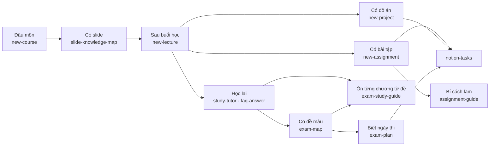

# SKILLS — Danh mục skill của repo

Tra nhanh skill nào làm gì. Gọi bằng `$<tên-skill>` trong Codex, `/<tên-skill>` trong Claude Code, hoặc nói tự nhiên như cột *Câu gọi mẫu*.
Chi tiết từng skill ở `.claude/skills/<tên>/SKILL.md`.

---

## Tra nhanh

| Skill | Làm gì | Câu gọi mẫu |
|---|---|---|
| [`new-course`](.claude/skills/new-course/SKILL.md) | Tạo môn mới, nối vào 6 file đang giữ danh sách môn | *thêm môn IT008, GV …* |
| [`slide-knowledge-map`](.claude/skills/slide-knowledge-map/SKILL.md) | Đọc hết slide, lập bản đồ kiến thức có dẫn chiếu slide | *lập knowledge map môn IE103* |
| [`new-lecture`](.claude/skills/new-lecture/SKILL.md) | Transcript + slide → note buổi học, gợi ý thi, deadline, flashcard | *xử lý buổi 6 môn IT007* |
| [`study-tutor`](.claude/skills/study-tutor/SKILL.md) | Gia sư hỏi đáp nhiều lượt, cuối phiên đề xuất FAQ/flashcard | *kèm tôi chương 5 IT007* |
| [`faq-answer`](.claude/skills/faq-answer/SKILL.md) | Trả lời nhanh, dồn câu hỏi vào `faqs-<chương>.md` | *tập trung chương 3, trả lời nhanh* |
| [`add-note-image`](.claude/skills/add-note-image/SKILL.md) | Chèn ảnh có sẵn vào đúng mục của ghi chú, giữ ảnh gốc và tránh trùng | *thêm hình bounded waiting vào L05 IT007* |
| [`illustrate-concept`](.claude/skills/illustrate-concept/SKILL.md) | Tạo hình giải thích khái niệm, kiểm tra nội dung rồi chèn vào đúng mục của note | *tạo hình address binding và thêm vào L08 IT007* |
| [`illustrate-mechanism`](.claude/skills/illustrate-mechanism/SKILL.md) | Tạo hình cho thấy các thành phần và trạng thái thay đổi khi cơ chế hoạt động, rồi chèn vào note | *minh họa cơ chế dynamic loading từng bước vào L08 IT007* |
| [`new-assignment`](.claude/skills/new-assignment/SKILL.md) | Dựng `aN/` · `labN/`, trích đề từ transcript, ghi hạn nộp | *thầy giao bài tập 8 IE105* |
| [`new-project`](.claude/skills/new-project/SKILL.md) | Dựng `projects/prjN/`, trích đề + tiêu chí chấm + các mốc, nối deadlines và Notion | *thầy giao đồ án nhóm IE101* |
| [`assignment-guide`](.claude/skills/assignment-guide/SKILL.md) | Sinh `GUIDE.md` — phương pháp + tiêu chí chấm, không có lời giải | *bài tập 5 IE105 làm thế nào* |
| [`exam-map`](.claude/skills/exam-map/SKILL.md) | Đề mẫu → map câu về chương/slide + exam blueprint | *phân tích đề mẫu IE105* |
| [`exam-study-guide`](.claude/skills/exam-study-guide/SKILL.md) | Chắt lọc kiến thức một chương từ đề mẫu, kèm đáp án, giải thích từng câu và dẫn chiếu nguồn | *tổng hợp kiến thức chương 5 IT007 từ đề mẫu và hướng dẫn từng câu* |
| [`exam-plan`](.claude/skills/exam-plan/SKILL.md) | Đọc lịch, xếp buổi ôn lùi từ ngày thi, tạo task Notion + sự kiện Google Calendar | *lên kế hoạch ôn thi IT007 và IE105* |
| [`notion-tasks`](.claude/skills/notion-tasks/SKILL.md) | Đồng bộ bài nộp, lịch thi với Notion; tạo task lẻ | *đồng bộ Notion* |
| [`tidy-files`](.claude/skills/tidy-files/SKILL.md) | Đổi tên, xếp file thả tay vào đúng thư mục | *tôi vừa thả file vào IE103, dọn giúp* |

Ngoài repo còn skill dùng chung `lecture-analyzer`, được `new-lecture` dùng khi có transcript.

---

## Dùng skill nào, lúc nào

| Giai đoạn | Skill | Ghi vào đâu |
|---|---|---|
| Đầu môn / đầu kỳ | `new-course` → `slide-knowledge-map` | thư mục môn · `materials/` map |
| Sau mỗi buổi | `new-lecture` | `lectures/` · `IMPORTANT_NOTES.md` · `admin/deadlines.md` · `exam-prep/` |
| Học lại, hỏi đáp | `study-tutor` · `faq-answer` | `exam-prep/faqs-*.md` · flashcard (sau khi duyệt) |
| Bổ sung ảnh minh họa | `add-note-image` | ghi chú liên quan · ảnh gốc hoặc `images/` phù hợp |
| Tạo hình giải thích khái niệm | `illustrate-concept` | ghi chú liên quan · ảnh mới trong `images/` cạnh note |
| Minh họa cơ chế hoạt động | `illustrate-mechanism` | ghi chú liên quan · ảnh diễn biến trong `images/` cạnh note |
| Có bài tập / lab | `new-assignment` → `assignment-guide` | `assignments/<aN\|labN>/` · `admin/deadlines.md` |
| Có đồ án | `new-project` → `notion-tasks` | `projects/prjN/` · `admin/deadlines.md` · Notion |
| Ôn thi | `exam-map` · `exam-study-guide` · `exam-plan` | `exam-prep/` · Notion · Google Calendar (lịch `Work`) |
| Quản lý việc | `notion-tasks` | Notion ☕ Tasks · `admin/deadlines.md` |
| Lỡ thả file lung tung | `tidy-files` | đúng thư mục theo `AGENTS.md` § 14 |

---

## Script đi kèm

Skill gọi các script này; tự chạy được khi cần.

| Script | Việc |
|---|---|
| `scripts/new-course.sh` | Dựng khung môn học (dùng bởi `new-course`) |
| `scripts/new-lecture.sh` | Tạo file `_raw`, nạp `.vtt` Teams (dùng bởi `new-lecture`) |
| `scripts/new-assignment.sh` | Dựng mục nộp, copy file Word đúng mẫu tên (dùng bởi `new-assignment`) |
| `scripts/new-project.sh` | Dựng thư mục đồ án `prjN/` (dùng bởi `new-project`) |
| `scripts/check-layout.sh` | Tìm file sai chỗ / sai tên (dùng bởi `tidy-files`) |
| `scripts/toc.py gen\|check` | Sinh / kiểm tra mục lục markdown |
| `scripts/peek.py` | Xem nhanh `.pdf` / `.docx` / `.pptx` / `.xlsx` / `.vtt` |
| `scripts/slides-to-md.py` | Dựng bộ đệm text của PDF trong `materials/` → `.cache/md/` để `grep` |

---

## Thêm skill mới

1. Tạo **một** file `.claude/skills/<tên>/SKILL.md` — `.agents/skills` là symlink nên Codex tự thấy.
2. Thêm dòng vào bảng *Tra nhanh* ở trên **và** bảng § 8c của [`AGENTS.md`](AGENTS.md).
