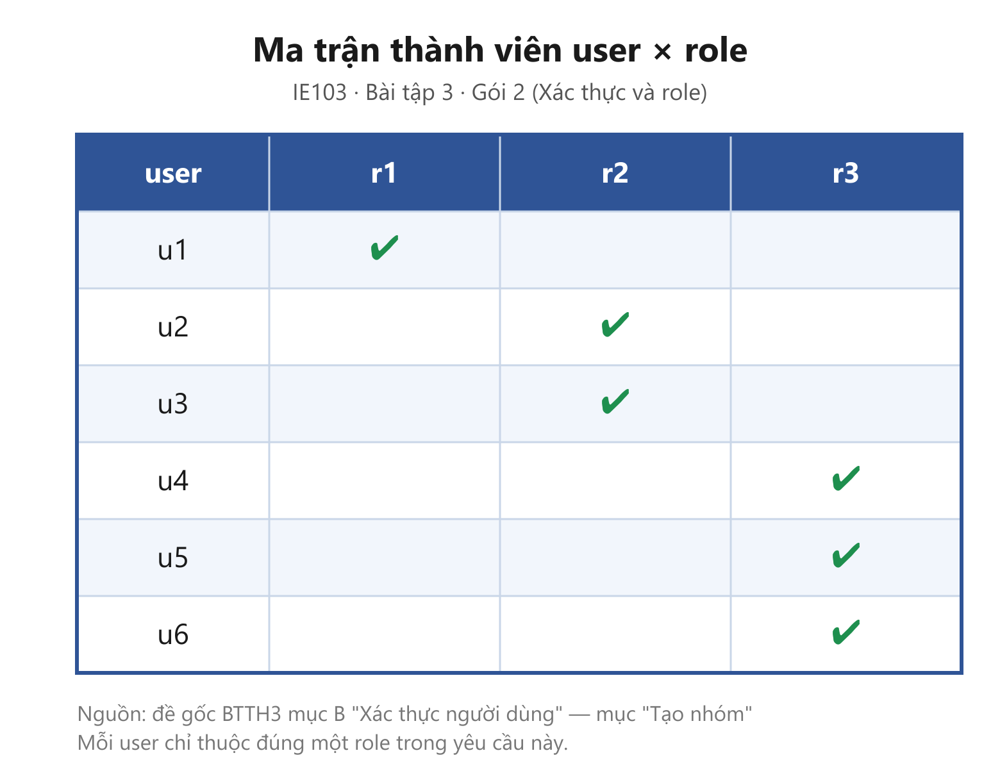
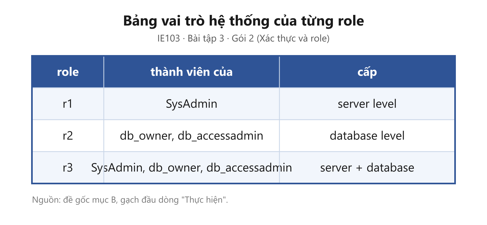
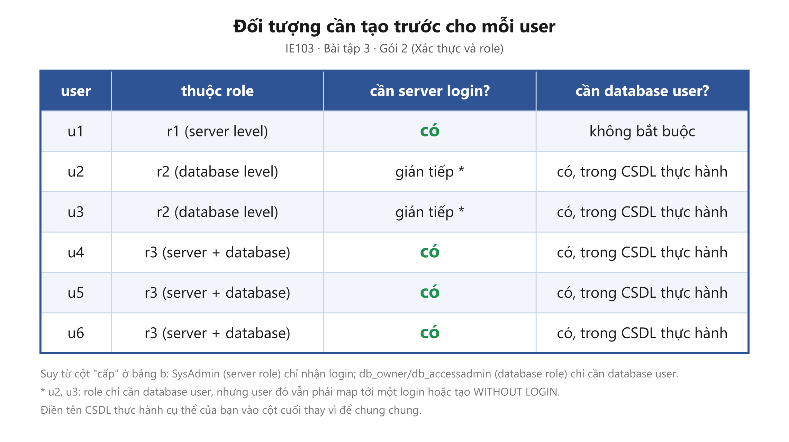
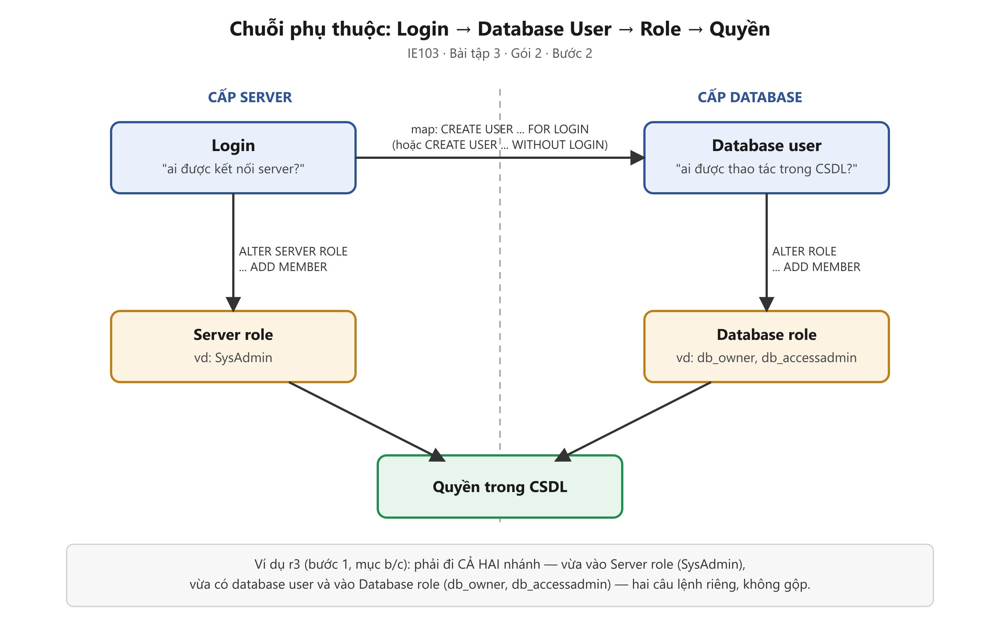

# IE103 — Bài tập 3 · Hướng dẫn Bài tập 2

| | |
|---|---|
| Bài tập | [`README.md`](README.md) |
| Phần trước | [Hướng dẫn Bài tập 1](guide-exercise-1.md) |
| Buổi học | ❓ chưa xác minh |
| **Hạn nộp** | **❓ chưa biết** |
| Ước lượng | 3–5 giờ, chưa tính thời gian cài hoặc xử lý lỗi SQL Server |

> ⚠️ **File này có hướng dẫn chi tiết cách làm, lời giải, script. Sinh viên sẽ đọc và hỏi khi cần hiểu rõ hơn một chi tiết nào đó.**

---

## Mục lục

- [Tiến độ hiện tại](#tiến-độ-hiện-tại)
- [Đề yêu cầu gì](#đề-yêu-cầu-gì)
- [Chuẩn bị](#chuẩn-bị)
- [Gói 1 — Import và export](#gói-1--import-và-export)
- [Gói 2 — Xác thực và role](#gói-2--xác-thực-và-role)
- [Gói 3 — GRANT, DENY, REVOKE](#gói-3--grant-deny-revoke)
- [Checklist trước khi nộp](#checklist-trước-khi-nộp)
- [Phần bạn phải tự quyết](#phần-bạn-phải-tự-quyết)

---

## Tiến độ hiện tại

> 🔄 Cập nhật thủ công: 2026-10-06, dựa trên ảnh/file đã có trong `images/` và `resources/`.

### Gói 1 — Import và export: 🟡 phần Import xong (bản tối giản), còn Export chưa làm

- [x] File mẫu `resources/sample-students.xlsx` + `.csv`
- [x] ~~Cách A~~ — đã quyết định bỏ, chỉ làm Cách B (đủ đáp ứng đề)
- [x] Cách B — Import Flat File Wizard — bước 1: Specify Input File (`g1-flatfile-step1-input-file.png`)
- [x] Cách B — bước 2: Preview Data (`g1-flatfile-step2-preview-data.png`)
- [x] ~~Cách B — bước 3: Modify Columns~~ — đã quyết định bỏ qua ảnh này theo yêu cầu, không chụp
- [x] ~~Cách B — bước 4a: Summary~~ — đã quyết định bỏ, không cần ảnh
- [x] ~~Cách B — bước 4b: Results~~ — đã quyết định bỏ qua ảnh này theo yêu cầu, không chụp (lưu ý: không còn ảnh chứng minh quá trình chạy, chỉ còn trước/sau)
- [x] Cách B — bước 5: Verify table (`g1-flatfile-step5-verify-table.png`)
- [ ] Export table → Excel (toàn bộ 6 ảnh `g1-export-*`) — **chưa bắt đầu**
- [ ] Đối chiếu số cột/dòng/giá trị giữa đầu vào và đầu ra

### Gói 2 — Xác thực và role: ✅ hoàn thành toàn bộ (bước 1–4), đã đối chiếu kết quả tổng hợp khớp ma trận a/b

- [x] Bước 1a: Ma trận thành viên user × role (`g2-user-role-matrix.png` + `.svg`)
- [x] Bước 1b: Bảng vai trò hệ thống của r1–r3 (`g2-role-table.png` + `.svg`)
- [x] Bước 1c: Bảng "đối tượng cần tạo trước" (`g2-precreate-table.png` + `.svg`)
- [x] Bước 2: Sơ đồ chuỗi phụ thuộc Login → User → Role → Quyền (`g2-login-user-role-flow.png`/`.svg`)
- [x] Bước 3a: `CREATE LOGIN` cho u1, u4, u5, u6 — đã chạy (`g2-a-create-login-run.png`, `g2-a-create-login-verify.png`)
- [x] Bước 3b: `CREATE USER` map login/`WITHOUT LOGIN` cho u2–u6 — đã chạy (`g2-b-create-user-run.png`, `g2-b-create-user-verify.png`)
- [x] Bước 3c: `CREATE ROLE r1, r2, r3` — đã chạy (`g2-c-create-role-run.png`, `g2-c-create-role-verify.png`)
- [x] Bước 3d: `ALTER ROLE ... ADD MEMBER` theo ma trận a (6 câu, có fix thêm `CREATE USER u1 FOR LOGIN u1` sau lỗi 15151) — đã chạy (`g2-d-add-member-run.png`, `g2-d-add-member-verify.png`)
- [x] Bước 3e: Gán r2/r3 vào `db_owner`/`db_accessadmin` và u1/u4/u5/u6 vào `SysAdmin` — đã chạy (`g2-e-add-role-run.png`, `g2-e-add-role-verify-database.png`, `g2-e-add-role-verify-server.png`)
- [x] Bước 4: Truy vấn tổng hợp đã chạy, kết quả khớp ma trận a/b (dòng `db_owner`-`dbo` và 5 member mặc định `sysadmin` là mặc định hệ thống, không phải lỗi)

### Gói 3 — GRANT, DENY, REVOKE: ✅ hoàn thành toàn bộ (bước 1–8)

- [x] Chọn T1–T3 theo chữ số cuối MSSV (`25730081` → `1` → `T1=GV_HV_CN`, `T2=HOIDONG_GV`, `T3=HOCVI`)
- [x] Bước 1 (tạo bảng mẫu vì CSDL thực hành chưa có sẵn) — đã chạy (`g3-a0-create-tables-run.png`)
- [x] Bước 2: Tạo `U1_PQ`–`U3_PQ` (login + user, đổi tên từ `U1`–`U3` do trùng case-insensitive với `u1`–`u3` của Gói 2) — đã chạy (`g3-a-create-users-run.png`, `g3-a-create-users-verify.png`)
- [x] Bước 3: Ma trận user × table × thao tác (xem bảng trong guide, mục C đề gốc)
- [x] Bước 4: `GRANT` — đã chạy (`g3-b-grant-run.png`)
- [x] Bước 5: `DENY` — đã chạy (`g3-c-deny-run.png`)
- [x] Bước 6: `REVOKE` — đã chạy (`g3-d-revoke-run.png`)
- [x] Bước 7: Kiểm tra `sys.database_permissions` — đã chạy (`g3-e-check-permissions.png`)
- [x] Bước 8: Kiểm tra hành vi thực tế `EXECUTE AS USER` — đã chạy (`g3-f-execute-as-test.png`)
- [ ] Giải thích "bị từ chối" vs "đã thu hồi" trong báo cáo

### Việc tiếp theo nên làm (theo thứ tự)

1. Phần Import của Gói 1 coi như xong (step1, 2, 5 — đã chủ động bỏ step3, 4a, 4b).
2. Làm phần Export (SQL Server → Excel) của Gói 1 — 6 điểm quyết định, xem bảng trong guide.
3. Gói 2 và Gói 3 đã xong toàn bộ — chỉ còn phần Export của Gói 1 để hoàn tất cả Bài tập 2.

---

## Đề yêu cầu gì

Bài tập 2 gồm ba gói: import/export dữ liệu qua giao diện, xác thực người dùng bằng user và role, rồi phân quyền trên CSDL Quản lý đề tài. Đầu ra cuối cùng vẫn là một báo cáo PDF và file `.sql` do bạn tự viết.

| Gói việc | Đầu ra phải có | Dạng |
|---|---|---|
| Import/export | Ảnh wizard và kết quả kiểm tra | Ảnh + diễn giải |
| User, role | Script tự viết và bằng chứng thực thi | `.sql` + ảnh/chứng minh |
| Phân quyền | Ma trận quyền, script và kiểm tra sau thay đổi | `.sql` + ảnh/chứng minh |

Nguồn yêu cầu là [đề gốc](brief/). Chưa có transcript nên guide không tự đặt thêm tiêu chí chấm hoặc hạn nộp.

## Chuẩn bị

**Công cụ:** SQL Server, SSMS, Excel, công cụ chụp màn hình, trình soạn PDF và file `.sql` để lưu lệnh của bạn.

1. Tạo một CSDL thực hành riêng; không dùng CSDL có dữ liệu quan trọng.
2. Mở [slide chương 5](../../materials/slides/05%20-%20Quan%20tri%20CSDL%20va%20an%20toan%20thong%20tin.pdf): phân quyền ở slide 10–40, import/export ở 69–81.
3. Tạo trước một bảng làm việc cho mapping user–role và một ma trận `user × table × thao tác`; chúng giúp tránh sót dòng khi viết SQL.
4. Trong báo cáo, dành riêng các mục đúng thứ tự đề; với mỗi ảnh, thêm một caption nói ảnh đang chứng minh bước nào.

## Gói 1 — Import và export

**Đề hỏi:** import một file dữ liệu sinh viên Excel vào SQL Server, rồi export một table SQL Server ra Excel, đều bằng giao diện.

**Đầu ra:** hai luồng ảnh theo bước và một kiểm tra kết quả ở đầu vào/đầu ra.

**Công cụ:** SSMS Import and Export Wizard, Excel và công cụ chụp màn hình.

**Các bước:**

1. Chuẩn bị file Excel nhỏ, có hàng tiêu đề nhất quán và dữ liệu đủ để nhận biết sau import. Tự kiểm tra kiểu dữ liệu trước khi mở wizard (file mẫu: `resources/sample-students.xlsx`, có bản `.csv` đi kèm nếu dùng Import Flat File Wizard).
2. Chụp các điểm quyết định trong luồng import — chỉ làm **một** cách là đủ đáp ứng đề (đề chỉ yêu cầu "chọn 1 file Excel, import vào SQL Server", không bắt làm cả hai luồng wizard).

   > ⚠️ **Đã bỏ Cách A (SSMS Import and Export Wizard, nguồn Excel trực tiếp)** — tối giản vì Cách B dưới đây đã đủ chứng minh yêu cầu của đề. Nếu muốn làm thêm để so sánh hai luồng wizard thì vẫn hợp lệ, nhưng không bắt buộc.

   **Cách B — Import Flat File Wizard** (nguồn `.csv`, chỉ đọc file text): click phải CSDL → `Tasks` → `Import Flat File...`

   | Điểm quyết định | Chụp lúc nào | Tên file ảnh |
   |---|---|---|
   | Chọn nguồn | Specify Input File — đã trỏ `sample-students.csv` | `images/g1-flatfile-step1-input-file.png` |
   | Xem trước dữ liệu | Preview Data — header + vài dòng đầu | `images/g1-flatfile-step2-preview-data.png` |
   | Kiểm tra table đích | Kết quả `SELECT * FROM` bảng vừa tạo | `images/g1-flatfile-step5-verify-table.png` |

   > ⚠️ **Đã bỏ ảnh Results (bước 4b)** theo quyết định của bạn. Lưu ý: đây là ảnh duy nhất chứng minh **wizard đã thực sự chạy** (hiển thị ✓/✗ từng hành động: tạo bảng, copy dữ liệu) — nếu bỏ, luồng ảnh của bạn nhảy thẳng từ "Preview Data" (bước 2, chưa chạy gì) sang "Verify table" (bước 5, đã có dữ liệu trong bảng). Vẫn **đủ để kết luận import thành công** vì bước 5 cho thấy dữ liệu đã nằm trong bảng, nhưng người chấm sẽ không thấy được quá trình chạy — chỉ thấy kết quả trước/sau. Nếu muốn chắc chắn hơn, có thể bù lại bằng một câu `SELECT COUNT(*)` đối chiếu đúng 8 dòng trong `sample-students.csv` ở ảnh bước 5, thay cho ảnh Results.

   > ℹ️ **Đã bỏ Summary (bước 4a)** — màn hình này chỉ tóm tắt lại các lựa chọn đã chọn ở các bước trước, không chứng minh thêm điều gì mới; `Results` (4b) đã đủ bằng chứng "đã chạy và kết quả ra sao".

   > ℹ️ **Đã bỏ ảnh Modify Columns (bước 3)** theo quyết định của bạn — không chụp màn hình này. Vẫn **nên tự kiểm tra kiểu dữ liệu** khi wizard hiện màn hình đó lúc thực hành (xem bảng kỳ vọng ngay dưới đây), chỉ là không bắt buộc đưa ảnh vào báo cáo; nếu wizard tự đoán sai và bạn không sửa, bước 4b/5 có thể báo lỗi hoặc ra dữ liệu sai mà không có ảnh bước 3 để truy lại nguyên nhân.

   **Lời giải tham khảo — Modify Columns (không bắt buộc chụp ảnh, nhưng nên tự đối chiếu khi làm):**

   File `resources/sample-students.csv` có 6 cột:

   ```
   MSSV,HoTen,NgaySinh,Lop,Nganh,DiemTB
   25730001,Nguyen Van An,1/15/2003,IT2023.1,CNTT,7.8
   ...
   ```

   Sau khi qua màn `Preview Data` (bước 2) và bấm `Next`, wizard mở màn **Modify Columns** — đây là nơi wizard **tự đoán kiểu dữ liệu** cho từng cột dựa trên dữ liệu mẫu nó đọc được, và bạn phải **tự kiểm tra lại từng dòng** trước khi bấm tiếp, vì đoán sai sẽ làm cả cột bị ép kiểu lố (vd text bị cắt) hoặc import lỗi giữa chừng.

   **Thao tác cụ thể trong SSMS:**

   1. Màn hình liệt kê 6 hàng, mỗi hàng là một cột nguồn, có các ô: `Column Name`, `Data Type` (dropdown), `Allow Nulls` (checkbox).
   2. Rà từng dòng, đối chiếu với bảng kỳ vọng dưới đây — sửa lại ô `Data Type` nếu wizard đoán khác.
   3. Chụp màn hình **sau khi đã sửa xong**, trước khi bấm `Next` — khung hình cần thấy rõ cả 6 dòng và cột `Data Type` đã chọn.

   **Lời giải — bảng kiểu dữ liệu kỳ vọng cho từng cột:**

   | Column Name | Data Type nên chọn | Vì sao |
   |---|---|---|
   | `MSSV` | `smallint`/`int` → nên đổi sang `bigint` hoặc `varchar(10)` | MSSV là mã định danh (`25730001`), không dùng để tính toán — dù là số, để `int`/`bigint` vẫn chạy được, nhưng nhiều đề thực tế coi MSSV là **mã**, nên `varchar` an toàn hơn nếu sau này có MSSV bắt đầu bằng số 0 (wizard sẽ tự xóa số 0 đầu nếu để kiểu số). Với 8 số liệu mẫu hiện tại không có số 0 đầu nên để `int` cũng không sai — ghi rõ lựa chọn và lý do trong báo cáo. |
   | `HoTen` | `nvarchar(50)` (hoặc wizard tự đề xuất độ dài tương tự) | Tên có dấu tiếng Việt — **bắt buộc `nvarchar`** (Unicode), không dùng `varchar`, nếu không dấu sẽ bị lỗi/mất khi import. Đây là lỗi hay gặp nhất ở cột text tiếng Việt. |
   | `NgaySinh` | `date` | Cột ngày tháng — đây là cột **dễ suy sai kiểu nhất**: dữ liệu ghi dạng `M/D/YYYY` (tháng/ngày/năm kiểu Mỹ, vd `1/15/2003` = 15 tháng 1). Nếu wizard hoặc SQL Server hiểu nhầm sang `D/M/YYYY` (kiểu Việt), ngày và tháng sẽ bị hoán đổi cho các dòng ngày ≤ 12 (vd `3/22/2003` ngày 22 không nhầm được vì >12, nhưng dòng nào ngày ≤12 thì có nguy cơ). Nếu wizard đoán ra `varchar` thay vì `date`, phải tự đổi lại thành `date` và kiểm tra kỹ sau khi import bằng `SELECT NgaySinh FROM ...` đối chiếu từng dòng với file gốc. |
   | `Lop` | `nvarchar(20)` hoặc `varchar(20)` | Giá trị dạng `IT2023.1` — chỉ chữ/số không dấu nên `varchar` cũng được, nhưng dùng `nvarchar` cho nhất quán với các cột text khác cũng không sai. |
   | `Nganh` | `nvarchar(20)` | Giá trị `CNTT`, `ATTT`, `KHMT` — chữ không dấu, tương tự `Lop`. |
   | `DiemTB` | `float` hoặc `decimal(4,2)` | Có giá trị thập phân (`7.8`, `9.1`) lẫn giá trị nguyên không có phần thập phân (`8` ở dòng Vũ Thị Giang) — wizard thường tự đoán đúng kiểu số thực nếu đọc đủ dòng mẫu, nhưng **kiểm tra kỹ dòng `8` không bị đoán nhầm thành `int`** (sẽ làm mất khả năng lưu số thập phân cho các dòng khác nếu kiểu bị ép sai theo dòng đầu). `decimal(4,2)` chính xác hơn `float` cho điểm số (tránh sai số dấu phẩy động), nên ưu tiên nếu wizard cho chọn. |

   **Điểm cần giải thích trong báo cáo:** nêu rõ cột nào wizard tự đoán đúng ngay, cột nào bạn phải tự sửa lại (nếu có) — đây chính là bằng chứng cho thấy bạn **đã kiểm tra**, không chỉ bấm `Next` liên tục qua màn hình này.

3. Chọn một table có dữ liệu rõ ràng cho export — dùng luôn bảng vừa import ở bước 2 (`dbo.SampleStudents` hoặc `dbo.SampleStudentsFlat`) để đề nhất quán và dễ đối chiếu ngược lại.

   > ⚠️ **Đã đổi công cụ — không dùng SSMS Export Wizard.** `Tasks → Export Data...` trong SSMS bị disable và `DTSWizard.exe` (workaround cho SQL Server Express) không mở được trên máy này. Thay vào đó dùng **Excel kéo dữ liệu từ SQL Server** (`Data → Get Data → From Database → From SQL Server Database`) — vẫn là thao tác giao diện, vẫn đáp ứng đúng yêu cầu đề ("chọn 1 table trong SQL Server, export tới Excel, dùng giao diện"), chỉ đổi chiều: Excel chủ động kéo thay vì SSMS đẩy ra. Ghi rõ lý do đổi công cụ này trong báo cáo (kèm ảnh menu `Export Data...` bị xám nếu muốn làm bằng chứng).

   | Điểm quyết định | Chụp lúc nào | Tên file ảnh |
   |---|---|---|
   | Mở Get Data | Excel → tab `Data` → `Get Data` → `From Database` → `From SQL Server Database` | `images/g1-export-step1-source.png` |
   | Nhập server/CSDL | Dialog `SQL Server database` — đã điền đúng `Server` và `Database` (CSDL chứa bảng đã import), chưa bấm OK | `images/g1-export-step2-destination.png` |
   | Chọn bảng (Navigator) | Cửa sổ Navigator liệt kê các bảng — đã tick đúng bảng nguồn, panel bên phải xem trước được dữ liệu | `images/g1-export-step3-mapping.png` |
   | Load xong | Sau khi bấm `Load`, dữ liệu đã nằm thành bảng trong sheet Excel, kèm panel `Queries & Connections` bên phải | `images/g1-export-step4-run-result.png` |

   > ℹ️ **Đã bỏ 2 ảnh:** Transform Data (step3b — vốn đã đánh dấu tùy chọn, không bắt buộc) và verify-excel (step5 — mở lại file đã lưu để kiểm tra). 4 ảnh còn lại (`step1`–`step4`) đã đủ chứng minh luồng: mở Get Data → nhập server/CSDL → chọn bảng → Load thành công vào Excel. Không có ảnh step5 nghĩa là báo cáo thiếu bằng chứng "đã lưu file và mở lại xem được" — nếu muốn chắc chắn, ít nhất ghi một dòng trong báo cáo xác nhận đã `Save As exported-students.xlsx` thành công, dù không kèm ảnh.

   Lưu ý: giữ nguyên tên bảng nguồn trong caption ảnh, để người chấm đối chiếu ngược lại đúng bảng đã import ở bước 2 — tránh export nhầm một bảng khác không liên quan.

   **Hướng dẫn chi tiết và lời giải — từng bước Excel Get Data:**

   1. **Mở Get Data (`g1-export-step1-source.png`):** mở Excel, tạo workbook mới hoặc dùng sẵn, vào tab `Data` (ribbon) → nhóm `Get & Transform Data` → `Get Data` → `From Database` → `From SQL Server Database`. Nếu không thấy mục này, Excel của bạn có thể là bản cũ — tìm `Data → From Other Sources → From SQL Server` (Excel 2016 trở xuống dùng tên khác nhưng chức năng giống nhau).

   2. **Nhập server/CSDL (`g1-export-step2-destination.png`):** dialog hiện ra yêu cầu `Server` — điền đúng tên instance (vd `.\SQLEXPRESS` hoặc `localhost`, tùy cách bạn kết nối SSMS), `Database` điền đúng tên CSDL chứa bảng vừa import ở bước 2 (không phải `QLTT_BTTH3` nếu bạn import sample-students vào CSDL thực hành riêng cho Gói 1). Chế độ kết nối chọn `Import` (không chọn `DirectQuery`, vì bạn cần dữ liệu nạp hẳn vào file Excel, không phải truy vấn trực tiếp mỗi lần mở). Bấm `OK`.

   3. **Chọn bảng ở Navigator (`g1-export-step3-mapping.png`):** cửa sổ `Navigator` liệt kê cây CSDL → Tables. Tick đúng bảng bạn đã import (vd `dbo.SampleStudentsFlat`), panel bên phải hiện preview dữ liệu — đối chiếu nhanh số cột/dòng hiện ra có khớp 6 cột, 8 dòng không.

   4. **Transform Data (tùy chọn, `g1-export-step3b-column-mappings.png`):** nếu muốn kiểm tra/sửa kiểu cột trước khi nạp (tương đương bước Column Mappings của wizard cũ), bấm `Transform Data` thay vì `Load` để mở Power Query Editor — xem cột `NgaySinh` có đang ở kiểu `Date` không, nếu bị nhận nhầm thành `Text` thì sửa qua menu `Data Type` ở đầu cột. Nếu dữ liệu đã đúng, bỏ qua bước này, bấm thẳng `Load`.

   5. **Load xong (`g1-export-step4-run-result.png`):** Excel tự tạo bảng (Excel Table) trong sheet hiện tại, chứa đủ dữ liệu đã kéo về; panel `Queries & Connections` bên phải hiện tên query và số dòng đã tải (vd `8 rows loaded`). Chụp màn hình lúc này — khung hình cần thấy cả bảng dữ liệu trong sheet và panel bên phải.

   6. **Lưu và kiểm tra (`g1-export-step5-verify-excel.png`):** `File → Save As`, đặt tên `exported-students.xlsx`, lưu vào `resources/`. Mở lại file vừa lưu, chụp màn hình thấy đủ hàng tiêu đề và 8 dòng dữ liệu. Đối chiếu nhanh: số cột (6), số dòng (8 + 1 header), và ít nhất một giá trị cụ thể (vd dòng `25730001, Nguyen Van An`) khớp đúng với bảng gốc trong SQL Server.
4. Đối chiếu số cột, số dòng và ít nhất một giá trị nhận diện ở mỗi đầu. Nếu wizard tự suy luận sai kiểu dữ liệu, ghi lỗi thật và cách bạn tự sửa thay vì che đi.

**Thế nào là đủ:** người chấm thấy được dữ liệu đã đi vào SQL Server và đi ra Excel, không chỉ thấy wizard được mở.

## Gói 2 — Xác thực và role

**Đề hỏi:** tạo `u1`–`u6`, `r1`–`r3`, gán đúng thành viên và role theo đề.

**Đầu ra:** script hoặc ảnh thể hiện thứ tự tạo login/user/role, mapping thành viên, và kiểm tra membership.

**Công cụ:** SSMS, cửa sổ truy vấn T-SQL, Object Explorer hoặc truy vấn metadata để đối chiếu membership.

**Các bước:**

1. Vẽ ma trận trước khi viết SQL — làm theo thứ tự này, đừng mở cửa sổ query trước:

   a. **Ma trận thành viên `user × role`.** Hàng là `u1`–`u6`, cột là `r1`–`r3`. Ô nào user thuộc role đó thì đánh dấu. Chép đúng mapping ở đề gốc (mục B, gạch đầu dòng "Tạo nhóm") vào bảng — không tự suy diễn hay đổi thứ tự, vì đây là phần chấm đối chiếu trực tiếp.

      

   b. **Bảng vai trò hệ thống của từng role.** Một bảng riêng, hai cột: `role` và `server role / database role mà nó là thành viên`. Đề gốc liệt kê rõ ba dòng cho `r1`, `r2`, `r3` (mục B, gạch đầu dòng "Thực hiện") — chép nguyên văn vào bảng này. Ghi chú thêm ở mỗi dòng: role đích đó thuộc **server level** (vd `SysAdmin`) hay **database level** (vd `db_owner`, `db_accessadmin`), vì hai loại này tạo bằng lệnh khác nhau (bước 3 sẽ dùng đến).

      | role | thành viên của | cấp |
      |---|---|---|
      | `r1` | `SysAdmin` | server level |
      | `r2` | `db_owner`, `db_accessadmin` | database level |
      | `r3` | `SysAdmin`, `db_owner`, `db_accessadmin` | server level + database level |

      

      Vì `r3` bắc cầu cả hai cấp, khi viết script ở bước 3 bạn sẽ cần **hai câu lệnh khác nhau** cho cùng một role: một lệnh gán vào server role (`ALTER SERVER ROLE ... ADD MEMBER`), một lệnh gán vào database role (`ALTER ROLE ... ADD MEMBER`) — đừng gộp chung thành một câu.

   c. **Cột "đối tượng cần tạo trước".** Thêm một cột nháp bên cạnh ma trận, liệt kê cho mỗi `u1`–`u6`: cần login cấp server hay chỉ cần user cấp CSDL, và CSDL nào. Đây là chỗ dễ quên nhất — xem bước 2.

      Suy trực tiếp từ cột "cấp" ở bảng b: role ở **server level** thì thành viên của nó phải là **login** (`SysAdmin` là fixed server role — chỉ nhận login/server principal làm thành viên, không nhận database user); role ở **database level** thì thành viên chỉ cần là **database user** trong đúng CSDL `QLTT_BTTH3`. Ghép với ma trận a, bạn có:

      | user | thuộc role | cần server login? | cần database user? |
      |---|---|---|---|
      | `u1` | `r1` (server level) | có | **có** — bắt buộc, vì `r1` là database role: xem ghi chú sửa lại ngay dưới |
      | `u2` | `r2` (database level) | không bắt buộc riêng — nhưng **mọi database user vẫn cần map tới một login/`WITHOUT LOGIN`** | có, trong CSDL `QLTT_BTTH3` |
      | `u3` | `r2` (database level) | như `u2` | có, trong CSDL `QLTT_BTTH3` |
      | `u4` | `r3` (server + database level) | có | có, trong CSDL `QLTT_BTTH3` |
      | `u5` | `r3` (server + database level) | có | có, trong CSDL `QLTT_BTTH3` |
      | `u6` | `r3` (server + database level) | có | có, trong CSDL `QLTT_BTTH3` |

      

      Cột cuối đã điền tên CSDL thực hành cụ thể (`QLTT_BTTH3`) thay vì để chung chung — đây là chỗ người chấm dễ bắt lỗi nhất nếu bạn tạo login/user ở sai CSDL.

      > ⚠️ **Sửa lại so với ảnh `g2-precreate-table.png`:** ảnh chụp ban đầu ghi `u1` "không bắt buộc" có database user. Thực tế khi chạy `ALTER ROLE r1 ADD MEMBER u1` ở bước 3d, SQL Server báo lỗi `Msg 15151: Cannot add the principal 'u1', because it does not exist` — vì `r1` là **database role** (tạo bằng `CREATE ROLE`, không phải fixed server role), nên thành viên của nó bắt buộc phải là **database principal**, bất kể mục tiêu cuối cùng của `u1` là quyền cấp server (`SysAdmin`). Quy tắc đúng: **mọi user cần vào bất kỳ database role nào (kể cả role trung gian do bạn tự tạo) đều phải có database user**, không chỉ áp dụng cho role database-level "thật" như `db_owner`. Ghi chú này vào báo cáo thay vì sửa lại ảnh cũ, để người chấm thấy được bạn tự phát hiện và tự sửa lỗi.

   Mục đích của toàn bộ bước 1 là để bước 3 (viết script) chỉ còn việc "dịch từng dòng ma trận thành một câu lệnh", không phải vừa viết vừa nhớ mapping.

2. Phân biệt rõ login, database user và role. Slide 11–31 là phần nền: bạn phải biết đối tượng nào thuộc cấp server, đối tượng nào thuộc CSDL trước khi chạy lệnh.

   

   a. **Ba khái niệm khác nhau ở đâu.**

      | Đối tượng | Cấp | Trả lời câu hỏi | Được tạo bởi |
      |---|---|---|---|
      | **Login** | Server | "Ai được phép kết nối vào SQL Server instance này?" | DBA/quản trị server |
      | **Database user** | Database | "Ai được phép thao tác trong CSDL này?" | Chủ CSDL, ánh xạ từ một login (hoặc `WITHOUT LOGIN`) |
      | **Role** (server role / database role) | Cả hai, tùy loại | "Nhóm quyền nào được gán sẵn, để gán hàng loạt thay vì gán từng quyền lẻ?" | DBA/chủ CSDL |

      Một login **không tự động** có quyền trong CSDL — phải map thành database user trước. Một database user **không tự động** có quyền gì — phải được thêm vào role hoặc `GRANT` trực tiếp. Đây là chuỗi phụ thuộc `login → user → role → quyền`, thiếu một mắt là user không dùng được như đề yêu cầu.

   b. **Vì sao bảng b/c ở bước 1 lại tách "cấp".** Server role (`SysAdmin`) chỉ chứa được login/server principal; database role (`db_owner`, `db_accessadmin`) chỉ chứa được database user. Không có lệnh nào gán thẳng một login vào một database role, hay một database user vào một server role — đây là lý do bước 3 phải viết hai câu lệnh khác nhau cho `r3`, đúng như đã nêu ở mục b.

   c. **Tự kiểm tra trước khi qua bước 3.** Với mỗi dòng trong bảng c, tự hỏi: "đối tượng cấp server của user này đã có chưa, đối tượng cấp database đã có chưa, và role nó cần gia nhập ở cấp nào?" Nếu câu trả lời cho một trong ba câu hỏi còn mơ hồ, quay lại đọc slide 11–31 phần tương ứng (login/user hay server role/database role) trước khi viết lệnh — viết trước rồi sửa lỗi cú pháp sau sẽ mất thời gian hơn nhiều so với xác nhận khái niệm trước.
3. Viết script theo thứ tự phụ thuộc: tạo đối tượng cấp server cần thiết, ánh xạ vào CSDL, tạo role, gán thành viên, rồi gán role hệ thống/database mà đề yêu cầu.

   Thứ tự dưới đây đi đúng chiều mũi tên trong sơ đồ ở bước 2 — mỗi nhóm lệnh chỉ dùng được sau khi nhóm trước đã chạy xong, nên **giữ nguyên thứ tự**, đừng nhảy cóc.

   a. **Tạo login cho những user cần server login** (đối chiếu cột "cần server login?" ở bảng c). Cú pháp gốc là `CREATE LOGIN <tên> WITH PASSWORD = '...'`. Đây là đối tượng cấp **server**, chạy ở ngữ cảnh CSDL `master`, không cần `USE` sang `QLTT_BTTH3`.

      **Output của nhóm này:** các login mới xuất hiện trong `Object Explorer → Security → Logins` (hoặc `SELECT name FROM sys.server_principals WHERE type IN ('S','U') AND name IN (...)`). Không có gì trong `QLTT_BTTH3` thay đổi ở bước này — nếu đã thấy user xuất hiện trong CSDL thì bạn đang nhảy cóc sang bước b.

      **Thao tác cụ thể trong SSMS (cách Query window, xem lựa chọn ở trên):**

      1. Kết nối SSMS vào instance, mở `New Query` — thanh tiêu đề/status bar phía dưới phải hiện `master` là CSDL hiện hành (không phải `QLTT_BTTH3`).
      2. Gõ toàn bộ các câu `CREATE LOGIN` cho những user cần login (theo bảng c) vào cùng một cửa sổ, Execute (F5). Kết quả panel `Messages` phải báo thành công cho từng câu, không có dòng `Msg ... Error`.
      3. Mở rộng `Object Explorer → Security → Logins`, nhấn `F5`/`Refresh` trên node `Logins` để danh sách cập nhật — Object Explorer không tự refresh sau khi chạy lệnh.
      4. Chụp lại đúng hai điểm quyết định sau:

      | Điểm quyết định | Chụp lúc nào | Tên file ảnh |
      |---|---|---|
      | Câu lệnh và kết quả thực thi | Cửa sổ query đang hiện toàn bộ các câu `CREATE LOGIN` phía trên, panel `Messages` phía dưới báo thành công | `images/g2-a-create-login-run.png` |
      | Danh sách login đã tạo | `Object Explorer → Security → Logins` đã mở rộng, thấy đủ tên login vừa tạo trong danh sách | `images/g2-a-create-login-verify.png` |

      Đặt tên file theo đúng quy ước này để nhất quán với ảnh của các nhóm b–e phía sau (`g2-b-...`, `g2-c-...`); nếu bạn tự đặt tên khác, giữ nguyên cùng một quy ước xuyên suốt cả bước 3 để người chấm dò theo thứ tự dễ hơn.

      **Lời giải — script đầy đủ cho nhóm a.** Theo bảng c: `u1`, `u4`, `u5`, `u6` cần server login (`u2`, `u3` thuộc `r2` — chỉ cấp database level — nên **không** cần login riêng ở nhóm này, xem nhóm b). Chạy trong CSDL `master`:

      ```sql
      USE master;
      GO

      CREATE LOGIN u1 WITH PASSWORD = 'Btth3_u1Pass!', CHECK_POLICY = OFF;
      CREATE LOGIN u4 WITH PASSWORD = 'Btth3_u4Pass!', CHECK_POLICY = OFF;
      CREATE LOGIN u5 WITH PASSWORD = 'Btth3_u5Pass!', CHECK_POLICY = OFF;
      CREATE LOGIN u6 WITH PASSWORD = 'Btth3_u6Pass!', CHECK_POLICY = OFF;
      GO

      -- Kiểm tra: 4 dòng, đúng u1/u4/u5/u6
      SELECT name, type_desc, create_date
      FROM sys.server_principals
      WHERE type IN ('S', 'U') AND name IN ('u1', 'u2', 'u3', 'u4', 'u5', 'u6');
      ```

      Giải thích từng điểm:

      - `CHECK_POLICY = OFF` tắt chính sách độ phức tạp mật khẩu của Windows cho login luyện tập — chỉ dùng trong môi trường thực hành, **không** làm vậy với hệ thống thật. Nếu để `ON` (mặc định) và mật khẩu không đủ mạnh, `CREATE LOGIN` báo lỗi *"Password validation failed"*.
      - Đặt mật khẩu khác nhau cho từng login chỉ để minh họa; đề không yêu cầu mật khẩu cụ thể, bạn có thể dùng chung một mật khẩu cho cả bốn nếu muốn, miễn ghi rõ trong báo cáo.
      - Vì sao chỉ 4 login, không phải 6: `u2` và `u3` chỉ thuộc `r2` (database level, theo bảng b), nên theo chuỗi phụ thuộc ở bước 2a chúng chỉ cần **database user** — tạo trực tiếp bằng `CREATE USER ... WITHOUT LOGIN` ở nhóm b, không cần đi qua `CREATE LOGIN` ở nhóm này. Đây là lý do bảng c ghi "không bắt buộc riêng" ở cột "cần server login?" của `u2`, `u3`.
      - Câu `SELECT` kiểm tra lọc `type IN ('S', 'U')` (`S` = SQL login, `U` = Windows login) để chỉ liệt kê login thật, loại các principal hệ thống khác; lọc theo tên để kết quả gọn, dễ đối chiếu với bảng c.
      - Nếu `Messages` báo *"CREATE LOGIN failed. The login already exists"*: hoặc bạn đã tạo trùng ở lần chạy trước — xóa bằng `DROP LOGIN u1;` rồi tạo lại, hoặc đổi tên khác nếu muốn giữ login cũ để đối chiếu.

   b. **Ánh xạ login thành database user**, hoặc tạo user không gắn login (`CREATE USER ... WITHOUT LOGIN`) cho những user chỉ cần cấp database. Bắt buộc `USE QLTT_BTTH3` trước khi chạy — đây là lỗi hay gặp nhất trong "Bẫy thường gặp" (cấp quyền/tạo user ở sai CSDL). Cú pháp gốc: `CREATE USER <tên> FOR LOGIN <tên login>`.

      **Output của nhóm này:** các user mới xuất hiện trong `QLTT_BTTH3 → Security → Users` (hoặc `SELECT name, type_desc FROM sys.database_principals WHERE type IN ('S','U')`). Số dòng trả về phải khớp đúng số user cần database user ở bảng c — thiếu dòng nào là còn sót user đó.

      **Thao tác cụ thể trong SSMS:**

      1. Trong cùng cửa sổ query hoặc cửa sổ mới, dòng đầu tiên phải là `USE QLTT_BTTH3;` — kiểm tra lại status bar đã đổi từ `master` sang `QLTT_BTTH3` trước khi Execute.
      2. Gõ các câu `CREATE USER` cho những user cần database user (theo bảng c), Execute, kiểm tra `Messages` không báo lỗi.
      3. Mở rộng `Object Explorer → QLTT_BTTH3 → Security → Users`, `Refresh` node này.

      | Điểm quyết định | Chụp lúc nào | Tên file ảnh |
      |---|---|---|
      | Câu lệnh và kết quả thực thi | Cửa sổ query hiện rõ dòng `USE QLTT_BTTH3` và các câu `CREATE USER`, `Messages` báo thành công | `images/g2-b-create-user-run.png` |
      | Danh sách user đã tạo | `Object Explorer → QLTT_BTTH3 → Security → Users` đã mở rộng, thấy đủ user vừa tạo | `images/g2-b-create-user-verify.png` |

      **Lời giải — script đầy đủ cho nhóm b.** `u1`, `u4`, `u5`, `u6` đã có login ở nhóm a (3a) nên map thẳng vào login cùng tên; `u2`, `u3` không có login riêng nên tạo `WITHOUT LOGIN`. Lưu ý: `u1` **phải** có database user dù nó chỉ cần quyền cấp server — vì `r1` (bước 3d) là database role, chỉ nhận database principal làm thành viên (xem ghi chú sửa ở bước 1c). Chạy sau khi đã `USE QLTT_BTTH3`:

      ```sql
      USE QLTT_BTTH3;
      GO

      CREATE USER u1 FOR LOGIN u1;
      CREATE USER u4 FOR LOGIN u4;
      CREATE USER u5 FOR LOGIN u5;
      CREATE USER u6 FOR LOGIN u6;

      CREATE USER u2 WITHOUT LOGIN;
      CREATE USER u3 WITHOUT LOGIN;
      GO

      -- Kiểm tra: đúng 6 dòng (u1–u6)
      SELECT name, type_desc, authentication_type_desc
      FROM sys.database_principals
      WHERE type IN ('S', 'U') AND name IN ('u1', 'u2', 'u3', 'u4', 'u5', 'u6');
      ```

      Giải thích từng điểm:

      - `CREATE USER u4 FOR LOGIN u4` ánh xạ user cấp database vào đúng login cấp server đã tạo ở nhóm a — nếu gõ sai tên login (vd login chưa tồn tại), lỗi báo *"Cannot find the login... because it does not exist"*. Tên user và tên login trùng nhau ở đây chỉ là lựa chọn cho gọn; SQL Server không bắt buộc hai tên phải giống nhau.
      - `CREATE USER u2 WITHOUT LOGIN` tạo một database user **không gắn với bất kỳ login nào** — user này không dùng để đăng nhập instance, chỉ tồn tại để làm security context bên trong CSDL (ví dụ gán quyền, hoặc dùng với `EXECUTE AS USER = 'u2'` khi kiểm tra quyền ở bước 4). Đây đúng là trường hợp nêu trong bảng c: `u2`, `u3` chỉ cần cấp database vì role đích của chúng (`r2`) là database-level.
      - Cột `authentication_type_desc` trong câu kiểm tra giúp phân biệt rõ: `u4`–`u6` sẽ hiện `INSTANCE` (vì có login đứng sau), còn `u2`, `u3` hiện `NONE` (vì `WITHOUT LOGIN`) — đây là bằng chứng trực quan để đưa vào báo cáo, chứng minh bạn hiểu sự khác biệt giữa hai cách tạo user.
      - Nếu `Messages` báo *"User, group, or role 'u4' already exists in the current database"*: hoặc đã tạo trùng ở lần chạy trước (`DROP USER u4;` rồi tạo lại), hoặc bạn đang nhầm CSDL — kiểm tra lại status bar đã đúng `QLTT_BTTH3` chưa.
      - Nếu quên `USE QLTT_BTTH3;` trước khi chạy, các câu `CREATE USER` này sẽ tạo nhầm user trong CSDL `master` (CSDL đang active từ nhóm a) — đây chính là lỗi "Bẫy thường gặp" đã nêu ở cuối Gói 2.

   c. **Tạo `r1`–`r3`.** Đây chỉ là role do đề bài định nghĩa (không phải server role/database role có sẵn) — tạo bằng `CREATE ROLE <tên>` bên trong `QLTT_BTTH3`, vì mục đích của chúng (theo mục b) là nhóm các **database user** lại. Chạy sau bước b, vì role trống không có ý nghĩa nếu chưa có user để gán vào.

      **Output của nhóm này:** đúng ba role mới trong `QLTT_BTTH3 → Security → Roles → Database Roles`, chưa có thành viên nào bên trong (kiểm tra bằng `SELECT name FROM sys.database_principals WHERE type = 'R' AND name IN ('r1','r2','r3')`).

      **Thao tác cụ thể trong SSMS:**

      1. Vẫn trong `QLTT_BTTH3` (kiểm tra lại status bar), gõ ba câu `CREATE ROLE r1`, `CREATE ROLE r2`, `CREATE ROLE r3`, Execute.
      2. Mở rộng `Object Explorer → QLTT_BTTH3 → Security → Roles → Database Roles`, `Refresh`.

      | Điểm quyết định | Chụp lúc nào | Tên file ảnh |
      |---|---|---|
      | Câu lệnh và kết quả thực thi | Cửa sổ query hiện ba câu `CREATE ROLE`, `Messages` báo thành công | `images/g2-c-create-role-run.png` |
      | Danh sách role đã tạo | `Database Roles` đã mở rộng, thấy `r1`, `r2`, `r3` trong danh sách (chưa cần mở xem thành viên ở bước này) | `images/g2-c-create-role-verify.png` |

      **Lời giải — script đầy đủ cho nhóm c.** Chạy trong `QLTT_BTTH3` (đã `USE` từ nhóm b, không cần gõ lại nếu vẫn cùng cửa sổ query):

      ```sql
      USE QLTT_BTTH3;
      GO

      CREATE ROLE r1;
      CREATE ROLE r2;
      CREATE ROLE r3;
      GO

      -- Kiểm tra: đúng 3 dòng, chưa có thành viên nào
      SELECT name, type_desc
      FROM sys.database_principals
      WHERE type = 'R' AND name IN ('r1', 'r2', 'r3');
      ```

      Giải thích từng điểm:

      - `CREATE ROLE <tên>` tạo một **database role do người dùng định nghĩa** (user-defined database role) — khác hẳn với `SysAdmin`, `db_owner`, `db_accessadmin` là các **fixed role có sẵn** của SQL Server. `r1`–`r3` chỉ là cái "giỏ" trống do đề bài đặt ra để nhóm user lại, bản thân chúng chưa có quyền gì cho tới khi được gán vào role hệ thống (nhóm e) hoặc được `GRANT` trực tiếp.
      - Không cần (và không có) tham số `WITH PASSWORD` hay `FOR LOGIN` ở đây — role không phải là principal dùng để đăng nhập hay sở hữu login, nên cú pháp `CREATE ROLE` chỉ cần một tên.
      - Thứ tự chạy **sau** nhóm b (tạo user) nhưng **trước** nhóm d (gán thành viên) là bắt buộc về mặt phụ thuộc: `ALTER ROLE ... ADD MEMBER` ở nhóm d cần cả role và user đã tồn tại, thiếu bên nào cũng báo lỗi *"...does not exist in this database"*.
      - Câu `SELECT` lọc `type = 'R'` (`R` = database Role) để chỉ liệt kê ba role vừa tạo, loại các principal khác (user, role hệ thống) có thể trùng một phần tên.
      - Nếu `Messages` báo *"The role 'r1' already exists"*: hoặc đã tạo trùng ở lần chạy trước (`DROP ROLE r1;` rồi tạo lại — chỉ `DROP` được khi role đó chưa có thành viên, tức phải làm trước khi chạy nhóm d), hoặc có role trùng tên để lại từ một CSDL/thao tác khác.
      - Chưa cần mở `Database Roles` kiểm tra thành viên ở bước này vì nhóm d (gán `ADD MEMBER`) chưa chạy — nếu bạn vào xem và đã thấy có thành viên, nghĩa là bạn đang chạy nhầm script của một người khác hoặc nhầm thứ tự.

   d. **Gán thành viên theo ma trận a**: mỗi user vào đúng role của nó (`ALTER ROLE <r> ADD MEMBER <user>`). Đối chiếu lại từng dòng của ma trận thành viên đã vẽ ở bước 1 — không gõ theo trí nhớ.

      **Output của nhóm này:** `SELECT r.name AS role, m.name AS member FROM sys.database_role_members rm JOIN sys.database_principals r ON r.principal_id = rm.role_principal_id JOIN sys.database_principals m ON m.principal_id = rm.member_principal_id WHERE r.name IN ('r1','r2','r3')` trả về đúng 6 dòng, khớp từng ô đã đánh dấu ở ma trận a — không thừa, không thiếu, không lệch role.

      **Thao tác cụ thể trong SSMS:**

      1. Gõ 6 câu `ALTER ROLE ... ADD MEMBER ...` (một câu cho mỗi user, đối chiếu ma trận a), Execute.
      2. Thay vì mở từng role trong Object Explorer để đếm tay, chạy câu `SELECT` ở dòng Output phía trên — cách này vừa nhanh vừa là bằng chứng khách quan hơn để đưa vào báo cáo.

      | Điểm quyết định | Chụp lúc nào | Tên file ảnh |
      |---|---|---|
      | Câu lệnh và kết quả thực thi | Cửa sổ query hiện 6 câu `ALTER ROLE ... ADD MEMBER`, `Messages` báo thành công | `images/g2-d-add-member-run.png` |
      | Kết quả truy vấn membership | Panel `Results` của câu `SELECT` kiểm tra membership, đủ 6 dòng, cột `role`/`member` đọc được rõ | `images/g2-d-add-member-verify.png` |

      **Lời giải — script đầy đủ cho nhóm d.** Theo ma trận a: `u1 → r1`; `u2`, `u3 → r2`; `u4`, `u5`, `u6 → r3`. Chạy trong `QLTT_BTTH3` (role và user đều là database-level nên không cần `ALTER SERVER ROLE` ở đây — đó là việc của nhóm e):

      ```sql
      USE QLTT_BTTH3;
      GO

      ALTER ROLE r1 ADD MEMBER u1;
      ALTER ROLE r2 ADD MEMBER u2;
      ALTER ROLE r2 ADD MEMBER u3;
      ALTER ROLE r3 ADD MEMBER u4;
      ALTER ROLE r3 ADD MEMBER u5;
      ALTER ROLE r3 ADD MEMBER u6;
      GO

      -- Kiểm tra: đúng 6 dòng, khớp từng ô đã đánh dấu ở ma trận a
      SELECT r.name AS role, m.name AS member
      FROM sys.database_role_members rm
      JOIN sys.database_principals r ON r.principal_id = rm.role_principal_id
      JOIN sys.database_principals m ON m.principal_id = rm.member_principal_id
      WHERE r.name IN ('r1', 'r2', 'r3')
      ORDER BY r.name, m.name;
      ```

      Giải thích từng điểm:

      - Mỗi câu `ALTER ROLE <role> ADD MEMBER <user>` chỉ thêm **một** user vào **một** role — không có cú pháp gộp nhiều user trong một câu, nên đúng 6 dòng lệnh cho 6 cặp user–role, không rút gọn được.
      - Cả role (`r1`–`r3`) và user (`u1`–`u6`) phải đã tồn tại trước khi chạy — đây là lý do thứ tự nhóm b → c → d bắt buộc. Nếu gõ sai tên hoặc chạy nhóm d trước nhóm b/c, lỗi báo *"...is not a valid login or you do not have permission"* hoặc *"...does not exist in this database"*.
      - `sys.database_role_members` lưu quan hệ thành viên dạng cặp `(role_principal_id, member_principal_id)`; câu `SELECT` phải `JOIN` hai lần vào `sys.database_principals` — một lần lấy tên role, một lần lấy tên member — vì cả hai cột id đều trỏ vào cùng một bảng principal.
      - `ORDER BY r.name, m.name` chỉ để kết quả hiển thị gọn theo từng role khi chụp ảnh, không ảnh hưởng đến tính đúng của dữ liệu.
      - Đối chiếu kết quả: `r1` phải có đúng 1 dòng (`u1`); `r2` đúng 2 dòng (`u2`, `u3`); `r3` đúng 3 dòng (`u4`, `u5`, `u6`) — tổng 6 dòng. Thiếu hoặc dư bất kỳ dòng nào nghĩa là gõ sai ma trận a hoặc chạy sót/lặp một câu `ALTER ROLE`.
      - Nếu `Messages` báo *"User, group, or role 'u1' already a member of role 'r1'"*: câu lệnh đó đã chạy ở lần trước, không gây hại gì — chỉ cần xác nhận lại bằng câu `SELECT` rằng membership vẫn đúng, không cần `ALTER ROLE ... DROP MEMBER` rồi thêm lại.

   e. **Gán `r1`–`r3` vào role hệ thống/database theo bảng b**, dùng đúng lệnh theo cấp đã phân loại ở cột "cấp": `ALTER SERVER ROLE <role đích> ADD MEMBER <rX>` cho phần server level, `ALTER ROLE <role đích> ADD MEMBER <rX>` cho phần database level. Với `r3`, chạy **cả hai lệnh** — đây là bước dễ sót nhất trong toàn bộ Gói 2.

      **Output của nhóm này:** hai truy vấn riêng khớp với hai cấp — `SELECT sr.name FROM sys.server_role_members srm JOIN sys.server_principals sr ON sr.principal_id = srm.role_principal_id WHERE srm.member_principal_id = SUSER_ID('r1')` kiểu tương tự cho phần server (áp dụng cho `r1`, `r3`), và `SELECT * FROM sys.database_role_members` lọc theo `db_owner`/`db_accessadmin` cho phần database (áp dụng cho `r2`, `r3`). `r3` phải xuất hiện trong **cả hai** kết quả truy vấn, không chỉ một.

      **Thao tác cụ thể trong SSMS:**

      1. Gõ các câu `ALTER SERVER ROLE ... ADD MEMBER ...` (phần server level: `r1`, `r3`) — lưu ý các câu này chạy được ở bất kỳ ngữ cảnh CSDL nào vì là lệnh cấp server, nhưng nên tách riêng khỏi khối lệnh cấp database cho dễ đọc script.
      2. Gõ các câu `ALTER ROLE ... ADD MEMBER ...` (phần database level: `r2`, `r3`), đảm bảo vẫn đang ở `QLTT_BTTH3`.
      3. Execute cả khối, kiểm tra `Messages`.
      4. Chạy lần lượt hai câu `SELECT` kiểm tra ở dòng Output phía trên — một cho phần server, một cho phần database.

      | Điểm quyết định | Chụp lúc nào | Tên file ảnh |
      |---|---|---|
      | Câu lệnh và kết quả thực thi | Cửa sổ query hiện cả khối `ALTER SERVER ROLE` và `ALTER ROLE`, `Messages` báo thành công | `images/g2-e-add-role-run.png` |
      | Kết quả truy vấn membership cấp server | Panel `Results` của câu `SELECT` phần server — **xem lại lời giải bên dưới trước khi chụp ảnh này**, vì `r1`/`r3` không gán thẳng vào `SysAdmin` được; kết quả đúng phải thấy các login `u1`, `u4`, `u5`, `u6` trong `SysAdmin` | `images/g2-e-add-role-verify-server.png` |
      | Kết quả truy vấn membership cấp database | Panel `Results` của câu `SELECT` phần database, thấy `r2` và `r3` trong `db_owner`/`db_accessadmin` | `images/g2-e-add-role-verify-database.png` |

      **Lời giải — script đầy đủ cho nhóm e.** Theo bảng b: `r1 → SysAdmin` (server); `r2 → db_owner`, `db_accessadmin` (database); `r3` → cả ba, vì nó bắc cầu hai cấp. `r1`, `r3` là **principal cấp database** (`CREATE ROLE` ở nhóm c tạo database role) nên **không** gán trực tiếp vào `SysAdmin` bằng `ALTER SERVER ROLE` được — chi tiết này cần làm rõ trước khi viết lệnh, xem giải thích ngay dưới script.

      ```sql
      -- Phần database level — chạy trong QLTT_BTTH3
      USE QLTT_BTTH3;
      GO

      ALTER ROLE db_owner ADD MEMBER r2;
      ALTER ROLE db_accessadmin ADD MEMBER r2;
      ALTER ROLE db_owner ADD MEMBER r3;
      ALTER ROLE db_accessadmin ADD MEMBER r3;
      GO

      -- Kiểm tra phần database: r2 và r3 phải xuất hiện dưới cả db_owner và db_accessadmin
      SELECT dr.name AS fixed_db_role, m.name AS member
      FROM sys.database_role_members rm
      JOIN sys.database_principals dr ON dr.principal_id = rm.role_principal_id
      JOIN sys.database_principals m ON m.principal_id = rm.member_principal_id
      WHERE dr.name IN ('db_owner', 'db_accessadmin')
      ORDER BY dr.name, m.name;
      ```

      Giải thích phần database:

      - `db_owner` và `db_accessadmin` là **fixed database role** có sẵn của SQL Server (không phải role bạn tự tạo như `r1`–`r3`); member hợp lệ của chúng là database user **hoặc** database role khác — đây là lý do `ALTER ROLE db_owner ADD MEMBER r2` hợp lệ: bạn đang lồng role `r2` vào trong role `db_owner`, mọi user thuộc `r2` sẽ **gián tiếp** có quyền của `db_owner`.
      - `r3` chạy cả hai câu vì theo bảng b nó thuộc cả `db_owner` và `db_accessadmin`.

      ```sql
      -- Phần server level — chạy ở bất kỳ ngữ cảnh CSDL nào, nhưng viết tách khối cho rõ
      ALTER SERVER ROLE SysAdmin ADD MEMBER r1;
      ALTER SERVER ROLE SysAdmin ADD MEMBER r3;
      GO
      ```

      Đến đây là chỗ cần dừng lại kiểm tra kỹ: **`ALTER SERVER ROLE ... ADD MEMBER` chỉ nhận login/server principal làm thành viên — không nhận database role như `r1`, `r3`.** Chạy hai câu trên sẽ báo lỗi dạng *"Cannot alter the role 'r1', because it does not exist or you do not have permission"* hoặc *"r1 is not a valid login"*, vì `r1` là **database role** (tạo bằng `CREATE ROLE` ở nhóm c, sống trong `QLTT_BTTH3`), không phải server principal.

      Đây chính là mâu thuẫn mà đề bài đặt ra giữa "gán `r1`–`r3` vào `SysAdmin`" (yêu cầu member cấp server) và "`r1`–`r3` được tạo bằng `CREATE ROLE` trong CSDL" (chỉ là database role) — slide 11–31 không có đường nối trực tiếp giữa hai cấp này cho role do người dùng tự định nghĩa. Có hai cách xử lý hợp lý, chọn một và ghi rõ lý do trong báo cáo:

      1. **Diễn giải "gán vào SysAdmin" là gán từng login/user tương ứng** — vì member thật sự cần quyền server là các login đứng sau `u1` (cho `r1`) và `u4`, `u5`, `u6` (cho `r3`), nên gán trực tiếp login vào `SysAdmin`:

         ```sql
         ALTER SERVER ROLE SysAdmin ADD MEMBER u1;
         ALTER SERVER ROLE SysAdmin ADD MEMBER u4;
         ALTER SERVER ROLE SysAdmin ADD MEMBER u5;
         ALTER SERVER ROLE SysAdmin ADD MEMBER u6;
         GO

         -- Kiểm tra phần server: u1, u4, u5, u6 phải xuất hiện
         SELECT sr.name AS server_role, m.name AS member
         FROM sys.server_role_members srm
         JOIN sys.server_principals sr ON sr.principal_id = srm.role_principal_id
         JOIN sys.server_principals m ON m.principal_id = srm.member_principal_id
         WHERE sr.name = 'SysAdmin'
         ORDER BY m.name;
         ```

      2. **Tạo thêm một server role tương ứng** (vd `r1_server`), gán login vào đó, rồi gán `r1_server` vào `SysAdmin` — mô phỏng đúng ý "role lồng role" như đã làm ở phần database, nhưng ở cấp server. Cách này đúng tinh thần đề hơn nhưng phức tạp hơn và đề không yêu cầu đặt thêm role, nên cách 1 thường gọn và dễ bảo vệ hơn khi giải thích.

      Dù chọn cách nào, **ghi rõ trong báo cáo** vì sao bạn không gán trực tiếp `r1`/`r3` (database role) vào `SysAdmin` (server role) — đây đúng là nội dung mục b ở bước 2 đã cảnh báo trước ("không có lệnh nào gán thẳng một database role vào một server role"), và là điểm người chấm nhiều khả năng sẽ hỏi lại nếu bạn chỉ chụp ảnh lỗi mà không giải thích.

   Sau khi viết xong cả 5 nhóm, đọc lại script một lượt và đối chiếu ngược với ba bảng ở bước 1: mỗi dòng trong bảng phải có ít nhất một câu lệnh tương ứng, không thiếu, không thừa.
4. Sau mỗi nhóm lệnh, dùng giao diện hoặc truy vấn metadata để kiểm tra membership thực tế. Lưu bằng chứng đó vào báo cáo.

   Bạn đã chụp 2 ảnh riêng cho mỗi nhóm a–e (run + verify) ở bước 3 — đó là bằng chứng *theo từng bước*. Bước 4 không yêu cầu chụp thêm ảnh mới, mà yêu cầu **tổng hợp lại** thành một bức tranh đầy đủ để người chấm đối chiếu một lần, không phải lật qua 10 ảnh rồi tự cộng nhẩm.

   **Lời giải — truy vấn tổng hợp cho báo cáo.** Chạy hai câu sau, mỗi câu cho một cấp, rồi dán kết quả vào báo cáo như bảng tổng kết cuối Gói 2 (không cần chụp ảnh riêng, dán trực tiếp bảng kết quả hoặc một ảnh chụp gộp):

   ```sql
   -- (1) Toàn bộ membership cấp database: r1–r3 ⊂ database user, và r2/r3 ⊂ db_owner/db_accessadmin
   USE QLTT_BTTH3;
   GO

   SELECT r.name AS role, m.name AS member, 'user-role (3d)' AS nguon
   FROM sys.database_role_members rm
   JOIN sys.database_principals r ON r.principal_id = rm.role_principal_id
   JOIN sys.database_principals m ON m.principal_id = rm.member_principal_id
   WHERE r.name IN ('r1', 'r2', 'r3')

   UNION ALL

   SELECT dr.name AS role, m.name AS member, 'role-into-fixedrole (3e)' AS nguon
   FROM sys.database_role_members rm
   JOIN sys.database_principals dr ON dr.principal_id = rm.role_principal_id
   JOIN sys.database_principals m ON m.principal_id = rm.member_principal_id
   WHERE dr.name IN ('db_owner', 'db_accessadmin')
   ORDER BY nguon, role, member;

   -- (2) Toàn bộ membership cấp server: login nào đang trong SysAdmin
   SELECT sr.name AS server_role, m.name AS member
   FROM sys.server_role_members srm
   JOIN sys.server_principals sr ON sr.principal_id = srm.role_principal_id
   JOIN sys.server_principals m ON m.principal_id = srm.member_principal_id
   WHERE sr.name = 'SysAdmin'
   ORDER BY m.name;
   ```

   Kết quả mong đợi, đối chiếu ngược lại đúng ba bảng đã vẽ ở bước 1 và script ở bước 3:

   | Câu | Kỳ vọng | Đối chiếu với |
   |---|---|---|
   | (1), nguồn `user-role (3d)` | 6 dòng: `r1`-`u1`, `r2`-`u2`, `r2`-`u3`, `r3`-`u4`, `r3`-`u5`, `r3`-`u6` | Ma trận a (bước 1a) |
   | (1), nguồn `role-into-fixedrole (3e)` | 4 dòng: `db_owner`-`r2`, `db_owner`-`r3`, `db_accessadmin`-`r2`, `db_accessadmin`-`r3` | Bảng b (bước 1b), phần database level |
   | (2) | ít nhất 4 dòng: `SysAdmin`-`u1`, `SysAdmin`-`u4`, `SysAdmin`-`u5`, `SysAdmin`-`u6` | Bảng b (bước 1b), phần server level — đã map từ `r1`/`r3` sang login tương ứng (xem lời giải 3e) |

   Vì sao gộp bằng `UNION ALL` thay vì chạy hai câu riêng cho câu (1): để một lần Execute vừa thấy "ai thuộc role nào" (3d) vừa thấy "role nào thuộc fixed role nào" (3e) trong cùng một bảng kết quả, tiện dán thẳng vào báo cáo làm bảng tổng kết — cột `nguon` chỉ để bạn (và người chấm) biết dòng đó chứng minh cho nhóm lệnh nào, xoá cột này đi nếu muốn bảng gọn hơn.

   Nếu một trong hai câu trả về **thiếu dòng** so với bảng kỳ vọng: quay lại đúng nhóm lệnh tương ứng (3d nếu thiếu ở câu (1) phần đầu, 3e nếu thiếu ở phần sau hoặc câu (2)) — khả năng cao là gõ sai tên hoặc bỏ sót một câu `ALTER ROLE`/`ALTER SERVER ROLE` khi làm, không phải lỗi của câu kiểm tra.

**Thế nào là đủ:** tất cả user và role trong đề xuất hiện đúng; không đảo mapping user–role hoặc lẫn server role với database role.

**Bẫy thường gặp:** tạo login nhưng quên database user; cấp quyền ở sai CSDL; hiểu role “sở hữu” là tự có toàn bộ quyền.

## Gói 3 — GRANT, DENY, REVOKE

**Đề hỏi:** tạo `U1`–`U3`, chọn `T1`–`T3` theo chữ số cuối MSSV, rồi cấp, từ chối và thu hồi quyền đúng theo danh sách đề bài.

**Đầu ra:** file SQL có các lệnh do bạn viết, cùng bảng đối chiếu để người chấm kiểm tra từng quyền trước và sau khi thay đổi.

**Công cụ:** trang 4 của đề PDF, SSMS, cửa sổ truy vấn T-SQL và một bảng ma trận quyền tự lập.

**Các bước:**

1. **Chọn T1–T3 theo chữ số cuối MSSV.** MSSV `25730081` → chữ số cuối là **1** → theo bảng trang 4 đề gốc:

   | | Tên bảng chọn |
   |---|---|
   | `T1` | `GV_HV_CN` |
   | `T2` | `HOIDONG_GV` |
   | `T3` | `HOCVI` |

   Ba bảng này phải **đã tồn tại sẵn** trong CSDL Quản lý đề tài (`QLTT_BTTH3`) — nếu CSDL thực hành của bạn chưa có đủ ba bảng này, tạo trước bằng `CREATE TABLE` tối giản (vài cột đủ để `INSERT`/`SELECT` chạy được) rồi mới viết tiếp các bước dưới, và ghi rõ trong báo cáo rằng bạn tự tạo bảng mẫu vì đề không cho sẵn cấu trúc.

   **Kiểm tra trước:**

   ```sql
   USE QLTT_BTTH3;
   GO

   SELECT name FROM sys.tables
   WHERE name IN ('GV_HV_CN', 'HOIDONG_GV', 'HOCVI');
   ```

   Nếu trả về ít hơn 3 dòng, **lời giải — script tạo bảng mẫu tối giản** (đủ cột để test `SELECT`/`INSERT`/`UPDATE`/`DELETE` ở các bước sau, có vài dòng dữ liệu mẫu để `SELECT`/`DELETE`/`UPDATE` có đối tượng để thao tác):

   ```sql
   CREATE TABLE dbo.GV_HV_CN (
       MaGV INT PRIMARY KEY,
       HoTenGV NVARCHAR(100) NOT NULL
   );

   CREATE TABLE dbo.HOIDONG_GV (
       MaHoiDong INT PRIMARY KEY,
       TenHoiDong NVARCHAR(100) NOT NULL
   );

   CREATE TABLE dbo.HOCVI (
       MaHocVi INT PRIMARY KEY,
       TenHocVi NVARCHAR(100) NOT NULL
   );
   GO

   INSERT INTO dbo.GV_HV_CN VALUES (1, N'Nguyen Van A'), (2, N'Tran Thi B');
   INSERT INTO dbo.HOIDONG_GV VALUES (1, N'Hoi dong bao ve dot 1');
   INSERT INTO dbo.HOCVI VALUES (1, N'Thac si'), (2, N'Tien si');
   GO

   -- Kiểm tra lại: phải ra đúng 3 dòng
   SELECT name FROM sys.tables
   WHERE name IN ('GV_HV_CN', 'HOIDONG_GV', 'HOCVI');
   ```

   Cấu trúc này **tự đặt, không có trong đề** — vì đề không cho cấu trúc cụ thể của "CSDL Quản lý đề tài", chỉ cần đủ để chứng minh được quyền `SELECT`/`INSERT`/`UPDATE`/`DELETE` hoạt động đúng ở các bước sau. Ghi rõ điều này trong báo cáo (một câu ngắn dưới mục Gói 3 là đủ) để người chấm không hiểu nhầm đây là cấu trúc bắt buộc theo đề.

   **Chụp ảnh:** câu lệnh `CREATE TABLE` + `INSERT` mẫu và `Messages` thành công (`images/g3-a0-create-tables-run.png`); không cần ảnh verify riêng vì câu `SELECT name FROM sys.tables` phía trên đã đóng vai trò đó — có thể gộp chung một ảnh nếu muốn.

2. **Tạo `U1`–`U3`** (login cấp server + user cấp database, giống chuỗi phụ thuộc đã làm ở Gói 2).

   > ⚠️ **Đổi tên bắt buộc do trùng với Gói 2.** SQL Server mặc định dùng collation **không phân biệt hoa/thường**, nên `U1` và `u1` là **cùng một principal** — mà `u1`–`u3` đã tồn tại từ Gói 2 (login `u1` ở bước 3a, database user `u1`–`u3` ở bước 3b). Nghiêm trọng hơn: `u1` đã là thành viên `SysAdmin` (Gói 2, bước 3e) — thành viên `SysAdmin` **bỏ qua mọi kiểm tra quyền**, nên nếu dùng chung, `GRANT`/`DENY`/`REVOKE` ở Gói 3 sẽ **không thể test được** (`EXECUTE AS USER = 'U1'` ở bước 8 sẽ không bao giờ bị từ chối). Vì vậy đặt tên user của Gói 3 là **`U1_PQ`, `U2_PQ`, `U3_PQ`** (hậu tố `_PQ` = Phân Quyền) để tách biệt khỏi `u1`–`u6` của Gói 2 — ghi rõ lý do đổi tên này trong báo cáo, kèm theo thông báo lỗi gốc làm bằng chứng bạn tự phát hiện và xử lý.

   ```sql
   USE master;
   GO

   CREATE LOGIN U1_PQ WITH PASSWORD = 'Btth3_U1Pass!', CHECK_POLICY = OFF;
   CREATE LOGIN U2_PQ WITH PASSWORD = 'Btth3_U2Pass!', CHECK_POLICY = OFF;
   CREATE LOGIN U3_PQ WITH PASSWORD = 'Btth3_U3Pass!', CHECK_POLICY = OFF;
   GO

   USE QLTT_BTTH3;
   GO

   CREATE USER U1_PQ FOR LOGIN U1_PQ;
   CREATE USER U2_PQ FOR LOGIN U2_PQ;
   CREATE USER U3_PQ FOR LOGIN U3_PQ;
   GO
   ```

   **Chụp ảnh:** câu lệnh + `Messages` thành công (`images/g3-a-create-users-run.png`), và kết quả `SELECT name FROM sys.database_principals WHERE name IN ('U1_PQ','U2_PQ','U3_PQ')` (`images/g3-a-create-users-verify.png`).

   Từ bước 3 trở đi trong hướng dẫn này, mọi chỗ ghi `U1`/`U2`/`U3` bạn hiểu là `U1_PQ`/`U2_PQ`/`U3_PQ` khi gõ lệnh thật — guide giữ tên ngắn `U1`/`U2`/`U3` cho dễ đọc vì đó là tên đề bài dùng, nhưng script thực chạy phải dùng tên đã đổi.

3. **Vẽ ma trận "user × table × thao tác" trước khi viết `GRANT`/`DENY`/`REVOKE`** — chép đúng từng gạch đầu dòng của đề (mục C, trang 3), không tự suy diễn:

   | User | Table | Trạng thái | Thao tác |
   |---|---|---|---|
   | U1 | T1 (`GV_HV_CN`) | được cấp | SELECT, DELETE |
   | U1 | T3 (`HOCVI`) | được cấp | SELECT, DELETE |
   | U2 | T2 (`HOIDONG_GV`) | được cấp | UPDATE, DELETE |
   | U3 | T1, T2, T3 | được cấp | INSERT |
   | U1 | T1 (`GV_HV_CN`) | bị từ chối | INSERT |
   | U1 | T2 (`HOIDONG_GV`) | bị từ chối | INSERT |
   | U2 | T3 (`HOCVI`) | bị từ chối | DELETE |
   | U1 | T1 (`GV_HV_CN`) | đã thu hồi | SELECT, DELETE (toàn bộ quyền đã cấp ở T1) |
   | U3 | T2 (`HOIDONG_GV`) | đã thu hồi | INSERT (toàn bộ quyền đã cấp ở T2) |

   Lưu ý khi đọc ma trận: `U1` trên `T1` có **cả ba trạng thái** lần lượt theo thời gian — `GRANT` trước, rồi `DENY` một quyền khác (`INSERT`), rồi cuối cùng `REVOKE` quyền đã `GRANT`. Ba lệnh này không triệt tiêu lẫn nhau vì áp dụng cho **quyền khác nhau** (`SELECT`/`DELETE` vs `INSERT`) — xem giải thích kỹ ở bước 6.

4. **Viết `GRANT`** theo đúng thứ tự U1 → U2 → U3 trong đề:

   ```sql
   USE QLTT_BTTH3;
   GO

   GRANT SELECT, DELETE ON dbo.GV_HV_CN TO U1_PQ;
   GRANT SELECT, DELETE ON dbo.HOCVI TO U1_PQ;

   GRANT UPDATE, DELETE ON dbo.HOIDONG_GV TO U2_PQ;

   GRANT INSERT ON dbo.GV_HV_CN TO U3_PQ;
   GRANT INSERT ON dbo.HOIDONG_GV TO U3_PQ;
   GRANT INSERT ON dbo.HOCVI TO U3_PQ;
   GO
   ```

   **Chụp ảnh:** `images/g3-b-grant-run.png`.

5. **Viết `DENY`** — đúng hai gạch đầu dòng của đề:

   ```sql
   DENY INSERT ON dbo.GV_HV_CN TO U1_PQ;
   DENY INSERT ON dbo.HOIDONG_GV TO U1_PQ;

   DENY DELETE ON dbo.HOCVI TO U2_PQ;
   GO
   ```

   **Chụp ảnh:** `images/g3-c-deny-run.png`.

   Giải thích: `DENY` không phải "hủy `GRANT`" — nó là một trạng thái **riêng, ưu tiên cao hơn `GRANT`**. `U1_PQ` vẫn đang được `GRANT SELECT, DELETE` trên `GV_HV_CN` (bước 4) và đồng thời bị `DENY INSERT` trên chính bảng đó (bước này) — hai lệnh áp dụng cho hai quyền khác nhau (`SELECT`/`DELETE` so với `INSERT`) nên không xung đột. Nếu `U1_PQ` từng được `GRANT INSERT` ở đâu đó (ở đây thì không), `DENY INSERT` sẽ đè lên, làm quyền `INSERT` bị cấm tuyệt đối bất kể `GRANT` nào khác.

6. **Viết `REVOKE`** — đúng hai gạch đầu dòng cuối của đề:

   ```sql
   REVOKE SELECT, DELETE ON dbo.GV_HV_CN FROM U1_PQ;

   REVOKE INSERT ON dbo.HOIDONG_GV FROM U3_PQ;
   GO
   ```

   **Chụp ảnh:** `images/g3-d-revoke-run.png`.

   Giải thích điểm dễ nhầm nhất của Gói 3: đề nói "thu hồi **các quyền** của U1 trên T1" — ở đây hiểu là thu hồi quyền **đã `GRANT`** (`SELECT`, `DELETE`), vì đó là "quyền của U1" theo nghĩa tự nhiên (quyền nó đang có). `REVOKE` ở câu trên **không đụng đến** `DENY INSERT` trên `GV_HV_CN` đã đặt ở bước 5 — hai câu `REVOKE`/`DENY` chỉ tác động lên đúng quyền được liệt kê trong câu lệnh (`SELECT, DELETE` so với `INSERT`), không "thu hồi tất cả mọi trạng thái" của user trên bảng đó. Nếu muốn bỏ luôn cả `DENY INSERT`, phải viết thêm `REVOKE INSERT ON dbo.GV_HV_CN FROM U1_PQ;` — đề không yêu cầu điều này nên **không thêm**, nhưng nên giải thích rõ lựa chọn này trong báo cáo để người chấm thấy bạn hiểu sự khác biệt, không phải bỏ sót.

7. **Kiểm tra toàn bộ trạng thái quyền sau khi chạy đủ GRANT/DENY/REVOKE:**

   ```sql
   SELECT dp.name AS grantee, o.name AS table_name,
          pr.permission_name, pr.state_desc
   FROM sys.database_permissions pr
   JOIN sys.objects o ON pr.major_id = o.object_id
   JOIN sys.database_principals dp ON pr.grantee_principal_id = dp.principal_id
   WHERE dp.name IN ('U1_PQ', 'U2_PQ', 'U3_PQ')
   ORDER BY dp.name, o.name, pr.permission_name;
   ```

   Kết quả mong đợi, đối chiếu lại ma trận bước 3:

   | grantee | table_name | permission_name | state_desc |
   |---|---|---|---|
   | U1_PQ | GV_HV_CN | INSERT | DENY |
   | U1_PQ | HOCVI | DELETE | GRANT |
   | U1_PQ | HOCVI | SELECT | GRANT |
   | U1_PQ | HOIDONG_GV | INSERT | DENY |
   | U2_PQ | HOCVI | DELETE | DENY |
   | U2_PQ | HOIDONG_GV | DELETE | GRANT |
   | U2_PQ | HOIDONG_GV | UPDATE | GRANT |
   | U3_PQ | GV_HV_CN | INSERT | GRANT |
   | U3_PQ | HOCVI | INSERT | GRANT |

   Lưu ý `U1_PQ` trên `GV_HV_CN` **không còn dòng `SELECT`/`DELETE`** (đã `REVOKE` ở bước 6, nên không còn permission entry) nhưng **vẫn còn dòng `INSERT`/`DENY`** (chưa bị đụng tới) — đây chính là bằng chứng trực quan nhất cho sự khác biệt giữa "thu hồi" và "bị từ chối" mà đề yêu cầu giải thích. Tương tự, `U3_PQ` trên `HOIDONG_GV` không còn dòng nào (đã `REVOKE INSERT`, và chưa từng có `GRANT`/`DENY` nào khác trên bảng đó).

   **Chụp ảnh:** `images/g3-e-check-permissions.png`.

8. **Kiểm tra bằng hành vi thực tế** (không chỉ tin vào bảng catalog) — dùng `EXECUTE AS USER` để giả lập đúng user rồi thử thao tác bị cấm:

   ```sql
   EXECUTE AS USER = 'U1_PQ';
   SELECT * FROM dbo.GV_HV_CN;          -- kỳ vọng: LỖI — quyền SELECT đã bị REVOKE
   INSERT INTO dbo.HOIDONG_GV DEFAULT VALUES;  -- kỳ vọng: LỖI — DENY INSERT vẫn còn hiệu lực
   REVERT;
   GO
   ```

   Thông báo lỗi kỳ vọng là *"The SELECT permission was denied on the object..."* hoặc *"...because it does not have the required permission"* — bản chất giống nhau dù lý do khác nhau (một bên là **không còn** `GRANT`, một bên là **có** `DENY`), nhưng với người dùng cuối, cả hai đều biểu hiện là "bị từ chối truy cập". Đây chính là điểm cần giải thích rõ trong báo cáo: **"bị từ chối" (`DENY`) là một trạng thái tường minh, chủ động cấm; "đã thu hồi" (`REVOKE`) là xóa trạng thái đã cấp, đưa về mặc định không có quyền — hai cơ chế khác nhau nhưng có thể dẫn tới cùng một kết quả quan sát được.**

   Luôn `REVERT;` ngay sau khi test xong để quay lại context quyền cao của bạn, tránh các câu lệnh tiếp theo trong cùng cửa sổ chạy nhầm dưới quyền `U1_PQ`.

   **Chụp ảnh:** `images/g3-f-execute-as-test.png`.

**Thế nào là đủ:** mỗi gạch đầu dòng trong đề có đúng một hoặc một nhóm lệnh tương ứng và có thể đối chiếu từ ma trận sang script; báo cáo giải thích rõ được vì sao `U1_PQ`/`T1` không còn `SELECT`/`DELETE` nhưng vẫn còn `DENY INSERT` sau khi chạy xong cả ba nhóm lệnh.

**Bẫy thường gặp:** chọn sai bảng theo MSSV; bỏ sót một trong các thao tác `DENY`/`REVOKE`; coi `REVOKE` là "hủy `DENY`" thay vì "xóa permission entry đã `GRANT`"; quên `REVERT` sau khi `EXECUTE AS USER`.

## Checklist trước khi nộp

- [ ] Import và export có ảnh kiểm tra kết quả cuối.
- [ ] Mapping user/role đã đối chiếu lại với đề gốc.
- [ ] Ba table `T1`–`T3` đã chọn đúng theo bảng ở trang 4 đề gốc.
- [ ] Mỗi quyền `GRANT`, `DENY`, `REVOKE` trong đề đều xuất hiện trong script/báo cáo của bạn.
- [ ] Ảnh thao tác có tiêu đề từng bước, rõ nét và không chứa thông tin nhạy cảm.
- [ ] PDF có phần tài liệu tham khảo; không sao chép nguyên văn câu lý thuyết.
- [ ] Tên file đúng `MSSV_HoTen_BTTH3.pdf` và `MSSV_HoTen_BTTH3.sql`.
- [ ] Nộp hai file riêng trên `courses.uit.edu.vn`, không nén file.
- [ ] Kiểm tra lại hạn nộp với giảng viên hoặc hệ thống courses trước khi nộp.

