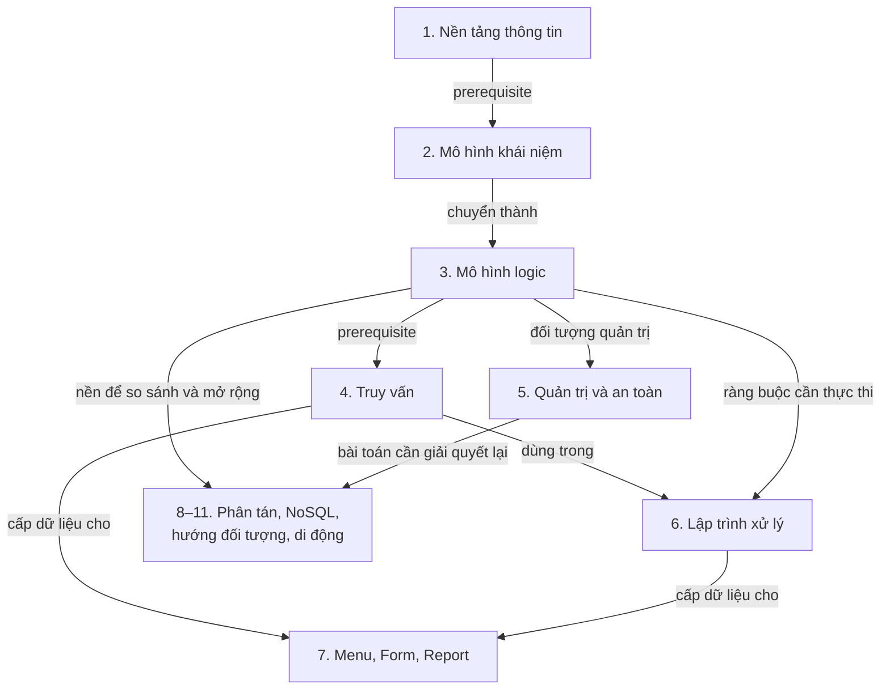

# Knowledge map — IE103 · Quản lý thông tin

> Phạm vi: **12 PDF · 695 trang/slide · 5 chương · 11 cụm kiến thức**.
> Cập nhật: **2026-09-23**.
> Quy ước: `[S<n>, slide a–b]` dẫn đến file có mã S<n>; số slide là **thứ tự trang PDF, tính từ 1**, kể cả bìa và phụ lục. Số in ở chân trang đôi khi lệch, đặc biệt trong S11.
> Phương pháp: đọc toàn bộ phần chữ; đối chiếu hình ở các trang có sơ đồ, bảng, ảnh thao tác hoặc chữ trích xuất thiếu nghĩa. Quan hệ **trực tiếp** có trong slide; quan hệ **prerequisite** là thứ tự học tổng hợp từ nội dung, không phải lịch buổi học.

---

## Mục lục

<!-- GENERATED_TOC -->

---

## Phạm vi nguồn

<!-- SOURCE_INVENTORY -->

Năm chương được xác nhận trong slide giới thiệu: tổng quan; biểu diễn thông tin; xử lý thông tin; trình bày thông tin; các mô hình CSDL tiên tiến. Chương 2 có hai phần, chương 3 có ba phần, chương 5 có bốn phần; **số đầu tên PDF không phải số chương hay số buổi học**. [S1, slide 8–9][S1]

## Bức tranh lớn

Môn học trả lời câu hỏi: **làm sao biến dữ liệu rời rạc thành thông tin có thể tìm, xử lý, bảo vệ và sử dụng?** Có thể hình dung một thư viện: phân loại sách, lập mục lục, tìm sách, quản lý người được mượn và lập báo cáo; khi có nhiều chi nhánh, phải giải quyết thêm việc phân bố và đồng bộ. Đây là analogy để đọc bản đồ, không phải một hệ thống bài tập xuyên suốt của slide. Phạm vi chuyên môn tương ứng nằm ở mục tiêu môn và sơ đồ tổng quan. [S1, slide 3][S1]; [S2, slide 9][S2]

Ví dụ nối các chương: slide dùng tác giả–sách để minh họa mô hình khái niệm; các phần NoSQL và hướng đối tượng tiếp tục dùng tác giả–sách–nhà xuất bản để so sánh cách biểu diễn. Chúng liên hệ về **bài toán và mô hình**, không nên mặc định dữ liệu mẫu ở các file hoàn toàn giống nhau. [S3, slide 22–24][S3]; [S10, slide 24–30][S10]; [S11, slide 22–25][S11]

| Quan hệ trên sơ đồ | Loại và bằng chứng |
|---|---|
| 1 → 2 → 3 | **Prerequisite**, rồi **chuyển đổi trực tiếp**: từ nhu cầu tổ chức thông tin đến các mức biểu diễn, từ ERD đến cấu trúc logic. [S2, slide 4–9][S2]; [S3, slide 4–10, 27–35][S3] |
| 3 → 4 | **Prerequisite**: hiểu bảng, thuộc tính, khóa và XML trước khi JOIN, truy vấn lồng hoặc XPath/XQuery. [S4, slide 36–45, 71–74][S4]; [S5, slide 6–27, 41–54][S5] |
| 3 → 5 | **Đối tượng quản trị**: server → database → object → action là các mức cần kiểm soát. [S6, slide 11, 15–40][S6] |
| 4 → 6 và 3 → 6 | **Dùng trong / thực thi**: procedure, function chứa xử lý dữ liệu; trigger gắn với thay đổi dữ liệu và các yêu cầu toàn vẹn. [S4, slide 47–68][S4]; [S7, slide 4–15, 26–46, 59–67][S7] |
| 4 → 7 và 6 → 7 | **Cấp dữ liệu**: report lấy dữ liệu từ nguồn truy vấn; slide chỉ rõ stored procedure có SELECT có thể làm nguồn cho Crystal Reports. [S8, slide 47–50, 60–62][S8] |
| 3 → 8–11 | **So sánh / mở rộng**: phân mảnh lược đồ quan hệ; chuyển ví dụ quan hệ sang NoSQL hoặc object; lưu dữ liệu ở thiết bị di động. [S9, slide 23–32][S9]; [S10, slide 24–30][S10]; [S11, slide 22–25][S11]; [S12, slide 4–8][S12] |
| 5 → 8–11 | **Bài toán tái xuất hiện**, nổi bật ở phân tán và di động: nhất quán, bảo mật, giao tác, phục hồi vẫn cần giải quyết khi có nhiều nơi giữ dữ liệu hoặc mất kết nối. [S9, slide 9–22][S9]; [S12, slide 15–23, 32–34][S12] |

## Các cụm kiến thức

### 1. Nền tảng thông tin — Chương 1

- **Trực giác:** ghi được dữ liệu chưa đủ; phải đặt nó vào ngữ cảnh mới dùng được. Giống một đống hóa đơn cần được phân loại trước khi biết chi tiêu tăng ở đâu.
- **Ví dụ trong slide:** dữ liệu được lựa chọn, tổng hợp và trình bày để tạo thông tin; diễn giải thông tin tạo ra hiểu biết. [S2, slide 14–18][S2]
- **Khái niệm lõi:** Data (dữ liệu) → Information (thông tin) → Knowledge (tri thức); Database (CSDL), DBMS (hệ quản trị CSDL), ứng dụng; thu thập → làm sạch → phân tích → xử lý. Phân tích có thể lặp lại, không phải lúc nào cũng đi một chiều. [S2, slide 14–31][S2]
- **Quan hệ:** tổ chức dữ liệu giảm trùng lặp và bất nhất; hệ thống kết hợp CSDL, DBMS và ứng dụng. Transaction (giao tác), rollback (hoàn tác), log (nhật ký) và backup (sao lưu) đặt nền cho việc khôi phục khi xử lý gặp lỗi. [S2, slide 4–7, 19–24, 32–39][S2]
- **Nối tiếp:** mô hình hóa trả lời cách tổ chức; truy vấn trả lời cách lấy thông tin; quản trị đào sâu bảo vệ và phục hồi. [S1, slide 8][S1]; [S6, slide 54–68][S6]

### 2. Mô hình khái niệm — Chương 2

- **Trực giác:** xác định những thứ cần quản lý và cách chúng liên quan trước khi chọn chỗ lưu. Giống vẽ sơ đồ phòng trước khi chọn vật liệu xây nhà.
- **Ví dụ trong slide:** tác giả viết sách; sơ đồ nhân viên–phòng ban đặt câu hỏi mỗi bên có thể liên quan đến bao nhiêu đối tượng bên kia. [S3, slide 19–26][S3]
- **Khái niệm lõi:** conceptual/logical/physical model (mô hình khái niệm/logic/vật lý); ERD (sơ đồ thực thể–kết hợp), entity, attribute, key, relationship và cardinality (lực lượng kết hợp tối thiểu/tối đa). Class diagram (sơ đồ lớp) bổ sung thuộc tính, phương thức, inheritance, association và aggregation. [S3, slide 4–24, 37–47][S3]
- **Quan hệ:** ERD → mô hình logic là bước chuyển đổi; ví dụ 1–n đưa khóa bên “1” sang bên “n”, n–n tạo bảng liên kết. Quan hệ giữa class có thể được biểu diễn bằng tham chiếu đơn hoặc tập đối tượng. [S3, slide 27–35, 48–51][S3]
- **Nối tiếp:** ERD dẫn tới bảng và ràng buộc ở cụm 3; class diagram dẫn tới CSDL hướng đối tượng ở cụm 10. [S4, slide 36–68][S4]; [S11, slide 7–14, 22–25][S11]

### 3. Mô hình logic và toàn vẹn dữ liệu — Chương 2

- **Trực giác:** cách xếp dữ liệu quyết định việc tìm và giữ dữ liệu đúng có dễ hay không. Giống kho hàng: cách chia kệ và sổ tra cứu ảnh hưởng trực tiếp đến thao tác.
- **Ví dụ trong slide:** điểm của sinh viên phải tham chiếu môn học tồn tại; tổng hóa đơn phải khớp các dòng chi tiết. [S4, slide 55–62, 65][S4]
- **Khái niệm lõi:** flat file, mô hình hierarchical/network/relational (phân cấp/mạng/quan hệ); relation, tuple, attribute, domain và NULL; schema (lược đồ) khác dữ liệu tại một thời điểm. Index (chỉ mục) có dense/sparse, clustering và B-Tree. XML biểu diễn dữ liệu bằng cấu trúc thẻ. [S4, slide 4–45, 71–74][S4]
- **Quan hệ:** khóa và ràng buộc miền/liên thuộc tính/liên bảng xác định dữ liệu hợp lệ; normalization (chuẩn hóa) dùng phụ thuộc hàm để xem xét cách tách bảng. Phụ lục giới thiệu 1NF, 2NF, 3NF, BCNF nhưng phần 3NF/BCNF cần xác minh trước khi học định nghĩa. [S4, slide 47–68, 79–85][S4]
- **Nối tiếp:** bảng/XML là đầu vào của truy vấn; ràng buộc nghiệp vụ nối sang trigger; mô hình quan hệ là mốc để so sánh các mô hình chương 5. [S5, slide 6–39, 41–54][S5]; [S7, slide 26–46][S7]

### 4. Truy vấn thông tin — Chương 3

- **Trực giác:** từ dữ liệu đã lưu, diễn đạt chính xác câu hỏi cần trả lời. Giống tìm trong thư viện: “có ít nhất một cuốn” khác “có tất cả các cuốn”.
- **Ví dụ trong slide:** INNER JOIN và LEFT JOIN cho kết quả khác nhau khi nhân viên không có thân nhân; mẫu chia quan hệ tìm đối tượng tham gia **tất cả** dự án bằng hai lớp NOT EXISTS. [S5, slide 6–10, 32][S5]
- **Khái niệm lõi:** nhóm lệnh SQL DDL/DML/DCL; JOIN; subquery (truy vấn con), correlated subquery (truy vấn con tương quan); IN, ANY/ALL, EXISTS; UNION/INTERSECT/EXCEPT; aggregate (hàm tổng hợp), GROUP BY/HAVING; XPath và XQuery FLWOR. [S5, slide 4–39, 41–54][S5]
- **Quan hệ:** JOIN nối nguồn dữ liệu; subquery diễn đạt điều kiện phụ thuộc tập/kết quả khác; WHERE lọc dòng, HAVING lọc nhóm; XPath định vị nút, XQuery kết hợp truy vấn và tạo kết quả XML. [S5, slide 6–27, 34–39, 41–54][S5]
- **Nối tiếp:** truy vấn được đóng gói trong view/procedure/function và cấp dữ liệu cho report. Các ví dụ cuối file là mẫu đọc yêu cầu rồi chọn cấu trúc truy vấn; không suy ra một cấu trúc luôn nhanh hơn cấu trúc khác. [S5, slide 56–77][S5]; [S6, slide 42–52][S6]; [S7, slide 4–15, 59–67][S7]; [S8, slide 60–62][S8]

### 5. Quản trị CSDL và an toàn thông tin — Chương 3

- **Trực giác:** dữ liệu chỉ hữu ích khi đúng người truy cập được và có thể lấy lại sau sự cố. Giống tòa nhà cần cả thẻ ra vào, phân quyền từng phòng và phương án phục hồi hồ sơ.
- **Ví dụ trong slide:** cho đọc thông tin nhân viên qua view nhưng không cấp quyền đọc trực tiếp bảng chứa lương; khôi phục từ full backup rồi differential backup. [S6, slide 51, 64–68][S6]
- **Khái niệm lõi:** DBA (người quản trị CSDL); Login (danh tính cấp server), User (danh tính trong database), Role (nhóm quyền); GRANT/DENY/REVOKE; View (bảng ảo theo truy vấn); full/differential/log backup và recovery model (chế độ phục hồi). [S6, slide 4–40, 42–60][S6]
- **Quan hệ:** Login được ánh xạ đến User; Role gom quyền theo phạm vi. View vừa đóng gói truy vấn vừa hỗ trợ giới hạn dữ liệu được thấy khi đi kèm phân quyền. Chuỗi backup, log và trạng thái restore quyết định điểm có thể phục hồi. [S6, slide 15–18, 20–40, 42–52, 54–68][S6]
- **Ứng dụng và nối tiếp:** import/export đi qua nguồn → đích → ánh xạ → chạy → kiểm tra. Các yêu cầu toàn vẹn, bảo mật và phục hồi tiếp tục xuất hiện trong CSDL phân tán/di động. [S6, slide 70–81][S6]; [S9, slide 9–22][S9]; [S12, slide 15–23, 32–34][S12]

### 6. Lập trình xử lý thông tin — Chương 3

- **Trực giác:** những thao tác dữ liệu lặp lại cần được đóng gói hoặc tự chạy khi có sự kiện. Giống quầy thu ngân có quy trình tính tiền và sổ tự ghi lại mỗi lần điều chỉnh.
- **Ví dụ trong slide:** procedure nhận tham số; trigger ghi nhận thay đổi lương hoặc cập nhật tổng hóa đơn; cursor duyệt lần lượt các dòng. [S7, slide 4–15, 39, 46, 69–83][S7]
- **Khái niệm lõi:** stored procedure (thủ tục lưu trữ), tham số vào/ra; trigger (xử lý theo sự kiện), AFTER/INSTEAD OF, tập inserted/deleted, nested/recursive trigger; scalar/table-valued function; cursor (con trỏ duyệt kết quả). [S7, slide 4–15, 26–53, 59–83][S7]
- **Quan hệ:** procedure được gọi để thực hiện công việc; function trả về giá trị hoặc bảng; DML kích hoạt trigger theo loại được khai báo. Cursor có vòng đời DECLARE → OPEN → FETCH → CLOSE → DEALLOCATE; CLOSE và DEALLOCATE giải phóng các mức tài nguyên khác nhau. [S7, slide 26–33, 59–67, 69–79][S7]
- **Nối tiếp:** dùng kiến thức SQL và ràng buộc để đọc các chương trình xử lý; SELECT trong procedure còn có thể cung cấp dữ liệu cho report. Mã mẫu có lỗi cần kiểm tra trước khi chạy, nêu ở mục Cần xác minh. [S7, slide 34–46][S7]; [S8, slide 62][S8]

### 7. Menu, Form và Report — Chương 4

- **Trực giác:** dữ liệu cần có đường vào và cách hiển thị để người dùng làm được việc. Giống nhà hàng có thực đơn để chọn, phiếu gọi món để ghi yêu cầu và hóa đơn để xem kết quả.
- **Ví dụ trong slide:** form kiểm tra dữ liệu rồi gửi qua backend tới database; report nhóm nhân viên và hiển thị tổng theo nhóm. [S8, slide 43, 70][S8]
- **Khái niệm lõi:** Menu (điều hướng), Form (nhập liệu), Report (báo cáo); control, validation (kiểm tra dữ liệu), event (sự kiện); chọn biểu đồ; Crystal Reports với header/detail/footer, parameter, formula, group và running total. [S8, slide 4–26, 29–43, 47–70][S8]
- **Quan hệ:** menu dẫn đến chức năng; form kết hợp kiểm tra kiểu/nghiệp vụ ở client và server; report thu thập → xử lý → trực quan hóa → xuất kết quả. Thiết kế giao diện gắn với khả năng nhận biết, tính nhất quán và số lựa chọn. [S8, slide 19–26, 32–43, 47–54, 72][S8]
- **An toàn và nối tiếp:** phần form đề cập SQL injection, XSS, CSRF cùng prepared statement, escaping và token; phần report lấy nguồn từ database hoặc procedure. Trình bày trên màn hình nhỏ quay lại ở CSDL di động. [S8, slide 38–43, 60–62][S8]; [S12, slide 34][S12]

### 8. CSDL phân tán — Chương 5, phần 1

- **Trực giác:** dữ liệu có thể ở nhiều nơi nhưng người dùng vẫn cần làm việc với một hệ thống thống nhất. Giống ngân hàng có nhiều chi nhánh cùng phục vụ một mạng tài khoản.
- **Ví dụ trong slide:** ngân hàng có ba chi nhánh; chuyển tiền giữa các nơi đặt ra yêu cầu phối hợp dữ liệu. [S9, slide 4–6][S9]
- **Khái niệm lõi:** distributed database (CSDL phân tán), tự trị cục bộ, tính trong suốt; replication (nhân bản), fragmentation (phân mảnh), allocation (phân bố); phân mảnh ngang/dọc/hỗn hợp; thiết kế top-down/bottom-up. [S9, slide 4, 9–32, 48–50][S9]
- **Quan hệ:** global schema → fragmentation schema → allocation schema → local mapping. Phân mảnh ngang chia dòng; dọc chia thuộc tính, có thể giữ khóa để nối lại; replication tạo bản sao. Đổi lại lợi ích truy cập cục bộ/sẵn sàng là chi phí phối hợp, lưu trữ và duy trì nhất quán. [S9, slide 23–36][S9]
- **Nối tiếp:** cần nền về khóa, truy vấn, giao tác và toàn vẹn. Đồng bộ bản sao và phục hồi là cầu nối với NoSQL và CSDL di động; không đồng nhất “phân tán” với một kiểu mô hình dữ liệu. [S9, slide 9–22][S9]; [S10, slide 8–12][S10]; [S12, slide 7–8, 15–23][S12]

### 9. CSDL NoSQL — Chương 5, phần 2

- **Trực giác:** cách lưu nên phù hợp với hình dạng dữ liệu và việc cần làm. Giống danh bạ, hồ sơ và sơ đồ quan hệ phục vụ những cách tra cứu khác nhau.
- **Ví dụ trong slide:** cùng bài toán tác giả–sách–nhà xuất bản được biểu diễn thành key-value, document, column và graph. [S10, slide 24–30][S10]
- **Khái niệm lõi:** bốn họ NoSQL: key-value (khóa–giá trị), document (tài liệu), column/wide-column (dữ liệu theo họ cột), graph (đồ thị); ACID, BASE và eventual consistency (nhất quán sau cùng) xuất hiện để thảo luận lựa chọn nhất quán và khả năng mở rộng. [S10, slide 4–22][S10]
- **Quan hệ:** key-value tra theo khóa; document gom cấu trúc vào tài liệu; ví dụ column cho phép các dòng có tập cột khác nhau; graph biểu diễn node–edge và thuộc tính. Đây là các cách tổ chức để **so sánh**, không phải bốn bước chuyển đổi bắt buộc. [S10, slide 14–22, 24–30][S10]
- **Nối tiếp:** dùng mô hình quan hệ làm mốc đọc ví dụ chuyển đổi, dùng kiến thức phân tán để đọc các đánh đổi. Các phát biểu bao quát về SQL/NoSQL và benchmark trong file cần giới hạn theo hệ quản trị, phiên bản, cấu hình và phép thử. [S10, slide 6–12, 31–36, 40–45][S10]

### 10. CSDL hướng đối tượng — Chương 5, phần 3

- **Trực giác:** có những dữ liệu tự nhiên hơn khi lưu theo đối tượng có cấu trúc và hành vi. Giống hồ sơ một thiết bị gồm bộ phận, đặc tính và thao tác của chính nó.
- **Ví dụ trong slide:** lớp Person có thuộc tính và phương thức; Student kế thừa Person; sách liên kết với nhà xuất bản và tập tác giả. [S11, slide 9, 12, 22–25][S11]
- **Khái niệm lõi:** object, class, property, method; encapsulation (đóng gói), inheritance (kế thừa), đa kế thừa; cấu trúc tuple/set/bag/list; biểu diễn thuộc tính phức hợp và quan hệ đối tượng. [S11, slide 7–14, 17–20][S11]
- **Quan hệ:** class diagram ở chương 2 nối tới cách tổ chức CSDL theo đối tượng. Ví dụ chuyển mô hình quan hệ dùng cấu trúc đơn cho liên kết đơn và tập/danh sách cho liên kết nhiều. [S3, slide 37–51][S3]; [S11, slide 22–25][S11]
- **Ứng dụng và ranh giới:** slide nêu CAD/CAM, đa phương tiện, cơ sở tri thức và hệ nhúng. Đây là hướng biểu diễn dữ liệu/hành vi, không phải từ đồng nghĩa với document database. [S11, slide 4–5, 15, 21][S11]; [S10, slide 17–18][S10]

### 11. CSDL di động — Chương 5, phần 4

- **Trực giác:** ứng dụng vẫn cần làm việc khi thiết bị đổi chỗ hoặc mất mạng. Giống mang một phần hồ sơ đi công tác rồi đối chiếu lại khi trở về.
- **Ví dụ trong slide:** dữ liệu lưu cục bộ để truy vấn khi không có kết nối, sau đó đồng bộ với dữ liệu từ xa. [S12, slide 4–8][S12]
- **Khái niệm lõi:** mobile database (CSDL di động), dữ liệu cục bộ/nhúng; kiến trúc client-server và peer-to-peer; hạn chế băng thông, bộ nhớ, năng lượng và kết nối; đồng bộ, bảo mật đầu cuối, tự quản lý; truy vấn phụ thuộc/không phụ thuộc vị trí. [S12, slide 4–23, 32–34][S12]
- **Quan hệ:** điều kiện di động làm phát sinh yêu cầu dữ liệu gọn, hoạt động khi ngắt kết nối và giải quyết thay đổi khi đồng bộ. Client-server tập trung vai trò server; peer-to-peer chia vai trò giữa các thiết bị và đặt ra vấn đề tìm/sẵn có dữ liệu. [S12, slide 10–23][S12]
- **Nối tiếp:** kết hợp quản trị, giao tác và nhất quán phân tán với yêu cầu giao diện màn hình nhỏ. Danh sách sản phẩm và số liệu thị trường trong slide là thông tin theo thời điểm nguồn, không phải bảng khuyến nghị hiện tại. [S12, slide 24–34][S12]

## Lộ trình học

Đây là **thứ tự học đề xuất từ quan hệ kiến thức**, không suy ra lịch giảng hay trọng số thi.

1. **Nắm câu hỏi của môn:** phân biệt Data/Information/Knowledge và vai trò Database/DBMS/ứng dụng. Mục tiêu: nói được dữ liệu được tổ chức để phục vụ việc gì. [S2, slide 14–24][S2]
2. **Vẽ trước, chọn cách lưu sau:** đọc entity, relationship, cardinality; theo một ví dụ ERD → bảng. Đọc class diagram để chuẩn bị nhánh hướng đối tượng. [S3, slide 11–35, 37–51][S3]
3. **Giữ dữ liệu đúng:** học bảng, khóa, domain, các loại ràng buộc; sau đó đọc index, normalization và XML. Phần chuẩn hóa có điểm cần xác minh bên dưới. [S4, slide 25–68, 71–85][S4]
4. **Lấy đúng kết quả:** luyện đọc JOIN → subquery → GROUP BY/HAVING → bài toán “tất cả”; với XML, đi từ XPath đến XQuery. Phân biệt đúng kết quả trước khi bàn hiệu năng. [S5, slide 6–54][S5]
5. **Đi hai nhánh bổ sung nhau:** quản trị học danh tính/quyền → view → backup/restore; lập trình học procedure → trigger → function → cursor. Cả hai cần mô hình dữ liệu và SQL ở bước trước. [S6, slide 11–68][S6]; [S7, slide 4–83][S7]
6. **Đưa vào luồng ứng dụng:** Menu → Form → xử lý dữ liệu → Report; lần theo một report lấy dữ liệu từ SELECT/procedure. [S8, slide 43, 60–62, 72][S8]
7. **Mở bốn nhánh chương 5:** phân tán đặt vấn đề dữ liệu ở nhiều nơi; NoSQL so sánh cách tổ chức; hướng đối tượng nối lại class diagram; di động ghép lưu cục bộ, đồng bộ và hạn chế thiết bị. Bốn nhánh có giao nhau, không tạo một chuỗi công nghệ thay thế nhau. [S9, slide 23–36][S9]; [S10, slide 14–30][S10]; [S11, slide 7–14, 22–25][S11]; [S12, slide 4–23][S12]

## Điểm dễ nhầm và ranh giới

| Cặp/nhóm khái niệm | Phân biệt để đọc slide | Nguồn |
|---|---|---|
| Data / Information / Knowledge | Dữ liệu ban đầu; dữ liệu có ngữ cảnh/ý nghĩa; hiểu biết rút ra qua diễn giải. | [S2, slide 14–18][S2] |
| Database / DBMS / ứng dụng | Nơi chứa dữ liệu; phần mềm quản lý dữ liệu; phần sử dụng dữ liệu cho công việc. | [S2, slide 19–21][S2] |
| Conceptual / logical / physical | Mô tả đối tượng và quan hệ; chuyển sang cấu trúc của mô hình dữ liệu; cụ thể hóa lưu trữ. | [S3, slide 4–10][S3] |
| Schema / dữ liệu hiện có | Cấu trúc quan hệ khác các bộ giá trị đang có tại một thời điểm. | [S4, slide 36–45][S4] |
| Constraint / index | Constraint mô tả điều kiện hợp lệ; index hỗ trợ truy cập. Không dùng chỉ mục để thay cho mọi quy tắc nghiệp vụ. | [S4, slide 25–34, 47–68][S4] |
| INNER / LEFT JOIN | INNER giữ các cặp khớp; LEFT còn giữ dòng phía trái không có đối tác, với phần bên phải là NULL. | [S5, slide 6–10][S5] |
| WHERE / HAVING | Điều kiện trên dòng đầu vào khác điều kiện trên nhóm sau tổng hợp. | [S5, slide 34–39][S5] |
| Login / User / Role | Danh tính cấp server; danh tính trong database; nhóm quyền theo phạm vi. Chủ sở hữu Role không tự động được hưởng mọi quyền của Role. | [S6, slide 15–31][S6] |
| GRANT / DENY / REVOKE | Cấp; từ chối rõ ràng; gỡ trạng thái cấp/từ chối đã đặt. REVOKE không đồng nghĩa DENY. | [S6, slide 33–40][S6] |
| View / bảng gốc | View thông thường mô tả kết quả truy vấn; giới hạn truy cập phải đi cùng quyền trên view và các đối tượng liên quan. | [S6, slide 42–52][S6] |
| Procedure / function / trigger | Công việc được gọi; xử lý trả giá trị/bảng; xử lý gắn với sự kiện. Cách gọi và phạm vi sử dụng khác nhau. | [S7, slide 4–15, 26–33, 59–67][S7] |
| Full / differential / log backup | Toàn bộ; thay đổi từ full backup làm cơ sở; chuỗi log giao tác. Không tùy ý hoán đổi thứ tự restore. | [S6, slide 54–68][S6] |
| Menu / Form / Report | Dẫn đến chức năng; nhận/kiểm tra dữ liệu; trình bày kết quả. | [S8, slide 72][S8] |
| Replication / fragmentation | Sao chép dữ liệu khác chia dữ liệu thành các mảnh; một thiết kế có thể phối hợp cả hai. | [S9, slide 27–36][S9] |
| Phân mảnh ngang / dọc | Chia theo dòng khác chia theo thuộc tính; mảnh dọc có thể cùng giữ khóa để ghép lại. | [S9, slide 28–31][S9] |
| Phân tán / NoSQL / hướng đối tượng / di động | Lần lượt nhấn mạnh vị trí dữ liệu; họ mô hình; biểu diễn đối tượng; điều kiện thiết bị/kết nối. Đây là các trục so sánh có thể giao nhau. | [S9, slide 4][S9]; [S10, slide 14–22][S10]; [S11, slide 7–14][S11]; [S12, slide 4–13][S12] |

## Cần xác minh

Không có file hay trang bị bỏ qua do không đọc được. Các mục dưới là **mâu thuẫn, lỗi ký hiệu/mã mẫu hoặc giới hạn bằng chứng trong nguồn**; chưa sửa slide và chưa xác nhận lại với giảng viên. Map chỉ giữ các kết luận có thể đối chiếu, không coi mã mẫu là chương trình đã chạy.

| Vị trí | Điểm cần xác minh | Cách dùng trong map |
|---|---|---|
| [S3, slide 30][S3] | Chuyển quan hệ 1–1 tùy chọn thành `T1T2(A1,B2)`, trong khi khóa của T2 là B1. | Cần kiểm tra B2 có phải lỗi ghi khóa trước khi làm theo sơ đồ. |
| [S4, slide 46][S4]; [S9, slide 28–30][S9] | S4 gắn σ cho phép chiếu và Π cho phép chọn, khác cách ký hiệu ở phần phân mảnh S9. | Dùng nghĩa “chọn dòng/chọn thuộc tính”, không sao chép bảng ký hiệu S4. |
| [S4, slide 79, 84–85][S4] | Mô tả 3NF ở slide 84 có cụm “phụ thuộc bắc cầu”; slide 85 ghi “Dạng chuẩn 4 (Boyce-Codd-Kent)” trong khi slide 79 liệt kê BCNF. | Cần đối chiếu định nghĩa chuẩn; không học BCNF như tên khác của 4NF. |
| [S5, slide 15, 22, 24][S5] | Khẳng định về tốc độ JOIN/IN/EXISTS và xử lý NULL thiếu điều kiện về dữ liệu, truy vấn và kế hoạch thực thi. | Không tạo quy tắc “cách nào luôn nhanh hơn”; phải kiểm tra ngữ nghĩa và phép đo cụ thể. |
| [S5, slide 28, 30, 43–44, 57][S5] | INTERSECT/EXCEPT ALL chưa chỉ rõ dialect/version; XPath cần đối chiếu nút gốc; ví dụ slide 57 đặt ORDER BY trước GROUP BY/HAVING. | Kiểm tra lại cú pháp trên hệ sử dụng trước khi chạy mẫu. |
| [S6, slide 25, 31, 40, 58–59][S6] | Thứ tự tham số `sp_addrolemember` không thống nhất; slide 58 giới hạn log backup ở FULL nhưng slide 59 cũng nêu BULK_LOGGED. | Đọc mô hình quyền/phục hồi riêng với mã mẫu; cần xác minh tham số và recovery model. |
| [S7, slide 31–32, 77, 82, 85, 87][S7] | Phát biểu bao quát về trigger/view/thứ tự kiểm tra cần phân biệt AFTER và INSTEAD OF; `@@FETCHSTATUS` khác `@@FETCH_STATUS`; mẫu UPDATE ở slide 85 không khớp tên bảng/cột và ý định gán giá trị. | Giữ cơ chế và vòng đời; chưa coi ví dụ là mã thực thi đã kiểm chứng. |
| [S9, slide 37, 41][S9] | Bảng kết quả được gắn nhãn phân mảnh dọc nhưng hình giữ thuộc tính và lọc dòng theo ví dụ gốc. | Đối chiếu lại nhãn với định nghĩa phân mảnh ở slide 28–31. |
| [S10, slide 6–10, 31, 33, 35–36][S10] | Một số phát biểu coi SQL chỉ mở rộng dọc, NoSQL đều mã nguồn mở/không có ràng buộc hoặc bỏ đặc tính ACID; hình slide 35 đặt Redis ở ô “Wide Column Stores”, Cassandra/HBase ở “Key-Value Databases”, khác cách phân loại ở slide 31. | Học bốn họ theo cấu trúc dữ liệu; xác minh từng sản phẩm/phiên bản thay vì dùng các phát biểu tuyệt đối hoặc logo để phân loại. |
| [S10, slide 24–30][S10] | Mã tác giả–sách và dữ liệu chưa được bảo toàn nhất quán giữa các cách chuyển; các đoạn giống JSON có lỗi cú pháp. | Dùng để so sánh ý tưởng biểu diễn; không coi là bộ dữ liệu chuyển đổi có thể chạy nguyên trạng. |
| [S10, slide 40–45][S10] | Slide 40 nêu MySQL nhưng cấu hình ở 42 là MongoDB 3.0/SQL Server 2014 Express và kết luận ở 45 là MSSQL; đồ thị không thể hiện rõ đơn vị thời gian. | Chỉ ghi nhận một thực nghiệm theo cấu hình nguồn; chưa suy ra xếp hạng hiệu năng chung hay số đo có đơn vị. |
| [S12, slide 5, 19, 25, 29][S12] | Mốc thời gian, thị phần và thông tin sản phẩm thuộc bối cảnh cũ; chưa có kiểm chứng hiện tại. | Dùng làm bối cảnh lịch sử, không coi là số liệu hoặc khuyến nghị công nghệ hiện hành. |

## Nguồn

Toàn bộ dẫn chiếu nội dung ở trên trỏ tới **12 PDF gốc trong cùng thư mục**. Analogy và lộ trình là phần diễn giải tổng hợp; những chỗ nguồn mâu thuẫn được giữ riêng ở mục Cần xác minh. Không dùng thông tin ngoài slide để bổ sung quy định thi, điểm hoặc lời giảng viên.

<!-- SOURCE_LIST -->
