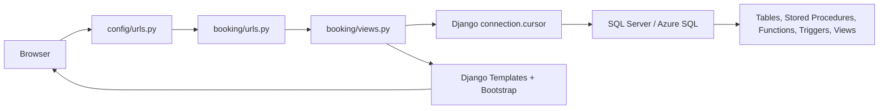

# Tổng quan dự án và source code mẫu IE103

> Phạm vi: thư mục `src/sample/` của [đồ án IE103 — Quản lý Khách sạn](../../README.md). Nội dung dưới đây được đối chiếu với các file đang có trong repo ngày 2026-10-06; **chưa chạy ứng dụng, SQL hay kiểm tra Azure SQL/demo trực tuyến**.

---

## Mục lục

- [1. Hai phạm vi cần phân biệt](#1-hai-phạm-vi-cần-phân-biệt)
- [2. Bản đồ source code](#2-bản-đồ-source-code)
- [3. Kiến trúc và luồng một thao tác](#3-kiến-trúc-và-luồng-một-thao-tác)
- [4. Mô hình dữ liệu đặt xe](#4-mô-hình-dữ-liệu-đặt-xe)
- [5. Nghiệp vụ nằm ở SQL](#5-nghiệp-vụ-nằm-ở-sql)
- [6. Những điểm phải kiểm tra trước khi tái sử dụng](#6-những-điểm-phải-kiểm-tra-trước-khi-tái-sử-dụng)
- [7. Cách dùng tài liệu này cho đồ án khách sạn](#7-cách-dùng-tài-liệu-này-cho-đồ-án-khách-sạn)
- [Nguồn và mức xác minh](#nguồn-và-mức-xác-minh)

---

## 1. Hai phạm vi cần phân biệt

| Phạm vi | Nội dung đã xác nhận | Vai trò của thư mục này |
|---|---|---|
| [Đồ án `prj1`](../../README.md) | Nhóm chọn **Quản lý Khách sạn**, gồm CSDL, Backend và Frontend. Đề giảng viên yêu cầu phân tích/thiết kế CSDL, 5 Stored Procedure, 5 Trigger, 3 Function, 2 Cursor, an toàn dữ liệu và 5 Report. Hạn nộp chính thức còn `❓`. | Đề tài và tiến độ của nhóm được theo dõi ở README đồ án, task `T027`. |
| [Mã mẫu `src/sample/source/`](source/README.md) | Demo **đặt xe công nghệ**: Django hiển thị dữ liệu và gọi SQL Server/Azure SQL. | Nguồn tham khảo về tổ chức code, SQL nghiệp vụ và cách trình diễn trước/sau; **không phải** mã đã triển khai cho khách sạn. |
| [`snippets/database-scripts/`](../../snippets/database-scripts/Scripts/README.md) | Bộ script **MySQL quản lý khách sạn** tách riêng, có hướng dẫn import/export/backup/restore. | Không cùng schema hoặc hệ quản trị với SQL Server của mẫu đặt xe. |

README của sample tự giới thiệu là bài demo đặt xe của “Group 5”. Quan hệ giữa nhóm đó và nhóm đồ án khách sạn hiện tại **❓ chưa xác nhận**; không lấy danh sách thành viên hoặc trạng thái hoàn thành trong README sample làm thông tin của `prj1`.

## 2. Bản đồ source code

| Vị trí | Vai trò thực tế |
|---|---|
| [`source/README.md`](source/README.md) | Tài liệu của sample: stack, hướng dẫn chạy, schema, màn hình. Một số mô tả khác code hiện tại; xem mục 6. |
| [`source/manage.py`](source/manage.py), [`source/requirements.txt`](source/requirements.txt) | Entry point Django và phiên bản dependency: Django 6.0.5, `mssql-django`, `pyodbc`, `python-decouple`. |
| [`source/config/settings.py`](source/config/settings.py), [`source/config/urls.py`](source/config/urls.py) | Đọc biến môi trường, cấu hình kết nối `mssql` qua ODBC Driver 18, đăng ký app và chuyển toàn bộ URL sang `booking.urls`. |
| [`source/booking/urls.py`](source/booking/urls.py), [`source/booking/views.py`](source/booking/views.py) | 8 route; `views.py` chứa truy vấn SQL trực tiếp, cấu hình form demo, xử lý GET/POST và dữ liệu đưa vào template. |
| [`source/booking/models.py`](source/booking/models.py), [`source/booking/tests.py`](source/booking/tests.py) | File khung gần như trống; dữ liệu không được mô hình hóa bằng Django ORM, chưa thấy test thực chất. |
| [`source/templates/base.html`](source/templates/base.html), [`source/templates/booking/`](source/templates/booking/) | Giao diện Django Templates dùng Bootstrap 5 qua CDN: dashboard, danh sách, 5 trang demo. |
| [`source/sql/`](source/sql/), [`sql/`](sql/) | **Hai bộ SQL** cùng bài toán nhưng khác thứ tự tên file, phần ví dụ và đoạn dọn dẹp cuối file; không coi là hai bản sao đồng nhất. |
| [`source/.env.example`](source/.env.example), [`source/.gitignore`](source/.gitignore) | Mẫu tên biến cấu hình và quy tắc bỏ qua `.env`/`venv`. Bản `.env` thật không nằm trong repo. |

README sample có nhắc `static/` và `venv/`; hai thư mục đó không có trong bản source đã đưa vào repo. `venv/` thường là môi trường tạo cục bộ. Cấu hình hiện vẫn khai báo `STATICFILES_DIRS` trỏ tới `source/static/`.

## 3. Kiến trúc và luồng một thao tác



Ứng dụng không dùng Django ORM cho nghiệp vụ. `views.py` chạy raw SQL qua `connection.cursor()`, đổi kết quả thành dictionary rồi render HTML. Ở các trang demo, GET đọc dữ liệu **trước** thao tác; POST gọi SQL, đọc dữ liệu **sau** thao tác và hiển thị kết quả. Các tham số ở lệnh SQL trong view được truyền qua `%s` và danh sách tham số. Nguồn: [`views.py`](source/booking/views.py), các [template demo](source/templates/booking/).

| URL | View | Nội dung |
|---|---|---|
| `/` | `dashboard` | KPI tài xế, cuốc xe, doanh thu, 10 cuốc gần nhất. |
| `/drivers/`, `/trips/` | `drivers`, `trips` | Danh sách và lọc theo trạng thái. |
| `/demo/procedures/` | `demo_procedures` | Gọi 5 Stored Procedure bằng form POST. |
| `/demo/triggers/` | `demo_triggers` | Thực hiện DML hoặc gọi procedure để kích hoạt 5 Trigger. |
| `/demo/functions/` | `demo_functions` | Gọi 3 Function và xem giá trị/bảng trả về. |
| `/demo/cursors/` | `demo_cursors` | Gọi 2 procedure chứa Cursor; đều có side effect. |
| `/demo/security/` | `demo_security` | Đọc 6 View báo cáo, metadata Dynamic Data Masking và database users/roles. |

Danh sách route lấy từ [`booking/urls.py`](source/booking/urls.py). **Bấm Execute là thao tác ghi thật vào database được cấu hình**, đặc biệt ở trang procedures, triggers và cursors; đây không phải mô phỏng giao diện.

## 4. Mô hình dữ liệu đặt xe

[`01_CreateDatabase.sql`](source/sql/01_CreateDatabase.sql) định nghĩa **13 bảng nghiệp vụ**. `CUOCXE` là bảng trung tâm, nối khách, tài xế, bảng giá và voucher. Hai bảng `IMPORT_LOG`, `EXPORT_AUDIT_LOG` được khai báo thêm trong [`07_Security_UPDATE.sql`](source/sql/07_Security_UPDATE.sql), không thuộc 13 bảng ban đầu.

| Nhóm | Bảng | Mối quan hệ / mục đích |
|---|---|---|
| Chủ thể | `KHACHHANG`, `TAIXE`, `PHUONGTIEN` | Phương tiện tham chiếu tài xế. |
| Đặt xe | `CUOCXE`, `DIEMDEN`, `HANGDOI` | Cuốc xe có các điểm đón/trả và bản ghi phát cuốc vào hàng đợi. |
| Giá và khuyến mãi | `BANGGIA`, `VOUCHER`, `KHACHHANG_VOUCHER` | Cuốc xe tham chiếu bảng giá/voucher; bảng nối lưu voucher của khách. |
| Tiền và hậu giao dịch | `VIDIENTU`, `LICHSUGIAODICH`, `DANHGIA`, `THONGBAO` | Ví và lịch sử giao dịch, đánh giá một lần mỗi cuốc, thông báo. |

```text
KHACHHANG ──┐
TAIXE ──────┼──> CUOCXE ──> DIEMDEN / HANGDOI / DANHGIA
BANGGIA ────┤       │
VOUCHER ────┘       └──> LICHSUGIAODICH <── VIDIENTU
```

`VIDIENTU` và `THONGBAO` lưu `loại chủ sở hữu/người nhận + mã` để dùng chung cho khách và tài xế; schema không khai báo foreign key trực tiếp từ các mã này tới cả hai bảng chủ thể. Dữ liệu mẫu ở [`02_SampleData.sql`](source/sql/02_SampleData.sql) chỉ có **4–18 dòng tùy bảng** (ví dụ `BANGGIA` 4, `TAIXE` 8, `VIDIENTU` 18), nên không chứng minh yêu cầu **10–20 dòng cho mỗi quan hệ** của đề đồ án đã được đáp ứng.

## 5. Nghiệp vụ nằm ở SQL

| Loại | Đối tượng trong `source/sql/` | Ý nghĩa theo phần code thực thi |
|---|---|---|
| 5 Stored Procedure | `sp_DatXe`, `sp_NhanCuocXe`, `sp_HoanThanhChuyen`, `sp_HuyChuyen`, `sp_NapTienVi` | Tạo cuốc/tạm trừ ví; nhận cuốc; hoàn thành và cộng ví tài xế; hủy và hoàn ví khách; nạp ví. Có transaction cho từng procedure. [`04_StoredProcedures.sql`](source/sql/04_StoredProcedures.sql) còn tạo helper `fn_SinhMa`. |
| 3 Function | `fn_TinhCuocPhi`, `fn_DoanhThuTheoThang`, `fn_KiemTraVoucher` | Tính giá sau voucher; trả bảng doanh thu tài xế theo tháng; trả BIT hợp lệ của voucher. Nằm trong [`03_Functions.sql`](source/sql/03_Functions.sql). |
| 5 Trigger | `trg_CapNhatDiemUyTin`, `trg_KiemTraSoDuTruocGiaoDich`, `trg_CapNhatLuotVoucher`, `trg_NganXoaCuocXe`, `trg_ThongBaoTrangThai` | Code thực tế lần lượt: đình chỉ tài xế khi đủ 3 đánh giá 1 sao trong ngày; **cảnh báo** ví khách dưới 10.000đ khi cuốc hoàn thành; tăng lượt voucher khi cuốc hoàn thành; chặn xóa cuốc đang chạy/đã nhận; gửi thông báo khi đổi trạng thái. Xem [`05_Triggers.sql`](source/sql/05_Triggers.sql). |
| 2 procedure dùng Cursor | `sp_Cursor_Top50TaiXeDoanhThuNgay`, `sp_Cursor_ThuongTop3KhachHang` | Gửi thông báo cho top tài xế; thưởng 50.000đ và gửi thông báo cho top 3 khách. Xem [`06_Cursors.sql`](source/sql/06_Cursors.sql). |
| Phân quyền và báo cáo | 6 `vw_*` View, database users/roles, Dynamic Data Masking; 5 nhóm câu truy vấn dashboard | [`07_Security_UPDATE.sql`](source/sql/07_Security_UPDATE.sql) chứa View/quyền/masking; [`09_Tableau_Queries.sql`](source/sql/09_Tableau_Queries.sql) chứa SQL làm data source cho **5 dashboard dự kiến**, chưa thấy file dashboard Tableau trong sample. |

Ví dụ luồng code hiện tại: POST `sp_DatXe` → trừ `VIDIENTU.So_Du` → thêm `CUOCXE` trạng thái `Cho nhan` → thêm `LICHSUGIAODICH`; POST `sp_NhanCuocXe` → khóa dòng cuốc bằng `UPDLOCK`, gán tài xế và đổi trạng thái; POST `sp_HoanThanhChuyen` → đổi `Hoan thanh`, cộng ví tài xế, ghi giao dịch và kích hoạt các Trigger `AFTER UPDATE` trên `CUOCXE`. Nguồn: [`04_StoredProcedures.sql`](source/sql/04_StoredProcedures.sql), [`05_Triggers.sql`](source/sql/05_Triggers.sql).

## 6. Những điểm phải kiểm tra trước khi tái sử dụng

1. **Các file SQL có lệnh phá dữ liệu ở cuối.** Cả [`source/sql/01_CreateDatabase.sql`](source/sql/01_CreateDatabase.sql) và [`sql/01_CreateDatabase.sql`](sql/01_CreateDatabase.sql) `DROP DATABASE` ở đầu rồi `DROP TABLE` toàn bộ 13 bảng ở cuối. [`source/sql/03_Functions.sql`](source/sql/03_Functions.sql) tạo rồi xóa 3 Function; [`source/sql/05_Triggers.sql`](source/sql/05_Triggers.sql) chạy một `UPDATE` ví dụ rồi xóa 5 Trigger; [`sql/07_Security.sql`](sql/07_Security.sql) xóa View, log table, role và user ở cuối. **Không chạy nguyên file hoặc chạy trên database có dữ liệu cần giữ** trước khi rà từng batch.
2. **Hai cây SQL không có cùng thứ tự hoặc cùng đoạn cuối.** `sql/` đánh số `03_StoredProcedures`, `04_Triggers`, `05_Functions`; `source/sql/` đánh số `03_Functions`, `04_StoredProcedures`, `05_Triggers`, thêm `09_Tableau_Queries`. File security ở `source/sql/` tên `07_Security_UPDATE` và không có đoạn cleanup cuối như bản `sql/07`. Chưa có một bộ script được xác nhận là bản triển khai cuối; cần chọn, sửa và kiểm thử một bộ nhất quán.
3. **Comment/README có chỗ vượt quá code.** Comment `sp_DatXe` nói tính phí bằng Function, kiểm tra voucher và tạo `DIEMDEN`/`HANGDOI`; thân procedure hiện nhận sẵn `Gia_Uoc_Tinh` và không làm các bước đó. `sp_NhanCuocXe` kiểm tra trạng thái cuốc nhưng không kiểm tra tài xế có `San sang`. Comment `trg_KiemTraSoDuTruocGiaoDich` nói chặn giao dịch thiếu tiền, nhưng trigger thực tế chỉ tạo cảnh báo khi cuốc hoàn thành và ví dưới 10.000đ. Comment `trg_CapNhatLuotVoucher` nói tăng khi INSERT cuốc, code tăng khi UPDATE sang `Hoan thanh`. Ưu tiên đọc câu SQL thực thi trước khi đưa hành vi vào báo cáo.
4. **Các nút demo có side effect lặp lại.** `sp_Cursor_ThuongTop3KhachHang` cộng 50.000đ cho từng khách top 3 **mỗi lần gọi**; Cursor top 50 tạo thêm thông báo mỗi lần gọi và điều kiện lọc “hôm nay” trong SQL đang bị comment. Trang Trigger có thao tác `DELETE FROM CUOCXE`. Nếu kết nối tới Azure SQL dùng chung, các lần demo sau sẽ thấy dữ liệu đã đổi. Nguồn: [`06_Cursors.sql`](source/sql/06_Cursors.sql), [`views.py`](source/booking/views.py).
5. **Phân quyền SQL chưa đồng nghĩa với đăng nhập web.** SQL tạo role/user và masking, nhưng `settings.py` không cài `django.contrib.auth`/`AuthenticationMiddleware`; các view demo không có kiểm tra quyền người dùng. `settings.py` dùng `ALLOWED_HOSTS = ['*']`, `DEBUG` mặc định `True`; `views.py` đưa nội dung exception ra template. Đây là demo cần rà cấu hình và quyền truy cập trước khi đưa lên môi trường dùng chung. Hai file security có **password viết trực tiếp trong SQL được Git theo dõi**; chưa xác minh chúng có còn dùng thật hay không, nên không chép giá trị vào tài liệu và cần xử lý nếu là credential thật.
6. **Phần còn thiếu so với đề bài.** Trong `src/sample/` chưa thấy luồng Import/Export/Backup/Restore thực thi; `IMPORT_LOG` và `EXPORT_AUDIT_LOG` chỉ là bảng log. `09_Tableau_Queries.sql` là câu truy vấn cho 5 nhóm dashboard, chưa chứng minh có 5 Report chạy được. Đây cũng là bài toán đặt xe, chưa phải chức năng hay dữ liệu khách sạn của `prj1`. Nguồn: [đề tài và checklist của đồ án](../../README.md), [`source/sql/`](source/sql/).

## 7. Cách dùng tài liệu này cho đồ án khách sạn

- **Có thể học cách chia tầng:** route → view/form → Stored Procedure/Function → Trigger → bảng dữ liệu; cách trình bày dữ liệu trước/sau một thao tác và cách viết View báo cáo.
- **Cần thiết kế lại theo khách sạn:** thực thể, quan hệ, trạng thái đặt phòng, nghiệp vụ thanh toán, quyền truy cập và 5 Report phải bám đề tài nhóm, không đổi tên bảng đặt xe để dùng lại.
- **Đối chiếu trạng thái bằng nguồn riêng:** [README đồ án](../../README.md) giữ yêu cầu và quyết định của nhóm; [bộ script MySQL khách sạn](../../snippets/database-scripts/Scripts/README.md) là tài liệu khác cần thẩm định độc lập. Không tính các đối tượng trong sample đặt xe là hạng mục đã hoàn thành của đồ án khách sạn.

## Nguồn và mức xác minh

Tổng hợp từ [README đồ án](../../README.md), [README sample](source/README.md), [Django app](source/booking/), [cấu hình](source/config/), [hai cây SQL](source/sql/) và [`sql/`](sql/). Các nhận xét về cấu trúc, lệnh và chênh lệch là **đối chiếu tĩnh file trong repo**. Trạng thái Azure SQL, kết quả thực thi, tính đúng của báo cáo và tiến độ thực tế của nhóm **❓ chưa xác minh**.
