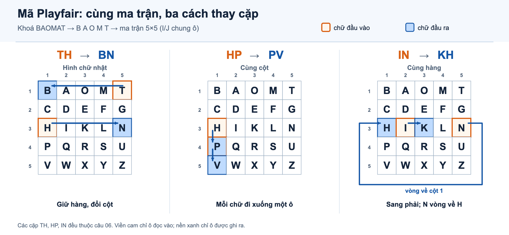

# IE105 — Ôn Chương 2A: Mã Playfair (Playfair cipher)

| | |
|---|---|
| Môn / chương | IE105 · Chương 2A — Các giải thuật mã hoá |
| Phạm vi | Đề 1, câu 05–06; phần Playfair |
| Đề nguồn | [SAMPLE_FINAL_EXAM.pdf](SAMPLE_FINAL_EXAM.pdf), trang 2 |
| Nguồn kiến thức | Slide Bài 2A, trang 31–34 và 73 |
| Điểm nhìn thấy trong đề mẫu | 2 câu × 0,25 = 0,50/10 điểm; đề chỉ có 7/40 câu |
| Ngày cập nhật | 2026-10-01 |
| Trạng thái đáp án | Suy luận từ đề và slide; chưa có đáp án chính thức |

> Đây là hướng dẫn cho hai câu Playfair nhìn thấy trong đề mẫu chưa đầy đủ. Không dùng tỷ lệ 0,50/10 để dự đoán trọng số của đề thi thật.

## Mục lục

- [Phạm vi và câu hỏi thuộc chương](#phạm-vi-và-câu-hỏi-thuộc-chương)
- [Mã Playfair (Playfair cipher)](#mã-playfair-playfair-cipher)
  - [1. Trực giác](#1-trực-giác)
  - [2. Analogy](#2-analogy)
  - [3. Ví dụ nhỏ](#3-ví-dụ-nhỏ)
  - [4. Quy tắc hình thức](#4-quy-tắc-hình-thức)
  - [5. Kiểm tra bằng code](#5-kiểm-tra-bằng-code)
- [Đáp án và hướng dẫn từng câu](#đáp-án-và-hướng-dẫn-từng-câu)
  - [Câu 05 — tra một ô trong ma trận](#câu-05--tra-một-ô-trong-ma-trận)
  - [Câu 06 — mã hoá thông điệp](#câu-06--mã-hoá-thông-điệp)
- [Tự kiểm tra](#tự-kiểm-tra)
- [Nguồn](#nguồn)
- [Bạn cần tự làm lại phần nào](#bạn-cần-tự-làm-lại-phần-nào)

---

## Phạm vi và câu hỏi thuộc chương

| Câu | Trang đề | Dữ kiện cần dùng | Việc cần làm | Điểm |
|---|---:|---|---|---:|
| 05 | 2 | Khoá BAOMAT; ma trận 5×5 | Dựng ma trận, đọc ô hàng 3 cột 3 | 0,25 |
| 06 | 2 | M = THANH PHO HO CHI MINH; khoá BAOMAT | Tách cặp, mã hoá từng cặp, lấy ký tự thứ hai của ciphertext | 0,25 |

Đề ghi 0,25 điểm mỗi câu ở trang 1. Hai câu chiếm 0,50 điểm trong 7 câu hiện có của bản mẫu. Bản PDF chỉ có câu 01–07 rồi chuyển sang tình huống chưa có câu hỏi; cấu trúc toàn đề chưa xác định.

## Mã Playfair (Playfair cipher)

### 1. Trực giác

Playfair mã hoá từng cặp chữ. Vì vậy, chữ mã hoá của một ký tự phụ thuộc vào vị trí của cả hai ký tự trong cùng một ma trận.

### 2. Analogy

Hãy xem ma trận như một bảng ghế 5×5. Hai chữ là hai người ngồi ở hai ghế:

- Cùng hàng: cả hai dịch sang ghế bên phải.
- Cùng cột: cả hai dịch xuống một hàng.
- Khác hàng và khác cột: mỗi người sang cột của người kia nhưng vẫn ở hàng cũ.

### 3. Ví dụ nhỏ

Với ma trận của khoá BAOMAT ở câu 05, A ở hàng 1 cột 2 và N ở hàng 3 cột 5. Hai chữ tạo thành hình chữ nhật, nên lấy hai góc còn lại trên từng hàng:

- A đổi sang chữ ở hàng 1 cột 5: T.
- N đổi sang chữ ở hàng 3 cột 2: I.

Vậy AN → TI. Đây cũng là cặp thứ hai trong câu 06.

### 4. Quy tắc hình thức

Theo slide Bài 2A trang 31–32:

1. Lần lượt đưa các chữ không trùng của khoá vào ma trận 5×5.
2. Xem I và J là một ký tự; sau khoá, điền các chữ còn lại theo thứ tự A–Z, bỏ J.
3. Bỏ khoảng trắng trong thông điệp rồi tách thành từng cặp liên tiếp. Slide trang 34 xác nhận cách tách cho chính thông điệp của câu 06.
4. Nếu còn một chữ lẻ, thêm X vào cuối.
5. Mã hoá từng cặp theo hàng, cột hoặc hình chữ nhật. Khi đi hết mép phải thì vòng về đầu hàng; khi đi hết hàng cuối thì vòng lên hàng đầu.

Với khoá BAOMAT, chữ A lặp lại nên chỉ giữ một lần. Ma trận thu được:

| | Cột 1 | Cột 2 | Cột 3 | Cột 4 | Cột 5 |
|---:|---|---|---|---|---|
| Hàng 1 | B | A | O | M | T |
| Hàng 2 | C | D | E | F | G |
| Hàng 3 | H | I | K | L | N |
| Hàng 4 | P | Q | R | S | U |
| Hàng 5 | V | W | X | Y | Z |

| Trường hợp | Quy tắc mã hoá |
|---|---|
| Cùng hàng | Dịch mỗi chữ một cột sang phải; cột cuối vòng về cột đầu |
| Cùng cột | Dịch mỗi chữ một hàng xuống; hàng cuối vòng về hàng đầu |
| Hình chữ nhật | Giữ nguyên hàng, đổi cột giữa hai chữ |

*Hình do AI dựng dựa trên slide Bài 2A, trang 31–34 và Đề 1, câu 06, trang 2; ba cặp dùng cùng ma trận BAOMAT.*

[SVG chỉnh sửa](images/playfair-mechanism.svg)

**Đọc hình:**

- **Viền cam** đánh dấu chữ đầu vào; **nền xanh** đánh dấu ô tạo chữ đầu ra. Ở cặp HP, ô P giữ cả hai vai trò.
- **Hình chữ nhật:** TH giữ hàng và đổi cột để thành BN.
- **Dịch chuyển:** HP đi xuống thành PV; IN sang phải thành KH, N vòng về đầu hàng.

### 5. Kiểm tra bằng code

Đoạn Python dưới đây nhận các cặp đã tách sẵn theo ví dụ trên slide. Nó giúp kiểm tra phép tính; khi làm đề, vẫn cần trình bày ma trận và từng cặp bằng tay.

~~~python
def build_square(key):
    alphabet = "ABCDEFGHIKLMNOPQRSTUVWXYZ"
    unique = []
    for char in key.upper().replace("J", "I"):
        if char in alphabet and char not in unique:
            unique.append(char)
    unique.extend(char for char in alphabet if char not in unique)
    return [unique[i:i + 5] for i in range(0, 25, 5)]

def encrypt_pairs(pairs, key):
    square = build_square(key)
    position = {
        char: (row, col)
        for row, letters in enumerate(square)
        for col, char in enumerate(letters)
    }
    result = []
    for pair in pairs.split():
        if len(pair) != 2:
            raise ValueError("Mỗi phần tử phải là một cặp hai chữ")
        first, second = pair.upper().replace("J", "I")
        row1, col1 = position[first]
        row2, col2 = position[second]
        if row1 == row2:
            encoded = (
                square[row1][(col1 + 1) % 5],
                square[row2][(col2 + 1) % 5],
            )
        elif col1 == col2:
            encoded = (
                square[(row1 + 1) % 5][col1],
                square[(row2 + 1) % 5][col2],
            )
        else:
            encoded = (square[row1][col2], square[row2][col1])
        result.append("".join(encoded))
    return " ".join(result)

pairs = "TH AN HP HO HO CH IM IN HX"
assert encrypt_pairs(pairs, "PLAYFAIR") == "QM PQ EA GQ GQ BK DE EU KW"
print(encrypt_pairs(pairs, "BAOMAT"))
~~~

Kết quả:

~~~text
BN TI PV KB KB HP LA KH KV
~~~

Kết quả với khoá PLAYFAIR khớp ví dụ trên slide Bài 2A trang 34; đây là phép đối chiếu cách tách cặp và áp dụng quy tắc, không phải đáp án chính thức cho câu 05–06.

## Đáp án và hướng dẫn từng câu

### Câu 05 — tra một ô trong ma trận

**Đề hỏi:** Với khoá BAOMAT, ký tự ở hàng 3 cột 3 của ma trận 5×5 là gì? [SAMPLE_FINAL_EXAM.pdf, trang 2]

**Đáp án suy luận: B — K.** Đề không kèm đáp án chính thức.

**Cách làm:**

1. Loại ký tự lặp trong khoá: BAOMAT → B, A, O, M, T. Chữ A thứ hai không tạo thêm ô.
2. Điền tiếp bảng chữ cái theo thứ tự, gộp I/J và bỏ J.
3. Đọc ma trận theo hàng từ trái sang phải. Hàng 3 là H, I, K, L, N.
4. Cột 3 của hàng 3 là K.

**Bẫy:** Bắt đầu đếm hàng và cột từ 1; không đếm lại ký tự A trùng trong khoá.

**Tự kiểm tra:** Hàng 3 phải có đúng H–I–K–L–N, và mỗi chữ trong ma trận chỉ xuất hiện một lần.

### Câu 06 — mã hoá thông điệp

**Đề hỏi:** Mã hoá THANH PHO HO CHI MINH với khoá BAOMAT rồi lấy ký tự thứ hai của ciphertext. [SAMPLE_FINAL_EXAM.pdf, trang 2]

**Đáp án suy luận: C — N.** Đề không kèm đáp án chính thức.

**Bước 1 — chuẩn bị plaintext:** Bỏ khoảng trắng được THANHPHOHOCHIMINH, gồm 17 chữ. Theo slide, thêm X để số chữ chẵn. Các cặp là:

~~~text
TH AN HP HO HO CH IM IN HX
~~~

**Bước 2 — mã hoá từng cặp bằng ma trận BAOMAT:**

| Cặp | Vị trí trong ma trận | Quy tắc | Cặp mã |
|---|---|---|---|
| TH | T(1,5), H(3,1) | Hình chữ nhật | BN |
| AN | A(1,2), N(3,5) | Hình chữ nhật | TI |
| HP | H(3,1), P(4,1) | Cùng cột, đi xuống | PV |
| HO | H(3,1), O(1,3) | Hình chữ nhật | KB |
| HO | H(3,1), O(1,3) | Hình chữ nhật | KB |
| CH | C(2,1), H(3,1) | Cùng cột, đi xuống | HP |
| IM | I(3,2), M(1,4) | Hình chữ nhật | LA |
| IN | I(3,2), N(3,5) | Cùng hàng, dịch phải và vòng mép | KH |
| HX | H(3,1), X(5,3) | Hình chữ nhật | KV |

Ciphertext theo từng cặp là:

~~~text
BN TI PV KB KB HP LA KH KV
~~~

Bỏ dấu cách, ciphertext bắt đầu bằng BN; ký tự thứ hai là N. Vì vậy chọn C.

**Bẫy:** Không nhầm ký tự thứ hai của ciphertext với chữ thứ hai của plaintext. Hãy mã hoá cặp đầu TH trước; cặp này cho BN.

**Tự kiểm tra:** Với cặp cùng hàng IN, I dịch sang K; N ở mép phải vòng sang H. Kết quả KH là kiểm tra nhanh quy tắc vòng mép.

## Tự kiểm tra

1. Vì sao chữ A trong khoá BAOMAT chỉ xuất hiện một lần trong ma trận?
2. Khi một cặp cùng hàng, hướng dịch là gì và điều gì xảy ra ở cột cuối?
3. Với ma trận BAOMAT, cặp AN được mã thành cặp nào?
4. Vì sao plaintext của câu 06 có thêm X ở cuối?
5. Ký tự thứ hai của ciphertext câu 06 là gì, và được xác định từ cặp plaintext nào?

Đáp án và giải thích

1. Slide yêu cầu các chữ trong ma trận không trùng nhau; chỉ giữ chữ A xuất hiện đầu tiên trong khoá.
2. Dịch sang phải một cột; từ cột cuối vòng về cột đầu.
3. TI. A(1,2) và N(3,5) tạo hình chữ nhật; lấy T(1,5) và I(3,2).
4. Bỏ khoảng trắng thì thông điệp có 17 chữ, nên thêm X để đủ cặp theo quy tắc slide trang 32.
5. N, là chữ thứ hai của cặp ciphertext đầu BN, mã từ cặp plaintext TH.

## Nguồn

- [SAMPLE_FINAL_EXAM.pdf](SAMPLE_FINAL_EXAM.pdf), Đề 1, trang 1–2: quy định 0,25 điểm/câu và nội dung câu 05–06.
- [Slide Bài 2A — Các giải thuật mã hoá](../materials/slides/Ba%CC%80i%202A%20-%20Ca%CC%81c%20gia%CC%89i%20thua%CC%A3%CC%82t%20ma%CC%83%20hoa%CC%81.pdf), trang 31–34: dựng ma trận, quy tắc mã hoá và ví dụ Playfair; trang 73: bài tập mẫu.
- [Map đề thi](exam-map.md), mục 1 và 2.8: phân loại câu 05–06 thuộc Chương 2A; map ghi rõ đề mẫu chỉ có 7/40 câu.

**Giới hạn nguồn:** Không có đáp án chính thức. Đáp án B — K và C — N được tính từ dữ kiện đề cùng các quy tắc trên slide. Slide trang 34 dùng khoá PLAYFAIR, nên chỉ dùng để đối chiếu cách tách cặp và phép mã hoá.

## Bạn cần tự làm lại phần nào

- Che ma trận, tự dựng lại từ khoá BAOMAT và trả lời câu 05.
- Che cột “Cặp mã”, tự mã hoá đủ chín cặp của câu 06 rồi so với kết quả.
- Tự giải thích vì sao cặp IN cho KH khi ký tự N nằm ở mép phải ma trận.
- Luyện thêm bài Playfair trên slide Bài 2A trang 73: tự dựng ma trận, mã hoá rồi giải mã; slide chỉ nêu yêu cầu, không có đáp án để đối chiếu.
