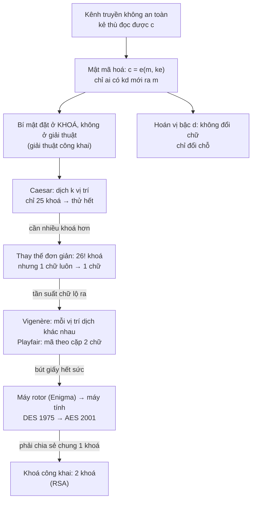
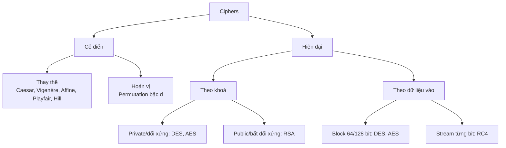
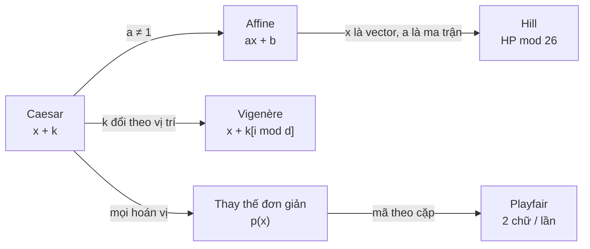

# L02 — Mã hoá cổ điển (Classical ciphers)

| | |
|---|---|
| Môn | `IE105` Nhập môn bảo đảm và an ninh thông tin |
| Buổi | 02 |
| Ngày | 2026-07-15 |
| Giảng viên | Tô Nguyễn Nhật Quang |
| Transcript | [`_raw/L02-2026-07-15-transcript.docx`](_raw/L02-2026-07-15-transcript.docx) (1h 28m) |
| Slide | [`Bài 2A - Các giải thuật mã hoá.pdf`](../materials/slides/B%C3%A0i%202A%20-%20C%C3%A1c%20gi%E1%BA%A3i%20thu%E1%BA%ADt%20m%C3%A3%20ho%C3%A1.pdf), trang 1–42 và 71–74 |
| Code | [`code/classical_ciphers.py`](../code/classical_ciphers.py) — kiểm mọi ví dụ trong note |

> Nhãn nguồn: `[B2A s23]` = slide Bài 2A, trang 23. `ngoài slide` = suy luận hoặc kiến thức chuẩn
> không có trong slide/transcript của buổi này.

---

## Mục lục

- [Tóm tắt một đoạn](#tóm-tắt-một-đoạn)
- [Gốc rễ của cả buổi](#gốc-rễ-của-cả-buổi)
- [Nội dung chính](#nội-dung-chính)
  - [1. Mật mã hoá và các khái niệm cơ bản (Encryption & Decryption)](#1-mật-mã-hoá-và-các-khái-niệm-cơ-bản-encryption--decryption)
  - [2. Phân loại mã hoá (Classical/Modern ciphers): theo khoá và theo dữ liệu vào](#2-phân-loại-mã-hoá-classicalmodern-ciphers-theo-khoá-và-theo-dữ-liệu-vào)
  - [3. Lịch sử mật mã (History of cryptography)](#3-lịch-sử-mật-mã-history-of-cryptography)
  - [4. Mã hoá khoá đối xứng và bất đối xứng (Symmetric/Asymmetric key)](#4-mã-hoá-khoá-đối-xứng-và-bất-đối-xứng-symmetricasymmetric-key)
  - [5. Yêu cầu cơ bản của giải thuật mật mã (Kerckhoffs's principle)](#5-yêu-cầu-cơ-bản-của-giải-thuật-mật-mã-kerckhoffss-principle)
  - [6. Mã thay thế đơn giản (Substitution Cipher)](#6-mã-thay-thế-đơn-giản-substitution-cipher)
  - [7. Mã hoán vị bậc d (Permutation Cypher)](#7-mã-hoán-vị-bậc-d-permutation-cypher)
  - [8. Mã dịch chuyển (Shift Cypher): Caesar và Vigenère](#8-mã-dịch-chuyển-shift-cypher-caesar-và-vigenère)
  - [9. Mã tuyến tính (Affine Cipher)](#9-mã-tuyến-tính-affine-cipher)
  - [10. Mã Playfair](#10-mã-playfair)
  - [11. Mã Hill](#11-mã-hill)
  - [12. Phá mã cổ điển (Cryptanalysis): phân tích tần suất](#12-phá-mã-cổ-điển-cryptanalysis-phân-tích-tần-suất)
- [Bảng tổng hợp](#bảng-tổng-hợp)
- [Sơ đồ](#sơ-đồ)
- [Gợi ý thi](#gợi-ý-thi)
- [Deadline phát sinh](#deadline-phát-sinh)
- [Chỗ chưa rõ](#chỗ-chưa-rõ)
- [Tự kiểm tra](#tự-kiểm-tra)
- [Liên kết](#liên-kết)

---

## Tóm tắt một đoạn

Buổi 2 mở Bài 2A: mật mã hoá là biến thông báo `m` thành chuỗi `c` mà chỉ người có khoá giải được.
Thầy phân loại mã hoá theo hai trục — cổ điển (thay thế / hoán vị) và hiện đại; hiện đại lại chia theo
**khoá** (đối xứng một khoá / bất đối xứng hai khoá) và theo **dữ liệu vào** (block / stream) — rồi kể
lịch sử từ Caesar, Enigma tới DES (1975) và AES (2001). Phần chính là 5 giải thuật cổ điển: thay thế
đơn giản, hoán vị bậc d, dịch chuyển (Caesar ⊂ Vigenère), tuyến tính (Affine) và **Playfair** — giải thuật
thầy dạy kỹ nhất, dùng cho bài tập cuối giờ và **có trong đề thi**. Mã Hill được bỏ qua vì tốn thời gian và
"thi cũng không hỏi". Công cụ kiểm tra kết quả: CrypTool 1.

---

## Gốc rễ của cả buổi

Vấn đề gốc: **gửi thông tin qua kênh mà kẻ thù đọc được** (điện tín bị bắt, mạng bị nghe lén). Không giấu được
đường truyền thì phải làm cho nội dung vô nghĩa với người ngoài — nhưng vẫn khôi phục được cho người nhận.
Mỗi giải thuật trong buổi sinh ra để vá điểm yếu của giải thuật trước.



> Chuỗi "điểm yếu → giải thuật kế tiếp" là suy luận `ngoài slide`; thứ tự các giải thuật bám slide [B2A s23–35].

---

## Nội dung chính

### 1. Mật mã hoá và các khái niệm cơ bản (Encryption & Decryption)

#### 📚 Lý thuyết

**Gốc rễ (first principles).** *`ngoài slide`*

- **Ngữ cảnh:** hai bên (Alice, Bob) liên lạc qua một kênh mà kẻ thứ ba (Adversary) nghe được [B2A s9].
- **Vấn đề gốc:** không ngăn được việc bị nghe → phải làm cho thứ bị nghe được **vô nghĩa**.
- **Sự thật nền:** (1) kẻ nghe lén thấy toàn bộ `c`; (2) người nhận phải khôi phục đúng `m`; (3) thứ duy nhất người nhận có mà kẻ nghe lén không có là một **bí mật nhỏ** trao trước qua kênh an toàn.
- **Suy luận:** (1) + (2) ⇒ phép biến đổi phải khả nghịch; (3) ⇒ phép nghịch đảo chỉ chạy được khi có bí mật ⇒ bí mật đó chính là **khoá** `kd`.
- **Nếu không có khoá?** Giải thuật nào giữ bí mật bằng cách giấu *cách làm* thì lộ cách làm một lần là mất hết.

**Định nghĩa hình thức** `[B2A s7–8]`

> - **Thông báo, văn bản:** là một chuỗi hữu hạn các ký hiệu lấy từ một bảng chữ cái Z nào đó và được ký hiệu là **m**.
> - **Mật mã hoá:** là việc biến đổi một thông báo sao cho nó không thể hiểu nổi đối với bất kỳ người khác ngoài người nhận được mong muốn. Ký hiệu **e(m)**.
> - **Khoá:** là một thông số đầu vào của phép mã hoá hoặc giải mã. Khoá mã hoá ký hiệu **ke**, khoá giải mã ký hiệu **kd**.
> - **Chuỗi mật mã:** là chuỗi nguỵ trang […] ký hiệu là **c**: `c = e(m, ke)`.
> - **Phép giải mã** `d(c, kd)` là quá trình xác định thông báo gốc m từ c và kd: `d(c, kd) = m`.

**Ký hiệu:** `m` = plaintext (bản rõ) · `c` = ciphertext (bản mã) · `ke`/`kd` = khoá mã hoá/giải mã.
Sơ đồ slide s9: khoá đi qua **secure channel**, bản mã đi qua **unsecured channel** mà Adversary nghe được.

#### 💡 Giải thích dễ hiểu

**Trực giác:** khoá là thứ duy nhất ngăn cách người nhận và kẻ nghe lén.

**Analogy:** gửi một cái hộp có khoá qua bưu điện. Ai cũng cầm được hộp (`c`), chỉ người có chìa (`kd`) mở được và lấy thư (`m`).
Chìa phải đưa trước, tận tay (secure channel).
*Chỗ analogy vỡ:* hộp khoá thì kẻ trộm vẫn biết bên trong "có thư"; bản mã tốt còn giấu cả cấu trúc của thư — và với hộp thật, phá ổ khoá là đủ, còn bản mã chỉ bị phá khi suy được khoá hoặc nội dung.

**Ví dụ nhỏ nhất:** `m = "AB"`, `ke = kd = 1` (dịch 1 chữ): `c = e("AB", 1) = "BC"`, `d("BC", 1) = "AB"`.

```
 Alice                                   Bob
 m ──e(·,ke)──► c ═══ kênh hở ═══► c ──d(·,kd)──► m
                      ▲
                 Adversary đọc được c, KHÔNG có kd
 ke ─────────────── kênh an toàn ──────────────► kd
```

#### 💻 Code & thực tế

Xem `caesar()` trong [`code/classical_ciphers.py`](../code/classical_ciphers.py).

> **Trong production** `ngoài slide`: HTTPS chính là sơ đồ s9 — gói tin đi qua Wi-Fi quán cà phê (kênh hở), còn "kênh an toàn"
> để thống nhất khoá được dựng bằng mã hoá khoá công khai lúc TLS handshake.

#### ✍️ Bài tập

**Bài 1** *(Nhớ)* — Trong ký hiệu của slide, `d(e(m, ke), kd)` bằng gì? Kênh nào trong sơ đồ s9 phải là kênh an toàn? · *tự đặt*

> 🔑 **Kiến thức mở khoá:** định nghĩa `c = e(m, ke)` và `d(c, kd) = m` [B2A s8]; sơ đồ s9.

<details><summary>Hướng giải</summary>

Thay `c = e(m, ke)` vào `d(c, kd) = m` ⇒ bằng **m**. Kênh an toàn là kênh truyền **khoá**; bản mã đi kênh không an toàn.

</details>

**Chốt mục:** nhớ cặp ký hiệu `m, c, ke, kd, e(), d()` — đề hay viết biểu thức bằng chúng (xem Bài 2B).

---

### 2. Phân loại mã hoá (Classical/Modern ciphers): theo khoá và theo dữ liệu vào

#### 📚 Lý thuyết

**Gốc rễ (first principles).** *`ngoài slide`*

- **Ngữ cảnh:** có hàng trăm giải thuật; cần trục để biết một giải thuật thuộc "họ" nào.
- **Sự thật nền:** (1) một giải thuật luôn có **khoá** — câu hỏi tự nhiên là *mấy khoá?*; (2) nó luôn nhận **dữ liệu vào** — câu hỏi tự nhiên là *nhận từng mẩu cỡ nào?*; (3) với chữ viết tay chỉ có hai thao tác: **đổi chữ** hoặc **đổi chỗ**.
- **Suy luận:** (3) ⇒ cổ điển chia thay thế/hoán vị; (1) ⇒ đối xứng/bất đối xứng; (2) ⇒ block/stream.

**Định nghĩa hình thức** `[B2A s10, s42]`

| Trục | Nhóm | Định nghĩa trên slide |
|---|---|---|
| **Cổ điển** (Classical) | Substitution cipher | *A block of plaintext is replaced with ciphertext* |
| | Transposition cipher | *The letters of the plaintext are shifted about to form the cryptogram* |
| **Hiện đại — theo khoá** | Private Key | *Same key is used for encryption and decryption* |
| | Public Key | *Two different keys are used for encryption and decryption* |
| **Hiện đại — theo dữ liệu vào** | Block Cipher | *Encrypts block of data of fixed size* — "mã hoá các khối có chiều dài cố định 64 bit hoặc 128 bit" [s42] |
| | Stream Cipher | *Encrypts continuous streams of data* — "mã hoá từng bit của thông điệp. Đại diện là RC4" [s42] |

Ví dụ trên slide s42: block cipher đối xứng — IDEA, RC2, **DES**, Triple DES, Rijndael (**AES**), MARS, RC6, Serpent, Twofish…; stream — **RC4**; bất đối xứng — **RSA**.

> ⚠️ **GỢI Ý THI:** *"thi cuối kỳ đôi khi thì cũng hỏi một câu trong cái phân loại này"* — buổi 2, 2026-07-15 (đầu buổi)

#### 💡 Giải thích dễ hiểu

**Trực giác:** hỏi ba câu — *thời nào? mấy khoá? ăn dữ liệu từng miếng hay từng giọt?* — là xếp được mọi giải thuật.

**Analogy:** phân loại xe — *xe ngựa hay xe máy* (cổ điển/hiện đại), *một chìa hay chìa riêng cho mở/khoá* (đối xứng/bất đối xứng),
*chở theo thùng cố định hay bơm như ống nước* (block/stream).
*Chỗ analogy vỡ:* các trục không loại trừ nhau — AES vừa là đối xứng vừa là block; còn xe thì không vừa là ngựa vừa là máy.

**Ví dụ nhỏ nhất:** xếp 4 cái tên → `Playfair`: cổ điển, thay thế · `DES`: hiện đại, đối xứng, block 64 bit · `RC4`: hiện đại, đối xứng, stream · `RSA`: hiện đại, bất đối xứng.



#### 💻 Code & thực tế

Không áp dụng — mục phân loại.

> **Trong production** `ngoài slide`: AES (đối xứng, block) mã dữ liệu thật; RSA/ECDH (bất đối xứng) chỉ dùng để trao khoá AES — vì bất đối xứng chậm hơn nhiều.

#### ✍️ Bài tập

**Bài 1** *(Nhớ)* — Giải thuật nào sau đây là **stream cipher**: a) DES b) AES c) RC4 d) RSA · *tự đặt, theo [B2A s42]*

> 🔑 **Kiến thức mở khoá:** danh sách đại diện ở s42 — stream chỉ nêu RC4.

<details><summary>Hướng giải</summary>

**c) RC4.** DES, AES là block; RSA là bất đối xứng (trục khác).

</details>

**Bài 2** *(Hiểu)* — "Đặc điểm nào sau đây **không** đúng với mã hoá khoá đối xứng?" a) một khoá dùng cả mã hoá và giải mã b) khoá phải giữ bí mật giữa hai bên c) khoá mã hoá được công bố cho mọi người d) DES là một ví dụ · *tự đặt, dạng câu phủ định thầy hay ra*

> 🔑 **Kiến thức mở khoá:** định nghĩa *Private Key — same key* [s10]; công bố khoá là đặc trưng của *Public Key*.

<details><summary>Hướng giải</summary>

**c).** Công bố khoá mã hoá chỉ an toàn khi khoá giải mã **khác** khoá mã hoá — tức bất đối xứng.

</details>

**Chốt mục:** ba trục độc lập. Bẫy: nghĩ "block/stream" là trục của cổ điển — slide đặt nó dưới **hiện đại**.

---

### 3. Lịch sử mật mã (History of cryptography)

*(mục phụ — bản rút gọn)*

**Định nghĩa hình thức** `[B2A s11, s13–19]`

> - Mật mã học cổ điển với **bút và giấy**; hiện đại với điện cơ, điện tử, máy tính.
> - Sự phát triển của mật mã học đi liền với sự phát triển của **phá mã (thám mã)**:
>   phát hiện ra **bức điện Zimmermann** khiến Hoa Kỳ tham gia **Thế chiến I**; phá mã thành công hệ thống mật mã
>   của Đức Quốc xã góp phần đẩy nhanh thời điểm kết thúc **Thế chiến II**.
> - **Hai sự kiện khiến mật mã học trở nên đại chúng:** sự xuất hiện của tiêu chuẩn **DES**; sự ra đời của các kỹ thuật **mật mã hoá khoá công khai**.
> - Cổ điển: chữ tượng hình Ai Cập (~4500 năm tr.CN), **Atbash** (~500–600 tr.CN), người La Mã xây dựng **Caesar**.
> - Thế chiến II: Đức dùng máy rôto **Enigma**; Đồng minh dùng **TypeX** (Anh) và **SIGABA** (Mỹ).
> - **DES** công bố tại Mỹ ngày **17.03.1975**, khoá **56 bit**, không đủ sức chống **brute force attack** (vét cạn).
>   **Năm 2001** DES được thay bằng **AES**. Bất đối xứng phổ biến nhất là **RSA**.

**Trực giác:** mỗi lần có người phá được mã, người ta lại phải nghĩ ra mã khó hơn — mật mã và thám mã đẩy nhau đi lên.

Thầy giải thích Enigma: như máy đánh chữ nhưng có **3 bánh răng (rotor)**; xoay bánh răng thì gõ `A` có thể ra `T`, `K`, `M`… —
bên nhận phải đặt đúng vị trí 3 bánh răng mới giải được. CrypTool có mô phỏng Enigma.

**Bài 1** *(Nhớ)* — Hai sự kiện nào khiến mật mã học trở nên **đại chúng**? · *nguồn: [B2A s11]*

> 🔑 **Kiến thức mở khoá:** gạch đầu dòng cuối của s11 — khác với hai sự kiện **thám mã** (Zimmermann, Thế chiến II) ở gạch trên.

<details><summary>Hướng giải</summary>

**DES** xuất hiện và **mật mã khoá công khai** ra đời. Bẫy: nhầm với hai sự kiện thám mã (Zimmermann → Thế chiến I; phá mã Đức → kết thúc Thế chiến II sớm).

</details>

**Chốt mục:** 1975 DES (56 bit) → 2001 AES. Zimmermann ↔ **Thế chiến I**; Enigma ↔ **Thế chiến II**.

---

### 4. Mã hoá khoá đối xứng và bất đối xứng (Symmetric/Asymmetric key)

#### 📚 Lý thuyết

**Gốc rễ (first principles).** *`ngoài slide`*

- **Vấn đề gốc:** đối xứng cần hai bên **đã có chung một khoá bí mật** — nhưng muốn trao khoá thì lại cần kênh an toàn, mà chưa có khoá thì chưa có kênh an toàn.
- **Sự thật nền:** (1) muốn ai cũng gửi được cho B thì công cụ mã hoá phải ai cũng có; (2) muốn chỉ B đọc được thì công cụ giải mã chỉ B có.
- **Suy luận:** (1) + (2) ⇒ công cụ mã hoá ≠ công cụ giải mã ⇒ **hai khoá khác nhau**, khoá mã hoá công khai, khoá giải mã bí mật ⇒ **cả hai khoá đều của người nhận B**.
- **Nếu không có?** n người muốn nói chuyện riêng từng đôi với nhau cần `n(n−1)/2` khoá đối xứng trao tay; 100 người → 4950 khoá.

**Định nghĩa hình thức** `[B2A s19]` + thầy giảng

> - **Khoá đối xứng** (symmetric key algorithms): cả người gửi và người nhận phải dùng **chung một khoá**, và cả hai người đều phải giữ bí mật về khoá này.
> - **Khoá bất đối xứng**: cần phải có **một cặp khoá**, một dùng để mã hoá và một dùng để giải mã. Phổ biến nhất là mã hoá **RSA**.

Thầy tóm bằng ký hiệu: `ke = kd` → **đối xứng**, khoá gọi là **khoá bí mật** (vd DES, AES);
`ke ≠ kd` → **bất đối xứng**, khoá mã hoá là **public key**, khoá giải mã là **private key / secret key** (vd RSA).

**Câu hỏi thầy hỏi trong chat:** A gửi thông điệp bí mật cho B, mã hoá bằng public key — public key đó **của ai**?
Lớp chia đôi: một nhóm nói "khoá mã hoá của A, khoá giải mã của B". **Đáp án của thầy: cả hai khoá đều của B — của người nhận.**
> *"Cả 2 khóa này đều là của của B hết của người nhận hết […] Còn nếu giả sử như là B muốn gửi cho A thì lúc đó là A cũng sẽ có cặp khóa của mình"*

Cặp khoá lấy từ đâu: mua của tổ chức cấp chứng thư số (thầy lấy ví dụ FPT), hoặc tổ chức tự sinh bằng phần mềm (vd CrypTool) — học kỹ ở buổi sau.

#### 💡 Giải thích dễ hiểu

**Trực giác:** đối xứng là một chìa cho cả hai việc; bất đối xứng là ổ khoá bấm phát miễn phí cho mọi người, còn chìa mở chỉ chủ nhà giữ.

**Analogy:** **hòm thư có khe**. B dựng hòm thư trước nhà: ai đi ngang cũng nhét thư vào được (public key = cái khe), chỉ B có chìa mở hòm (private key).
Hòm thư và chìa **đều là của B** — người gửi A không cần có gì riêng.
*Chỗ analogy vỡ:* khe hòm thư không "biến đổi" lá thư; còn mã hoá bằng public key biến thư thành bản mã mà **ngay cả A** cũng không đọc lại được.

**Ví dụ nhỏ nhất:** A muốn gửi cho B, rồi B trả lời A.

| Bước | Ai làm | Dùng khoá | Của ai |
|---|---|---|---|
| A → B: mã hoá | A | public key | **B** |
| A → B: giải mã | B | private key | **B** |
| B → A: mã hoá | B | public key | **A** |
| B → A: giải mã | A | private key | **A** |

#### 💻 Code & thực tế

Không áp dụng ở buổi này — RSA được học ở Bài 1B/2B.

> **Trong production** `ngoài slide`: `ssh-keygen` sinh đúng một cặp `id_ed25519` (private, giữ trên máy) và `id_ed25519.pub` (dán lên GitHub).
> Ai giữ `.pub` cũng chỉ *kiểm* được bạn, không *giả* được bạn.

#### ✍️ Bài tập

**Bài 1** *(Hiểu)* — A gửi email bí mật cho B bằng mã hoá bất đối xứng. Khoá giải mã thuộc về ai, và ai biết khoá mã hoá? · *nguồn: câu thầy hỏi trên lớp*

> 🔑 **Kiến thức mở khoá:** cặp khoá thuộc về **người nhận**; public key được "tung lên mạng cho mọi người".

<details><summary>Hướng giải</summary>

Khoá giải mã = private key **của B**, chỉ B biết. Khoá mã hoá = public key **của B**, ai cũng biết (kể cả A).

</details>

**Bài 2** *(Phân tích)* — 10 nhân viên muốn trao đổi riêng từng đôi. Cần bao nhiêu khoá nếu dùng đối xứng, bao nhiêu cặp khoá nếu dùng bất đối xứng? · *tự đặt*

> 🔑 **Kiến thức mở khoá:** đối xứng = một khoá chung **cho mỗi cặp người**; bất đối xứng = mỗi **người** một cặp khoá.

<details><summary>Hướng giải</summary>

Đối xứng: `10·9/2 = 45` khoá. Bất đối xứng: **10 cặp** (mỗi người một cặp, public key chia sẻ chung). Đây là "sự bất tiện của một khoá" thầy nhắc.

</details>

**Chốt mục:** gửi bí mật cho ai thì dùng **public key của người đó**. Bẫy: "khoá mã hoá của người gửi".

---

### 5. Yêu cầu cơ bản của giải thuật mật mã (Kerckhoffs's principle)

*(mục phụ — bản rút gọn)*

**Định nghĩa hình thức** `[B2A s22]`

> Các yêu cầu cơ bản đối với giải thuật mật mã hoá là:
> - Có tính bảo mật cao
> - Công khai, dễ hiểu. **Khả năng bảo mật được chốt vào khoá chứ không vào bản thân giải thuật.**
> - Có thể triển khai trên các thiết bị điện tử.

Tên gọi **Kerckhoffs's principle** cho ý thứ hai là thuật ngữ chuẩn `ngoài slide`. Thầy nối ý này với đồ án tốt nghiệp:
tự thiết kế giải thuật thì phải *"công khai dễ hiểu"* để người khác dùng được, và *"chạy được trên máy tính"*.

**Trực giác:** ổ khoá tốt là ổ khoá mà thợ khoá biết hết cấu tạo vẫn không mở được nếu không có chìa.

**Bài 1** *(Hiểu)* — Vì sao giải thuật nên **công khai** mà không giấu đi? · *tự đặt*

> 🔑 **Kiến thức mở khoá:** "bảo mật được chốt vào khoá" [s22].

<details><summary>Hướng giải</summary>

Giải thuật bị lộ (dịch ngược, nhân viên nghỉ việc) thì không thay được; khoá bị lộ thì đổi khoá. Công khai còn cho cộng đồng soi lỗi — DES, AES đều là chuẩn công khai.

</details>

---

### 6. Mã thay thế đơn giản (Substitution Cipher)

#### 📚 Lý thuyết

**Gốc rễ (first principles).** *`ngoài slide`*

- **Vấn đề gốc:** Caesar chỉ có 25 khoá — thử tay hết trong vài phút.
- **Sự thật nền:** (1) muốn giải mã được thì ánh xạ chữ → chữ phải **1–1**; (2) số ánh xạ 1–1 trên 26 chữ là `26!`.
- **Suy luận:** cho phép **mọi** ánh xạ 1–1 (không chỉ phép dịch) ⇒ không gian khoá nhảy từ 25 lên `26! ≈ 4·10²⁶`.
- **Nếu chỉ dùng dịch?** 25 khoá. Thay thế đơn giản: thử 10⁹ khoá/giây cũng mất ~10¹⁰ năm.

**Định nghĩa hình thức** `[B2A s23–24]`

> Trong phép này, **khoá là một hoán vị h của bảng chữ cái Z** và mỗi ký hiệu của thông báo được thay thế bằng ảnh của nó qua hoán vị h.
> Khoá thường được biểu diễn bằng một chuỗi 26 ký tự. Có **26! (≈ 4.10²⁶)** hoán vị (khoá).
> Ví dụ: khoá là chuỗi `UXEOS…`, ký hiệu A trong thông báo sẽ được thay bằng U, ký hiệu B sẽ được thay bằng X…

**Ký hiệu:** khoá `p: Z26 → Z26`; mã hoá `e_p(x) = p(x)`; giải mã `d_p(y) = p⁻¹(y)` [s24].

#### 💡 Giải thích dễ hiểu

**Trực giác:** viết lại bảng chữ cái theo một thứ tự xáo trộn, rồi tra bảng thay từng chữ.

**Analogy:** **bảng biệt danh trong lớp** — mỗi bạn có đúng một biệt danh không trùng. Đọc danh sách biệt danh mà không có bảng thì không biết ai là ai.
*Chỗ analogy vỡ:* người nhiều chuyện nhất lớp (chữ `E` trong tiếng Anh) vẫn bị nhận ra vì biệt danh của họ xuất hiện nhiều nhất — đó chính là lỗ hổng tần suất (mục 12).

**Ví dụ nhỏ nhất:** khoá bắt đầu `UXEOS…` (A→U, B→X, C→E, D→O, E→S).

| Bản rõ | B | A | D |
|---|---|---|---|
| Bản mã | X | U | O |

Thầy: *"đừng có nghĩ rằng đây là giải thuật đơn giản […] nó có 26 giai thừa trường hợp […] con người không làm được"*.

#### 💻 Code & thực tế

```bash
python3 code/classical_ciphers.py
# 26! = 4.03e+26 khoá thay thế
# Substitution: XUO
```

> **Trong production** `ngoài slide`: S-box trong AES (SubBytes) chính là một bảng thay thế byte → byte — thay thế không chết, nó trở thành **một bước** trong giải thuật nhiều vòng.

#### ✍️ Bài tập

**Bài 1** *(Hiểu)* — Không gian khoá của thay thế đơn giản là 26!. Vì sao nó vẫn bị xếp là "yếu"? · *nguồn: [B2A s23] "Phá mã?" + s39*

> 🔑 **Kiến thức mở khoá:** mỗi chữ luôn thay bằng **cùng một** chữ ⇒ tần suất chữ của bản rõ được giữ nguyên trong bản mã (mục 12).

<details><summary>Hướng giải</summary>

Kẻ tấn công không thử khoá mà **đếm tần suất**: chữ hay gặp nhất trong bản mã ≈ `E`, rồi `T`, `A`… Không gian khoá lớn không cứu được khi cấu trúc ngôn ngữ lộ ra.

</details>

**Chốt mục:** 26! ≈ 4·10²⁶ khoá; yếu vì **1 chữ → luôn 1 chữ**.

---

### 7. Mã hoán vị bậc d (Permutation Cypher)

#### 📚 Lý thuyết

**Gốc rễ (first principles).** *`ngoài slide`*

- **Sự thật nền:** với bút giấy chỉ có hai thao tác — **đổi chữ** (thay thế) hoặc **đổi chỗ** (hoán vị).
- **Suy luận:** hoán vị giữ nguyên các chữ nhưng phá **thứ tự**, nên từ ngữ không còn đọc được ⇒ một họ mã khác hẳn thay thế.
- **Giá phải trả:** chữ không đổi ⇒ tần suất chữ y nguyên bản rõ ⇒ nhìn tần suất là biết ngay "đây là hoán vị".

**Định nghĩa hình thức** `[B2A s25–26]`

> Đối với một số nguyên dương **d** bất kỳ, chia thông báo m thành từng **khối có chiều dài d**. Rồi lấy một **hoán vị h của 1, 2, …, d** và áp dụng h vào mỗi khối.
> Ví dụ: nếu d=5 và h=(4 1 3 2 5), hoán vị (1 2 3 4 5) sẽ được thay thế bằng hoán vị mới (4 1 3 2 5).
> m = `JOHN IS A GOOD ACTOR` → c = `NJHO AI S DGOO OATCR`

**Cách đọc h:** vị trí thứ *i* của khối mới lấy ký tự ở vị trí **h(i)** của khối cũ. Khoảng trắng **được tính** là ký tự. Khoá gồm **(d, h)**; có `d!` hoán vị (thầy: *"5 giai thừa cách"*).

#### 💡 Giải thích dễ hiểu

**Trực giác:** cắt câu thành từng đoạn đều nhau, trong mỗi đoạn xáo chỗ các chữ theo cùng một công thức.

**Analogy:** **xếp hàng chụp ảnh tập thể theo sơ đồ**: mỗi nhóm 5 người, sơ đồ ghi "chỗ 1 cho người thứ 4, chỗ 2 cho người thứ 1…". Nhóm nào cũng đứng theo cùng sơ đồ.
*Chỗ analogy vỡ:* ảnh tập thể không ai đọc theo thứ tự; còn bản mã hoán vị bị phá bằng cách thử xếp lại cho ra từ có nghĩa (anagram) — sơ đồ càng ngắn càng dễ đoán.

**Ví dụ nhỏ nhất:** khối đầu `JOHN␣`, h = (4 1 3 2 5).

| Vị trí mới | 1 | 2 | 3 | 4 | 5 |
|---|---|---|---|---|---|
| Lấy vị trí cũ h(i) | 4 | 1 | 3 | 2 | 5 |
| Ký tự | N | J | H | O | ␣ |

Làm tương tự `IS␣A␣` → `AI␣S␣`, `GOOD␣` → `DGOO␣`, `ACTOR` → `OATCR` ⇒ `NJHO AI S DGOO OATCR` ✓ khớp slide.

#### 💻 Code & thực tế

```bash
python3 code/classical_ciphers.py
# Permutation slide s26: 'NJHO AI S DGOO OATCR'
# Permutation tự đặt   : ECSETR
```

> **Trong production** `ngoài slide`: ShiftRows của AES là một phép hoán vị byte — hiện đại = thay thế + hoán vị lặp nhiều vòng [B2A s41].

#### ✍️ Bài tập

**Bài 1** *(Vận dụng)* — Mã hoá `SECRET` với d = 3, h = (2 3 1). · *tự đặt, kiểm bằng code*

> 🔑 **Kiến thức mở khoá:** chia khối d ký tự; vị trí mới *i* lấy ký tự cũ ở **h(i)**.

<details><summary>Hướng giải</summary>

`SEC` → (E, C, S) = `ECS`; `RET` → (E, T, R) = `ETR` ⇒ **`ECSETR`**.

</details>

**Bài 2** *(Phân tích)* — Bản mã có tần suất chữ giống hệt tiếng Anh thông thường (E nhiều nhất, rồi T, A…) nhưng không đọc được. Nhiều khả năng là thay thế hay hoán vị? · *tự đặt*

> 🔑 **Kiến thức mở khoá:** hoán vị **không đổi chữ**, chỉ đổi chỗ ⇒ giữ nguyên tần suất từng chữ.

<details><summary>Hướng giải</summary>

**Hoán vị.** Thay thế đơn giản cũng giữ *hình dạng* phân bố nhưng gán sang chữ khác (chữ nhiều nhất không còn là E).

</details>

**Chốt mục:** đọc đúng chiều h — "vị trí mới i lấy vị trí cũ h(i)"; nhớ đếm **khoảng trắng**.

---

### 8. Mã dịch chuyển (Shift Cypher): Caesar và Vigenère

#### 📚 Lý thuyết

**Gốc rễ (first principles).** *`ngoài slide`*

- **Sự thật nền:** (1) đánh số chữ cái 0–25 thì "đổi chữ" thành **cộng số**; (2) bảng chữ cái hữu hạn ⇒ cộng phải **vòng lại** (mod 26).
- **Suy luận:** cộng một số cố định cho mọi chữ = **Caesar**. Nhưng như vậy mỗi chữ luôn ra cùng một chữ (lộ tần suất), và chỉ 25 khoá.
  ⇒ Cho mỗi vị trí cộng một số **khác nhau**, lấy lần lượt từ một từ khoá ⇒ **Vigenère**. Cùng chữ `E` ở hai chỗ khác nhau có thể ra hai chữ khác nhau.
- **Nếu chỉ có Caesar?** thầy: *"lần lượt dịch 1, dịch 2, dịch 3 cho tới dịch 25 […] là sẽ ra được đáp án"*.

**Định nghĩa hình thức** `[B2A s27–29]`

> Trong phương pháp **Vigenère**, khoá bao gồm một chuỗi có **d ký tự**. Chúng được **viết lặp lại bên dưới thông báo** và được **cộng modulo 26**. Các ký tự trắng được giữ nguyên không cộng.
> Nếu **d=1** thì khoá chỉ là một ký tự đơn và được gọi là phương pháp **Caesar** (được đưa ra sử dụng đầu tiên bởi Julius Caesar).

- Caesar `[s28]`: `C = (p + k) mod 26`. Ví dụ `CRYPTOGRAPHY` → `HWDUYTLWFUMD` (shift 5).
- Vigenère `[s29]`: từ khoá `CHIFFRE`, mã hoá `VIGENERE` → `XPOJSVVG`. Blaise de Vigenère (1523–1596).

**Tính chất:** Caesar là trường hợp riêng của Vigenère (d = 1) — thầy: *"nó là trường hợp tổng quát … trường hợp đơn giản"*.
Đánh số **A = 0** thì chữ khoá `C` nghĩa là dịch 2. Thầy giảng theo kiểu "A là 1, C là 3, đếm chữ đang đứng là 1" — đếm cách nào cũng ra cùng kết quả.

**Mẹo thầy chỉ:** lập **bảng Caesar/Vigenère** (cột A–Z, mỗi hàng dịch thêm 1) rồi tra; *"đương nhiên thi cử mình không có bảng này […] chỉ cần lệch 1 ký tự thôi là sai"*.

#### 💡 Giải thích dễ hiểu

**Trực giác:** Caesar = quay mọi chữ cùng một nấc; Vigenère = mỗi chữ quay một nấc khác, theo nhịp của từ khoá.

**Analogy:** **ổ khoá số dạng vòng xoay**. Caesar: mọi vòng xoay cùng *k* nấc. Vigenère: vòng 1 xoay theo chữ khoá thứ 1, vòng 2 theo chữ thứ 2…, hết từ khoá thì lặp lại.
*Chỗ analogy vỡ:* ổ khoá số chỉ có vài vòng; Vigenère dùng cùng một từ khoá **lặp lại đều đặn** suốt văn bản dài — chính nhịp lặp đó là điểm yếu (đoán được độ dài khoá, `ngoài slide`: phương pháp Kasiski).

**Ví dụ nhỏ nhất — trace Vigenère của slide s29** (A = 0):

| Bản rõ | V | I | G | E | N | E | R | E |
|---|---|---|---|---|---|---|---|---|
| Số | 21 | 8 | 6 | 4 | 13 | 4 | 17 | 4 |
| Khoá | C | H | I | F | F | R | E | C ← lặp lại |
| Số khoá | 2 | 7 | 8 | 5 | 5 | 17 | 4 | 2 |
| Tổng mod 26 | 23 | 15 | 14 | 9 | 18 | 21 | 21 | 6 |
| Bản mã | **X** | **P** | **O** | **J** | **S** | **V** | **V** | **G** |

Để ý: hai chữ `E` (vị trí 4 và 6) ra `J` và `V` — **cùng chữ, khác bản mã**; đó là thứ Caesar không làm được.

#### 💻 Code & thực tế

```bash
python3 code/classical_ciphers.py
# Caesar slide s28  : HWDUYTLWFUMD
# Caesar giải mã    : CRYPTOGRAPHY
# Caesar tự đặt k=3 : WUXRQJ GDL KRF
# Vigenère slide s29: XPOJSVVG
# Vigenère tự đặt   : LXFOPV
```

Thầy dùng **CrypTool 1** để kiểm: *Encrypt/Decrypt → Symmetric (classic) → Caesar / Vigenère*. CrypTool quy ước khoá Caesar bằng chữ: nhập `3` tương ứng chữ `D`.

> **Trong production** `ngoài slide`: ROT13 (Caesar k = 13) vẫn dùng để "giấu" spoiler — đúng nghĩa là không bảo mật gì. Ý tưởng "khoá thay đổi theo vị trí" sống lại trong stream cipher: keystream XOR từng byte.

#### ✍️ Bài tập

**Bài 1** *(Vận dụng)* — Mã hoá Caesar `TRUONG DAI HOC` với k = 3. · *tự đặt, theo bài thầy cho làm trên lớp; kiểm bằng code*

> 🔑 **Kiến thức mở khoá:** `C = (p + k) mod 26`; khoảng trắng giữ nguyên.

<details><summary>Hướng giải</summary>

T→W, R→U, U→X, O→R, N→Q, G→J · D→G, A→D, I→L · H→K, O→R, C→F ⇒ **`WUXRQJ GDL KRF`**.

</details>

**Bài 2** *(Vận dụng)* — Mã hoá Vigenère `ATTACK` với khoá `LEMON`. · *tự đặt, kiểm bằng code*

> 🔑 **Kiến thức mở khoá:** viết khoá lặp dưới bản rõ, cộng mod 26 từng cặp; khoá dài 5 < bản rõ 6 ⇒ chữ thứ 6 dùng lại `L`.

<details><summary>Hướng giải</summary>

A(0)+L(11)=L · T(19)+E(4)=X · T(19)+M(12)=31→F · A(0)+O(14)=O · C(2)+N(13)=P · K(10)+L(11)=V ⇒ **`LXFOPV`**.

</details>

**Bài 3** *(Phân tích)* — Kẻ tấn công biết bản mã là Caesar. Cần thử tối đa bao nhiêu khoá? Nếu là Vigenère với từ khoá dài 5 thì sao? · *tự đặt*

> 🔑 **Kiến thức mở khoá:** Caesar có 1 chữ khoá ⇒ 26 giá trị (25 có ích); Vigenère d ký tự ⇒ 26^d.

<details><summary>Hướng giải</summary>

Caesar: **25** (bỏ k = 0). Vigenère d = 5: `26⁵ = 11 881 376` khoá — vẫn nhỏ với máy tính, và còn bị phá nhanh hơn bằng cách tách thành 5 bài Caesar riêng (`ngoài slide`).

</details>

**Chốt mục:** Caesar = Vigenère với **d = 1**. Bẫy: quên cho khoá **lặp lại**, hoặc đếm lệch 1 khi dịch (A = 0!).

---

### 9. Mã tuyến tính (Affine Cipher)

#### 📚 Lý thuyết

**Gốc rễ (first principles).** *`ngoài slide`*

- **Sự thật nền:** Caesar là `x + b`. Phép biến đổi đơn giản tiếp theo trên số là **nhân rồi cộng**: `ax + b`.
- **Ràng buộc:** muốn giải mã phải "chia cho a" trong mod 26 ⇒ cần **a⁻¹ (mod 26)** ⇒ a phải nguyên tố cùng nhau với 26 (`gcd(a, 26) = 1`).
- **Nếu chọn sai a?** a = 2: A(0) → b và N(13) → 26 + b ≡ b ⇒ **hai chữ khác nhau ra cùng một chữ**, không giải mã được.

**Định nghĩa hình thức** `[B2A s30]`

> Mã tuyến tính là mã thay thế có dạng: **e(x) = ax + b (mod 26)**, với a, b ∈ Z26.
> Nếu **a = 1** ta có mã dịch chuyển.
> Giải mã: y = ax + b (mod 26) ⇒ ax = y – b (mod 26) ⇒ **x = a⁻¹(y – b) (mod 26)**.

Điều kiện `gcd(a, 26) = 1` và số khoá `12 × 26 = 312` là kiến thức chuẩn `ngoài slide` (slide chỉ viết a⁻¹).
Thầy: *"giống phương trình bậc nhất y = ax + b […] nhớ phải mod 26 để kết quả nằm trong bảng chữ cái"*.

#### 💡 Giải thích dễ hiểu

**Trực giác:** Caesar chỉ "trượt" bảng chữ cái; Affine "giãn" bảng chữ cái ra *a* lần rồi mới trượt *b*.

**Analogy:** **mặt đồng hồ 26 giờ**: nhảy mỗi lần *a* nấc rồi lùi lại *b*. Nếu *a* chia hết chung với 26 (như 2), kim chỉ chạm các giờ chẵn — nửa mặt đồng hồ không bao giờ được chạm, nên hai chữ đụng nhau.
*Chỗ analogy vỡ:* đồng hồ không có "phép chia"; trong mod 26 phép chia là nhân với a⁻¹ — chỉ tồn tại khi gcd = 1.

**Ví dụ nhỏ nhất:** a = 5, b = 8, chữ `F` (x = 5): `5·5 + 8 = 33 ≡ 7` → `H`. Giải: a⁻¹ = 21 (vì `5·21 = 105 = 4·26 + 1`), `21·(7 − 8) = −21 ≡ 5` → `F` ✓.

#### 💻 Code & thực tế

```bash
python3 code/classical_ciphers.py
# Affine 5x+8       : IHHWVC | a^-1 = 21
# Affine giải mã    : AFFINE
# Affine a=2        : a=2 không khả nghịch mod 26 → không giải mã được
```

> **Trong production** `ngoài slide`: "phải có nghịch đảo modulo" là đúng ý tưởng của RSA — chọn `e` nguyên tố cùng nhau với φ(n) để tồn tại `d = e⁻¹`.

#### ✍️ Bài tập

**Bài 1** *(Vận dụng)* — Mã hoá `AFFINE` với e(x) = 5x + 8 (mod 26), A = 0. · *tự đặt, kiểm bằng code*

> 🔑 **Kiến thức mở khoá:** công thức `ax + b mod 26` [s30].

<details><summary>Hướng giải</summary>

A(0)→8 I · F(5)→33→7 H · F→H · I(8)→48→22 W · N(13)→73→21 V · E(4)→28→2 C ⇒ **`IHHWVC`**.

</details>

**Bài 2** *(Phân tích)* — Vì sao không được chọn a = 13? · *tự đặt*

> 🔑 **Kiến thức mở khoá:** giải mã cần a⁻¹ ⇒ gcd(a, 26) = 1.

<details><summary>Hướng giải</summary>

gcd(13, 26) = 13 ≠ 1 ⇒ không có 13⁻¹. Cụ thể `13x mod 26` chỉ nhận 0 hoặc 13 ⇒ cả bảng chữ cái dồn về 2 chữ.

</details>

**Chốt mục:** a = 1 ⇒ Caesar. Giải mã `x = a⁻¹(y − b)` — không phải `(y − b)/a`.

---

### 10. Mã Playfair

#### 📚 Lý thuyết

**Gốc rễ (first principles).** *`ngoài slide`*

- **Vấn đề gốc:** mọi mã ở trên đều mã **từng chữ một** ⇒ tần suất từng chữ (26 giá trị) lộ ra.
- **Sự thật nền:** số cặp chữ là ~26² = 676 — thống kê cặp chữ khó hơn nhiều so với thống kê 26 chữ.
- **Suy luận:** mã theo **cặp 2 chữ**, và chữ mã của một chữ phụ thuộc cả chữ đi cùng ⇒ cùng chữ `T` ở hai cặp khác nhau ra hai chữ khác nhau. Để làm được bằng tay, dùng một **ma trận 5×5** và luật hình học đơn giản.
- **Vì sao 5×5 và I = J?** 25 ô < 26 chữ ⇒ phải gộp một cặp chữ ít nhầm lẫn.

**Định nghĩa hình thức** `[B2A s31–32]`

> **Mật mã đa ký tự** (mỗi lần mã hoá 2 ký tự liên tiếp nhau). Giải thuật dựa trên một ma trận các chữ cái **n×n (n=5 hoặc n=6)** được xây dựng từ một khoá.
>
> **Xây dựng ma trận khoá:**
> - Lần lượt thêm từng ký tự của khoá vào ma trận.
> - Nếu ma trận chưa đầy, thêm các ký tự còn lại trong bảng chữ cái vào ma trận theo thứ tự A – Z.
> - **I và J xem như 1 ký tự.**
> - Các ký tự trong ma trận khoá **không được trùng nhau**.
>
> **Giải thuật mã hoá:**
> - Mã hoá từng cặp 2 ký tự liên tiếp nhau. Nếu **dư 1 ký tự, thêm ký tự "x" vào cuối**.
> - **Cùng dòng** → thay bằng 2 ký tự tương ứng **bên phải**. Ký tự ở cột cuối cùng được thay bằng ký tự ở cột đầu tiên.
> - **Cùng cột** → thay bằng 2 ký tự **bên dưới**. Ký tự ở hàng cuối cùng được thay bằng ký tự ở hàng trên cùng.
> - **Lập thành hình chữ nhật** → thay bằng 2 ký tự tương ứng **trên cùng dòng ở hai góc còn lại**.

**Ma trận 6×6** (thầy giảng): 26 chữ + 10 chữ số 0–9 = 36 ô ⇒ **I và J tách riêng**, dùng khi thông điệp có số (vd "20 năm thành lập").
**Giải mã** (thầy): làm ngược lại — cùng dòng lấy **bên trái**, cùng cột lấy **bên trên**, hình chữ nhật vẫn lấy hai góc còn lại.

> ⚠️ **GỢI Ý THI:** *"giải thuật thứ 5 là Playfair thì đây là giải thuật chính nè, bài tập lát mình làm cũng dùng nó và trong bài thi á thì thầy cũng sẽ hỏi"* — buổi 2, 2026-07-15

#### 💡 Giải thích dễ hiểu

**Trực giác:** đặt hai chữ lên một bàn cờ 5×5; vị trí tương đối của hai chữ quyết định chúng nhảy đi đâu.

**Analogy:** **hai người trong rạp chiếu phim 5×5 ghế đổi chỗ theo luật**. Cùng hàng: cả hai dịch sang ghế bên phải (ghế cuối vòng về đầu hàng).
Cùng cột: cả hai lùi xuống một hàng. Khác hàng khác cột: mỗi người **giữ hàng của mình**, sang **cột của người kia**.
*Chỗ analogy vỡ:* rạp thật không "vòng" từ ghế cuối sang ghế đầu; và trong rạp hai người có thể ngồi cùng một ghế thì không — nhưng trong Playfair một cặp có thể là hai chữ giống nhau (`LL`), luật slide không xử lý trường hợp này (xem Bài 3).

**Ví dụ nhỏ nhất — ví dụ thầy làm trên Excel:** khoá `COMPUTER`, bản rõ `TRUONG DAI HOC CONG NGHE THONG TIN`.

```
     c1 c2 c3 c4 c5
 r1  C  O  M  P  U      ← khoá COMPUTER (bỏ chữ trùng)
 r2  T  E  R  A  B      ← sau khoá: A–Z còn lại, bỏ chữ đã có
 r3  D  F  G  H  I/J
 r4  K  L  N  Q  S
 r5  V  W  X  Y  Z
```

| Cặp | Vị trí | Luật | Kết quả |
|---|---|---|---|
| TR | T(r2,c1), R(r2,c3) | cùng dòng → bên phải | **EA** |
| UO | U(r1,c5), O(r1,c2) | cùng dòng; U ở cột cuối → vòng về C | **CM** |
| NG | N(r4,c3), G(r3,c3) | cùng cột → bên dưới | **XN** |
| DA | D(r3,c1), A(r2,c4) | chữ nhật → giữ hàng, đổi cột | **HT** |
| IH | I(r3,c5), H(r3,c4) | cùng dòng; I cột cuối → D | **DI** |

Toàn bộ (kiểm bằng code): `EA CM XN HT DI MO OM XN XN FA AD ML DR GS` — khớp các cặp thầy đọc trên lớp.

```
 Cùng dòng → phải      Cùng cột → dưới       Chữ nhật → góc còn lại cùng dòng
 . a→ . b→ .           . a .                 a ─ ─ ▶ a'
                       . ↓ .                 │       │
                       . b .                 b' ◀ ─ ─ b
                       . ↓ .
 (cuối dòng vòng về đầu, cuối cột vòng lên trên)
```

#### 💻 Code & thực tế

```bash
python3 code/classical_ciphers.py
# Playfair slide s34 : QM PQ EA GQ GQ BK DE EU KW
# Playfair của thầy  : EA CM XN HT DI MO OM XN XN FA AD ML DR GS
# Giải mã ngược      : TR UO NG DA IH OC CO NG NG HE TH ON GT IN
# Playfair tự đặt    : FA NN MW
```

CrypTool 1: *Encrypt/Decrypt → Symmetric (classic) → Playfair*, nhập khoá (tắt bộ gõ tiếng Việt), kiểm ma trận rồi bấm Encrypt.
Thầy lưu ý CrypTool *"đôi khi nó khác ở chỗ … thêm cái ký tự cho nó chẵn"* — kết quả có thể lệch với tay ở chỗ chữ lặp.

> **Trong production** `ngoài slide`: Playfair được quân đội Anh dùng ở thực địa vì mã tay nhanh; ngày nay vô dụng trước máy tính. Ý tưởng "mã theo khối nhiều ký tự" là tiền thân của block cipher.

#### ✍️ Bài tập

**Bài 1** *(Vận dụng)* — Dựng ma trận khoá 5×5 từ khoá `PLAYFAIR`, rồi mã hoá cặp `TH`. · *nguồn: [B2A s34]*

> 🔑 **Kiến thức mở khoá:** bỏ chữ trùng (A, I lặp), I = J, điền A–Z còn lại; luật **hình chữ nhật**.

<details><summary>Hướng giải</summary>

```
P L A Y F
I R B C D
E G H K M
N O Q S T
U V W X Z
```
T(r4,c5), H(r3,c3) khác hàng khác cột ⇒ T giữ hàng 4 sang cột 3 = **Q**; H giữ hàng 3 sang cột 5 = **M** ⇒ `QM` (khớp s34: `THANH PHO HO CHI MINH` → `QM PQ EA GQ GQ BK DE EU KW`).

</details>

**Bài 2** *(Vận dụng)* — Đề mẫu câu 05–06: khoá `BAOMAT`, tra ô hàng 3 cột 3 và mã hoá `THANH PHO HO CHI MINH`. · *nguồn: đề mẫu câu 05–06 ([exam-map](../exam-prep/exam-map.md))*

> 🔑 **Kiến thức mở khoá:** chữ `A` lặp trong khoá chỉ giữ một lần; đọc ô theo (hàng, cột) đếm từ 1.

<details><summary>Hướng giải</summary>

Lời giải chi tiết từng bước ở [`exam-prep/chapter2a-exam-study-guide.md`](../exam-prep/chapter2a-exam-study-guide.md). Ma trận `BAOMAT` (kiểm bằng code):
```
B A O M T
C D E F G
H I K L N
P Q R S U
V W X Y Z
```

</details>

**Bài 3** *(Phân tích)* — Mã hoá `HELLO` với khoá `COMPUTER` theo đúng luật slide. Cặp `LL` ra gì, và điều đó lộ ra gì? · *tự đặt, kiểm bằng code*

> 🔑 **Kiến thức mở khoá:** tách cặp `HE LL OX` (dư 1 chữ → thêm x); hai chữ giống nhau thì "cùng dòng" ⇒ cả hai dịch phải như nhau.

<details><summary>Hướng giải</summary>

`HE`→`FA`, `LL`→`NN`, `OX`→`MW` ⇒ `FA NN MW`. Chữ lặp trong bản rõ ra **chữ lặp trong bản mã** — lộ cấu trúc. Playfair chuẩn (`ngoài slide`) chèn `X` giữa hai chữ trùng trong một cặp (`HE LX LO`) — đó là lý do CrypTool có thể ra kết quả khác. Thầy nói **không ra đề** trường hợp phức tạp này.

</details>

**Chốt mục:** 3 luật — **phải / dưới / góc cùng dòng**; I = J với 5×5; 6×6 khi có số. Bẫy: lấy góc chữ nhật theo **cột** thay vì theo **dòng**, và quên vòng ở cột/hàng cuối.

---

### 11. Mã Hill

*(mục phụ — bản rút gọn; thầy bỏ qua trên lớp)*

**Định nghĩa hình thức** `[B2A s35]`

> Sử dụng **m ký tự liên tiếp** của plaintext và thay thế bằng m ký tự trong ciphertext với một phương trình tuyến tính trên các ký tự được gán giá trị lần lượt là **A=01, B=02, …, Z=26**.
> Chọn **ma trận vuông Hill (ma trận H)** làm khoá. Mã hoá từng chuỗi n ký tự (vector P) với n là kích thước ma trận.
> **C = HP mod 26** · **P = H⁻¹C mod 26**

**Trực giác:** Affine cho một chữ, nhưng nhân **ma trận** cho cả khối n chữ — mỗi chữ mã phụ thuộc mọi chữ trong khối.

> ⚠️ **GỢI Ý THI (phạm vi):** *"thầy thôi bỏ qua thì bị của rất là tốn thời gian và thi cũng không hỏi được"* — buổi 2, 2026-07-15. Thầy: muốn thì tự thử trên CrypTool.

**Bài 1** *(Nhớ)* — Trong công thức Hill, khoá là gì và giải mã cần điều kiện gì? · *nguồn: [B2A s35]*

> 🔑 **Kiến thức mở khoá:** `P = H⁻¹C` ⇒ cần ma trận nghịch đảo modulo 26.

<details><summary>Hướng giải</summary>

Khoá là **ma trận vuông H**. Giải mã cần **H⁻¹ (mod 26)** tồn tại (`ngoài slide`: det(H) nguyên tố cùng nhau với 26 — cùng ý với điều kiện a của Affine).

</details>

---

### 12. Phá mã cổ điển (Cryptanalysis): phân tích tần suất

*(mục phụ — bản rút gọn)*

**Định nghĩa hình thức** `[B2A s39–40]`

> Phương pháp phá mã cổ điển:
> - Dựa vào **đặc điểm ngôn ngữ**.
> - Dựa vào **tần suất xuất hiện của các chữ cái** trong bảng chữ cái thông qua thống kê từ nhiều nguồn văn bản khác nhau, dựa vào số lượng các ký tự trong bảng mã để xác định thông báo đầu vào.

Thầy định nghĩa **thám mã**: bên kia bắt được điện tín, **không biết khoá** nhưng bằng cách nào đó giải được nội dung.
Với Caesar thì **vét cạn** (thử 25 khoá) là đủ — và DES 56 bit cũng chết vì chính kiểu tấn công này (brute force) [s18].

**Trực giác:** ngôn ngữ có "dấu vân tay" — chữ E nhiều nhất, TH hay đi cùng nhau; mã nào giữ lại dấu vân tay đó thì bị phá.

**Bài 1** *(Hiểu)* — Giải thuật nào dưới đây **chống** phân tích tần suất từng chữ tốt nhất: Caesar, thay thế đơn giản, Vigenère? · *tự đặt*

> 🔑 **Kiến thức mở khoá:** chỉ Vigenère cho cùng một chữ bản rõ ra nhiều chữ bản mã khác nhau (mục 8).

<details><summary>Hướng giải</summary>

**Vigenère.** Caesar và thay thế đơn giản đều "1 chữ → luôn 1 chữ" nên phân bố tần suất chỉ bị đổi tên chứ không bị làm phẳng.

</details>

**Chốt mục:** hai cách phá — **vét cạn khoá** (khi ít khoá) và **tần suất/đặc điểm ngôn ngữ** (khi nhiều khoá nhưng 1 chữ → 1 chữ).

---

## Bảng tổng hợp

Bảng thầy dặn lập để ôn thi (*"mấy em lập ra một cái bảng tổng hợp mấy cái giải thuật"* — buổi 3); phần cổ điển:

| Giải thuật | Nhóm | Đơn vị mã | Khoá | Số khoá | Phá bằng | Nguồn |
|---|---|---|---|---|---|---|
| Thay thế đơn giản | Thay thế | 1 chữ | hoán vị 26 chữ | 26! ≈ 4·10²⁶ | tần suất | s23–24 |
| Hoán vị bậc d | **Hoán vị** | khối d chữ | (d, h) | d! | thử xếp lại; tần suất giữ nguyên | s25–26 |
| Caesar | Thay thế (dịch chuyển) | 1 chữ | 1 số k | 25 | vét cạn | s27–28 |
| Vigenère | Thay thế (dịch chuyển) | 1 chữ, khoá lặp | chuỗi d chữ | 26^d | tìm độ dài khoá → d bài Caesar `ngoài slide` | s27, s29 |
| Affine | Thay thế | 1 chữ | (a, b), gcd(a,26)=1 | 312 `ngoài slide` | vét cạn / tần suất | s30 |
| **Playfair** | Thay thế đa ký tự | **cặp 2 chữ** | ma trận 5×5 (6×6) | — | tần suất cặp chữ | s31–34 |
| Hill | Thay thế đa ký tự | khối n chữ | ma trận H khả nghịch | — | *(không thi)* | s35 |

**Cổ điển ↔ hiện đại** [s11, s41]: bút giấy ↔ máy tính; một phép biến đổi ↔ **nhiều vòng** thay thế + hoán vị với **khoá con** sinh từ khoá ban đầu.

---

## Sơ đồ

Họ các mã thay thế — mỗi bước tổng quát hoá bước trước:



> Quan hệ Caesar → Affine (a = 1) và Caesar → Vigenère (d = 1) có trong slide [s27, s30]; các mũi tên còn lại là suy luận `ngoài slide`.

---

## Gợi ý thi

> ⚠️ **GỢI Ý THI:** *"thi cuối kỳ đôi khi thì cũng hỏi một câu trong cái phân loại này"* — buổi 2, 2026-07-15
>
> ⚠️ **GỢI Ý THI:** *"trong bài thi cuối kỳ á, là sẽ có khoảng chừng vài câu hỏi về mấy cái mã hóa cổ điển này"* — buổi 2
>
> ⚠️ **GỢI Ý THI:** *"giải thuật thứ 5 là Playfair thì đây là giải thuật chính nè […] trong bài thi á thì thầy cũng sẽ hỏi"* — buổi 2
>
> ⚠️ **GỢI Ý THI (phạm vi):** Mã Hill — *"bỏ qua […] rất là tốn thời gian và thi cũng không hỏi"* — buổi 2, trước mốc 1:00:50
>
> ⚠️ **GỢI Ý THI (mức độ):** *"hiểu và sâu thiệt sâu á thì không cần thiết. Thầy cũng không bắt mấy em […] cũng là mã hóa này nhưng mà nó sẽ có cái phức tạp hơn, ví dụ như 2 chữ liền nhau"* — buổi 2, sau mốc 1:21:05
>
> ⚠️ **GỢI Ý THI (tính tay):** *"đương nhiên thi cử mình không có bảng này […] chỉ cần là lệch 1 ký tự thôi là sai […] tính cũng phải cẩn thận"* — buổi 2 (về bảng Caesar)

*(Ba gợi ý đầu đã có sẵn trong `IMPORTANT_NOTES.md` mục 2.2; ba gợi ý sau mới append vào mục 3.)*

---

## Deadline phát sinh

| Việc | Hạn nộp | Đã ghi vào `admin/tasks-2025-2026-S3.md` |
|---|---|---|
| Bài tập 1A — câu 1 Vigenère (M = `TRUONG DAI HOC QUOC GIA`, K = họ tên), câu 2 Playfair (M = `NHAP MON BAO DAM VA AN NINH THONG TIN`, K = họ tên): dựng ma trận, trình bày quá trình mã hoá **và giải mã**, không chỉ chụp CrypTool | 2026-07-15 21:30 (dự phòng: hết ngày 2026-07-15) | ❌ Không ghi — đã qua hạn; bài tập 1–2 bỏ theo dõi theo yêu cầu người dùng ngày 2026-09-26 |
| 2 bài thực hành buổi sau: 1 bài nộp ngay trong buổi 2026-07-22, 1 bài nộp trước buổi học tuần sau nữa | 2026-07-22 và trước buổi kế tiếp | ❌ Không ghi — đã qua hạn, chưa có thư mục lab trong repo |

> *"Đặt tên file là bài tập một A. Họ tên mã số sinh viên của mình […] để phân biệt bữa sau có cái bài tập một B nữa"* —
> khác slide s74 ghi `Bài tập 1B - Họ tên_mssv.doc`. Lời thầy trên lớp thắng slide.

---

## Chỗ chưa rõ

> ❓ **CẦN XÁC MINH:** transcript bắt đầu ở 0:03 với *"Của 2 nhóm này"* — phần mở đầu (giới thiệu mật mã, slide s1–9) có thể đã nói trước khi bật ghi. Định nghĩa ở mục 1 lấy từ slide.
>
> ❓ **CẦN XÁC MINH:** cách CrypTool xử lý cặp chữ trùng (`LL`) — thầy chỉ nói "đôi khi khác"; chưa chạy CrypTool để kiểm.
>
> ❓ **CẦN XÁC MINH:** buổi 2026-07-22 là buổi **thực hành** (thầy: *"tuần sau mình sẽ làm bài thực hành"*) — giải thích khoảng trống L02 → L03, nhưng không có transcript để xác nhận buổi đó thật sự diễn ra.

---

## Tự kiểm tra

**1.** Một giải thuật mã hoá khối 128 bit và dùng chung một khoá cho hai chiều. Xếp nó theo cả ba trục phân loại.

<details><summary>Đáp án</summary>

Hiện đại · đối xứng (private key) · block cipher. Ví dụ AES [B2A s42].

</details>

**2.** Vì sao Caesar chỉ có 25 khoá hữu ích nhưng thay thế đơn giản có 26! khoá — và vì sao cả hai đều thua phân tích tần suất?

<details><summary>Đáp án</summary>

Caesar chỉ cho phép phép dịch (26 giá trị, bỏ k = 0); thay thế cho phép mọi hoán vị 26 chữ. Cả hai đều ánh xạ **1 chữ → luôn 1 chữ**, nên chữ phổ biến nhất trong bản mã vẫn ứng với chữ phổ biến nhất trong ngôn ngữ.

</details>

**3.** Mã hoá `HI` bằng Vigenère khoá `B`, rồi bằng Affine e(x) = 3x + 1. (A = 0)

<details><summary>Đáp án</summary>

Vigenère khoá `B` = Caesar k = 1: `HI` → **`IJ`**. Affine: H(7) → 22 → `W`; I(8) → 25 → `Z` ⇒ **`WZ`**.

</details>

**4.** Với ma trận khoá `COMPUTER` (mục 10), mã hoá cặp `HE`, rồi giải mã `XN`.

<details><summary>Đáp án</summary>

`HE`: H(r3,c4), E(r2,c2) ⇒ chữ nhật ⇒ H→F, E→A = **`FA`**. Giải mã `XN`: X(r5,c3), N(r4,c3) cùng cột ⇒ lấy **bên trên**: X→N, N→G = **`NG`**.

</details>

**5.** A muốn gửi bí mật cho B bằng mã hoá bất đối xứng; sau đó B trả lời A. Mỗi lượt dùng khoá nào của ai? Và vì sao "giải thuật công khai" không làm hệ thống yếu đi?

<details><summary>Đáp án</summary>

A→B: mã bằng **public key của B**, B giải bằng **private key của B**. B→A: public key của A, private key của A. Bảo mật **chốt vào khoá** chứ không vào giải thuật [B2A s22] — lộ giải thuật không sao, lộ khoá thì đổi khoá.

</details>

---

## Liên kết

- Slide: [`Bài 2A - Các giải thuật mã hoá.pdf`](../materials/slides/B%C3%A0i%202A%20-%20C%C3%A1c%20gi%E1%BA%A3i%20thu%E1%BA%ADt%20m%C3%A3%20ho%C3%A1.pdf) — s1–42 (buổi này), s71–74 (bài tập)
- Ôn thi Playfair theo đề mẫu: [`exam-prep/chapter2a-exam-study-guide.md`](../exam-prep/chapter2a-exam-study-guide.md) · [`exam-prep/cheatsheet.md`](../exam-prep/cheatsheet.md) · [`exam-prep/exam-map.md`](../exam-prep/exam-map.md)
- Code kiểm ví dụ: [`code/classical_ciphers.py`](../code/classical_ciphers.py)
- Ghi chú quan trọng của môn: [`../IMPORTANT_NOTES.md`](../IMPORTANT_NOTES.md)
- Ý tưởng đồ án: [`program/thesis/ideas/applied-cryptography.md`](../../../../program/thesis/ideas/applied-cryptography.md)
- Khái niệm dùng chung: [`knowledge-base/`](../../../../knowledge-base/)
