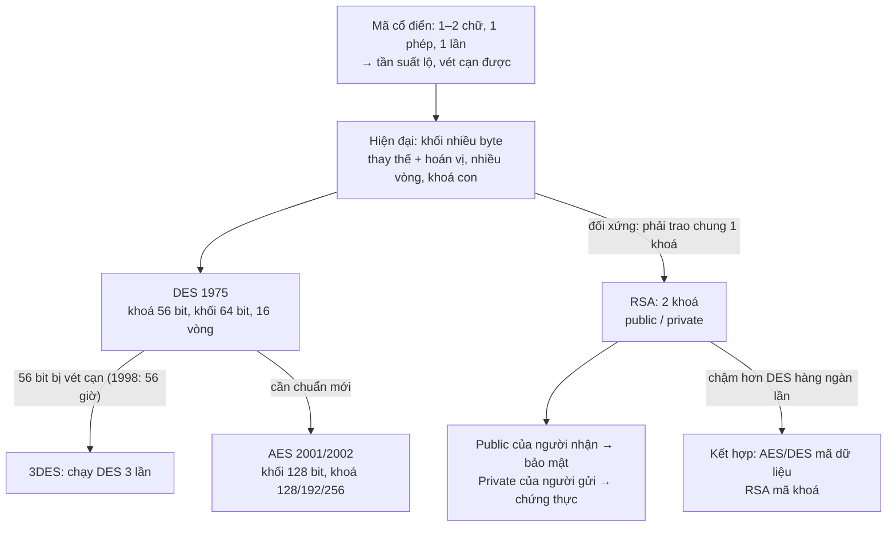
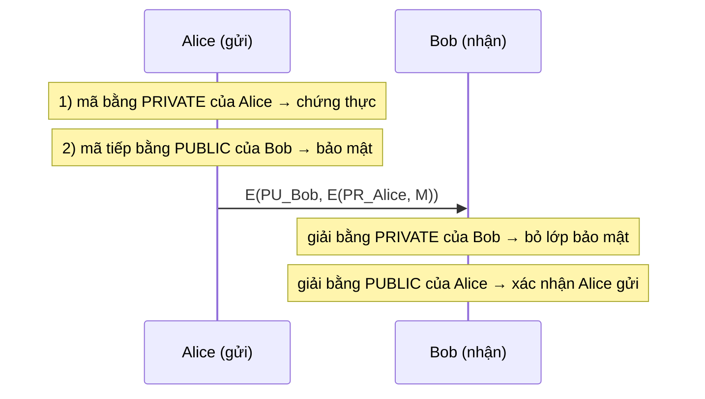
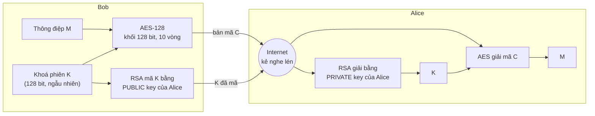

# L03 — Mã hoá hiện đại (Modern ciphers): DES, AES, RSA

| | |
|---|---|
| Môn | `IE105` Nhập môn bảo đảm và an ninh thông tin |
| Buổi | 03 |
| Ngày | 2026-07-29 |
| Giảng viên | Tô Nguyễn Nhật Quang |
| Transcript | [`_raw/L03-2026-07-29-transcript.docx`](_raw/L03-2026-07-29-transcript.docx) (1h 34m) |
| Slide | [`Bài 2A - Các giải thuật mã hoá.pdf`](../materials/slides/B%C3%A0i%202A%20-%20C%C3%A1c%20gi%E1%BA%A3i%20thu%E1%BA%ADt%20m%C3%A3%20ho%C3%A1.pdf), trang 41–70 |
| Code | [`code/modern_ciphers.py`](../code/modern_ciphers.py) — vét cạn, ShiftRows, RSA đồ chơi |
| Buổi trước | [L02 — Mã hoá cổ điển](L02-classical-ciphers.md) |

> Nhãn nguồn: `[B2A s43]` = slide Bài 2A, trang 43. `ngoài slide` = suy luận hoặc kiến thức chuẩn
> không có trong slide/transcript của buổi này.

---

## Mục lục

- [Tóm tắt một đoạn](#tóm-tắt-một-đoạn)
- [Gốc rễ của cả buổi](#gốc-rễ-của-cả-buổi)
- [Nội dung chính](#nội-dung-chính)
  - [1. Đặc điểm của mã hoá hiện đại (Modern ciphers)](#1-đặc-điểm-của-mã-hoá-hiện-đại-modern-ciphers)
  - [2. Chuẩn mã hoá dữ liệu DES (Data Encryption Standard)](#2-chuẩn-mã-hoá-dữ-liệu-des-data-encryption-standard)
  - [3. Lịch sử DES và Triple DES (3DES)](#3-lịch-sử-des-và-triple-des-3des)
  - [4. Giải thuật mã hoá AES (Advanced Encryption Standard)](#4-giải-thuật-mã-hoá-aes-advanced-encryption-standard)
  - [5. Bốn hàm của AES (SubBytes, ShiftRows, MixColumns, AddRoundKey)](#5-bốn-hàm-của-aes-subbytes-shiftrows-mixcolumns-addroundkey)
  - [6. Hệ mã hoá công khai RSA (Public-key cryptosystem)](#6-hệ-mã-hoá-công-khai-rsa-public-key-cryptosystem)
  - [7. Bảo mật và chứng thực bằng cặp khoá (Confidentiality & Authentication)](#7-bảo-mật-và-chứng-thực-bằng-cặp-khoá-confidentiality--authentication)
  - [8. Kết hợp RSA với mã đối xứng (Hybrid encryption)](#8-kết-hợp-rsa-với-mã-đối-xứng-hybrid-encryption)
  - [9. Bẻ gãy một hệ thống mật mã (Brute force attack)](#9-bẻ-gãy-một-hệ-thống-mật-mã-brute-force-attack)
- [Bảng tổng hợp](#bảng-tổng-hợp)
- [Sơ đồ](#sơ-đồ)
- [Gợi ý thi](#gợi-ý-thi)
- [Deadline phát sinh](#deadline-phát-sinh)
- [Chỗ chưa rõ](#chỗ-chưa-rõ)
- [Tự kiểm tra](#tự-kiểm-tra)
- [Liên kết](#liên-kết)

---

## Tóm tắt một đoạn

Mã hoá hiện đại khác cổ điển ở bốn điểm: mã theo **khối** nhiều ký tự, **kết hợp thay thế và hoán vị**, lặp **nhiều vòng**,
mỗi vòng một **khoá con** sinh từ khoá ban đầu. Buổi 3 học ba đại diện: **DES** (đối xứng, khoá 56 bit, khối 64 bit, 16 vòng,
16 khoá con — bị vét cạn được nên chuyển sang 3DES), **AES** (đối xứng, khối 128 bit, khoá 128/192/256, ma trận trạng thái 4×4
qua bốn hàm SubBytes, ShiftRows, MixColumns, AddRoundKey) và **RSA** (bất đối xứng, 2 khoá). Phần thầy nhấn kỹ nhất là RSA:
**mã bằng public key của người nhận → bảo mật, không chứng thực**; **mã bằng private key của người gửi → chứng thực, không bảo mật**;
muốn cả hai thì mã hai lần. RSA chậm nên thực tế **kết hợp**: mã đối xứng mã dữ liệu, RSA mã khoá. Cuối buổi: bảng thời gian vét cạn
cho thấy khoá càng dài càng an toàn — 56 bit chỉ còn vài giờ, 128 bit là 10¹⁸ năm.

---

## Gốc rễ của cả buổi

Vấn đề gốc: mã cổ điển **tính bằng tay** nên chỉ dùng phép biến đổi đơn giản, mã từng 1–2 chữ, và bị phá bằng tần suất
hoặc vét cạn. Khi có máy tính, cả người mã lẫn người phá đều mạnh lên — giải thuật phải đủ phức tạp để máy tính của kẻ tấn công
cũng không phá được, nhưng vẫn chạy nhanh cho người dùng.



> Chuỗi "điểm yếu → giải pháp" là suy luận `ngoài slide`; các mốc và đặc điểm lấy từ [B2A s41–64].

---

## Nội dung chính

### 1. Đặc điểm của mã hoá hiện đại (Modern ciphers)

#### 📚 Lý thuyết

**Gốc rễ (first principles).** *`ngoài slide`*

- **Vấn đề gốc:** cổ điển mã 1 chữ bằng 1 phép ⇒ mỗi chữ bản rõ để lại dấu vết riêng trong bản mã (tần suất).
- **Sự thật nền:** (1) máy tính làm hàng triệu phép/giây, nên không còn giới hạn "tính tay được"; (2) chỉ thay thế thì lộ tần suất, chỉ hoán vị thì giữ nguyên chữ — mỗi phép **một mình** đều có lỗ; (3) một vòng biến đổi đơn giản thì dễ đảo ngược.
- **Suy luận:** (2) ⇒ ghép **thay thế + hoán vị** để bù lỗ cho nhau; (3) ⇒ lặp **nhiều vòng**; dùng cùng khoá mọi vòng thì các vòng "giống nhau" ⇒ mỗi vòng một **khoá con**; mã từng byte vẫn lộ tần suất byte ⇒ mã cả **khối**.
- **Nếu không có?** mã 1 byte một lần thì chữ `E` luôn ra cùng một byte — quay về đúng điểm yếu của mã thay thế đơn giản.

**Định nghĩa hình thức** `[B2A s41]`

> - Thường sử dụng **mã khối** kết hợp với các phép **hoán vị và thay thế**.
> - Việc biến đổi văn bản được thực hiện **nhiều lần trong một số vòng lặp**.
> - **Khoá con** của các vòng lặp sẽ khác nhau và được **sinh ra từ khoá ban đầu**.
> - Phổ biến có DES, AES, RSA...

Thầy gọi đây là **4 đặc điểm chính**: (1) mã khối — một lần nhiều ký tự; (2) kết hợp hoán vị + thay thế; (3) nhiều vòng lặp; (4) mỗi vòng một khoá riêng, sinh từ khoá ban đầu.

#### 💡 Giải thích dễ hiểu

**Trực giác:** thay vì xáo một lá bài, ta xáo cả bộ bài, nhiều lần, mỗi lần một kiểu khác nhau.

**Analogy:** **nhồi bột làm bánh** — cán dẹt (hoán vị: đổi chỗ), gập lại và rắc bột (thay thế: đổi chất), lặp 16 lần;
mỗi lần rắc một loại bột khác (khoá con). Sau vài lần, không còn chỉ ra được hạt bột ban đầu nằm đâu.
*Chỗ analogy vỡ:* nhồi bột không đảo ngược được; còn mã hoá **phải** đảo ngược được hoàn toàn khi có khoá.

**Ví dụ nhỏ nhất:** cổ điển — `A` ra `D` (Caesar). Hiện đại — khối 16 byte `TRUONGDAIHOCCNTT` qua 10 vòng AES ra 16 byte mà
đổi **1 bit** bản rõ thì khoảng một nửa số bit bản mã đổi theo (`ngoài slide`: hiệu ứng thác — avalanche effect).

#### 💻 Code & thực tế

```bash
for s in TRUONGD TRUONGDAIHOC; do printf "%-13s 3DES:%3s  AES-128:%3s\n" $s \
  $(printf $s | openssl enc -des-ede3-cbc -K 000102030405060708090a0b0c0d0e0f1011121314151617 -iv 0001020304050607 -nosalt | wc -c) \
  $(printf $s | openssl enc -aes-128-ecb -K 000102030405060708090a0b0c0d0e0f -nosalt | wc -c); done
# TRUONGD       3DES:  8  AES-128: 16
# TRUONGDAIHOC  3DES: 16  AES-128: 16
```

Bản mã luôn tròn **bội số của cỡ khối**: 8 byte (64 bit) với họ DES, 16 byte (128 bit) với AES — đó là "mã khối".

> **Trong production** `ngoài slide`: khi bạn gọi `AES-GCM` trong code, thư viện lo phần vòng lặp và khoá con; phần dev phải tự lo là **chế độ** (GCM/CBC, không dùng ECB) và **quản lý khoá**.

#### ✍️ Bài tập

**Bài 1** *(Nhớ)* — Nêu 4 đặc điểm của mã hoá hiện đại so với cổ điển. · *nguồn: [B2A s41] + thầy giảng*

> 🔑 **Kiến thức mở khoá:** 4 gạch đầu dòng ở s41.

<details><summary>Hướng giải</summary>

Mã khối · kết hợp hoán vị và thay thế · lặp nhiều vòng · khoá con mỗi vòng khác nhau, sinh từ khoá ban đầu.

</details>

**Chốt mục:** cổ điển = 1–2 chữ, 1 phép, 1 lần, tay; hiện đại = khối, thay thế + hoán vị, nhiều vòng, khoá con, máy tính.

---

### 2. Chuẩn mã hoá dữ liệu DES (Data Encryption Standard)

#### 📚 Lý thuyết

**Gốc rễ (first principles).** *`ngoài slide`*

- **Ngữ cảnh:** thập niên 1970, ngân hàng và doanh nghiệp cần **một chuẩn chung** để mã dữ liệu — ai cũng tự chế giải thuật thì không ai kiểm chứng được.
- **Sự thật nền:** (1) phần cứng thời đó đắt ⇒ khối và khoá phải nhỏ; (2) chuẩn công khai ⇒ an toàn phải nằm ở khoá (Kerckhoffs, L02 mục 5).
- **Suy luận:** khối 64 bit, khoá 56 bit (thầy: *"khoảng 7 ký tự, năm 1975 thì chắc chắn là an toàn"*), 16 vòng để đủ trộn.
- **Giá phải trả:** khoá 56 bit ⇒ 2⁵⁶ ≈ 7,2·10¹⁶ khoá — máy tính mạnh lên thì vét cạn được (mục 3, mục 9).

**Định nghĩa hình thức** `[B2A s43, s47–48]`

> - DES (Data Encryption Standard) được sử dụng rộng rãi trên thế giới.
> - Dùng **khoá có độ dài 56 bit** để mã hoá các **khối dữ liệu 64 bit**.
> - Cả bên mã hoá lẫn bên giải mã đều **dùng chung một khoá** và DES thuộc vào **hệ mã khoá bí mật**.
> - Xét về độ an toàn, hiện nay **3DES** (một cải tiến của DES) được đánh giá là có độ an toàn cao vì độ dài khoá của nó **gấp 3 lần** so với DES.

**Giải thuật** `[B2A s47]`:

```text
Dùng khoá K tạo ra n khoá con K1, K2, …, Kn
Hoán vị dữ liệu (IP)
Lặp n vòng (DES: n = 16). Mỗi vòng:
    chia dữ liệu thành hai nửa
    áp phép thay thế lên một nửa, nửa còn lại giữ nguyên
    hoán vị hai nửa cho nhau
Hoán vị dữ liệu (IP⁻¹)
```

Sơ đồ s48: `Input block X → IP → 16 DES rounds → Pre-output → IP⁻¹ → Output block Y`, song song `Key K → PC1 → PC2(K) → 16 subkeys` cấp cho 16 vòng.
Ký hiệu s44: `P` (64) + `K` (56) → **DES** → `C`; `C` + `K` → **DES⁻¹** → `P`.

> ⚠️ **GỢI Ý THI:** *"cái DES này mình nhớ là cái gì? Thứ nhất là kích thước khoá là 56 bit, thứ hai khối dữ liệu là 64 bit, thứ 3 thực hiện trong 16 vòng lặp và sử dụng 16 khoá con. Mình chỉ cần nắm những cái đó thôi"* — buổi 3, 2026-07-29

Thầy giải thích con số 56: khoá ban đầu 64 bit, **bỏ cột cuối (8 bit)** của ma trận 8×8 thì còn 56 bit (`ngoài slide`: 8 bit đó là bit parity).

#### 💡 Giải thích dễ hiểu

**Trực giác:** DES lấy 8 ký tự, xáo trộn 16 lượt, mỗi lượt dùng một mảnh khoá khác nhau cắt ra từ mật khẩu 7 ký tự.

**Analogy:** **dây chuyền 16 trạm**: thùng hàng 64 bit đi qua 16 trạm; ở mỗi trạm nhân viên mở nửa thùng, thay đồ bên trong theo
phiếu riêng của trạm (khoá con), rồi đổi hai nửa cho nhau. Phiếu của 16 trạm đều in ra từ cùng một mật khẩu gốc 56 bit.
*Chỗ analogy vỡ:* ở dây chuyền thật mất một phiếu chỉ hỏng một trạm; ở DES lộ khoá gốc 56 bit là lộ cả 16 phiếu.

**Ví dụ nhỏ nhất:** `TRUONGDA` = 8 ký tự ASCII = **64 bit** = đúng một khối DES. Khoá 56 bit ≈ **7 ký tự** (7 × 8 = 56).

```
 P (64 bit) ─► IP ─► [vòng 1, K1] ─► … ─► [vòng 16, K16] ─► IP⁻¹ ─► C (64 bit)
                         ▲                     ▲
 K (56 bit) ─► PC1/PC2 ──┴─── sinh 16 khoá con ┘
```

#### 💻 Code & thực tế

Thầy demo DES bằng **CrypTool 2** (cần Java), mục trực quan hoá — 424 bước từ khối 64 bit tới bản mã. Code DES tay quá dài; xem cỡ khối 8 byte ở mục 1.

> **Trong production** `ngoài slide`: DES đã bị loại khỏi mọi chuẩn mới; OpenSSL 3 xếp DES vào provider `legacy`. Gặp DES/3DES trong hệ thống cũ là dấu hiệu cần nâng cấp.

#### ✍️ Bài tập

**Bài 1** *(Nhớ)* — Điền: DES dùng khoá ___ bit, khối ___ bit, ___ vòng, ___ khoá con. · *nguồn: [B2A s43, s48]*

> 🔑 **Kiến thức mở khoá:** "bộ bốn" thầy dặn: 56 · 64 · 16 · 16.

<details><summary>Hướng giải</summary>

**56 · 64 · 16 · 16.** Bẫy: nhầm 56 (khoá) với 64 (khối) — nhớ "khoá **ngắn hơn** khối vì bỏ 8 bit".

</details>

**Bài 2** *(Hiểu)* — Phát biểu nào **sai** về DES? a) thuộc hệ mã khoá bí mật b) mã các khối 64 bit c) dùng một khoá để mã hoá và một khoá khác để giải mã d) sinh 16 khoá con từ khoá ban đầu · *tự đặt*

> 🔑 **Kiến thức mở khoá:** "cả bên mã hoá lẫn bên giải mã đều dùng chung một khoá" [s43].

<details><summary>Hướng giải</summary>

**c)** — đó là mô tả bất đối xứng (RSA).

</details>

**Chốt mục:** **56 / 64 / 16 / 16**, đối xứng, block. Bẫy: "DES dùng khoá 64 bit".

---

### 3. Lịch sử DES và Triple DES (3DES)

*(mục phụ — bản rút gọn; thầy: lịch sử "không hỏi")*

**Định nghĩa hình thức** `[B2A s45–46]`

| Mốc | Sự kiện |
|---|---|
| 17.03.1975 | DES được công bố để công chúng đóng góp ý kiến |
| 11.1976 | DES được phê chuẩn làm tiêu chuẩn chính thức |
| 1992 | Biham và Shamir công bố tấn công **thám mã vi sai** với độ phức tạp thấp hơn tấn công bạo lực (trên lý thuyết; cần chọn 2⁴⁷ văn bản rõ — không thực tế) |
| 06.1997 | Dự án **DESCHALL** lần đầu phá được một bản tin mã bằng DES |
| 07.1998 | Thiết bị **Deep Crack** (EFF) phá một khoá DES trong **56 giờ** |
| 01.1999 | Deep Crack + distributed.net phá DES trong **22 giờ 15 phút** |
| 25.10.1999 | **Triple DES** được khuyến cáo cho các hệ thống quan trọng |
| 26.05.2002 | **AES** trở thành tiêu chuẩn thay thế DES |

**Triple DES:** chạy DES **3 lần**; slide s43: *"độ dài khoá của nó gấp 3 lần so với DES"*. Thầy: *"Đến bây giờ, giải thuật này vẫn dùng"*, laptop thường không phá được.

**Trực giác:** khoá 56 bit giống ổ khoá 7 chữ số — đủ chắc năm 1975, nhưng máy tính càng nhanh thì càng thử hết được.

> ⚠️ **GỢI Ý THI (phạm vi):** *"Bây giờ thầy nói qua về cái lịch sử hình thành cái giải thuật này. Thì không hỏi nha"* — buổi 3, 2026-07-29

**Bài 1** *(Hiểu)* — Vì sao người ta khuyến cáo 3DES thay DES? · *nguồn: [B2A s43, s46]*

> 🔑 **Kiến thức mở khoá:** DES chết vì **khoá ngắn** (vét cạn), không phải vì cấu trúc ⇒ cách vá rẻ nhất là kéo dài khoá.

<details><summary>Hướng giải</summary>

Khoá 56 bit bị vét cạn trong vài chục giờ (1998–1999). 3DES dùng DES 3 lần với khoá dài gấp 3 ⇒ vét cạn không còn khả thi, lại tái dùng được phần cứng/phần mềm DES sẵn có.

</details>

---

### 4. Giải thuật mã hoá AES (Advanced Encryption Standard)

#### 📚 Lý thuyết

**Gốc rễ (first principles).** *`ngoài slide`*

- **Vấn đề gốc:** DES có khoá quá ngắn; 3DES vá được nhưng chạy DES 3 lần ⇒ **chậm gấp 3**, khối vẫn chỉ 64 bit.
- **Sự thật nền:** (1) phần cứng 2000 mạnh hơn 1975 rất nhiều; (2) máy tính xử lý theo **byte**.
- **Suy luận:** (1) ⇒ khối 128 bit, khoá ≥ 128 bit; (2) ⇒ xếp 16 byte thành **ma trận 4×4** và biến đổi theo byte/hàng/cột — nhanh trên phần mềm.
- **Nếu vẫn dùng DES?** slide s69: 56 bit chỉ còn **3,5 giờ** với máy 1 triệu USD.

**Định nghĩa hình thức** `[B2A s49–51]`

> - AES (Advanced Encryption Standard – Tiêu chuẩn mã hoá tiên tiến) là một giải thuật **mã hoá khoá đối xứng** được **công bố năm 2000** để thay thế cho DES. Giải thuật này thực hiện mã hoá khối bằng cách **lặp lại nhiều lần** các bước xử lý.
> - Giải thuật (còn có tên gọi khác là **Rijndael**) được đề xuất bởi hai nhà mật mã học người Bỉ là **Joan Daemen** và **Vincent Rijmen**.
> - **Kích thước khối dữ liệu đầu vào là 128 bit**, kích thước khoá lần lượt là **128, 192, 256 bit** (AES-128, AES-192, AES-256).
> - Mỗi khoá con là một cột gồm 4 bytes.
> - Mỗi khối 128 bit đầu vào, tương ứng với **16 bytes**, tạo thành một **ma trận 4x4** của các byte, gọi là **ma trận trạng thái** (state). Ma trận trạng thái này sẽ biến đổi trong quá trình thực hiện mã hoá.

**Mã giả** `[B2A s51]`:

```text
state = in
AddRoundKey(state, w)
for round = 1 to Nr-1
    SubBytes(state); ShiftRows(state); MixColumns(state); AddRoundKey(state, w+round*Nb)
SubBytes(state); ShiftRows(state); AddRoundKey(state, w+Nr*Nb)     ← vòng cuối KHÔNG có MixColumns
out = state
```

Với AES-128: `Nr = 10` ⇒ **9 vòng đủ 4 hàm + 1 vòng cuối 3 hàm** (thầy: *"9 vòng lặp … khi thoát ra gọi thêm 3 hàm"*); **11 khoá vòng** [s53]. `Nr = 12/14` cho AES-192/256 là `ngoài slide`.
Hai công đoạn trong demo: **A — mã hoá** (các vòng) và **B — sinh khoá** (key expansion: từ khoá ban đầu sinh khoá cho từng vòng).

> ⚠️ **GỢI Ý THI:** *"Đặc điểm đầu tiên là kích thước khối đầu vào là 128 bit, em nhớ nha"* · *"khi mà thi trắc nghiệm thì có thể nhiều khi câu hỏi đơn giản thôi. AES có khối đầu vào là … thì phải nhớ là 128 bit"* — buổi 3, 2026-07-29

#### 💡 Giải thích dễ hiểu

**Trực giác:** AES đặt 16 byte lên bàn cờ 4×4, rồi mỗi vòng: đổi từng ô, xoay từng hàng, trộn từng cột, rắc khoá vào.

**Analogy:** **khối Rubik 4×4 có in chữ**: vặn hàng (ShiftRows), trộn cột (MixColumns), dán đè sticker theo bảng (SubBytes), phủ một lớp màu theo khoá (AddRoundKey) — 10 lượt.
*Chỗ analogy vỡ:* Rubik chỉ đổi chỗ các ô; AES còn **đổi giá trị** từng byte (SubBytes, XOR với khoá), nên không "giải" được bằng cách xoay ngược mà thiếu khoá.

**Ví dụ nhỏ nhất:** `TRUONGDAIHOCCNTT` = 16 ký tự = 16 byte = **128 bit** = đúng một khối AES, xếp theo cột:

```
 T N I C
 R G H N
 U D O T
 O A C T     ← ma trận trạng thái 4×4, điền theo cột: TRUO | NGDA | IHOC | CNTT (`ngoài slide`)
```

So DES: một lần AES mã **gấp đôi** dữ liệu (128 vs 64 bit) — thầy nhấn điểm này.

#### 💻 Code & thực tế

Xem `openssl` ở mục 1 (AES ra bội số 16 byte) và ShiftRows ở mục 5. Thầy demo AES bằng video CrypTool (từng vòng, ma trận trạng thái đổi giá trị).
Thầy về chọn cỡ khoá: *"công việc bình thường sử dụng AES 128 là đủ"*, việc càng quan trọng thì khoá càng lớn; AES-256 chậm hơn.

> **Trong production** `ngoài slide`: CPU hiện đại có lệnh **AES-NI** chạy một vòng AES trong vài chu kỳ — lý do AES gần như "miễn phí" về hiệu năng trong TLS, ổ đĩa mã hoá (BitLocker, FileVault).

#### ✍️ Bài tập

**Bài 1** *(Nhớ)* — AES có kích thước khối đầu vào bao nhiêu bit, và những kích thước khoá nào? · *nguồn: [B2A s50]*

> 🔑 **Kiến thức mở khoá:** khối **cố định** 128 bit; chỉ **khoá** có 3 cỡ.

<details><summary>Hướng giải</summary>

Khối **128 bit**; khoá **128 / 192 / 256 bit**. Bẫy: "AES-256 mã khối 256 bit" — sai, con số trong tên là **khoá**.

</details>

**Bài 2** *(Hiểu)* — Trong AES-128, có bao nhiêu vòng gọi đủ 4 hàm, và vòng cuối thiếu hàm nào? · *nguồn: [B2A s51] + thầy giảng*

> 🔑 **Kiến thức mở khoá:** mã giả s51 — vòng lặp `1 … Nr-1`, sau vòng lặp chỉ còn 3 hàm.

<details><summary>Hướng giải</summary>

`Nr = 10` ⇒ **9 vòng** đủ SubBytes, ShiftRows, MixColumns, AddRoundKey; vòng cuối **thiếu MixColumns**. Thêm 1 AddRoundKey trước vòng lặp ⇒ 11 lần cộng khoá ⇒ **11 khoá vòng** [s53].

</details>

**Chốt mục:** AES = đối xứng, block **128 bit**, khoá 128/192/256, ma trận trạng thái **4×4 byte**, tên khác Rijndael. Bẫy: nhầm cỡ khoá với cỡ khối.

---

### 5. Bốn hàm của AES (SubBytes, ShiftRows, MixColumns, AddRoundKey)

#### 📚 Lý thuyết

**Gốc rễ (first principles).** *`ngoài slide`*

- **Sự thật nền:** từ mục 1 — cần **thay thế** (phá quan hệ tuyến tính), **hoán vị/khuếch tán** (để 1 byte ảnh hưởng nhiều byte), và **khoá** (để kết quả phụ thuộc bí mật).
- **Suy luận:** trên ma trận 4×4 có đúng ba "đơn vị" để tác động — **từng byte, từng hàng, từng cột** — cộng một bước trộn khoá ⇒ đúng 4 hàm.
  Thầy chỉ ra đúng quy luật này: *"hàm đầu tiên thực hiện từng byte một, hàm thứ 2 từng hàng một, hàm thứ 3 từng cột một, hàm thứ 4 thực hiện phép XOR"*.

**Định nghĩa hình thức** `[B2A s52–57]`

> - **SubBytes:** mỗi byte trong state được **thay thế** với các byte khác, sử dụng một bảng look-up được gọi là **S-box**. S-box được dùng bắt nguồn từ hàm ngược trên trường GF(2⁸). Hình s54: `b_ij = S(a_ij)`.
> - **ShiftRows:** mỗi hàng được chuyển tuần tự với một số lượng bước cố định. **Hàng đầu tiên không thay đổi** vị trí, **hàng thứ hai dịch sang trái một cột**, hàng thứ ba dịch trái hai cột, hàng cuối dịch trái ba cột.
> - **MixColumns:** **mỗi cột** được chuyển đổi tuyến tính bằng cách nhân nó với một ma trận trong trường hữu hạn […] nhân modulo x⁴ + 1 với `c(x) = 3x³ + x² + x + 2`.
> - **AddRoundKey:** mỗi byte trong bảng trạng thái được thực hiện phép **XOR với một khoá vòng**; AES-128 thu được **11 khoá vòng**.

| Hàm | Tác động lên | Loại phép | Nhận diện trên hình |
|---|---|---|---|
| **SubBytes** | từng **byte** | thay thế qua **S-box** | 1 ô `a₂,₂` đi qua hộp **S** ra `b₂,₂` |
| **ShiftRows** | từng **hàng** | hoán vị (xoay trái 0/1/2/3) | nhãn "No change / Shift 1 / Shift 2 / Shift 3", mũi tên vòng trong hàng |
| **MixColumns** | từng **cột** | nhân ma trận (trộn tuyến tính) | cả một **cột** đi qua ⊗ `c(x)` |
| **AddRoundKey** | từng byte với **khoá vòng** | **XOR** | ma trận ⊕ ma trận khoá `k` |

> ⚠️ **GỢI Ý THI:** *"trong bài thi thầy có thể cho cái hình hỏi đây là hàm gì nha, chứ còn không có yêu cầu phải nắm quá sâu"* — buổi 3, 2026-07-29

#### 💡 Giải thích dễ hiểu

**Trực giác:** đọc **tên hàm** là đoán được việc nó làm — *Sub*-Bytes thay byte, *Shift*-Rows dịch hàng, *Mix*-Columns trộn cột, *Add*-RoundKey cộng khoá.

**Analogy:** **xếp lại lớp học 4×4 bàn** — SubBytes: mỗi học sinh đổi áo theo bảng quy định; ShiftRows: dãy 2 dịch 1 bàn sang trái, dãy 3 dịch 2, dãy 4 dịch 3;
MixColumns: mỗi tổ (cột) trao đổi bài vở để ai cũng "dính" thông tin của cả tổ; AddRoundKey: mỗi học sinh đeo thêm phù hiệu của buổi học (khoá vòng).
*Chỗ analogy vỡ:* MixColumns không phải "chia sẻ" tuỳ ý mà là phép nhân ma trận cố định, đảo ngược chính xác được.

**Ví dụ nhỏ nhất — ShiftRows** (khớp hình s55):

```
 trước                    sau
 a00 a01 a02 a03   ─0─►  a00 a01 a02 a03
 a10 a11 a12 a13   ─1─►  a11 a12 a13 a10
 a20 a21 a22 a23   ─2─►  a22 a23 a20 a21
 a30 a31 a32 a33   ─3─►  a33 a30 a31 a32
```

Mấu chốt: sau ShiftRows, **mỗi cột chứa 1 byte từ mỗi cột cũ** — MixColumns ngay sau đó trộn chúng lại ⇒ sau 2 vòng mỗi byte phụ thuộc cả 16 byte (`ngoài slide`).

#### 💻 Code & thực tế

```bash
python3 code/modern_ciphers.py
# ShiftRows:
#    a00 a01 a02 a03  →  a00 a01 a02 a03
#    a10 a11 a12 a13  →  a11 a12 a13 a10
#    a20 a21 a22 a23  →  a22 a23 a20 a21
#    a30 a31 a32 a33  →  a33 a30 a31 a32
```

> **Trong production** `ngoài slide`: S-box dạng bảng tra bị **timing attack** qua cache (đúng "Timing attack" trên s67) — lý do thư viện dùng AES-NI hoặc cài đặt constant-time.

#### ✍️ Bài tập

**Bài 1** *(Nhớ — dạng đề thầy hay ra)* — Hình vẽ cho thấy ma trận 4×4, hàng đầu ghi "No change", ba hàng sau ghi "Shift 1/2/3" với mũi tên vòng sang trái. Đây là hàm nào của AES? a) SubBytes b) ShiftRows c) MixColumns d) AddRoundKey · *tự đặt theo hình [B2A s55]*

> 🔑 **Kiến thức mở khoá:** bảng "Tác động lên" — thao tác trên **hàng** ⇒ ShiftRows.

<details><summary>Hướng giải</summary>

**b) ShiftRows.** Nếu hình có hộp **S** ⇒ SubBytes; tác động cả **cột** ⇒ MixColumns; có dấu **⊕** và ma trận khoá ⇒ AddRoundKey.

</details>

**Bài 2** *(Vận dụng)* — Áp ShiftRows lên hàng thứ ba `[A B C D]` (hàng chỉ số 2). · *tự đặt, kiểm bằng code*

> 🔑 **Kiến thức mở khoá:** hàng thứ ba dịch **trái 2 cột**, vòng tròn.

<details><summary>Hướng giải</summary>

`[C D A B]`. Bẫy: dịch phải, hoặc dịch 3 (nhầm đếm hàng từ 1 thay vì "hàng đầu dịch 0").

</details>

**Chốt mục:** byte → SubBytes (S-box) · hàng → ShiftRows · cột → MixColumns · XOR khoá → AddRoundKey. Vòng cuối bỏ MixColumns.

---

### 6. Hệ mã hoá công khai RSA (Public-key cryptosystem)

#### 📚 Lý thuyết

**Gốc rễ (first principles).** *`ngoài slide`*

- **Vấn đề gốc:** DES/AES cần **cùng một khoá** ở hai đầu — nhưng gửi khoá qua mạng thì bị nghe lén (L02 mục 4).
- **Sự thật nền:** (1) có những phép toán **dễ làm một chiều, cực khó làm ngược** (nhân hai số nguyên tố lớn thì dễ, phân tích ngược thì khó); (2) từ hai số nguyên tố `p, q` sinh được cặp số `e, d` mà mã bằng cái này thì giải bằng cái kia.
- **Suy luận:** công bố `e` (public) không làm lộ `d` (private) chừng nào chưa phân tích được `n = p·q` ⇒ ai cũng mã được cho mình, chỉ mình giải được.
- **Giá phải trả:** an toàn chỉ khi **khoá rất dài** (2048 bit) ⇒ chậm (mục 8).

**Định nghĩa hình thức** `[B2A s58, s60–61]`

> - Được sử dụng phổ biến trong **thương mại điện tử**. Đảm bảo an toàn với điều kiện **độ dài khoá đủ lớn**.
> - Thuật toán RSA có **hai khoá**: **khoá công khai** (hay khoá công cộng) và **khoá bí mật** (hay khoá cá nhân). Mỗi khoá là những số cố định sử dụng trong quá trình mã hoá và giải mã.
> - Khoá công khai được công bố rộng rãi cho mọi người và được dùng để mã hoá. Những thông tin được mã hoá bằng khoá công khai **chỉ có thể được giải mã bằng khoá bí mật tương ứng**.
> - [s60] Chọn một số ngẫu nhiên lớn để sinh cặp khoá. Dùng khoá công khai để mã hoá, nhưng dùng khoá bí mật để giải mã.
> - [s61] **Dùng khoá bí mật để ký một thông báo; dùng khoá công khai để xác minh chữ ký.** Tổ hợp khoá bí mật của mình với khoá công khai của người khác tạo ra khoá dùng chung chỉ hai người biết.

**Tính chất thầy nhấn:** *"dùng khoá này để mã hoá thì dùng khoá kia để giải mã và ngược lại"* — đối xứng **giữa hai khoá của cùng một cặp**.
Cặp khoá lấy từ: mua **chứng chỉ số** (FPT, VNPT, tổ chức nước ngoài), hoặc tự sinh (CrypTool). Mất private key → báo huỷ, mua cặp mới.
Thầy xem chứng chỉ của website ngân hàng ACB và báo Tuổi Trẻ: **RSA 2048 bit**.

Cách **tính** cặp khoá: thầy demo bằng đồ án sinh viên chính quy (p = 139…) rồi nói *"mình bỏ qua, mình không học tới"* — đề cương đã bỏ phần này.

#### 💡 Giải thích dễ hiểu

**Trực giác:** ai cũng có ổ khoá bấm của bạn, chỉ bạn có chìa.

**Analogy:** **ổ khoá bấm phát miễn phí** — Alice phát hàng trăm ổ khoá bấm đang mở (public key); Bob bỏ thư vào hộp, bấm khoá lại; chỉ Alice có chìa (private key).
*Chỗ analogy vỡ:* ổ khoá thật không "ký" được; còn với RSA, Alice dùng chìa để "khoá" thì ai có ổ cũng "mở" được — đó là chữ ký (mục 7).

**Ví dụ nhỏ nhất — RSA đồ chơi** (`ngoài slide`, số nhỏ để tính tay được): `p = 61, q = 53` ⇒ `n = 3233`, `φ = 60·52 = 3120`, chọn `e = 17` ⇒ `d = 2753` (vì `17·2753 = 46801 = 15·3120 + 1`).

| Bước | Ai | Phép | Kết quả |
|---|---|---|---|
| Mã hoá | Bob | `c = 65¹⁷ mod 3233` | 2790 |
| Giải mã | Alice | `m = 2790²⁷⁵³ mod 3233` | 65 ✓ |

```
 Bob (gửi)                                   Alice (nhận)
 m ──E(e_Alice)──► c ═══ kênh hở ═══► c ──D(d_Alice)──► m
                        ▲
         Passive Adversary thấy c và e (công khai), không có d     [s59]
```

#### 💻 Code & thực tế

```bash
python3 code/modern_ciphers.py
# RSA đồ chơi: public = (17, 3233) private = (2753, 3233)
#   Bảo mật  : m=65 → mã bằng PUBLIC  → c=2790 → giải bằng PRIVATE → 65
#   Chứng thực: m=65 → mã bằng PRIVATE → s=588 → giải bằng PUBLIC  → 65
```

> **Trong production** `ngoài slide`: bấm ổ khoá trên thanh địa chỉ → Certificate → *Public Key: RSA (2048 bits)* — đúng thao tác thầy làm. Khoá mới nên ≥ 2048 bit; nhiều hệ thống chuyển sang ECDSA/Ed25519 vì khoá ngắn hơn mà an toàn tương đương.

#### ✍️ Bài tập

**Bài 1** *(Nhớ)* — RSA thuộc loại mã hoá nào, gồm những khoá gì, khoá nào được công bố? · *nguồn: [B2A s42, s58]*

> 🔑 **Kiến thức mở khoá:** s58 — hai khoá, public công bố rộng rãi.

<details><summary>Hướng giải</summary>

Bất đối xứng; khoá công khai (công cộng) và khoá bí mật (cá nhân); công bố **khoá công khai**.

</details>

**Bài 2** *(Vận dụng)* — Với `n = 3233, e = 17, d = 2753`, kiểm rằng giải mã `c = 2790` cho lại `m = 65`. Vì sao trong thực tế không ai đoán được `d` dù biết `e` và `n`? · *tự đặt, kiểm bằng code*

> 🔑 **Kiến thức mở khoá:** `d = e⁻¹ mod φ(n)`; tính `φ(n)` cần biết `p, q` — tức phải phân tích `n`.

<details><summary>Hướng giải</summary>

`2790²⁷⁵³ mod 3233 = 65` (chạy code). Với `n = 3233` thử chia là ra `61·53` ngay; với `n` dài **2048 bit** thì phân tích ra `p, q` là bất khả thi ⇒ không tính được `φ(n)` ⇒ không tính được `d`.

</details>

**Chốt mục:** RSA = bất đối xứng, 2 khoá, an toàn khi khoá dài (2048 bit), **chậm**. Bẫy: "RSA là block cipher đối xứng".

---

### 7. Bảo mật và chứng thực bằng cặp khoá (Confidentiality & Authentication)

#### 📚 Lý thuyết

**Gốc rễ (first principles).** *`ngoài slide`*

- **Sự thật nền:** (1) public key **ai cũng có**; (2) private key **chỉ chủ nhân có**; (3) mã bằng khoá nào thì phải giải bằng **khoá kia** của cùng cặp.
- **Suy luận:**
  - Mã bằng **public của người nhận** ⇒ chỉ người nhận giải được ⇒ **bảo mật**. Nhưng (1) ⇒ ai cũng mã được ⇒ **không biết ai gửi**.
  - Mã bằng **private của người gửi** ⇒ giải được bằng public của người gửi chứng tỏ chỉ người gửi tạo ra được ⇒ **chứng thực**. Nhưng (1) ⇒ ai cũng giải được ⇒ **không bảo mật**.
  - Muốn cả hai ⇒ **mã hai lần**.

**Định nghĩa hình thức** — thầy giảng, khớp [B2A s60–61]

| Mã bằng | Giải bằng | Đạt được | Không đạt |
|---|---|---|---|
| **Public key của người nhận** (khoá xanh của Alice khi Bob gửi Alice) | private key của người nhận | **Bảo mật** | Chứng thực — *"ai cũng có thể dùng khoá xanh của Alice để mã hoá"* |
| **Private key của người gửi** (khoá đỏ của Alice khi Alice gửi Bob) | public key của người gửi | **Chứng thực** người gửi (gần như chữ ký số) | Bảo mật — *"khoá xanh có sẵn trên mạng rồi, giải mã là đọc được"* |
| Cả hai: private người gửi **và** public người nhận | lần lượt hai khoá tương ứng | **Bảo mật + chứng thực** | — (phải mã 2 lần, giải 2 lần) |

> ⚠️ **GỢI Ý THI:** *"Chỗ này là nghe cho kỹ nha, nghe rồi hồi cũng không hiểu đâu, cũng là trả lời lung tung […] cho nên là chú ý lát thì sẽ đặt câu hỏi đó"* — buổi 3, 2026-07-29 (ngay trước phần RSA bảo mật/chứng thực)
>
> ⚠️ **GỢI Ý THI:** *"trong trường hợp vừa bảo mật vừa chứng thực á thì sẽ phải mã hoá hai lần, một lần bằng khoá công khai của người nhận"* — buổi 3

**Hai câu thầy hỏi trong chat — lớp trả lời sai nhiều:**
1. Bob mã bằng khoá xanh (public) của Alice, gửi Alice. *Alice có biết chắc ai gửi không?* → **Không.** Ai cũng lấy được khoá xanh của Alice; email có vẻ từ Bob cũng có thể giả mạo.
2. Alice mã *"cho tôi vay 500"* bằng khoá đỏ (private) của mình, gửi Bob; Jimmy chặn được. *Jimmy đọc được không?* → **Được.** Chỉ cần khoá xanh của Alice — công khai.

Ứng dụng email thầy nêu: tuỳ chọn **"Mã hoá nội dung và tệp đính kèm"** = public key người nhận; **"Thêm chữ ký số"** = private key người gửi.

#### 💡 Giải thích dễ hiểu

**Trực giác:** khoá **của người nhận** để giữ bí mật; khoá **của người gửi** để chứng minh danh tính.

**Analogy:**
- Bảo mật = **thả thư vào hòm thư có khoá của người nhận** — ai cũng thả được, chỉ chủ hòm mở được, nhưng nhìn lá thư không biết ai thả.
- Chứng thực = **đóng con dấu riêng lên thư rồi dán lên bảng tin** — ai cũng đọc được, ai cũng so được con dấu với mẫu dấu công khai, nhưng chỉ chủ con dấu đóng được.
*Chỗ analogy vỡ:* con dấu thật làm giả được bằng cách khắc lại; private key thì không suy ra được từ public key.

**Ví dụ nhỏ nhất:** cùng cặp khoá đồ chơi của Alice `(e = 17, d = 2753, n = 3233)`:

| Tình huống | Phép | Ai làm được | Ai đọc được |
|---|---|---|---|
| Bob → Alice bí mật | `65¹⁷ mod 3233 = 2790` | **Bất kỳ ai** (e công khai) | **Chỉ Alice** (cần d) |
| Alice ký gửi Bob | `65²⁷⁵³ mod 3233 = 588` | **Chỉ Alice** (cần d) | **Bất kỳ ai** (e công khai) |

Hai dòng **đối xứng nhau** — đó là toàn bộ bí quyết của mục này.



#### 💻 Code & thực tế

Xem output RSA ở mục 6: dòng "Bảo mật" và "Chứng thực" dùng **cùng cặp khoá**, chỉ đảo vai trò.

> **Trong production** `ngoài slide`: JWT ký RS256 = private key của server **ký**, mọi service có public key **xác minh** — dữ liệu trong JWT vẫn đọc được (base64), đúng "chứng thực, không bảo mật".

#### ✍️ Bài tập

**Bài 1** *(Hiểu)* — Alice mã thông điệp bằng private key của mình rồi gửi Bob. Phát biểu nào **đúng**? a) chỉ Bob đọc được b) chứng thực được Alice là người gửi c) vừa bảo mật vừa chứng thực d) không ai giải mã được ngoài Alice · *nguồn: câu thầy hỏi trên lớp*

> 🔑 **Kiến thức mở khoá:** mã bằng private người gửi ⇒ giải bằng public người gửi (công khai) ⇒ chứng thực, không bảo mật.

<details><summary>Hướng giải</summary>

**b).** a, c sai vì ai cũng có public key của Alice; d sai vì chính public key của Alice giải được.

</details>

**Bài 2** *(Phân tích)* — Bob muốn gửi hợp đồng cho Alice sao cho chỉ Alice đọc được **và** Alice chắc chắn là Bob gửi. Bob dùng những khoá nào, theo thứ tự nào? Alice giải bằng khoá nào? · *nguồn: thầy giảng + [B2B s21] (buổi sau)*

> 🔑 **Kiến thức mở khoá:** bảng 3 dòng — cần cả dòng 1 và dòng 2.

<details><summary>Hướng giải</summary>

Bob: mã bằng **private key của Bob** (chứng thực), rồi mã tiếp bằng **public key của Alice** (bảo mật). Alice: giải bằng **private key của Alice**, rồi giải bằng **public key của Bob** — giải được lớp này là chắc chắn Bob gửi.

</details>

**Chốt mục:** **người nhận → bảo mật, người gửi → chứng thực.** Bẫy: "mã bằng public key ⇒ biết ai gửi" và "mã bằng private key ⇒ bí mật".

---

### 8. Kết hợp RSA với mã đối xứng (Hybrid encryption)

#### 📚 Lý thuyết

**Gốc rễ (first principles).** *`ngoài slide`*

- **Sự thật nền:** (1) đối xứng (DES/AES) **nhanh** nhưng phải trao khoá; (2) RSA **trao khoá an toàn** nhưng chậm hơn DES **hàng ngàn lần** [s64].
- **Suy luận:** dùng mỗi loại cho đúng việc nó giỏi: RSA chỉ mã **khoá đối xứng** (vài chục byte), còn dữ liệu (MB, GB) mã bằng đối xứng.

**Định nghĩa hình thức** `[B2A s62, s64]`

> - Các giải thuật mã hoá DES và RSA còn được ứng dụng vào chữ ký điện tử.
> - Giải thuật RSA là rất an toàn nhưng **tốc độ mã hoá và giải mã chậm hơn giải thuật DES hàng ngàn lần**.
> - Thông thường người ta thường kết hợp hai phương pháp: **DES mã hoá khối văn bản. RSA để mã hoá khoá mà DES đã dùng để mã hoá khối văn bản.**

Hình s62 (HTTPS): ① máy bạn **xin public key** của server → ② **mã dữ liệu bằng public key** đó → ③ dữ liệu mã đi qua Internet → ④ server **giải bằng private key**.
CrypTool có giải thuật **Hybrid** = RSA + AES. Thầy trả lời câu hỏi của bạn Thịnh: khoá AES tự sinh thì *"mã hoá khoá đó bằng khoá công khai của người ta để chuyển khoá bí mật này sang"*.

#### 💡 Giải thích dễ hiểu

**Trực giác:** dùng két sắt chậm chạp (RSA) để gửi **chìa khoá**, còn hàng hoá thì đi bằng xe tải nhanh khoá bằng chìa đó (AES).

**Analogy:** **chuyển nhà** — đồ đạc đi xe tải khoá móc thường (AES, nhanh); chìa móc khoá gửi riêng qua bưu điện bảo đảm (RSA, chậm nhưng chắc).
*Chỗ analogy vỡ:* bưu điện bảo đảm vẫn có người cầm chìa; RSA thì trên đường đi không ai — kể cả người vận chuyển — mở được.

**Ví dụ nhỏ nhất:** gửi file 1 GB → RSA chỉ mã **16 byte** khoá AES-128; AES mã 1 GB dữ liệu.

```
 Bob: sinh khoá K (AES) ──E(PU_Alice, K)──────────────► Alice: D(PR_Alice) → K
      dữ liệu M ─────────E_AES(K, M)───────────────────► Alice: D_AES(K) → M
```

#### 💻 Code & thực tế

Không áp dụng riêng — xem RSA (mục 6) và AES (mục 1).

> **Trong production** `ngoài slide`: TLS 1.3 dùng ECDHE để thoả thuận khoá rồi AES-GCM/ChaCha20 mã dữ liệu — cùng tinh thần "bất đối xứng cho khoá, đối xứng cho dữ liệu"; RSA trong TLS 1.3 chỉ còn dùng để **ký**.

#### ✍️ Bài tập

**Bài 1** *(Hiểu)* — Trong mô hình kết hợp ở slide s64, RSA mã cái gì và DES mã cái gì? Vì sao không dùng RSA mã toàn bộ? · *nguồn: [B2A s64]*

> 🔑 **Kiến thức mở khoá:** RSA chậm hơn DES hàng ngàn lần.

<details><summary>Hướng giải</summary>

DES mã **khối văn bản**; RSA mã **khoá DES**. RSA mã toàn bộ thì chậm hàng ngàn lần — thầy: *"dùng RSA hết toàn bộ cũng được, nhưng … chậm lắm"*.

</details>

**Chốt mục:** đối xứng mã **dữ liệu**, RSA mã **khoá**. Bẫy: đảo ngược vai trò.

---

### 9. Bẻ gãy một hệ thống mật mã (Brute force attack)

#### 📚 Lý thuyết

**Gốc rễ (first principles).** *`ngoài slide`*

- **Sự thật nền:** (1) kẻ tấn công **biết giải thuật** (Kerckhoffs) — chỉ thiếu khoá; (2) khoá `b` bit có `2ᵇ` giá trị, trung bình phải thử một nửa.
- **Suy luận:** thêm 1 bit ⇒ thời gian vét cạn **gấp đôi**; từ 56 lên 128 bit là gấp 2⁷² ≈ 4,7·10²¹ lần ⇒ độ dài khoá là thước đo an toàn trực tiếp nhất.

**Định nghĩa hình thức** `[B2A s65–69]`

> - Những chuyên gia mật mã hay những kẻ tấn công thường được giả thiết **biết đầy đủ thông tin về hàm mã hoá e và hàm giải mã d**. […] Với một chuỗi mật mã nào đó, họ **thiếu khoá k** để có thể sử dụng d để giải mã c một cách chính xác.
> - Các khả năng tấn công [s67]: Ciphertext-only · Known-plaintext · Chosen-plaintext · Chosen-ciphertext · Chosen-key · Adaptive chosen-plaintext · Timing attack · Rubber hose attack.

**Thời gian trung bình vét cạn** `[B2A s68]`:

| Khoá | Số khoá | 1 lần thử / µs | 10⁶ lần thử / µs |
|---|---|---|---|
| 32 bit | 2³² ≈ 4,3·10⁹ | 35,8 phút | **2,15 ms** |
| 56 bit (DES) | 2⁵⁶ ≈ 7,2·10¹⁶ | 1142 năm | **10,01 giờ** |
| 128 bit (AES) | 2¹²⁸ ≈ 3,4·10³⁸ | 5,4·10²⁴ năm | **5,4·10¹⁸ năm** |
| 26 ký tự hoán vị | 26! ≈ 4·10²⁶ | 6,4·10¹² năm | 6,4·10⁶ năm |

**Theo ngân sách** `[B2A s69]`:

| Ngân sách | 40 bit (5 ký tự) | 56 bit (7 ký tự) | 64 bit (8 ký tự) | 128 bit (16 ký tự) |
|---|---|---|---|---|
| $2K (1 PC, cá nhân) | 1,4 phút | 73 ngày | 50 năm | 10²⁰ năm |
| $100K (công ty) | 2 giây | 35 giờ | 1 năm | 10¹⁹ năm |
| $1M (tổ chức lớn / nhà nước) | 0,2 giây | **3,5 giờ** | 37 ngày | 10¹⁸ năm |

Thầy đọc bảng: *"DES bây giờ … chỉ cần tốn vài tiếng thôi đối với một cái máy mạnh"*; mật khẩu **8 ký tự** thì người dùng laptop vài ngàn đô *"không cách nào"* phá được; AES-128 *"cực kỳ an toàn rồi"*.

#### 💡 Giải thích dễ hiểu

**Trực giác:** mỗi bit khoá thêm vào làm việc đoán khoá khó gấp đôi.

**Analogy:** **ổ khoá số vali** — 3 vòng số (1000 tổ hợp) thì kiên nhẫn 15 phút là mở; mỗi vòng thêm vào nhân 10 lần thời gian.
*Chỗ analogy vỡ:* vali bị cạy được mà không cần đoán số; còn mã tốt thì **chỉ** còn cách đoán khoá (nếu giải thuật không có lỗ).

**Ví dụ nhỏ nhất:** 56 → 57 bit: `10 giờ → 20 giờ`. 56 → 128 bit: `10 giờ × 2⁷² ≈ 5,4·10¹⁸ năm` (khớp bảng s68).

#### 💻 Code & thực tế

```bash
python3 code/modern_ciphers.py
# Vét cạn với 10^6 lần thử mỗi MICRO giây (= 10^12/s):
#    32 bit: 2.15 ms
#    56 bit: 10 giờ
#   128 bit: 5.39e+18 năm
# Vét cạn với 1 lần thử mỗi micro giây (= 10^6/s):
#    32 bit: 35.8 phút
#    56 bit: 1.14e+03 năm
```

Code khớp bảng s68 **chỉ khi đơn vị là micro giây** — tiêu đề cột trên slide ghi "/s" là lệch (xem *Chỗ chưa rõ*).

> **Trong production** `ngoài slide`: mật khẩu người dùng ngắn hơn khoá rất nhiều ⇒ hệ thống không mã bằng mật khẩu trực tiếp mà băm chậm (bcrypt/argon2) để mỗi lần thử tốn hàng trăm ms.

#### ✍️ Bài tập

**Bài 1** *(Nhớ — dạng đề thầy hay ra)* — Sắp xếp các khoá sau theo độ an toàn tăng dần trước tấn công vét cạn: AES-128, DES, khoá 40 bit, RSA 2048. · *tự đặt, theo [B2A s68–69] + thầy giảng*

> 🔑 **Kiến thức mở khoá:** khoá càng dài càng an toàn (cùng loại thuật toán); thầy so 56 → 128 → 2048 bit.

<details><summary>Hướng giải</summary>

40 bit < DES (56) < AES-128 < RSA 2048 (theo độ dài khoá thầy so sánh). `ngoài slide`: độ dài khoá RSA và AES không so trực tiếp được — RSA-2048 tương đương ~112 bit đối xứng; nhưng trong đề của môn, thầy chỉ dùng quy tắc "khoá dài hơn → an toàn hơn".

</details>

**Bài 2** *(Vận dụng)* — Theo bảng s68, khoá 56 bit mất 10,01 giờ với 10⁶ lần thử/µs. Khoá 58 bit mất bao lâu ở cùng tốc độ? · *tự đặt*

> 🔑 **Kiến thức mở khoá:** thêm 1 bit ⇒ gấp đôi.

<details><summary>Hướng giải</summary>

`10,01 × 2² ≈ 40 giờ`.

</details>

**Chốt mục:** thêm 1 bit = gấp đôi thời gian. 56 bit: giờ; 128 bit: 10¹⁸ năm. Kẻ tấn công **biết giải thuật**, chỉ thiếu khoá.

---

## Bảng tổng hợp

Phần hiện đại của bảng thầy dặn lập (*bài tập buổi 3, câu 2*); phần cổ điển ở [L02](L02-classical-ciphers.md#bảng-tổng-hợp).

| | **DES** | **3DES** | **AES** | **RSA** |
|---|---|---|---|---|
| Loại khoá | đối xứng (khoá bí mật) | đối xứng | đối xứng | **bất đối xứng** (public + private) |
| Loại dữ liệu vào | block | block | block | — |
| Kích thước khối | **64 bit** | 64 bit | **128 bit** (16 byte, ma trận 4×4) | — |
| Kích thước khoá | **56 bit** | gấp 3 DES | **128 / 192 / 256 bit** | 2048 bit (website thầy xem) |
| Số vòng | **16** (16 khoá con) | 3 lần DES | AES-128: 10 (11 khoá vòng) | — |
| Cấu trúc | IP → 16 vòng (chia đôi, thay thế 1 nửa, đổi chỗ) → IP⁻¹ | DES ×3 | SubBytes · ShiftRows · MixColumns · AddRoundKey | lũy thừa modulo, cặp `e, d` |
| Mốc | công bố 1975, chuẩn 11.1976 | khuyến cáo 10.1999 | công bố 2000, chuẩn 26.05.2002 | — |
| Độ an toàn | **yếu** — vét cạn 56 giờ (1998), 3,5 giờ ($1M) | cao | **rất cao** — 10¹⁸ năm | rất cao nếu khoá dài; **chậm hơn DES hàng ngàn lần** |
| Nguồn | s43–48 | s43, s46 | s49–57 | s58–64 |

---

## Sơ đồ

Một thông điệp đi từ Bob tới Alice, dùng đủ những gì buổi này học:



> Thêm bước **ký bằng private key của Bob** (mục 7) nếu Alice cần chắc chắn người gửi — học kỹ ở Bài 2B (buổi 4).

---

## Gợi ý thi

> ⚠️ **GỢI Ý THI:** *"Mấy cái đặc điểm này là mấy em phải nhớ để sau này mình làm bài thi nha"* — buổi 3, 2026-07-29 (về đặc điểm DES)
>
> ⚠️ **GỢI Ý THI:** *"Mẹ phải nhớ mấy cái này nha, 56 là kích thước khoá 64 là kích thước dữ liệu"* · *"16 vòng lặp và sử dụng 16 khoá con. Mình chỉ cần nắm những cái đó thôi"* — buổi 3
>
> ⚠️ **GỢI Ý THI:** *"Đó là cái mình phải nhớ mình phải nắm được cái này nha"* — buổi 3, ngay sau khi mô tả luồng DES: khối 64 bit → hoán vị → 16 khoá con, 16 vòng → hoán vị lần nữa → bản mã [s48]
>
> ⚠️ **GỢI Ý THI:** AES — *"kích thước khối đầu vào là 128 bit em nhớ nha"* · *"trong bài thi thầy có thể cho cái hình hỏi đây là hàm gì nha"* — buổi 3
>
> ⚠️ **GỢI Ý THI:** RSA bảo mật vs chứng thực — *"Chỗ này là nghe cho kỹ nha […] cho nên là chú ý lát thì sẽ đặt câu hỏi đó"* · *"chỗ này thì cũng biết là sẽ có nhiều bạn bị sai"* — buổi 3
>
> ⚠️ **GỢI Ý THI:** *"vừa bảo mật vừa chứng thực á thì sẽ phải mã hoá hai lần"* — buổi 3
>
> ⚠️ **GỢI Ý THI (phạm vi):** lịch sử DES — *"thì không hỏi nha"*; mã hoá hiện đại — *"thi cử là chỉ hỏi mấy cái đặc điểm chung thôi chứ không có yêu cầu mấy em crack … tính toán cái gì hết"*; cách tính cặp khoá RSA — *"mình bỏ qua, mình không học tới"* — buổi 3
>
> ⚠️ **GỢI Ý THI (cách ôn):** lập **bảng tổng hợp** thuật toán cổ điển + hiện đại — *"học bài thi á mình có thể không cần phải mở toàn bộ cái slide này ra"* — buổi 3

*(Các gợi ý về đặc điểm DES/AES, hình hàm AES, mã hai lần và bảng tổng hợp đã có trong `IMPORTANT_NOTES.md` mục 2–3; gợi ý luồng DES, RSA "nhiều bạn sai" và phạm vi mới append vào mục 3, đồng thời giải quyết ❓ "chỗ dặn nghe kỹ".)*

---

## Deadline phát sinh

| Việc | Hạn nộp | Đã ghi vào `admin/tasks-2025-2026-S3.md` |
|---|---|---|
| Bài tập buổi 3 — câu 1: mô tả kỹ thuật mã hoá từ bảng 1 (ma trận khoá 5×5 với nhãn hàng `1 4 2 3 5`, nhãn cột `2 4 5 1 3`) và bảng 2 (dòng *Row/Column*), rồi tự lập ví dụ với khoá = họ tên, bản rõ = `TRUONG DAI HOC CONG NGHE THONG TIN`; câu 2: bảng tổng hợp giải thuật | hết ngày 2026-07-29 | ❌ Không ghi — đã qua hạn; bài tập 1–2 bỏ theo dõi theo yêu cầu người dùng ngày 2026-09-26 |
| Bài thực hành tuần sau (*"bài thực hành sẽ làm trong 1 tuần"*) | giao 2026-08-05, hạn ❓ | ❌ Không ghi — đã qua, chưa có thư mục lab |

---

## Chỗ chưa rõ

> ❓ **CẦN XÁC MINH:** tiêu đề cột bảng s68 ghi *"1 decryption/s"* và *"10⁶ decryption/s"*, nhưng các con số chỉ khớp khi đơn vị là **micro giây** (2³¹ µs = 35,8 phút; 2⁵⁵ / 10⁶ µs = 10,01 giờ — đã kiểm bằng code). Nếu đề hỏi theo bảng, dùng **con số** trên slide.
>
> ❓ **CẦN XÁC MINH:** lúc tóm tắt, thầy nói *"một lần bằng khoá công khai của người nhận để bảo mật, một lần bằng khoá công khai của người gửi để chứng thực"* — chỗ sau gần như chắc là nói nhầm; vài câu trước thầy nói rõ *"mã hoá thêm một lần nữa bằng khoá bí mật của mình"* và slide s61 ghi *"dùng khoá bí mật để ký"*. Note theo **khoá bí mật của người gửi**.
>
> ❓ **CẦN XÁC MINH:** năm AES thay DES — slide s19 ghi **2001**, s46 ghi **26.05.2002**, s49 ghi công bố **2000**. `ngoài slide`: FIPS-197 công bố 11.2001, hiệu lực 26.05.2002. Nếu đề hỏi, đối chiếu từng mốc theo đúng câu chữ.
>
> ❓ **CẦN XÁC MINH:** tên kỹ thuật trong bài tập buổi 3 (ma trận 5×5 có nhãn hàng/cột hoán vị) — thầy cố ý không nói tên; đề bài gốc không có trong `materials/`.

---

## Tự kiểm tra

**1.** Điền bảng: DES và AES — kích thước khoá, kích thước khối, số vòng.

<details><summary>Đáp án</summary>

DES: khoá 56 bit, khối 64 bit, 16 vòng (16 khoá con). AES: khoá 128/192/256 bit, khối 128 bit, AES-128 có 10 vòng (9 vòng đủ 4 hàm + vòng cuối không MixColumns), 11 khoá vòng.

</details>

**2.** Hàm AES nào thao tác trên từng **cột** của ma trận trạng thái, và hàm nào dùng **XOR**?

<details><summary>Đáp án</summary>

MixColumns thao tác từng cột (nhân với ma trận/đa thức c(x) trong GF(2⁸)). AddRoundKey XOR từng byte với khoá vòng.

</details>

**3.** Bob mã thông điệp bằng public key của Alice. Alice nhận được, giải mã được. Alice có chắc là Bob gửi không? Kẻ nghe lén có đọc được không?

<details><summary>Đáp án</summary>

Không chắc — ai cũng có public key của Alice nên ai cũng mã được. Kẻ nghe lén không đọc được — chỉ private key của Alice giải được. ⇒ **Bảo mật, không chứng thực.**

</details>

**4.** So với mã cổ điển ở L02, mã hoá hiện đại khác ở 4 điểm nào? Playfair có điểm nào giống không?

<details><summary>Đáp án</summary>

Mã khối, kết hợp thay thế + hoán vị, nhiều vòng, khoá con sinh từ khoá ban đầu. Playfair chỉ giống ở chỗ mã **nhiều hơn 1 ký tự** (cặp 2 chữ) — nhưng 1 vòng, không có khoá con, không lặp.

</details>

**5.** Vì sao thực tế không dùng RSA mã toàn bộ dữ liệu, và kết hợp thế nào? Theo bảng s69, DES (56 bit) trụ được bao lâu trước tổ chức có 1 triệu USD?

<details><summary>Đáp án</summary>

RSA chậm hơn DES hàng ngàn lần ⇒ dùng đối xứng (DES/AES) mã dữ liệu, RSA mã khoá đối xứng [s64]. DES trước ngân sách $1M: **3,5 giờ** [s69].

</details>

---

## Liên kết

- Slide: [`Bài 2A - Các giải thuật mã hoá.pdf`](../materials/slides/B%C3%A0i%202A%20-%20C%C3%A1c%20gi%E1%BA%A3i%20thu%E1%BA%ADt%20m%C3%A3%20ho%C3%A1.pdf) — s41–70
- Buổi trước: [L02 — Mã hoá cổ điển](L02-classical-ciphers.md) · buổi sau: Bài 2B — chứng thực dữ liệu, chữ ký số (L04)
- Ôn thi: [`exam-prep/cheatsheet.md`](../exam-prep/cheatsheet.md) mục 1 · [`exam-prep/exam-map.md`](../exam-prep/exam-map.md)
- Code: [`code/modern_ciphers.py`](../code/modern_ciphers.py)
- Ghi chú quan trọng của môn: [`../IMPORTANT_NOTES.md`](../IMPORTANT_NOTES.md)
- Ý tưởng đồ án: [`program/thesis/ideas/applied-cryptography.md`](../../../../program/thesis/ideas/applied-cryptography.md)
- Khái niệm dùng chung: [`knowledge-base/`](../../../../knowledge-base/)
