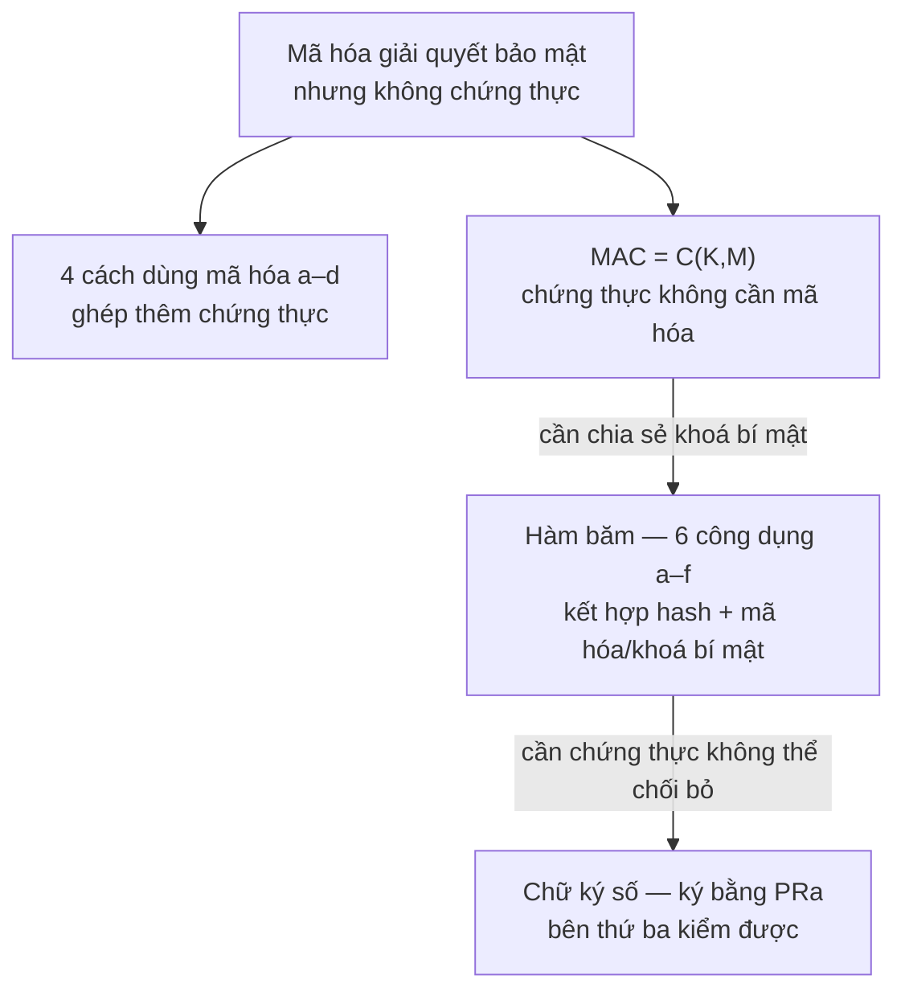

# L04 — Chứng thực dữ liệu (Data Authentication)

| | |
|---|---|
| Môn | `IE105` Nhập môn bảo đảm và an ninh thông tin |
| Buổi | 04 |
| Ngày | 2026-08-05 |
| Giảng viên | Tô Nguyễn Nhật Quang |
| Transcript | [`_raw/L04-2026-08-05-transcript.docx`](_raw/L04-2026-08-05-transcript.docx) |
| Slide | [`Bài 2B - Chứng thực dữ liệu.pdf`](../materials/slides/B%C3%A0i%202B%20-%20Ch%E1%BB%A9ng%20th%E1%BB%B1c%20d%E1%BB%AF%20li%E1%BB%87u.pdf), 56 trang |
| Buổi trước | [L03 — Mã hoá hiện đại](L03-modern-ciphers.md) |

> Nhãn nguồn: `[B2B sN]` = slide Bài 2B, trang N. `ngoài slide` = suy luận hoặc kiến thức chuẩn
> không có trong slide/transcript của buổi này.

---

## Mục lục

- [Tóm tắt một đoạn](#tóm-tắt-một-đoạn)
- [Gốc rễ của cả buổi](#gốc-rễ-của-cả-buổi)
- [Nội dung chính](#nội-dung-chính)
  - [1. Bốn cách dùng mã hóa (Message Encryption — 4 uses)](#1-bốn-cách-dùng-mã-hóa-message-encryption--4-uses)
  - [2. Mã chứng thực thông điệp (Message Authentication Code — MAC)](#2-mã-chứng-thực-thông-điệp-message-authentication-code--mac)
  - [3. Hàm băm và 6 công dụng (Hash Function — 6 uses)](#3-hàm-băm-và-6-công-dụng-hash-function--6-uses)
  - [4. Chữ ký số (Digital Signature)](#4-chữ-ký-số-digital-signature)
- [Bảng tổng hợp](#bảng-tổng-hợp)
- [Gợi ý thi](#gợi-ý-thi)
- [Deadline phát sinh](#deadline-phát-sinh)
- [Chỗ chưa rõ](#chỗ-chưa-rõ)
- [Tự kiểm tra](#tự-kiểm-tra)
- [Liên kết](#liên-kết)

---

## Tóm tắt một đoạn

Buổi 4 học **Bài 2B — Chứng thực dữ liệu**. Vấn đề trung tâm: mã hóa bảo vệ nội dung, nhưng không tự động chứng minh thông điệp đến từ đúng người gửi và chưa bị sửa. Slide trình bày bốn sơ đồ mã hóa (a–d) để đạt bảo mật/chứng thực/kết hợp, sau đó giới thiệu **MAC = C(K,M)** — chứng thực không cần mã hóa toàn bộ thông điệp. Phần nặng nhất là **6 công dụng của hàm băm (a)–(f)**: mỗi công dụng một biểu thức khác, người học cần nhận ra sơ đồ từ biểu thức và ngược lại. Cuối buổi là **chữ ký số**: ký bằng private key của người gửi trên hash, không phải trên toàn bộ thông điệp. Đây là phần thi quan trọng nhất của Bài 2B.

---

## Gốc rễ của cả buổi

Mã hóa (Bài 2A) giải quyết **bảo mật** (confidentiality) — ngăn kẻ thứ ba đọc nội dung. Nhưng Bob nhận được M, biết M đúng nội dung, vẫn không biết M có phải từ Alice không và M có bị sửa giữa đường không. Đó là vấn đề **chứng thực** (authentication) — buổi này giải quyết.



---

## Nội dung chính

### 1. Bốn cách dùng mã hóa (Message Encryption — 4 uses)

*(mục phụ — bản rút gọn)*

**Định nghĩa hình thức** `[B2B s17–21]`

Slide liệt kê bốn sơ đồ mã hóa thông điệp, mỗi sơ đồ đạt mục tiêu bảo mật/chứng thực khác nhau:

| Sơ đồ | Biểu thức | Bảo mật | Chứng thực | Ghi chú |
|---|---|---|---|---|
| (a) | E(K, M) | ✅ | ❌ | Khoá đối xứng K chung hai bên |
| (b) | E(PUb, M) | ✅ | ❌ | Mã bằng public key của Bob |
| (c) | E(PRa, M) | ❌ | ✅ | Mã bằng private key của Alice → ai cũng giải được |
| (d) | E(PUb, E(PRa, M)) | ✅ | ✅ | Mã hai lần: Alice ký, Bob nhận bảo mật |

**Trực giác:** (a)(b) là khóa két — chỉ người có chìa đọc được. (c) là con dấu — ai cũng xem được nhưng biết rõ ai đóng. (d) là cả hai.

*Chỗ analogy vỡ:* Trong thực tế, (d) rất chậm vì RSA/ECC tốn kém — không ai mã toàn bộ văn bản hai lần. Thực tế dùng chữ ký số (mục 4) để vừa nhanh vừa chứng thực.

**Chốt mục:** Sơ đồ (c) đạt chứng thực vì chỉ Alice có PRa — nhưng không đạt bảo mật vì ai cũng có PUa để giải. Bẫy hay gặp: tưởng mã hóa là chứng thực.

> ⚠️ **GỢI Ý THI:** "Trong bài thi cuối kì thầy cho cái biểu thức hỏi cái hình nào là hình của nó, hoặc cho cái hình để hỏi biểu thức nào là biểu thức của nó" — buổi 4, 2026-08-05

---

### 2. Mã chứng thực thông điệp (Message Authentication Code — MAC)

#### 📚 Lý thuyết

**Gốc rễ (first principles).** *Phần suy luận không có trong slide gắn nhãn `ngoài slide`.*

- **Ngữ cảnh:** Alice và Bob chia sẻ một khoá bí mật K. Alice muốn gửi M cho Bob và Bob cần biết chắc M chưa bị sửa và đến từ Alice.
- **Vấn đề gốc:** Mã hóa toàn bộ M tốn tài nguyên và đôi khi không cần bảo mật — chỉ cần biết M chưa bị giả mạo.
- **Những sự thật nền:**
  1. Kẻ tấn công không biết K, nên không tính lại được MAC từ M đã sửa.
  2. Hàm C phải là one-way: biết M, K → dễ tính MAC; không thể từ MAC tìm ngược K.
- **Suy luận:** Nếu có một hàm C chỉ Bob và Alice tính được (vì chỉ có K), thì gửi kèm C(K,M) là đủ để chứng thực — không cần mã hóa M. `ngoài slide`
- **Nếu không có MAC thì sao?** Kẻ nghe lén có thể thay thế M bằng M' và Bob không phát hiện. `ngoài slide`

**Định nghĩa hình thức** `[B2B s22–27]`

> **MAC = C(K, M)**
>
> Trong đó: K là khoá bí mật chung giữa người gửi và người nhận · M là thông điệp · C là hàm chứng thực · MAC (Message Authentication Code) là kết quả có độ dài cố định.

**Ba sơ đồ sử dụng MAC** `[B2B s25–27]`

```
Sơ đồ (a): Alice gửi M‖C(K,M), Bob tính C(K,M) và so sánh
           → chứng thực + toàn vẹn, KHÔNG bảo mật (M đọc được)

Sơ đồ (b): Alice gửi E(K2, M‖C(K1,M)), Bob giải mã rồi kiểm MAC
           → bảo mật + chứng thực + toàn vẹn (hai khoá riêng)

Sơ đồ (c): Alice gửi E(K2,M)‖C(K1,M), Bob giải mã rồi kiểm MAC của M gốc
           → bảo mật (K2) + chứng thực (K1), MAC tính trên M gốc
```

**Tính chất:**
- K chia sẻ giữa hai bên → MAC là đối xứng (khác chữ ký số dùng khoá bất đối xứng)
- MAC không mã hóa M — chỉ là "con dấu xác nhận"
- Độ dài MAC ngắn hơn M nhiều → giao thức nhẹ hơn mã hóa toàn bộ `ngoài slide`

#### 💡 Giải thích dễ hiểu

**Trực giác:** MAC là con số kiểm tra mà chỉ người biết mật khẩu mới tính được — gửi kèm văn bản để bên kia xác nhận văn bản chưa bị sửa.

**Analogy đời thường:** Dấu niêm phong trên phong bì — ai cũng thấy phong bì, nhưng chỉ người có con dấu gốc mới tạo ra dấu đó. Mở ra thấy dấu còn nguyên → biết không ai mở trộm.

*Chỗ analogy vỡ:* Dấu niêm phong vật lý khó làm giả nhưng về mặt nguyên lý bất cứ ai có con dấu đều tạo được. MAC dựa trên bí mật toán học — không biết K thì không tính được, dù nhìn thấy hàng ngàn cặp (M, MAC(K,M)).

**Sơ đồ ASCII — luồng sơ đồ (a):**

```
Alice                              Bob
  |                                 |
  | K (bí mật chung)          K (bí mật chung)
  |                                 |
  M ──► C(K, M) = MAC               |
  |                                 |
  └──── M ‖ MAC ──────────────────► |
                                    |
                              C(K, M') = MAC'
                              So sánh MAC' == MAC?
                              Đúng → M chưa bị sửa
```

#### 💻 Code & thực tế

```python
import hmac, hashlib

key = b"shared_secret"          # K — khoá bí mật chung
msg = b"Transfer 100 USD"       # M — thông điệp

# Alice tính MAC
mac = hmac.new(key, msg, hashlib.sha256).digest()

# Bob kiểm tra: tính lại với cùng key, so sánh bằng constant-time
msg_received = b"Transfer 100 USD"
mac_verify = hmac.new(key, msg_received, hashlib.sha256).digest()
ok = hmac.compare_digest(mac, mac_verify)
print(ok)  # True
```

> **Trong production:** `hmac.compare_digest` tránh timing attack — so sánh byte-by-byte thường thường dừng sớm khi khác, để lộ thông tin qua thời gian. `ngoài slide`

#### ✍️ Bài tập

**Bài 1** *(Nhớ)* — MAC = C(K, M) gồm những thành phần nào? · *nguồn: slide B2B s22*

> 🔑 **Kiến thức mở khoá:** Định nghĩa hình thức MAC.

<details><summary>Hướng giải</summary>

- K: khoá bí mật dùng chung giữa người gửi và người nhận
- M: thông điệp cần chứng thực
- C: hàm chứng thực (authentication function)
- Kết quả MAC có độ dài cố định, gửi kèm M

</details>

**Bài 2** *(Vận dụng)* — Phân biệt sơ đồ MAC (b) và (c): hai cái này khác nhau ở điểm nào và hậu quả của sự khác nhau đó? · *nguồn: slide B2B s26–27*

> 🔑 **Kiến thức mở khoá:** Ba sơ đồ MAC và mục tiêu từng sơ đồ.

<details><summary>Hướng giải</summary>

- **(b)** E(K2, M‖C(K1,M)): MAC tính trước, rồi mã hóa CẢ M lẫn MAC → Bob giải mã ra M rồi mới kiểm MAC.
- **(c)** E(K2,M)‖C(K1,M): M mã hóa riêng, MAC của M gốc gửi kèm ngoài → Bob có thể kiểm MAC ngay mà không cần giải mã M trước.
- Khác biệt thực tế: (c) cho phép kiểm tính toàn vẹn trước khi giải mã — tiết kiệm tài nguyên khi M giả mạo. `ngoài slide`

</details>

**Chốt mục:** MAC dùng khoá đối xứng → cả hai bên đều có thể tạo MAC, không dùng được để "phủ nhận" (non-repudiation). Muốn non-repudiation thì cần chữ ký số.

---

### 3. Hàm băm và 6 công dụng (Hash Function — 6 uses)

#### 📚 Lý thuyết

**Gốc rễ (first principles).** *Phần suy luận không có trong slide gắn nhãn `ngoài slide`.*

- **Ngữ cảnh:** Cần chứng thực thông điệp mà không muốn mã hóa toàn bộ M (M có thể rất dài).
- **Vấn đề gốc:** C(K,M) cần khoá chung K → hai bên phải chia sẻ khoá trước. Hàm băm cho phép xây dựng chứng thực không cần khoá chung — chỉ cần hash của M.
- **Những sự thật nền:**
  1. Hàm băm ánh xạ đầu vào bất kỳ → chuỗi có độ dài cố định (digest).
  2. Hai tính chất cốt lõi: (i) one-way — không thể từ H(M) tìm ngược M; (ii) collision resistance — không tìm được M' ≠ M mà H(M') = H(M).
- **Suy luận:** Nếu ký (hoặc mã hóa) H(M) thay vì M, kích thước cố định và ngắn → vừa nhanh vừa có thể kết hợp nhiều kiểu chứng thực. `ngoài slide`
- **Nếu không có collision resistance thì sao?** Kẻ tấn công tạo M' giả mạo có H(M') = H(M), thay M bằng M', chữ ký vẫn hợp lệ.

**Định nghĩa hình thức** `[B2B s40–43]`

> Hàm băm H nhận vào thông điệp M có độ dài bất kỳ và trả ra digest H(M) có độ dài cố định.
>
> **Hai tính chất cốt lõi:**
> - **One-way (một chiều):** Cho H(M), không thể tìm M. Dễ tính thuận, không thể tính ngược.
> - **Collision resistance (kháng đụng độ):** Không thể tìm M' ≠ M sao cho H(M') = H(M).

**Sáu công dụng hàm băm** `[B2B s40–43]`

| Sơ đồ | Biểu thức gửi đi | Bảo mật | Chứng thực | Chữ ký số |
|---|---|---|---|---|
| (a) | M‖E(K, H(M)) | ❌ | ✅ (K đối xứng) | ❌ |
| (b) | E(K, M‖H(M)) | ✅ | ✅ | ❌ |
| (c) | M‖E(PRa, H(M)) | ❌ | ✅ | ✅ |
| (d) | E(K, M‖E(PRa, H(M))) | ✅ | ✅ | ✅ |
| (e) | M‖H(M‖S) | ❌ | ✅ (S bí mật) | ❌ |
| (f) | E(K, M‖H(M‖S)) | ✅ | ✅ | ❌ |

> *S = secret value bí mật chia sẻ hai bên (không phải khoá mã hóa).*

**Các chuẩn hàm băm** `[B2B s45–49]`

| Chuẩn | Độ dài digest | Năm | Tác giả/cơ quan | Tình trạng |
|---|---|---|---|---|
| MD5 | 128 bit | 1991 | Ronald Rivest, MIT | **Đã vỡ** — không dùng cho bảo mật mới |
| SHA-1 | 160 bit | 1993 → 1995 | NIST/NSA | **Đã vỡ** (2005, Google 2017) |
| SHA-2 | 224/256/384/512 bit | 2001 | NIST | ✅ Đang dùng |
| SHA-3 | 224/256/384/512 bit | 2015 | Keccak team | ✅ Chuẩn mới |

#### 💡 Giải thích dễ hiểu

**Trực giác:** Hash là "vân tay" của văn bản — thay đổi một ký tự thì vân tay thay đổi hoàn toàn, nhưng từ vân tay không thể tái tạo văn bản gốc.

**Analogy đời thường:** Máy xay sinh tố — bỏ quả vào, ra sinh tố. Không thể từ ly sinh tố lắp lại quả. Hai quả khác nhau không thể ra cùng một ly.

*Chỗ analogy vỡ:* Máy xay thực tế có thể lý thuyết bị đảo (nguyên liệu bão hòa, nhiệt độ…). Hàm băm tốt là **tính toán không khả thi** để đảo — không phải vật lý bất khả.

**Hiệu ứng tuyết lở (avalanche effect) — ví dụ MD5:**

```
MD5("Hello") = 8b1a9953c4611296a827abf8c47804d7
MD5("hello") = 5d41402abc4b2a76b9719d911017c592
                ^^^^^^^^^^^^^^^^^^^^^^^^^^^^^^^
    Chỉ đổi "H" → "h", toàn bộ 32 ký tự hex thay đổi
```

**Đọc 6 công dụng bằng cách phân rã biểu thức:**

```
Công dụng (a): M‖E(K, H(M))
  - Phần gửi: M (không mã) + hash của M đã mã
  - Bob nhận: giải E(K, H(M)) → H(M); tự tính H(M); so sánh
  - Kết: biết M chưa bị sửa, biết ai gửi (có K), nhưng Eve đọc được M
  
Công dụng (c): M‖E(PRa, H(M))
  - Phần gửi: M (không mã) + hash của M ký bằng private key Alice
  - Bob nhận: giải E(PRa, H(M)) bằng PUa → H(M); tự tính H(M); so sánh
  - Kết: chứng thực, chữ ký số, nhưng Eve đọc được M
  
Công dụng (e): M‖H(M‖S)
  - Phần gửi: M + hash của (M nối với S bí mật)
  - Không cần mã hóa, chỉ cần S chung
  - Eve không biết S → không tính lại H(M‖S) dù có M
```

#### 💻 Code & thực tế

```python
import hashlib

# Avalanche effect: thay 1 ký tự, toàn bộ hash thay đổi
print(hashlib.md5(b"Hello").hexdigest())
# 8b1a9953c4611296a827abf8c47804d7
print(hashlib.md5(b"hello").hexdigest())
# 5d41402abc4b2a76b9719d911017c592

# SHA-256 thực tế (production)
print(hashlib.sha256(b"Hello").hexdigest())
# 185f8db32921bd46d35cc0a447d1a7c4...

# Công dụng (e): H(M‖S) không cần mã hóa
import hmac
S = b"shared_secret_value"
M = b"document content"
digest = hashlib.sha256(M + S).hexdigest()
# Bên nhận tính lại: sha256(M + S) == digest?
```

> **Trong production:** SHA-256 là chuẩn tối thiểu hiện tại. MD5 và SHA-1 chỉ dùng cho checksum không bảo mật (tải file, Git object ID). `ngoài slide`

#### ✍️ Bài tập

**Bài 1** *(Nhớ)* — Hai tính chất cốt lõi của hàm băm là gì? · *nguồn: slide B2B s40*

> 🔑 **Kiến thức mở khoá:** Định nghĩa hình thức hàm băm.

<details><summary>Hướng giải</summary>

1. **One-way**: Cho H(M), không thể tìm M.
2. **Collision resistance**: Không thể tìm M' ≠ M sao cho H(M') = H(M).

</details>

**Bài 2** *(Vận dụng)* — Đề thi cho hình sơ đồ (c): `M‖E(PRa, H(M))`. Bên nhận Bob kiểm tra bằng cách nào? · *nguồn: slide B2B s42 + đề mẫu câu 07*

> 🔑 **Kiến thức mở khoá:** Sơ đồ (c) dùng PRa để ký, PUa để kiểm.

<details><summary>Hướng giải</summary>

1. Bob nhận được M và E(PRa, H(M)).
2. Tính H(M) từ M nhận được → được H'(M).
3. Giải mã phần chữ ký: D(PUa, E(PRa, H(M))) → được H(M) gốc.
4. So sánh H'(M) == H(M): khớp → M chưa bị sửa và đến từ Alice (chỉ Alice có PRa).

</details>

**Bài 3** *(Phân tích)* — Công dụng (a) và (e) đều không bảo mật. Khác nhau thế nào về cơ chế chứng thực? · *tự đặt*

> 🔑 **Kiến thức mở khoá:** Bảng 6 công dụng — cột biểu thức và ghi chú.

<details><summary>Hướng giải</summary>

- **(a)** `M‖E(K, H(M))`: dùng khoá đối xứng K để mã hóa hash → cần chia sẻ K trước.
- **(e)** `M‖H(M‖S)`: dùng secret value S nối vào M rồi băm → không cần mã hóa, nhưng S phải bí mật.
- Cơ chế (a) mạnh hơn: K đối xứng thường dài 128–256 bit; S trong (e) có thể ngắn → dễ brute-force hơn. `ngoài slide`

</details>

**Chốt mục:** Bẫy hay gặp: nhầm sơ đồ (c) với (a) — (c) dùng PRa (bất đối xứng, chữ ký số), (a) dùng K (đối xứng, không chữ ký số). Khi đề cho hình bị che một ô: xem khoá loại gì (đối xứng vs private key) và M có mã hóa không.

---

### 4. Chữ ký số (Digital Signature)

#### 📚 Lý thuyết

**Gốc rễ (first principles).** *Phần suy luận không có trong slide gắn nhãn `ngoài slide`.*

- **Ngữ cảnh:** MAC dùng khoá đối xứng → cả hai bên đều có thể tạo MAC → không thể dùng làm bằng chứng pháp lý (Alice có thể nói "Bob tự tạo MAC").
- **Vấn đề gốc:** Cần chứng thực mà **chỉ người gửi tạo được, nhưng bên thứ ba có thể kiểm** (non-repudiation).
- **Những sự thật nền:**
  1. PRa là bí mật tuyệt đối của Alice — chỉ Alice có.
  2. PUa là công khai — bất kỳ ai (kể cả tòa án) có thể kiểm.
- **Suy luận:** Nếu Alice ký H(M) bằng PRa → E(PRa, H(M)), thì bất kỳ ai dùng PUa giải ra H(M) và so sánh với hash của M nhận được — đây là bằng chứng Alice đã ký. Alice không thể chối vì chỉ cô có PRa. `ngoài slide`
- **Nếu không có non-repudiation thì sao?** Thương mại điện tử không thể hoạt động — người bán có thể phủ nhận đã nhận đơn hàng. `ngoài slide`

**Định nghĩa hình thức** `[B2B s50–54]`

> **Chữ ký số = E(PRa, H(M))**
>
> - Ký: H(M) → E(PRa, H(M)) = Sig
> - Gửi: M‖Sig (M không mã hóa — sơ đồ không bảo mật)
>   hoặc E(PUb, M‖Sig) (có bảo mật — sơ đồ có mã hóa)
> - Kiểm: D(PUa, Sig) = H(M) · so sánh với H(M) tính từ M nhận được

**Tính chất:**
- Chỉ Alice tạo được (PRa bí mật) → **non-repudiation**
- Bất kỳ ai kiểm được (PUa công khai)
- Ký trên H(M) ngắn thay vì M dài → RSA/ECC đủ nhanh `ngoài slide`

**Hai sơ đồ chữ ký số** `[B2B s53–54]`

```
Sơ đồ không mã hóa (s53):
  Alice: DS = E(PRa, H(M)) → gửi M‖DS
  Bob: D(PUa, DS) → H(M) · H(M_recv) == H(M)?

Sơ đồ có mã hóa (s54):
  Alice: DS = E(PRa, H(M)) → gửi E(PUb, M‖DS)
  Bob: D(PRb, ...) → M‖DS · rồi kiểm DS như trên
```

#### 💡 Giải thích dễ hiểu

**Trực giác:** Chữ ký tay trên giấy — ai cũng nhìn thấy, chỉ bạn ký được, tòa án kiểm được.

**Analogy đời thường:** Con dấu và chữ ký công chứng — công chứng viên đóng dấu (PRa), bất kỳ ai nhìn thấy con dấu (PUa) đều biết đây là bản được công chứng viên đó xác nhận.

*Chỗ analogy vỡ:* Con dấu vật lý có thể làm giả. Chữ ký số dựa trên toán học — không thể làm giả nếu PRa an toàn.

**Luồng đầy đủ — sơ đồ (c) và chữ ký số so sánh:**

```
Sơ đồ hàm băm (c): M‖E(PRa, H(M))
           ↑
           Đây chính là chữ ký số không mã hóa thông điệp

Luồng chi tiết:
  Alice                              Bob
    M ──► H(M) ──► E(PRa, H(M))=Sig   |
    └─── M ‖ Sig ──────────────────► |
                              H(M_recv) ← H(M nhận)
                              D(PUa, Sig) = H(M)
                              H(M_recv) == H(M)? ✅
```

#### 💻 Code & thực tế

không áp dụng — ký số đòi hỏi quản lý certificate/PKI; trong code thực dùng thư viện `cryptography` (Python) hoặc `openssl`, không tự cài đặt.

> **Trong production:** JWT (JSON Web Token) dùng chữ ký số — `header.payload` được ký bằng RS256 (RSA + SHA-256) hoặc ES256 (ECDSA). Phần cuối token là chữ ký số, verify bằng public key server. `ngoài slide`

#### ✍️ Bài tập

**Bài 1** *(Nhớ)* — Biểu thức chữ ký số là gì? Gửi đi cái gì? · *nguồn: slide B2B s50*

> 🔑 **Kiến thức mở khoá:** Định nghĩa hình thức chữ ký số.

<details><summary>Hướng giải</summary>

- Chữ ký: `DS = E(PRa, H(M))` — ký trên hash của M bằng private key của Alice.
- Gửi đi: `M‖DS` (sơ đồ không mã hóa) hoặc `E(PUb, M‖DS)` (sơ đồ có mã hóa).

</details>

**Bài 2** *(Vận dụng)* — Tại sao ký trên H(M) thay vì ký trực tiếp lên M? · *tự đặt*

> 🔑 **Kiến thức mở khoá:** Tính chất hàm băm (độ dài cố định) + giới hạn của RSA.

<details><summary>Hướng giải</summary>

- RSA/ECC chỉ mã hóa dữ liệu có kích thước nhỏ (≤ kích thước khoá modulus). `ngoài slide`
- H(M) luôn có độ dài cố định (e.g., SHA-256: 256 bit) → RSA xử lý được.
- Nếu ký M trực tiếp, M có thể dài hàng MB → không khả thi.

</details>

**Chốt mục:** Sự khác nhau cốt lõi MAC vs Chữ ký số: MAC dùng khoá đối xứng → cả hai bên tạo được; Chữ ký số dùng khoá bất đối xứng (PRa) → chỉ người gửi tạo được, bên thứ ba kiểm được. MAC không có non-repudiation.

---

## Bảng tổng hợp

| Cơ chế | Biểu thức đặc trưng | Khoá | Bảo mật | Chứng thực | Non-repudiation |
|---|---|---|---|---|---|
| Mã hóa đối xứng (a) | E(K, M) | K đối xứng | ✅ | ❌ | ❌ |
| Mã hóa bất đối xứng (b) | E(PUb, M) | PUb Bob | ✅ | ❌ | ❌ |
| Ký bằng PRa (c) | E(PRa, M) | PRa Alice | ❌ | ✅ | ✅ |
| Kết hợp (d) | E(PUb, E(PRa, M)) | PUb + PRa | ✅ | ✅ | ✅ |
| MAC | M‖C(K,M) | K đối xứng | ❌ | ✅ | ❌ |
| Hash dùng (c) | M‖E(PRa,H(M)) | PRa Alice | ❌ | ✅ | ✅ |
| Hash dùng (d) | E(K,M‖E(PRa,H(M))) | K + PRa | ✅ | ✅ | ✅ |
| Hash dùng (e) | M‖H(M‖S) | S bí mật | ❌ | ✅ | ❌ |

> **Cột đọc nhanh:** Non-repudiation chỉ đạt khi dùng PRa (private key của người gửi).

---

## Gợi ý thi

> ⚠️ **GỢI Ý THI:** "Trong bài thi cuối kì á thì thầy cho cái biểu thức hỏi cái hình nào là hình của nó, hoặc là cho cái hình để hỏi biểu thức nào là biểu thức của nó." — buổi 4, 2026-08-05

> ⚠️ **GỢI Ý THI:** "Trong bài thi cuối kỳ thì hay cho cái hình này, bị che đi một cái ô nào đó" — buổi 4, 2026-08-05 (hình: 6 công dụng hàm băm a–f)

*(Đã có trong `IMPORTANT_NOTES.md` mục 2.1.)*

---

## Deadline phát sinh

| Việc | Hạn nộp | Đã ghi vào `admin/tasks-2025-2026-S3.md` |
|---|---|---|
| Bài tập quá trình buổi 4 | Nộp cuối buổi 2026-08-05 | Đã qua |

---

## Chỗ chưa rõ

> ❓ **CẦN XÁC MINH:** Sơ đồ MAC (b) dùng K2 mã hóa, K1 làm MAC — slide có ghi rõ hai khoá khác nhau không hay cùng một K? Đối chiếu slide s26.

---

## Tự kiểm tra

**1.** Sơ đồ E(PRa, M) đạt bảo mật hay chứng thực? Giải thích ngắn tại sao.

<details><summary>Đáp án</summary>

Chứng thực (✅), không bảo mật (❌). Vì PUa là công khai — ai cũng có thể giải mã E(PRa, M) bằng PUa. Nhưng chỉ Alice có PRa → chứng thực được nguồn gốc.

</details>

**2.** MAC và chữ ký số đều chứng thực thông điệp. Khác nhau một điểm quan trọng nhất?

<details><summary>Đáp án</summary>

MAC dùng khoá đối xứng → cả hai bên tạo được → **không có non-repudiation**. Chữ ký số dùng PRa (chỉ người gửi có) → bên thứ ba kiểm được → **có non-repudiation**.

</details>

**3.** Công dụng hàm băm (c) là gì? Bob kiểm tra bằng cách nào?

<details><summary>Đáp án</summary>

(c): `M‖E(PRa, H(M))` — Alice gửi M cùng hash của M đã ký bằng private key. Bob: tính H(M) từ M nhận → giải D(PUa, phần ký) → được H(M) gốc → so sánh hai hash.

</details>

**4.** MD5 sinh hash bao nhiêu bit? Hiện tại còn dùng cho bảo mật không?

<details><summary>Đáp án</summary>

MD5 → 128 bit. Ronald Rivest, MIT, 1991. **Không dùng cho bảo mật** — đã vỡ, có thể tạo collision. Chỉ còn dùng cho checksum không bảo mật (tải file).

</details>

**5.** Tại sao chữ ký số ký trên H(M) chứ không ký trực tiếp trên M?

<details><summary>Đáp án</summary>

RSA chỉ mã hóa được dữ liệu nhỏ (≤ kích thước khoá). H(M) luôn có độ dài cố định (vd SHA-256 = 256 bit) → RSA xử lý được. M có thể dài hàng MB → không khả thi ký trực tiếp.

</details>

---

## Liên kết

- Kiến thức liên quan: [L03 — Mã hoá hiện đại (RSA, khoá công khai)](L03-modern-ciphers.md)
- Ghi chú quan trọng của môn: [`../IMPORTANT_NOTES.md`](../IMPORTANT_NOTES.md)
- Cheatsheet ôn thi: [`../exam-prep/cheatsheet.md`](../exam-prep/cheatsheet.md)
- Hướng dẫn ôn chương 2B: [`../exam-prep/chapter2b-exam-study-guide.md`](../exam-prep/chapter2b-exam-study-guide.md)
