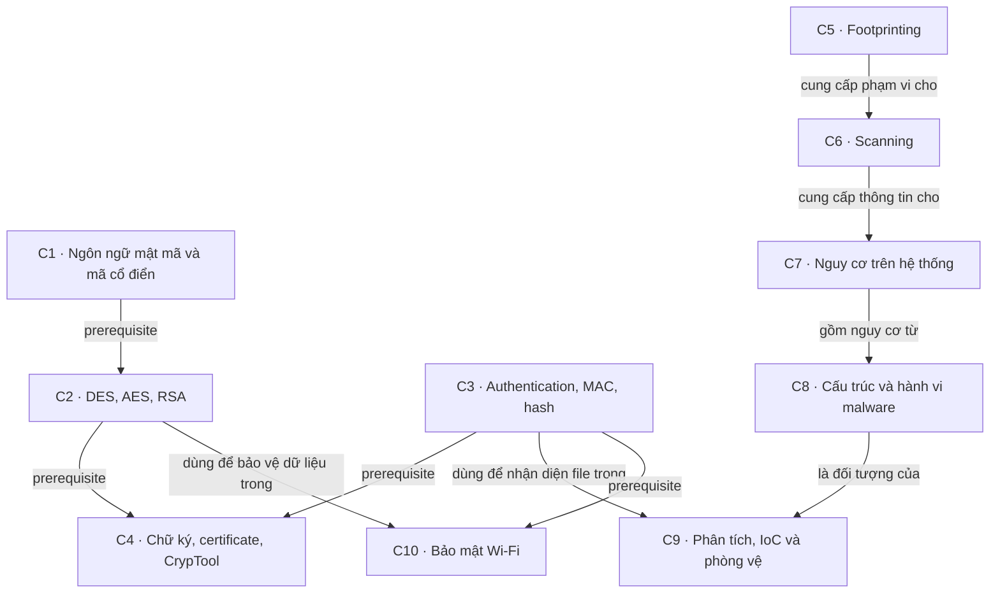

# Knowledge map — Nhập môn bảo đảm và an ninh thông tin

> **IE105** · Phạm vi: **9 PDF, 646 trang** · Cập nhật: **2026-09-24**
> **Đã đọc: 557 trang của 8 PDF.** PDF Tổng quan có 89 trang nhưng không đọc được do lỗi dữ liệu; đây là map của phần nguồn đọc được, chưa bao phủ nội dung Tổng quan.
> Quy ước: `[S<n>]` dẫn tới đúng file trong bảng nguồn; **slide là số trang PDF, tính từ 1**, kể cả trang bìa. Với S2, đó là trang tài liệu thực hành. Số in trên một số slide có thể khác số trang PDF.

---

## Mục lục

- [Phạm vi nguồn](#phạm-vi-nguồn)
- [Bức tranh lớn](#bức-tranh-lớn)
- [Các cụm kiến thức](#các-cụm-kiến-thức)
  - [C1. Ngôn ngữ mật mã và mã cổ điển](#c1-ngôn-ngữ-mật-mã-và-mã-cổ-điển)
  - [C2. Mật mã hiện đại — DES, AES, RSA](#c2-mật-mã-hiện-đại--des-aes-rsa)
  - [C3. Authentication, MAC và hash](#c3-authentication-mac-và-hash)
  - [C4. Digital signature, certificate và thực hành CrypTool](#c4-digital-signature-certificate-và-thực-hành-cryptool)
  - [C5. Footprinting — thông tin lộ ra trước khi kiểm thử](#c5-footprinting--thông-tin-lộ-ra-trước-khi-kiểm-thử)
  - [C6. Scanning — host, port, service và vulnerability](#c6-scanning--host-port-service-và-vulnerability)
  - [C7. Nguy cơ bảo mật trên hệ thống](#c7-nguy-cơ-bảo-mật-trên-hệ-thống)
  - [C8. Malware — loại, cấu trúc và hành vi](#c8-malware--loại-cấu-trúc-và-hành-vi)
  - [C9. Phân tích mã độc, IoC và phòng vệ](#c9-phân-tích-mã-độc-ioc-và-phòng-vệ)
  - [C10. Bảo mật mạng không dây](#c10-bảo-mật-mạng-không-dây)
- [Lộ trình học](#lộ-trình-học)
- [Điểm dễ nhầm và ranh giới](#điểm-dễ-nhầm-và-ranh-giới)
- [Cần xác minh](#cần-xác-minh)
- [Nguồn](#nguồn)

---

## Phạm vi nguồn

| Mã | File gốc | Chủ đề nhận diện | Trang/slide | Trạng thái |
|---|---|---|---|---|
| S1 | [Bài 1 - Tổng quan.pdf][S1] | Tổng quan — chưa đọc được nội dung | 89 | ❓ lỗi dữ liệu PDF |
| S2 | [Bài 1B - Mã hoá hiện đại, chứng thực, chữ ký số.pdf][S2] | Thực hành CrypTool: encryption, hash, RSA, signature | 4 | Đã đọc toàn bộ |
| S3 | [Bài 2A - Các giải thuật mã hoá.pdf][S3] | Mật mã cổ điển và hiện đại | 75 | Đã đọc toàn bộ |
| S4 | [Bài 2B - Chứng thực dữ liệu.pdf][S4] | Chứng thực dữ liệu, MAC, hash, chữ ký số | 56 | Đã đọc toàn bộ |
| S5 | [Bài 3A - Dò tìm lỗ hổng bảo mật thông tin - Thăm dò.pdf][S5] | Footprinting | 59 | Đã đọc toàn bộ |
| S6 | [Bài 3B - Dò tìm lỗ hổng bảo mật thông tin - Quét mạng.pdf][S6] | Scanning | 52 | Đã đọc toàn bộ |
| S7 | [Bài 4 - Các nguy cơ bảo mật trên hệ thống.pdf][S7] | Nguy cơ trên hệ thống | 79 | Đã đọc toàn bộ |
| S8 | [Bài 5 - Mã độc và kỹ thuật phân tích mã độc.pdf][S8] | Malware và phân tích/phòng chống | 120 | Đã đọc toàn bộ |
| S9 | [Bài 6 - Bảo mật mạng không dây.pdf][S9] | Bảo mật mạng không dây | 112 | Đã đọc toàn bộ |

**Cách đọc nguồn:** trích text của toàn bộ trang, dùng OCR cho chữ trong ảnh và xem trực tiếp các sơ đồ mang quan hệ chính. S1 đã thử trích text bằng hai thư viện và render/OCR bằng PDFKit; cả 89 trang không cho nội dung đọc được. Không dùng tên file để suy ra nội dung phần này.

**Ranh giới:** map theo nội dung PDF hiện có, không theo thứ tự buổi học hay số bài tập. S2 tự ghi là **Bài thực hành 1B**, dù nằm trong thư mục slide. Outline ở S3 slide 2 còn liệt kê Web, mobile, firewall/IDS/IPS, quản lý rủi ro và xu thế hiện đại; thư mục hiện tại không có các bộ bài riêng tương ứng. Một vài chủ đề này xuất hiện trong phần mã độc/Wi‑Fi, chưa đủ để coi là đã có toàn bộ chương. [S2] — trang 1; [S3] — slide 2.

## Bức tranh lớn

**Trực giác:** môn này giúp hiểu cách giữ thông tin đáng tin cậy, nhận ra chỗ có thể bị xâm nhập và biết dựa vào đâu để phát hiện, phòng chống.

**Ví von để nhớ** *(minh họa của map)*: bảo vệ một văn phòng cần cả khóa cửa, kiểm tra người ra vào, kiểm tra cửa phụ và quan sát dấu vết bất thường. Bốn việc đó tương ứng với mật mã, chứng thực, đánh giá điểm yếu và giám sát; chỉ có một chiếc khóa tốt chưa giải quyết hết bài toán.

**Ví dụ nhỏ:** Alice gửi một tài liệu cho Bob. Mã hóa giúp giới hạn người đọc; kiểm tra digest/chữ ký giúp phát hiện thay đổi và kiểm tra nguồn gửi. Nếu máy của Alice có keylogger thì việc bảo vệ đường truyền chưa xử lý được nguy cơ ngay trên máy. Hai góc nhìn này nối phần mật mã với phần bảo vệ hệ thống. [S3] — slide 7–10, 58–64; [S4] — slide 19–21, 51–54; [S7] — slide 14, 39–43.

Bản đồ gom thành **10 cụm C1–C10**. Mũi tên `prerequisite` là thứ tự học đề xuất từ nội dung, không phải điều kiện tiên quyết do trường quy định. Các nhánh có thể học song song.

**Nguồn cho các cạnh:**

| Quan hệ trên graph | Vì sao nối được | Nguồn |
|---|---|---|
| C1 → C2 | Substitution/permutation, thông điệp và khóa là nền để đọc các phép biến đổi nhiều vòng | [S3] — slide 7–10, 23–42, 47–57 |
| C2 + C3 → C4 | Quy trình ký kết hợp hash với private/public key; bài thực hành nối mã hóa, hash và chữ ký | [S4] — slide 51–54; [S2] — trang 1–3 |
| C5 → C6 → C7 | Sơ đồ System Hacking đặt footprinting, scanning và enumeration trước các bước trên hệ thống | [S7] — slide 3–5; [S6] — slide 3–5 |
| C7 → C8 → C9 | Trojan/keylogger/spyware là nguy cơ trên máy; phân tích mã độc đi từ cấu trúc và hành vi sang tìm dấu vết | [S7] — slide 4, 14, 37; [S8] — slide 28–60 |
| C3 → C9 | Hash và chữ ký số là dữ liệu dùng khi kiểm tra file, lập IoC | [S8] — slide 55, 64, 70 |
| C2 + C3 → C10 | Wi‑Fi dùng cipher để bảo vệ frame, cơ chế chứng thực để kiểm tra người dùng và tính toàn vẹn | [S9] — slide 15–22, 25–30 |

## Các cụm kiến thức

### C1. Ngôn ngữ mật mã và mã cổ điển

- **Trả lời:** làm sao biến một thông điệp thành dạng người ngoài khó đọc, và vì sao quy luật ngôn ngữ có thể làm lộ nó?
- **Ví von → ví dụ:** như đổi quy ước viết thư giữa hai người. Caesar dịch 5 vị trí biến `CRYPTOGRAPHY` thành `HWDUYTLWFUMD`; đây là ví dụ có sẵn trong nguồn. [S3] — slide 28.
- **Khái niệm lõi:** plaintext (bản rõ), ciphertext (bản mã), key (khóa), encryption/decryption (mã hóa/giải mã). Mô hình: `c = e(m, ke)` và `m = d(c, kd)`; bảo mật đặt vào khóa, thuật toán có thể công khai. [S3] — slide 7–10, 22.
- **Cấu trúc:** substitution (thay ký hiệu) và transposition/permutation (đổi vị trí); Caesar/Vigenère dùng phép dịch, Affine dùng `ax + b mod 26`, Playfair xử lý cặp ký tự bằng ma trận, Hill dùng phép nhân ma trận modulo 26. [S3] — slide 23–38.
- **Quan hệ:** `Vigenère với khóa dài 1 → Caesar` là trường hợp riêng; `Affine với a = 1 → shift cipher` cũng là trường hợp riêng. Thống kê tần suất là cơ sở của cryptanalysis (thám mã) được giới thiệu sau các ví dụ. [S3] — slide 27, 30, 39–40.
- **Nối với cụm khác:** C2 phát triển ý tưởng biến đổi dữ liệu qua nhiều vòng; C7 gặp lại brute force trong bài toán mật khẩu. Lịch sử ở slide 11–21 giúp đặt Enigma, DES và public-key vào bối cảnh. [S3] — slide 41, 65–69; [S7] — slide 9.

### C2. Mật mã hiện đại — DES, AES, RSA

- **Trả lời:** chọn loại khóa và cách xử lý dữ liệu thế nào để mã hóa được dữ liệu thực tế?
- **Ví von → ví dụ:** khóa chung giống hai người cùng giữ chìa một ổ khóa; public/private key tách vai trò khóa và mở. Ví dụ RSA của nguồn dùng `n = 3233`, biến `123 → 855 → 123`; chỉ là số nhỏ để minh họa phép toán. [S3] — slide 20–21, 63.
- **Khái niệm lõi:** symmetric/asymmetric (đối xứng/bất đối xứng) phân loại theo quan hệ giữa các khóa; block/stream cipher phân loại theo cách xử lý dữ liệu. Đây là **hai trục phân loại khác nhau**. [S3] — slide 10, 19–20, 42.
- **Cơ chế:** DES dùng khóa 56 bit, block 64 bit, 16 vòng theo sơ đồ; AES dùng block 128 bit với khóa 128/192/256 bit và các bước SubBytes, ShiftRows, MixColumns, AddRoundKey. RSA dùng public key của người nhận để mã hóa và private key tương ứng để giải mã. [S3] — slide 43–58, 60–63.
- **Quan hệ:** `mã đối xứng bảo vệ dữ liệu + RSA bảo vệ khóa → mô hình kết hợp`. Nguồn minh họa bằng DES/RSA; mục đích là kết hợp vai trò của hai loại mật mã, không phải khuyến nghị chọn DES cho hệ thống mới. [S3] — slide 18–19, 64.
- **Độ an toàn:** nguồn phân biệt các điều kiện attacker biết được dữ liệu gì, và minh họa chi phí brute force (vét cạn) theo độ dài khóa. Các bảng thời gian gắn với tốc độ thử giả định trong slide. [S3] — slide 65–69.
- **Nối với cụm khác:** RSA là nền đọc quy trình ký ở C4; RC4/AES xuất hiện trong WEP/WPA/WPA2 ở C10. [S4] — slide 51–54; [S9] — slide 25–30.

### C3. Authentication, MAC và hash

- **Trả lời:** làm sao kiểm tra dữ liệu có bị sửa và người gửi có biết bí mật đã thỏa thuận hay không?
- **Ví von → ví dụ:** digest giống dấu kiểm tra của một kiện hàng; MAC thêm một bí mật mà hai đầu cùng biết. Nguồn đổi `Tin` thành `tin` và cho hai MD5 khác nhau để minh họa thay đổi nhỏ ở đầu vào. [S4] — slide 14, 46.
- **Khái niệm lõi:** authentication (chứng thực), integrity (toàn vẹn), hash/digest (giá trị băm), Message Authentication Code (MAC). `H(M)` ánh xạ thông điệp thành digest cố định; `MAC = C(K, M)` dùng thêm khóa bí mật chia sẻ. [S4] — slide 5–6, 14, 22–24, 33–35.
- **Cơ chế:** bên nhận tính lại MAC với cùng khóa rồi so sánh. Hash mật mã cần tính một chiều và khả năng chống tìm collision (đụng độ); ví dụ XOR ở slide 33–34 cho thấy một phép gộp dữ liệu đơn giản có thể không đáp ứng yêu cầu. [S4] — slide 23–24, 33–37, 47.
- **Quan hệ:** `MAC + encryption → chứng thực kết hợp bảo mật`; nguồn đặt cạnh nhau trường hợp MAC gắn với plaintext và với ciphertext. Hash cũng được kết hợp với khóa/cipher trong sáu mô hình ở phần sau. [S4] — slide 26–27, 40–43.
- **Giới hạn quan trọng:** người nhận cũng biết shared key, nên không dùng cơ chế đó để chứng minh duy nhất người gửi đã tạo thông điệp trước bên thứ ba. Hash gửi kèm thông điệp chỉ có ích cho xác thực nguồn khi có cơ chế bảo vệ giá trị đối chiếu; đối chiếu cách bảo vệ hash trong các mô hình của nguồn. [S4] — slide 12–14, 18, 42–43.
- **Nối với cụm khác:** digest trở thành đầu vào của chữ ký ở C4 và dấu nhận diện file trong C9. MD5, SHA‑1, SHA‑2, SHA‑3 được trình bày tại slide 37–49; các phát biểu về mức an toàn có điểm cần đối chiếu, xem mục Cần xác minh. [S8] — slide 55, 64.

### C4. Digital signature, certificate và thực hành CrypTool

- **Trả lời:** làm sao kiểm tra ai đã ký tài liệu và ghép chứng thực với bảo mật nội dung?
- **Ví von → ví dụ:** khóa phong bì và ký xác nhận là hai việc khác nhau. Trong bài thực hành, sửa văn bản sau khi ký làm bước verify trả về `INVALID`. [S2] — trang 3.
- **Khái niệm lõi:** digital signature (chữ ký số), non-repudiation (chống chối bỏ), certificate (chứng chỉ số). Sơ đồ certificate chứa danh tính, public key, thời hạn, thông tin thu hồi và chữ ký của CA (tổ chức chứng thực). [S2] — trang 2; [S4] — slide 11, 13, 50–54.
- **Cơ chế:** `message → digest → ký bằng private key người gửi`; người nhận verify bằng public key người gửi và đối chiếu với digest tính từ message nhận được. Đây là mô hình khái niệm RSA trong slide, chưa phải đặc tả một giao thức triển khai. [S4] — slide 51–53.
- **Quan hệ:** sơ đồ slide 54 thể hiện **ký rồi mã hóa** cả message và signature bằng public key người nhận; đầu nhận giải mã trước rồi verify. Vai trò hai cặp khóa phải tách rõ. Phần chữ ở slide 50 diễn đạt khác, được ghi nhận riêng để xác minh. [S4] — slide 50–54.
- **Ứng dụng:** S2 nối bốn phép thử trong CrypTool: mã hóa/giải mã đối xứng, đổi một ký tự để quan sát hash, mã hóa RSA, tạo/verify chữ ký. Các mode ECB/CBC/CFB/OFB được yêu cầu quan sát nhưng tài liệu này không giải thích đầy đủ cơ chế từng mode. [S2] — trang 1–4.
- **Nối với cụm khác:** C2 cung cấp cipher và cặp khóa; C3 cung cấp digest. Kiểm tra chữ ký file ở C9 và EAP‑TLS dùng certificate ở C10 là hai chỗ gặp lại ý tưởng này. [S8] — slide 55, 64; [S9] — slide 22.

### C5. Footprinting — thông tin lộ ra trước khi kiểm thử

- **Trả lời:** từ những thông tin đã lộ ra, có thể dựng được bức tranh nào về tổ chức và hệ thống?
- **Ví von → ví dụ:** như đọc biển hiệu và sơ đồ tòa nhà trước khi kiểm tra cửa. Một DNS record `MX` chỉ ra mail server, còn `NS` chỉ ra name server. [S5] — slide 24.
- **Khái niệm lõi:** footprinting (thăm dò), thông tin mạng, hệ thống và tổ chức; các nhánh WHOIS, DNS, network, website, email và tìm kiếm nâng cao. [S5] — slide 4–7.
- **Cấu trúc → đầu ra:** WHOIS cho thông tin đăng ký/netrange; DNS cho host và dịch vụ; traceroute cho dấu vết tuyến đường; website/header/archive cho công nghệ và nội dung đã công bố; email header cho đường đi và hệ thống gửi thư. [S5] — slide 19–30, 35–46.
- **Quan hệ:** `nhiều mảnh thông tin → hồ sơ mục tiêu → phạm vi kiểm tra`. Sơ đồ traceroute minh họa ghép nhiều tuyến để suy ra topology; dữ liệu nhân sự còn liên quan tới social engineering (tác động tâm lý để lấy thông tin). [S5] — slide 5–6, 12–18, 29–30, 57–58.
- **Phòng vệ:** giảm thông tin công bố, tránh lộ cấu hình web, kiểm soát DNS zone transfer, đào tạo nhân sự và tự kiểm tra những thông tin đang công khai. Quy trình đánh giá trong nguồn bắt đầu bằng xác định quyền và phạm vi. [S5] — slide 52–55.
- **Nối với cụm khác:** C6 xác định host/port/service trong phạm vi đó; C7 dùng dữ liệu thu thập để phân tích nguy cơ trên hệ thống. [S7] — slide 3–5.

### C6. Scanning — host, port, service và vulnerability

- **Trả lời:** trong phạm vi đã biết, máy nào hoạt động, dịch vụ nào lộ ra và cần kiểm tra điểm yếu ở đâu?
- **Ví von → ví dụ:** biết địa chỉ tòa nhà chưa cho biết cửa nào mở. Trong mô hình SYN scan của nguồn, `SYN → SYN/ACK → RST` khác TCP Connect hoàn tất three-way handshake (bắt tay ba bước). [S6] — slide 9, 16–17.
- **Khái niệm lõi:** network scan tìm host; port scan tìm cổng/dịch vụ; vulnerability scan tìm dấu hiệu điểm yếu. TCP flags, ICMP và phản hồi của host là nền để đọc kết quả. [S6] — slide 3–14.
- **Cơ chế:** `host discovery → port scan → banner/OS fingerprinting → vulnerability scan → network diagram → báo cáo`. Proxy được giới thiệu như thành phần trung gian; không phải điều kiện để phát hiện mọi điểm yếu. [S6] — slide 5, 30–33, 49–51.
- **So sánh:** TCP Connect và SYN scan khác ở mức hoàn tất kết nối; FIN/NULL/XMAS phụ thuộc cách hệ thống phản hồi; ACK scan xem dấu hiệu lọc; UDP không dùng TCP handshake. Không đồng nhất `open`, `filtered` và `open|filtered`. [S6] — slide 16–24.
- **Nhánh phụ:** proxy chuyển tiếp kết nối; IP spoofing (giả địa chỉ nguồn) làm phản hồi đi về địa chỉ bị giả, nên khác với dùng proxy. Nguồn có thêm HTTP tunneling và các cách nhận diện spoofing. [S6] — slide 33–48.
- **Phòng vệ và nối cụm:** báo cáo giúp đóng port không dùng, giảm dịch vụ, hiệu chỉnh firewall/IDS và sửa cấu hình. Kết quả về host/service là đầu vào C7; tư duy quan sát traffic gặp lại ở C9 và C10. [S6] — slide 29, 49–51; [S7] — slide 3; [S8] — slide 93; [S9] — slide 66.

### C7. Nguy cơ bảo mật trên hệ thống

- **Trả lời:** sau khi biết hệ thống, những chỗ nào có thể khiến mất tài khoản, quyền kiểm soát hoặc khả năng phát hiện sự cố?
- **Ví von → ví dụ:** lấy được thẻ ra vào không có nghĩa đã có chìa phòng quản trị. Nguồn phân biệt dùng tài khoản thường với privilege escalation (leo thang đặc quyền) để có quyền admin. [S7] — slide 30.
- **Cấu trúc:** footprinting/scanning/enumeration (liệt kê thông tin chi tiết) cung cấp dữ liệu; sơ đồ tiếp theo gồm gaining access, escalating privileges, executing applications, hiding files, covering tracks. Đây là mô hình trong bài, không khẳng định mọi sự cố đều diễn ra đủ từng bước. [S7] — slide 3–6.
- **Khái niệm lõi:** dictionary/brute-force/hybrid/rule-based; cách lấy hay thử credential online, offline và phi kỹ thuật; hash mật khẩu trong SAM, rainbow table và hash injection. Học rõ **đang đoán mật khẩu, tra hash hay tái sử dụng credential**. [S7] — slide 7–27.
- **Nguy cơ tiếp theo:** keylogger ghi phím; spyware theo dõi hoạt động; rootkit gắn với che giấu; NTFS ADS là luồng dữ liệu bổ sung; steganography (giấu tin) nhúng thông tin trong vật mang; sửa log làm mất dấu vết. [S7] — slide 37–71, 77.
- **Quan hệ:** `quyền truy cập → khả năng chạy/thay đổi hệ thống`; `hành vi che giấu → khó quan sát sự cố`. Sơ đồ steganography tách cover, embedding, stego và extracting để phân biệt với encryption của C2. [S7] — slide 4–5, 35, 56–57, 66–68.
- **Phòng vệ và nối cụm:** bảo vệ credential, MFA, least privilege (quyền tối thiểu), cập nhật bản vá, giám sát tiến trình và dấu vết. C8–C9 giải thích sâu hơn chương trình độc hại và cách thu bằng chứng về hoạt động của nó. [S7] — slide 28, 35, 43, 48, 77; [S8] — slide 41–58, 107–109.

### C8. Malware — loại, cấu trúc và hành vi

- **Trả lời:** một chương trình độc hại có thể xâm nhập, tồn tại và gây tác động qua những thành phần nào?
- **Ví von → ví dụ:** như người lạ vào văn phòng rồi tìm cách quay lại và mang tài liệu ra ngoài. Nguồn dùng ví dụ tác vụ khởi động để minh họa persistence (duy trì hiện diện) sau reboot. [S8] — slide 24, 45.
- **Khái niệm lõi:** malware (mã độc), virus, worm, Trojan, backdoor, rootkit, spyware, ransomware, botnet; nguồn lây gồm email, web, chia sẻ file, thiết bị ngoại vi và phần mềm. [S8] — slide 4–12, 19–22.
- **Quy trình:** delivery/infection, execution, persistence, lateral movement (di chuyển sang máy khác), C2 (Command and Control — điều khiển từ xa), actions on objectives. Đây là các giai đoạn/hành vi để nhận diện; nguồn nêu chỉ một số loại có lateral movement. [S8] — slide 13, 23–27.
- **Cấu trúc:** header/entry point, sections, import table và resources giúp đọc file thực thi. Import/API gợi ý việc chương trình có thể làm; cần kết hợp với bằng chứng hành vi. [S8] — slide 29–32, 60, 73.
- **Quan hệ:** `packing/obfuscation → che nội dung`; `anti-VM/anti-debug → hạn chế quan sát khi phân tích`; `file/registry/process/network → nơi để lại dấu vết`. [S8] — slide 33–48.
- **Nối với cụm khác:** các nguy cơ C7 trở thành hành vi cụ thể ở đây; C9 dùng hành vi và cấu trúc để tạo IoC. Encryption của C2 cũng xuất hiện trong ransomware, cho thấy cùng một kỹ thuật có thể phục vụ mục đích khác nhau. [S8] — slide 26, 49–58.

### C9. Phân tích mã độc, IoC và phòng vệ

- **Trả lời:** lấy bằng chứng nào để kết luận mẫu làm gì và chuyển kết quả thành phát hiện/phòng chống?
- **Ví von → ví dụ:** đọc bản thiết kế và quan sát máy chạy bổ sung cho nhau. Một registry key mới và kết nối tới domain lạ là hai loại dấu vết khác nhau cần đưa vào bối cảnh. [S8] — slide 51, 53, 60, 102–105.
- **Khái niệm lõi:** static analysis (phân tích tĩnh) không chạy mẫu; dynamic analysis (phân tích động) quan sát mẫu thực thi; IoC (Indicator of Compromise — chỉ dấu xâm nhập) có thể thuộc host, network, file hoặc behavior. [S8] — slide 49–60, 76–78.
- **Hai luồng bổ sung:** tĩnh đi từ metadata/hash/structure/strings/imports đến logic và IoC; động đặt baseline, theo dõi process/file/registry/network, đối chiếu thay đổi và lập báo cáo trong môi trường kiểm soát. [S8] — slide 69–75, 99–105.
- **Công cụ theo câu hỏi:** PEStudio/DIE xem cấu trúc; strings/FLOSS tìm chuỗi; Ghidra/IDA đọc logic; Procmon/Process Explorer quan sát hệ thống; Regshot so sánh registry; Wireshark/TCPView quan sát mạng; YARA dùng luật nhận diện. [S8] — slide 61–68, 81, 92–98.
- **Quan hệ:** `kết quả phân tích → IoC/rule → giám sát và phản ứng`. Phát hiện theo signature (mẫu nhận diện) khác theo behavior; nguồn còn giới thiệu ML/AI và sandbox. Dấu hiệu bất thường cần kiểm tra false positive (cảnh báo nhầm), không tự nó là kết luận có mã độc. [S8] — slide 57–58, 74–75, 110–115.
- **Phòng vệ và phản ứng:** người dùng, endpoint và network phối hợp qua MFA, backup, patching, least privilege, firewall/IDS/IPS, DNS filtering và segmentation; sự cố dẫn tới cô lập, loại bỏ, khôi phục và cập nhật quy tắc. [S8] — slide 106–119.
- **Nối với cụm khác:** hash/chữ ký C3–C4 dùng để kiểm tra file; host/port/service C6 giúp hiểu kết nối; hành vi C7–C8 định hướng cần quan sát gì. [S8] — slide 55, 64, 70, 93, 102–104.

### C10. Bảo mật mạng không dây

- **Trả lời:** khi đường truyền đi qua sóng vô tuyến, cần bảo vệ kết nối, danh tính và dữ liệu ở những lớp nào?
- **Ví von → ví dụ:** biển tên quán không chứng minh người đang mời vào đúng là chủ quán. Hai AP cùng tên có thể dẫn tới kết nối nhầm; đây là ý tưởng evil twin (điểm truy cập giả mạo) trong nguồn. [S9] — slide 36–41, 85–86.
- **Nền tảng:** IEEE 802.11, Access Point (AP — điểm truy cập), topology, SSID (tên nhận diện mạng), BSSID, band/channel và các thế hệ Wi‑Fi. Chỉ số tốc độ/chuẩn truyền dẫn và cơ chế bảo mật là hai nội dung riêng. [S9] — slide 4–13, 61.
- **Chứng thực:** Open System, WEP Shared Key, WPA2 Personal/Enterprise; EAP/802.1X/RADIUS gắn với chứng thực tập trung. Certificate xuất hiện trong EAP‑TLS. Captive portal, MAC filtering và WPS được giới thiệu với vai trò và giới hạn riêng. [S9] — slide 14–24, 28.
- **Mã hóa/toàn vẹn:** WEP dùng RC4, IV 24 bit và CRC‑32; WPA/TKIP cải tiến cách dùng khóa; WPA2 dùng AES‑CCMP, có dữ liệu chứng thực bổ sung và packet number cho chống replay. WEP minh họa rằng có encryption vẫn chưa đủ nếu IV, kiểm tra toàn vẹn và quản lý khóa yếu. [S9] — slide 25–34.
- **Nguy cơ:** rogue AP, kết nối nhầm, MAC spoofing, deauthentication/disassociation, MITM và jamming. Cần phân biệt mất bí mật dữ liệu với mất kết nối; sơ đồ slide 80 tách mất association và mất authentication. [S9] — slide 35–48, 79–86.
- **Quan hệ:** `khám phá mạng → nhận diện AP/cơ chế bảo mật → phân tích traffic → đánh giá nguy cơ`. Các phần công cụ minh họa discovery, GPS mapping, packet capture và kiểm tra WEP/WPA‑PSK; map giữ vai trò của chúng thay vì chép các chuỗi thao tác. [S9] — slide 49–103.
- **Phòng vệ và nối cụm:** nguồn xếp các lớp RF, connection, data, device, network và end-user; kết hợp quản trị AP, chứng thực tập trung, WPA2/AES, firewall, VPN và wireless IDS/IPS. C2–C4 cung cấp nguyên lý mật mã/chứng thực; C5–C6 cung cấp cách đặt câu hỏi về bề mặt lộ ra. [S9] — slide 104–110.

## Lộ trình học

Đây là lộ trình theo quan hệ kiến thức trong nguồn, **không suy ra trọng số thi**.

| Bước | Học gì trước → sau | Mốc tự đối chiếu | Nguồn |
|---|---|---|---|
| 1 | C1 → C2 | Phân loại được cipher theo khóa và theo đơn vị xử lý; giải thích vai trò DES/AES/RSA | [S3] — slide 10, 42–64 |
| 2 | C3 → C4, dùng lại C2 | Theo đúng khóa của sender/receiver trong sơ đồ ký–verify và mã hóa–giải mã; hiểu vì sao hash, MAC, signature khác nhau | [S4] — slide 12–27, 40–54 |
| 3 | S2 sau bước 1–2 | Tự quan sát thay đổi hash/chữ ký khi sửa dữ liệu; đối chiếu mục tiêu từng phép thử CrypTool | [S2] — trang 1–4 |
| 4 | C5 → C6 | Từ domain/IP range tới host, port, service và kết quả kiểm tra điểm yếu; đọc phản hồi theo đúng loại scan | [S5] — slide 5, 19–30; [S6] — slide 3–24, 49–51 |
| 5 | C7 sau C6 | Nối credential, quyền, thực thi và che giấu với biện pháp phòng vệ tương ứng | [S7] — slide 3–6, 28, 35, 43, 48, 77 |
| 6 | C8 → C9 | Từ một hành vi nghi vấn, biết cần dữ liệu file/process/registry/network nào; phân biệt suy đoán tĩnh và quan sát động | [S8] — slide 29–60, 69–105 |
| 7 | C10 sau phần mật mã/chứng thực và kiến thức mạng | Nối cơ chế bảo vệ frame, cách chứng thực người dùng và nguy cơ AP giả/mất kết nối | [S9] — slide 14–34, 35–48, 104–110 |

Khi có bản S1 đọc được, bổ sung nền tảng Tổng quan rồi rà lại graph và thứ tự học; chưa tự điền các định nghĩa từ phần bị hỏng.

## Điểm dễ nhầm và ranh giới

| Cặp khái niệm | Khác ở đâu | Nguồn |
|---|---|---|
| Symmetric/asymmetric ↔ block/stream | Một trục nói về khóa; trục kia nói về cách xử lý dữ liệu | [S3] — slide 10, 42 |
| Độ dài block ↔ độ dài key | AES có block 128 bit dù key có thể 128/192/256 bit; DES có block 64 bit và key hữu hiệu 56 bit | [S3] — slide 43, 50 |
| Encryption ↔ authentication | Mã hóa bằng public key người nhận không tự xác thực sender: ai có public key cũng có thể tạo ciphertext | [S4] — slide 19–21 |
| Hash ↔ MAC ↔ signature | Digest không dùng shared key; MAC dùng shared key; signature trong mô hình dùng private key để ký/public key để verify | [S4] — slide 14, 22–24, 51–54 |
| Checksum ↔ cryptographic hash | Phát hiện lỗi không đồng nghĩa chống sửa đổi có chủ đích; XOR dễ collision, CRC‑32 trong WEP không đủ bảo vệ toàn vẹn trước attacker | [S4] — slide 33–37; [S9] — slide 32 |
| Signature ↔ certificate | Chữ ký gắn với nội dung được ký; certificate chứa danh tính/public key và chữ ký CA cùng thông tin hiệu lực | [S4] — slide 11, 51–54 |
| Footprinting ↔ scanning ↔ enumeration | Hồ sơ mục tiêu → host/service → dữ liệu chi tiết như user list; không gộp thành một kết quả “đã có lỗ hổng” | [S7] — slide 3–5; [S6] — slide 3–4 |
| Port mở ↔ vulnerability | Có dịch vụ lắng nghe chưa phải đã chứng minh có điểm yếu; nguồn tách port scan và vulnerability scan | [S6] — slide 4–5 |
| Không phản hồi ↔ port chắc chắn mở | Ví dụ XMAS/NULL cho kết quả `open\|filtered`; ACK scan lại kiểm tra dấu hiệu lọc | [S6] — slide 18, 20, 24 |
| Proxy ↔ IP spoofing | Proxy là trung gian chuyển tiếp; spoofing đổi nguồn khai báo và ảnh hưởng nơi nhận phản hồi | [S6] — slide 33–36, 44 |
| Rainbow lookup ↔ “giải mã hash” | Tra/so sánh các giá trị tính trước khác với một phép decryption để đảo hash | [S7] — slide 16; [S4] — slide 35, 47 |
| Steganography ↔ encryption | Giấu sự hiện diện của thông điệp trong vật mang khác với biến đổi nội dung thành ciphertext | [S7] — slide 56–57; [S3] — slide 7–8 |
| Static ↔ dynamic analysis | Một bên không chạy mẫu; một bên cần thực thi để quan sát. Packing và anti-analysis có thể làm kết quả quan sát thiếu | [S8] — slide 33–40, 60, 77 |
| Detection signature ↔ digital signature | Một bên là mẫu/luật nhận diện mã độc; một bên là cơ chế ký và verify bằng khóa | [S8] — slide 64, 68, 110; [S4] — slide 51–52 |
| SSID ↔ bằng chứng mạng đáng tin | Tên có thể bị sao chép; hidden SSID và MAC filter có giới hạn được chính phần tấn công minh họa | [S9] — slide 12, 20, 77, 85 |
| Authentication ↔ association | Slide mô tả disassociation mất liên kết, còn deauthentication mất cả trạng thái chứng thực và liên kết | [S9] — slide 80 |
| WEP key recovery ↔ WPA‑PSK password guessing | Nguồn minh họa điểm yếu WEP khác với kiểm tra ứng viên mật khẩu WPA‑PSK; không suy rằng minh họa sau đã phá AES | [S9] — slide 88–96 |

## Cần xác minh

Các mục dưới đây là **khoảng trống hoặc chỗ nguồn chưa đủ rõ/không nhất quán**, không phải phần kiến thức tự bổ sung từ bên ngoài.

| Vị trí | Vấn đề và cách map xử lý |
|---|---|
| **[S1] — slide 1–89** | **Không đọc được toàn bộ file.** Lỗi giải nén stream xuất hiện khi trích/render; PDFKit render ra trang trắng, OCR không thu được chữ. Cần một bản PDF đọc được để hoàn tất phần Tổng quan. Không suy nội dung từ tên file. |
| [S3] — slide 2; [S9] — slide 2 | Outline ghi bài 6 là Web, nhưng PDF S9 tự ghi bài 6 là mạng không dây. Map theo tiêu đề và nội dung từng file; cần đối chiếu nếu lập danh sách chương chính thức. |
| [S3] — slide 50–53, 61 | Slide 53 nói 11 round key mà chưa tách các độ dài key AES ở slide 50; slide 61 chú thích “khóa bí mật của người khác” trong khi sơ đồ dùng public key của bên kia. Không dùng hai câu này làm định nghĩa tổng quát hoặc mô tả cơ chế RSA. |
| [S4] — slide 14, 20, 27 | Mô tả HMAC bằng “hàm băm + checksum” chưa nêu đủ cơ chế; slide 20 lẫn ký hiệu `PRa/PRb`; slide 27 lẫn `K/K1`. Map dựa thêm vào sơ đồ slide 26 và quy trình ký slide 51–54, không chép các ký hiệu lệch. |
| [S4] — slide 35–37, 45–49 | “Thuộc tính duy nhất” chưa rõ có nghĩa chống tìm collision hay không có collision; nhận xét chung về SHA phải đối chiếu với phần nói SHA‑1 bị suy yếu ở slide 37. Map giữ phân biệt one-way/collision và không coi các mô tả lịch sử là khuyến nghị thuật toán hiện hành. |
| [S4] — slide 50 và 54 | Phần chữ ở slide 50 nói mã hóa thông điệp rồi xử lý chữ ký; sơ đồ slide 54 thể hiện ký trước, mã hóa cả message và signature sau. Map chỉ mô tả rõ sơ đồ 54, cần xác nhận cách diễn đạt ở slide 50. |
| [S5] — slide 29, 56 | Slide 29 gọi TTL là trường trong ICMP header, cần đối chiếu sơ đồ IP header ở [S6] slide 10. Slide 56 ghép nhầm nhãn công cụ/nhánh footprinting so với các phần DNS/network/website/email trước đó; map lấy quan hệ từ slide 19–46. |
| [S6] — slide 18–24 | XMAS slide 18 có bộ flags trong chữ khác hình; UDP slide 22 ghi “open” trong ô Closed; các sơ đồ đơn giản hóa “không phản hồi = mở” trong khi output có `open\|filtered`. Map không biến chúng thành quy tắc tuyệt đối. |
| [S8] — slide 78, 82, 85–86 | Slide 85 ghép “Host-only / NAT” dưới yêu cầu cô lập, còn các trang khác yêu cầu chặn Internet thật hoặc mô phỏng mạng. Chưa đủ căn cứ coi riêng NAT là cô lập; map giữ nguyên yêu cầu môi trường kiểm soát. |
| [S9] — slide 11–12, 16, 19, 28–30, 38, 106–108 | Có chỗ gọi SSID là secret key; WPA3 bị gộp dưới PSK ở slide 19 nhưng slide 16 nêu SAE; slide 28 nói khóa 256 bit còn bảng slide 30 ghi 128 bit mà chưa tách loại khóa. Phần khuyến nghị WPA cũ cũng cần đối chiếu bảng slide 16. Map không đồng nhất SSID với khóa, không khái quát cấu hình WPA3, không trộn độ dài khóa và giữ giới hạn của hidden SSID/MAC filtering. |

## Nguồn

Các link giữ đúng tên file gốc, URL-encode khoảng trắng và dấu tiếng Việt. Tổng phạm vi kiểm tra là **646 trang**; nội dung xây map từ **557 trang đọc được**. Tên tài liệu trong bảng là nguồn, không phải tên do map đặt lại.

- **S1** — [Bài 1 - Tổng quan.pdf][S1] — slide 1–89 — **không đọc được**.
- **S2** — [Bài 1B - Mã hoá hiện đại, chứng thực, chữ ký số.pdf][S2] — trang 1–4.
- **S3** — [Bài 2A - Các giải thuật mã hoá.pdf][S3] — slide 1–75.
- **S4** — [Bài 2B - Chứng thực dữ liệu.pdf][S4] — slide 1–56.
- **S5** — [Bài 3A - Dò tìm lỗ hổng bảo mật thông tin - Thăm dò.pdf][S5] — slide 1–59.
- **S6** — [Bài 3B - Dò tìm lỗ hổng bảo mật thông tin - Quét mạng.pdf][S6] — slide 1–52.
- **S7** — [Bài 4 - Các nguy cơ bảo mật trên hệ thống.pdf][S7] — slide 1–79.
- **S8** — [Bài 5 - Mã độc và kỹ thuật phân tích mã độc.pdf][S8] — slide 1–120.
- **S9** — [Bài 6 - Bảo mật mạng không dây.pdf][S9] — slide 1–112.

[S1]: Ba%CC%80i%201%20-%20To%CC%82%CC%89ng%20quan.pdf
[S2]: Ba%CC%80i%201B%20-%20Ma%CC%83%20hoa%CC%81%20hie%CC%A3%CC%82n%20%C4%91a%CC%A3i%2C%20chu%CC%9B%CC%81ng%20thu%CC%9B%CC%A3c%2C%20chu%CC%9B%CC%83%20ky%CC%81%20so%CC%82%CC%81.pdf
[S3]: Ba%CC%80i%202A%20-%20Ca%CC%81c%20gia%CC%89i%20thua%CC%A3%CC%82t%20ma%CC%83%20hoa%CC%81.pdf
[S4]: Ba%CC%80i%202B%20-%20Chu%CC%9B%CC%81ng%20thu%CC%9B%CC%A3c%20du%CC%9B%CC%83%20lie%CC%A3%CC%82u.pdf
[S5]: Ba%CC%80i%203A%20-%20Do%CC%80%20ti%CC%80m%20lo%CC%82%CC%83%20ho%CC%82%CC%89ng%20ba%CC%89o%20ma%CC%A3%CC%82t%20tho%CC%82ng%20tin%20-%20Tha%CC%86m%20do%CC%80.pdf
[S6]: Ba%CC%80i%203B%20-%20Do%CC%80%20ti%CC%80m%20lo%CC%82%CC%83%20ho%CC%82%CC%89ng%20ba%CC%89o%20ma%CC%A3%CC%82t%20tho%CC%82ng%20tin%20-%20Que%CC%81t%20ma%CC%A3ng.pdf
[S7]: Ba%CC%80i%204%20-%20Ca%CC%81c%20nguy%20co%CC%9B%20ba%CC%89o%20ma%CC%A3%CC%82t%20tre%CC%82n%20he%CC%A3%CC%82%20tho%CC%82%CC%81ng.pdf
[S8]: Ba%CC%80i%205%20-%20Ma%CC%83%20%C4%91o%CC%A3%CC%82c%20va%CC%80%20ky%CC%83%20thua%CC%A3%CC%82t%20pha%CC%82n%20ti%CC%81ch%20ma%CC%83%20%C4%91o%CC%A3%CC%82c.pdf
[S9]: Ba%CC%80i%206%20-%20Ba%CC%89o%20ma%CC%A3%CC%82t%20ma%CC%A3ng%20kho%CC%82ng%20da%CC%82y.pdf
