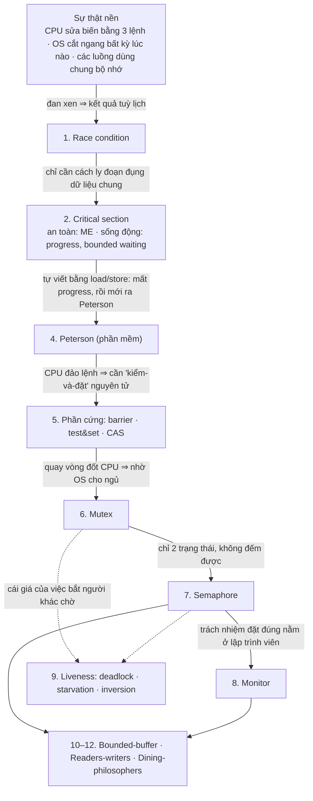
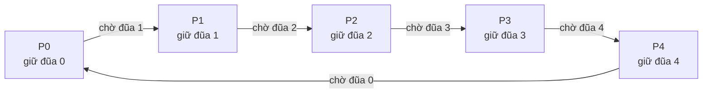
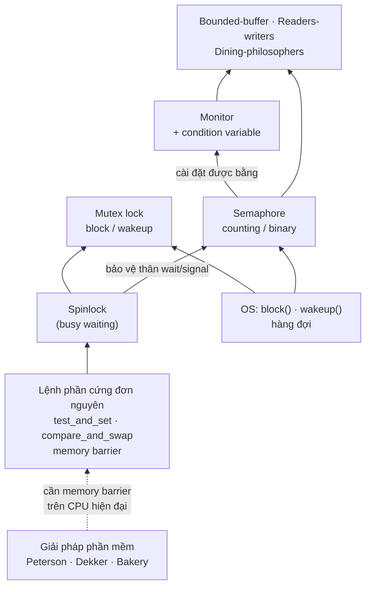

# L05 — Process synchronization (Đồng bộ tiến trình)

| | |
|---|---|
| Môn | `IT007` Hệ điều hành |
| Buổi | 5 — tổng hợp **toàn bộ chương 5** theo yêu cầu người dùng |
| Ngày | Không gán |
| Giảng viên | Nguyễn Thanh Thiện |
| Transcript | Không có; note dựa trên ba bộ slide bên dưới |
| Code | [`../code/L05/`](../code/L05/) — hai file C chạy được + một script Python kiểm chứng các giải thuật ở mục 3 |

> Không có transcript nên note **chỉ phản ánh slide**: không bắt được lời giảng viên
> nói thêm, ví dụ ngoài slide hay gợi ý thi. Phần "gốc rễ", analogy, ví dụ nhỏ, code, bài tập
> tự đặt và các đoạn "trong production" là phần bổ sung, không phải lời giảng.
> Theo lịch ở slide chương 0, chương 5 rải trên buổi 5–6 [C0 s9–s10]; `L05` là số
> note, không khẳng định cả chương được dạy trong một buổi.

> **Cấu trúc mỗi mục:** 📚 **Lý thuyết** (gốc rễ → định nghĩa học thuật) → 💡 **Giải thích dễ hiểu**
> (trực giác, analogy, ví dụ nhỏ nhất, hình) → 💻 **Code & thực tế** → ✍️ **Bài tập** (kèm 🔑 kiến thức
> mở khoá bài đó). Mục phụ được rút gọn và ghi rõ. Xem quy tắc ở `.claude/skills/new-lecture/SKILL.md`, Bước 5.

---

## Mục lục

- [Nguồn và cách đọc](#nguồn-và-cách-đọc)
- [Tóm tắt một đoạn](#tóm-tắt-một-đoạn)
- [Gốc rễ của cả chương](#gốc-rễ-của-cả-chương)
- [Nội dung chính](#nội-dung-chính)
  - [1. Race condition — vì sao phải đồng bộ](#1-race-condition--vì-sao-phải-đồng-bộ)
  - [2. Critical section và 3 yêu cầu của lời giải](#2-critical-section-và-3-yêu-cầu-của-lời-giải)
  - [3. Phân loại giải pháp](#3-phân-loại-giải-pháp)
  - [4. Giải pháp phần mềm: turn, flag, Peterson](#4-giải-pháp-phần-mềm-turn-flag-peterson)
  - [5. Hỗ trợ từ phần cứng: memory barrier](#5-hỗ-trợ-từ-phần-cứng-memory-barrier)
  - [6. Mutex locks](#6-mutex-locks)
  - [7. Semaphore](#7-semaphore)
  - [8. Monitor và condition variable](#8-monitor-và-condition-variable)
  - [9. Liveness: deadlock, starvation, priority inversion](#9-liveness-deadlock-starvation-priority-inversion)
  - [10. Bài toán bounded-buffer](#10-bài-toán-bounded-buffer)
  - [11. Bài toán readers-writers](#11-bài-toán-readers-writers)
  - [12. Bài toán dining-philosophers](#12-bài-toán-dining-philosophers)
- [Bảng tổng hợp](#bảng-tổng-hợp)
- [Sơ đồ](#sơ-đồ)
- [Quy trình giải bài đồng bộ bằng semaphore](#quy-trình-giải-bài-đồng-bộ-bằng-semaphore)
- [Chỗ cần lưu ý khi đối chiếu nguồn](#chỗ-cần-lưu-ý-khi-đối-chiếu-nguồn)
- [Gợi ý thi và deadline phát sinh](#gợi-ý-thi-và-deadline-phát-sinh)
- [Liên kết](#liên-kết)
- [Tự kiểm tra](#tự-kiểm-tra)

---

## Nguồn và cách đọc

Số slide là **trang PDF, bắt đầu từ 1**. Nhãn `[C5-2 s16]` = bộ C5-2, slide 16.

| Mã | Tài liệu gốc | Phạm vi |
|---|---|---|
| C5-1 | [Copy of #Week07-Chapter5-1 2024.pdf](../materials/slides/Copy%20of%20%23Week07-Chapter5-1%202024.pdf) | 58 slide: 5.1 race condition → 5.5 hỗ trợ phần cứng |
| C5-2 | [Copy of #Week09-Chapter5-2 2024.pdf](../materials/slides/Copy%20of%20%23Week09-Chapter5-2%202024.pdf) | 55 slide: 5.6 mutex → 5.8 monitor, Appendix A liveness |
| C5-3 | [Copy of #Week10-Chapter5-3 2024.pdf](../materials/slides/Copy%20of%20%23Week10-Chapter5-3%202024.pdf) | 32 slide: 5.9 bounded-buffer, 5.10 readers-writers, 5.11 dining-philosophers |
| C0 | [Copy of #Week01-Chapter0.pdf](../materials/slides/Copy%20of%20%23Week01-Chapter0.pdf) | Lịch buổi học |

Mục 1–5 trả lời **vấn đề là gì và cần gì để giải**; mục 6–8 là **công cụ** hệ điều
hành cung cấp; mục 9 là **cái giá** khi dùng sai công cụ; mục 10–12 là **ba bài kinh
điển** để luyện áp dụng công cụ. C5-3 có nhiều code dưới dạng hình; phần đó đã được
đọc bằng cách render slide.

**Nhãn nguồn trong bài tập:** `slide` = có trong slide · `đề mẫu câu n` = dạng câu của đề mẫu
([`exam-map.md`](../exam-prep/exam-map.md), **đề đã viết lại**, không chép nguyên văn) · `tự đặt` = bài mình đặt, **đáp án đã kiểm
bằng code hoặc tính tay hai lần**.

## Tóm tắt một đoạn

Khi nhiều tiến trình/thread cùng sửa một dữ liệu chung, kết quả phụ thuộc vào thứ tự
chạy mà không ai kiểm soát được — đó là race condition. Cách chữa là biến đoạn code
đụng dữ liệu chung (critical section) thành "mỗi lúc một người", và lời giải nào cũng
phải đạt đủ ba yêu cầu: mutual exclusion, progress, bounded waiting. Giải pháp phần
mềm như Peterson đạt đủ ba nhưng phải busy waiting và hỏng trên CPU hiện đại do sắp
xếp lại lệnh; vì vậy hệ điều hành cung cấp công cụ cấp cao hơn: mutex lock, semaphore
(đếm tài nguyên, cho phép ngủ thay vì quay vòng) và monitor. Dùng sai các công cụ này
sinh ra lỗi liveness — deadlock, starvation, priority inversion. Ba bài bounded-buffer,
readers-writers, dining-philosophers là khuôn mẫu cho gần như mọi bài đồng bộ.

## Gốc rễ của cả chương

Cả chương là **một chuỗi hệ quả** mọc từ đúng một gốc: *nhiều luồng xen kẽ trên bộ nhớ dùng chung*.
Mỗi công cụ ra đời để vá đúng chỗ hở của công cụ trước — đọc theo mũi tên, mỗi nhãn là **"vì sao phải có cái tiếp theo"**.



---

## Nội dung chính

### 1. Race condition — vì sao phải đồng bộ

#### 📚 Lý thuyết

**Gốc rễ (first principles).** *Phần suy luận không có trong slide gắn nhãn `ngoài slide`.*

- **Ngữ cảnh:** nhiều tiến trình/thread cùng tồn tại trong một hệ thống. Hệ điều hành chia CPU cho chúng ([L04](L04-cpu-scheduling.md)) hoặc chúng chạy song song trên nhiều core; các thread trong một tiến trình còn dùng chung bộ nhớ ([L03](L03-process-management.md)).
- **Vấn đề gốc:** ta muốn chương trình cho kết quả **xác định** — cùng đầu vào, cùng đầu ra. Nhưng khi hai luồng cùng sửa một biến, kết quả có thể tuỳ "hôm nay CPU chia lịch thế nào".
- **Những sự thật nền:**
  1. CPU không sửa thẳng một ô nhớ: `count++` là **3 lệnh máy** — load → tính trên thanh ghi → store [C5-1 s11].
  2. Bộ lập lịch có thể cắt ngang **giữa hai lệnh bất kỳ**, và trên nhiều core thì hai luồng chạy thật sự cùng lúc; luồng **không có quyền** quyết định thứ tự. *(ngoài slide)*
  3. Biến chung nằm ở một ô nhớ mà mọi luồng cùng thấy.
- **Suy luận:** (1) + (2) ⇒ ba lệnh của luồng này **xen kẽ** với ba lệnh của luồng kia. Với `count++` và `count--` có C(6,3) = **20** cách xen kẽ, chỉ **2** cách cho kết quả đúng (5); 9 cách cho 4 và 9 cách cho 6 *(tự đếm bằng code)*. (3) ⇒ luồng ghi sau cùng **đè** kết quả của luồng kia. Vậy kết quả **phụ thuộc thứ tự thực thi** — đó là **race condition**: hệ quả tất yếu của ba sự thật trên, không phải một lỗi ngẫu nhiên.
- **Nếu không có khái niệm này thì sao?** ta không giải thích được vì sao chương trình chạy đúng 999 lần rồi sai lần thứ 1000: lỗi chỉ hiện ở lịch xen kẽ hiếm, và biến mất khi bật debugger.

**Định nghĩa hình thức** [C5-1 s15–s16]

> **Race condition** là hiện tượng xảy ra khi các tiến trình cùng truy cập đồng thời vào
> dữ liệu được chia sẻ. Kết quả cuối cùng phụ thuộc vào thứ tự thực thi của các tiến
> trình đang chạy đồng thời. Race condition có thể làm dữ liệu sai và không nhất quán
> (inconsistency).

**Điều kiện · tính chất:**
- Cần **đủ bốn điều kiện** *(ngoài slide)*: ≥ 2 luồng · có dữ liệu dùng chung · ít nhất một luồng **ghi** · thao tác đọc-sửa-ghi **không nguyên tử**. Thiếu một điều kiện thì không có race condition (chỉ đọc thì không race).
- **Race condition là hiện tượng; data inconsistency là hậu quả** [C5-1 s16]. Đừng lẫn với critical section (một đoạn code, mục 2) hay mutual exclusion (một cách chữa).

#### 💡 Giải thích dễ hiểu

**Trực giác:** hai người cùng sửa một con số mà không hẹn trước, người sau ghi đè
kết quả của người trước.

**Analogy:** hai thu ngân cùng cập nhật số hàng tồn trên một tờ giấy. Người A đọc "5",
người B cũng đọc "5"; A nhập thêm 1 hàng ghi "6", B bán 1 hàng ghi "4". Thực tế tồn
kho vẫn là 5, nhưng tờ giấy ghi 4.
*Chỗ analogy vỡ:* hai thu ngân **thấy nhau** đang cầm bút và có thể ngừng lại; CPU thì **không biết** luồng kia đang ở giữa chừng — nó chỉ chạy lệnh. Việc "báo cho nhau" phải do lập trình viên dựng lên bằng công cụ ở mục 6–8.

**Ví dụ nhỏ nhất** [C5-1 s11]: `count = 5`. `count++` thật ra là 3 lệnh máy
(load → inc → store), `count--` cũng vậy. Nếu quantum = 2 chu kỳ:

```
T1 Producer: reg1 = count      (reg1 = 5)
T2 Producer: reg1 = reg1 + 1   (reg1 = 6)
T3 Consumer: reg2 = count      (reg2 = 5)   ← đọc giá trị cũ
T4 Consumer: reg2 = reg2 - 1   (reg2 = 4)
T5 Producer: count = reg1      (count = 6)
T6 Consumer: count = reg2      (count = 4)  ← sai, đúng phải là 5
```

Với quantum = 3 chu kỳ, mỗi bên chạy trọn 3 lệnh nên ra đúng 5. **Cùng code, khác lịch
chạy, khác kết quả** — đó là dấu hiệu nhận biết race condition. Ví dụ thứ hai trong slide
là hai tiến trình cùng `fork()` và cùng lấy `next_available_pid`, dẫn đến một PID bị cấp
cho hai tiến trình con [C5-1 s13].

> 💬 *Bổ sung từ phiên gia sư 2026-09-23*
>
> **Đọc bảng T1–T6 như chuyện "bảng trắng + giấy nháp".** CPU không sửa thẳng con số
> trong bộ nhớ. Mỗi nhân viên có một tờ giấy nháp riêng (thanh ghi `reg1`, `reg2`) và muốn
> sửa số trên bảng (biến `count`) thì phải làm 3 bước: **chép** số trên bảng vào nháp
> (`load`) → **tính** trên nháp (`inc`/`dec`) → **ghi** nháp đè lên bảng (`store`).
> Quantum là số bước mỗi người được làm trước khi bị gọi đi, và người đó mang giấy nháp theo.
>
> | Lúc | Ai | Việc | Giấy nháp | Bảng |
> |---|---|---|---|---|
> | T1 | Producer | chép | P: 5 | 5 |
> | T2 | Producer | cộng 1 | P: 6 | 5 |
> | T3 | Consumer | chép | C: **5** ← bảng vẫn là 5 | 5 |
> | T4 | Consumer | trừ 1 | C: 4 | 5 |
> | T5 | Producer | ghi | | 6 |
> | T6 | Consumer | ghi, **đè mất số 6** | | **4** ❌ |
>
> **Mấu chốt nằm ở khoảng giữa lúc đọc và lúc ghi.** Consumer **đọc lúc T3** nhưng **ghi
> lúc T6**. Ở giữa, T5 đã đổi bảng thành 6, còn Consumer vẫn cầm số cũ (stale) và ghi đè
> lên. Race condition xảy ra khi giữa lúc đọc và lúc ghi của một bên, bên kia chen vào sửa
> dữ liệu. Cách chữa là làm cho ba bước chép → tính → ghi **liền một mạch**, tức là biến
> chúng thành critical section (mục 2).
>
> Chỗ dễ nhầm: hỏi "Consumer lấy số 5 lúc nào" thì đáp án là lúc **đọc** (T3), không phải
> lúc **ghi** (T6).

> 💬 *Bổ sung từ phiên gia sư 2026-09-24*
>
> **Vì sao `count++` là 3 lệnh — CPU không sửa thẳng một ô nhớ.**
> - **Trực giác:** CPU chỉ tính toán được trên vài "ô nháp" nằm ngay trong nó (thanh ghi). RAM ở xa
>   và chậm hơn nhiều lần, nên muốn sửa một biến phải chép nó vào ô nháp, sửa ở đó, rồi chép ngược lại.
> - **Analogy:** đầu bếp chỉ thái được trên thớt (thanh ghi), nguyên liệu nằm trong kho (RAM). Thêm 1 quả
>   trứng vào số trứng trong kho = **lấy số trứng ra thớt → cộng thêm → mang trả về kho**. Giữa ba bước
>   đó, đầu bếp khác có thể vào kho và thấy số cũ.
>
> ```
> mov eax, [count]    ; 1. load   — chép count từ RAM vào thanh ghi
> add eax, 1          ; 2. tính   — cộng trên thanh ghi (RAM chưa hề đổi)
> mov [count], eax    ; 3. store  — ghi thanh ghi đè lên RAM
> ```
>
> Mấu chốt: **giữa bước 1 và bước 3, `count` trong RAM vẫn là số cũ** — đó là khoảng hở mà luồng kia chen vào.
> *Ngoài slide:* trên x86 có lệnh `inc [count]` trông như một lệnh, nhưng bên trong phần cứng vẫn làm đủ
> đọc → cộng → ghi, và **không nguyên tử** giữa nhiều core nếu không có tiền tố `lock`. Vì vậy "3 lệnh"
> là mô hình đúng về bản chất, không phải chi tiết của một máy cụ thể.
>
> **"Một lệnh" ≠ "nguyên tử".** Giả sử `count++` chỉ là đúng một lệnh máy:
>
> | | Chuyện xảy ra | Còn race condition? |
> |---|---|:-:|
> | **Một core** | Ngắt và chuyển luồng chỉ xảy ra **giữa hai lệnh**, không giữa một lệnh → lệnh chạy trọn vẹn rồi mới đến luồng kia | ❌ không |
> | **Hai core** | Hai core chạy **thật sự cùng lúc**; mỗi core đang làm đọc → cộng → ghi trên cùng một ô nhớ, hai quá trình **chồng lên nhau** | ✅ vẫn có |
>
> Trên hai core: cả hai cùng đọc 5; core 1 tính 6, core 2 tính 4; ai ghi sau thì thắng (RAM cuối là 4 hoặc 6, không phải 5).
> "Một lệnh" chỉ chống được việc **bị ngắt giữa chừng trên cùng một core**. **Nguyên tử** thật sự còn đòi phần
> cứng **khoá ô nhớ** để core khác không chen được (tiền tố `lock` trên x86, hoặc `test_and_set` /
> `compare_and_swap` ở mục 5–6) — đây là nền cho cả phần mutex phía sau.

**Minh hoạ:** cùng lịch T1–T6 vẽ theo trục thời gian — nhìn thấy ngay hai đoạn "đọc → ghi" **chồng lên nhau**:

```
Thời gian →   T1     T2     T3     T4     T5     T6
Producer:    load    +1                   store
Consumer:                   load   −1            store
Bảng count:   5      5      5      5      6      4      ← số cuối là 4, đúng phải là 5
                           ▲ đọc số cũ (5)          ▲ ghi đè, mất số 6
              └──── đoạn nguy hiểm của Producer ────┘
                           └──── đoạn nguy hiểm của Consumer ─────┘   (hai đoạn chồng nhau)
```

#### 💻 Code & thực tế

[`../code/L05/race-condition.c`](../code/L05/race-condition.c):

```c
#define N 1000000
int count = 5;

void *producer(void *arg) { for (int i = 0; i < N; i++) count++; return NULL; }
void *consumer(void *arg) { for (int i = 0; i < N; i++) count--; return NULL; }
// main: tạo 2 thread, join, in count
```

```
$ gcc -O0 -pthread race-condition.c -o race && ./race
count = -252492 (kỳ vọng 5)       ← mỗi lần chạy một số khác
$ gcc -O0 -pthread -DUSE_MUTEX race-condition.c -o race && ./race
count = 5 (kỳ vọng 5)
```

> **Trong production** *(ngoài slide)*: đây chính là lỗi "lost update" — hai request cùng
> `SELECT balance` rồi `UPDATE balance = ...`. Database giải bằng đúng tư tưởng của
> chương này: khoá dòng (`SELECT ... FOR UPDATE`) hoặc phép cập nhật nguyên tử
> (`UPDATE ... SET balance = balance - 1`).

#### ✍️ Bài tập

**Bài 1** *(Nhớ)* — *đề mẫu câu 17, đề viết lại.* Hiện tượng nào sau đây mô tả **"kết quả phụ thuộc vào thứ tự thực thi của các tiến trình cùng truy cập dữ liệu chung"**: (a) critical section · (b) mutual exclusion · (c) race condition · (d) data inconsistency?

> 🔑 **Kiến thức mở khoá:** bốn thuật ngữ đóng **bốn vai khác nhau** — *hiện tượng* (race condition), *hậu quả* (data inconsistency), *đoạn code* (critical section), *cách chữa* (mutual exclusion). Câu hỏi mô tả **hiện tượng**, và định nghĩa [C5-1 s15] dùng đúng cụm "kết quả phụ thuộc thứ tự thực thi".

<details><summary>Hướng giải</summary>

Đáp án **(c)**. Loại (a): CS là đoạn code, không phải hiện tượng. Loại (b): ME là yêu cầu/cách chữa. Loại (d): inconsistency là hậu quả, không nói gì đến "thứ tự thực thi".

</details>

**Bài 2** *(Vận dụng)* — *tự đặt.* `count = 0`; hai thread cùng chạy **một lần** `count++` (mỗi lần 3 lệnh load/inc/store). Kết quả cuối có thể là những giá trị nào?

> 🔑 **Kiến thức mở khoá:** *"mấu chốt nằm ở khoảng giữa lúc đọc và lúc ghi"* — chỉ cần cả hai **đọc trước khi bất kỳ ai ghi** là cả hai cùng thấy số cũ.

<details><summary>Hướng giải</summary>

Đáp án **{1, 2}**. Chạy nối tiếp (một thread trọn 3 lệnh rồi tới thread kia) → 2. Nếu T1 load 0, T2 load 0, T1 store 1, T2 store 1 → **1**, mất một lần cộng (*lost update*). Đếm cả 20 cách xen kẽ: 2 cách ra 2, 18 cách ra 1 *(đã kiểm bằng code)*.

</details>

**Bài 3** *(Phân tích)* — *tự đặt.* API rút tiền: mỗi request làm `SELECT balance` rồi `UPDATE balance = <số vừa đọc> − 10`. `balance = 100`, 3 request đến đồng thời. Số dư cuối có thể là bao nhiêu? Cái nào đúng?

> 🔑 **Kiến thức mở khoá:** cùng mẫu **đọc → sửa → ghi không nguyên tử** ở mục 1; "số vừa đọc" chính là *giá trị cũ (stale)* của Consumer ở T3. Điều kiện 3 (có luồng ghi) và 4 (không nguyên tử) đều thoả.

<details><summary>Hướng giải</summary>

Kết quả có thể là **70, 80 hoặc 90**; chỉ **70** đúng (3 × 10 = 30). Nếu cả ba cùng đọc 100 trước khi ai ghi thì ai ghi sau cùng cũng ghi 90. Cách chữa: `UPDATE ... SET balance = balance - 10` (cập nhật nguyên tử trong DB) hoặc khoá dòng khi đọc — đều là "làm cho đọc → tính → ghi liền một mạch".

</details>

**Chốt mục:** race condition = *kết quả phụ thuộc lịch chạy*; lỗi nằm ở **khoảng giữa đọc và ghi**. Bẫy thi: nhầm hiện tượng (race condition) với hậu quả (inconsistency) hay với cách chữa (ME).

### 2. Critical section và 3 yêu cầu của lời giải

#### 📚 Lý thuyết

**Gốc rễ (first principles).**

- **Ngữ cảnh:** ta đã biết đan xen sinh race condition (mục 1). Nhưng không thể cấm mọi đan xen — làm thế là mất luôn lợi ích của việc chạy song song.
- **Vấn đề gốc:** tìm một luật **tối thiểu** chỉ chặn đan xen ở đúng chỗ nguy hiểm.
- **Những sự thật nền:**
  1. Đan xen chỉ nguy hiểm ở đoạn code **đụng dữ liệu chung**; phần code còn lại độc lập, cho chạy song song thoải mái.
  2. Cách duy nhất để hai luồng không phá nhau ở đoạn đó là bảo đảm **khi một luồng đang ở trong, luồng khác không được ở trong**.
  3. Luật (2) **tự nó quá dễ thoả**: "không ai được vào bao giờ" cũng thoả — và vô dụng. *(ngoài slide)*
- **Suy luận:** (1) + (2) ⇒ **khoanh vùng** đoạn code đó và gọi là *critical section*; luật (2) là **mutual exclusion**. (3) ⇒ luật (2) chưa đủ, phải thêm điều kiện buộc hệ thống **thực sự tiến lên**: *nếu CS trống và có người muốn vào thì phải có người vào* (**progress**), và *không ai bị bỏ rơi mãi* (**bounded waiting**). Đến đây ta đã **tự suy ra** ba yêu cầu của slide: **một yêu cầu an toàn** (không phá nhau) + **hai yêu cầu sống động** (không kẹt mãi). Cặp *an toàn / sống động* (safety / liveness) sẽ quay lại ở mục 9.
- **Nếu thiếu yêu cầu nào?** thiếu ME → race condition. Thiếu progress → cửa bị chặn dù phòng trống. Thiếu bounded waiting → một tiến trình đói vô hạn.

**Định nghĩa hình thức** [C5-1 s18, s21–s25]

> **Critical section (vùng tranh chấp)** là đoạn code mà tiến trình thay đổi dữ liệu
> được chia sẻ. Lời giải cho bài toán vùng tranh chấp phải đảm bảo **3 yêu cầu**:
> 1. **Mutual exclusion (loại trừ tương hỗ):** khi P đang thực thi trong CS của nó thì
>    không có tiến trình Q nào khác đang thực thi trong CS của Q.
> 2. **Progress (tiến triển):** một tiến trình tạm dừng bên ngoài CS không được ngăn
>    cản các tiến trình khác vào CS.
> 3. **Bounded waiting (chờ đợi giới hạn):** mỗi tiến trình chỉ phải chờ vào CS trong
>    một khoảng thời gian có hạn định. Không xảy ra starvation (đói tài nguyên).

**Cấu trúc và tính chất:** mọi tiến trình có dạng entry → CS → exit → remainder [C5-1 s19]. Slide gắn thêm: P chờ điều kiện từ Q trong khi Q cũng chờ điều kiện từ P để vào CS thì gọi là **deadlock** — một dạng vi phạm progress [C5-1 s24].

> ⚠️ Đề mẫu cuối kỳ có câu cho 4 phát biểu và hỏi cái nào là "chờ đợi giới hạn"; phát
> biểu nhiễu là "tiến trình chưa được vào phải từ bỏ CPU" — không phải yêu cầu nào cả.
> Xem [`../exam-prep/exam-map.md`](../exam-prep/exam-map.md) câu 2.

#### 💡 Giải thích dễ hiểu

**Trực giác:** khoanh vùng đoạn code đụng dữ liệu chung, rồi đặt luật "mỗi lúc chỉ
một người vào" — nhưng luật đó không được làm ai kẹt mãi bên ngoài.

**Analogy:** phòng thử đồ có một buồng. (1) **[ME]** Có người trong buồng thì người khác không
vào. (2) **[Progress]** Buồng trống thì người đang đứng ngoài hàng — không muốn thử đồ — không được
chặn cửa người khác. (3) **[Bounded waiting]** Không ai phải đợi vô hạn vì cứ bị người khác chen lên.
*Chỗ analogy vỡ:* ngoài đời khách tự giác xếp hàng; máy tính **không có sự tự giác** — mỗi luật trên phải được ép bằng cơ chế cụ thể (mục 4–7).

**Ví dụ nhỏ nhất:** P0, P1 cùng tăng `count`. Critical section (CS) là dòng `count++`.
Mọi tiến trình có dạng [C5-1 s19]:

```
while (1) {
    entry section       ← xin phép vào
        critical section
    exit section        ← báo đã ra
        remainder section
}
```

**Minh hoạ:** ba luật trên trục thời gian — thanh `███` là lúc đang trong CS:

```
Đúng (ME):      P0: ░░░░███░░░░░░░░░░        Hai thanh KHÔNG bao giờ chồng nhau
                P1: ░░░░░░░░███░░░░░░

Sai (vi phạm    P0: ░░░░███░░░░░░░░░░        Hai thanh chồng nhau ⇒ race condition
 ME):           P1: ░░░░░██░░░░░░░░░░
                          ▲ cùng ở trong CS

Vi phạm progress: P1 đang ở remainder section (░░░), cửa CS trống,
                  nhưng P0 muốn vào vẫn bị chặn ▶ ▶ ▶ ✗
```

**Ba yêu cầu, mỗi yêu cầu một hình ảnh** — so ba yêu cầu cạnh nhau để khỏi lẫn:

| Yêu cầu | Nói bằng lời thường | Bị vi phạm khi | Ở phòng thử đồ |
|---|---|---|---|
| **Mutual exclusion** | Trong CS mỗi lúc chỉ một người | Hai tiến trình cùng ở trong CS | Hai người cùng vào một buồng |
| **Progress** | CS trống mà có người muốn vào thì **phải có người vào**; người ở ngoài không muốn vào thì **không được cản** | Tiến trình **ngoài CS** vẫn chặn được người khác | Người đứng ngoài hàng, đang lướt điện thoại, vẫn giữ "lượt" nên người kia không vào được dù buồng trống |
| **Bounded waiting** | Đã xin vào thì chỉ phải chờ **một khoảng có hạn** — người khác không được vượt mặt mình mãi | Một tiến trình **bị vượt liên tục**, chờ vô hạn (**starvation** — đói tài nguyên) | Nhân viên liên tục cho khách quen chen ngang, bạn xếp hàng mãi không tới lượt |

**Ví dụ nhỏ nhất cho bounded waiting.** P0 và P1 cùng lặp đi lặp lại "vào CS → ra → xin vào lại". P0 xin vào từ lượt đầu, nhưng mỗi lần CS trống lại đúng lúc P1 xin lại và thắng cuộc đua:

```
Vi phạm bounded waiting:
  P0:  ░░ xin vào ░░░░░░░░░░░░░░░░░░░░░░░░░░░░░░ …   (chờ mãi, chưa bao giờ vào)
  P1:  ███ ░ ███ ░ ███ ░ ███ ░ ███ ░ ███ …          (vào CS hết lần này đến lần khác)

  ✔ ME đạt      — không lúc nào hai người cùng trong CS
  ✔ Progress đạt — CS trống lúc nào cũng có người vào (là P1)
  ✘ Bounded waiting vi phạm — P0 bị vượt vô hạn lần

Thoả bounded waiting (như Peterson, mục 4):
  P0:  ░░ xin vào ░░░░░░░░░ ███
  P1:  ███ ░░░░░░░░░░░░░░░░░ …    (P1 chỉ được chen tối đa 1 lần rồi phải nhường P0)
```

Bài học: **progress đảm bảo "có người nào đó vào"; bounded waiting đảm bảo "người nào xin cũng sẽ vào".** Một lời giải có thể đạt progress mà vẫn vi phạm bounded waiting (như ví dụ trên). Cách nói chuẩn của giáo trình *(ngoài slide)*: sau khi một tiến trình đã xin vào CS, **số lần** các tiến trình khác được vào trước nó **có một cận trên hữu hạn**. Slide [C5-1 s25] diễn đạt là "chỉ phải chờ trong một khoảng thời gian có hạn định".

> 💬 *Bổ sung từ phiên gia sư 2026-09-24*
>
> **Thế nào là "tiến trình thay đổi dữ liệu được chia sẻ"?** **Dữ liệu chia sẻ** là dữ liệu mà từ hai
> luồng/tiến trình trở lên cùng truy cập được. **Thay đổi** là có **ghi** vào nó, kể cả kiểu đọc → sửa → ghi
> như `count++`. Critical section là **đoạn code** làm cả hai việc đó; dữ liệu chia sẻ là thứ nó đụng vào.
> Hai câu hỏi để nhận biết: (1) ô nhớ/file này có luồng khác cùng truy cập không? (2) đoạn code này có ghi
> vào nó không? Cả hai "có" thì đó là critical section.
>
> | Đoạn code | Dữ liệu chia sẻ? | Là CS? |
> |---|---|---|
> | `count++` với `count` là biến toàn cục, hai thread cùng chạy | ✅ | ✅ |
> | `x++` với `x` là biến cục bộ trong hàm | ❌ mỗi thread có stack riêng | ❌ |
> | Hai tiến trình `fork()` cùng đọc và tăng `next_available_pid` trong kernel [C5-1 s13] | ✅ biến của kernel | ✅ |
> | Hai tiến trình cùng ghi vào **một** file log | ✅ | ✅ |
> | Hai tiến trình mỗi bên ghi vào file **riêng** | ❌ | ❌ |
> | Hai request cùng `UPDATE balance` trên **một** dòng DB | ✅ | ✅ |
> | Thread `t` chỉ ghi `a[t]++`, mỗi thread một phần tử riêng | ❌ không ai đụng ô của ai | ❌ |
> | Chỉ **đọc** `count`, không ai ghi | ✅ nhưng không ai thay đổi | ❌ theo định nghĩa của slide |
>
> **Hai chi tiết hay nhầm:**
> - Tiến trình có bộ nhớ **riêng**; chúng chỉ chia sẻ qua shared memory, file, hoặc cấu trúc của kernel.
>   Còn các **thread trong cùng một tiến trình** thì tự chia sẻ biến toàn cục và vùng heap *(ngoài slide)*.
> - Chỉ đọc thì an toàn, **nhưng nếu lúc đó có luồng khác đang ghi** thì có thể đọc phải số nửa vời —
>   lý do có bài readers-writers ở mục 11.

#### 💻 Code & thực tế

Không áp dụng — mục này là **đặc tả** (cần đạt gì), chưa phải cách làm. Cách làm ở mục 4–7.

> **Trong production** *(ngoài slide)*: khi review code đa luồng, câu hỏi đầu tiên luôn là *"đoạn nào là critical section?"* — khoanh sai vùng là nguồn lỗi phổ biến nhất (quá rộng → chậm; quá hẹp → vẫn race).

#### ✍️ Bài tập

**Bài 1** *(Nhớ)* — *đề mẫu câu 2, đề viết lại.* Phát biểu nào mô tả đúng **bounded waiting**? (a) tiến trình chưa được vào CS phải từ bỏ CPU · (b) mỗi tiến trình chỉ phải chờ vào CS trong khoảng thời gian có hạn · (c) tiến trình ngoài CS không được ngăn tiến trình khác vào · (d) không hai tiến trình nào cùng ở trong CS.

> 🔑 **Kiến thức mở khoá:** ba yêu cầu có **ba định nghĩa khác nhau** [C5-1 s21–s25]: (d) = ME, (c) = progress, (b) = bounded waiting; phát biểu (a) **không thuộc yêu cầu nào**. Xem bảng *Ba yêu cầu, mỗi yêu cầu một hình ảnh* ở phần 💡 để thấy khác nhau ở đâu.

<details><summary>Hướng giải</summary>

Đáp án **(b)**. Cách làm: ghép **từng** phát biểu về đúng yêu cầu của nó rồi loại.

| | Phát biểu | Thực ra là | Vì sao **không phải** bounded waiting |
|---|---|---|---|
| (a) | Chưa được vào CS thì phải từ bỏ CPU | **Không phải yêu cầu nào** | Đây là *cách một tiến trình chờ*, không phải tính chất của lời giải. Peterson chờ bằng vòng `while` (không nhả CPU) mà vẫn đạt đủ 3 yêu cầu, nên "từ bỏ CPU" không thể là yêu cầu |
| (b) | Chỉ phải chờ vào CS trong khoảng thời gian **có hạn** | **Bounded waiting** ✅ | — |
| (c) | Tiến trình **ngoài** CS không được ngăn tiến trình khác vào | **Progress** | Nói về *ai đang chặn* (người không liên quan đến CS), không nói gì về *chờ bao lâu*. Có thể đạt (c) mà vẫn vi phạm bounded waiting: P1 thắng mãi, P0 chờ vô hạn dù chẳng ai ở ngoài CS mà cản (ví dụ ở phần 💡) |
| (d) | Không hai tiến trình nào **cùng** ở trong CS | **Mutual exclusion** | Nói về *số người ở trong CS cùng lúc*, không nói gì về thời gian chờ. "Khoá cửa vĩnh viễn" cũng thoả (d) nhưng ai cũng chờ mãi (bài 2) |

**Mẹo phân biệt theo từ khoá:** *"chờ … có hạn / bao lâu"* → bounded waiting · *"ngoài CS … không được cản"* → progress · *"không hai … cùng lúc"* → mutual exclusion. Mỗi phương án trả lời một câu hỏi khác nhau: (d) hỏi *"ai ở trong?"*, (c) hỏi *"ai đang cản?"*, (b) hỏi *"chờ bao lâu?"*.

</details>

**Bài 2** *(Hiểu)* — *tự đặt.* Lời giải "**khoá cửa vĩnh viễn**: không tiến trình nào được vào CS" thoả và vi phạm yêu cầu nào trong ba yêu cầu?

> 🔑 **Kiến thức mở khoá:** ở phần gốc rễ, sự thật (3): ME **một mình** quá dễ thoả — nên phải thêm hai yêu cầu *sống động*.

<details><summary>Hướng giải</summary>

**Thoả ME** (không bao giờ có hai tiến trình cùng trong CS — vì không ai vào). **Vi phạm progress** (CS trống, có người muốn vào mà không ai được vào) và **bounded waiting** (chờ vô hạn). Bài này cho thấy vì sao phải có *cả ba*.

</details>

**Bài 3** *(Phân tích)* — *tự đặt.* Một lời giải dùng biến chung `lock = 0`: `while (lock == 1); lock = 1; /* CS */ lock = 0;`. Nó có đạt mutual exclusion không? Nêu lịch chạy cụ thể.

> 🔑 **Kiến thức mở khoá:** `lock` **cũng là dữ liệu chung**, nên việc *kiểm tra rồi gán* nó cũng là đọc → ghi không nguyên tử — **race condition (mục 1) xảy ra ngay trên chiếc khoá**.

<details><summary>Hướng giải</summary>

**Không đạt ME.** Lịch: P0 kiểm tra `lock == 1` → sai, thoát vòng `while`, **bị ngắt trước khi gán**. P1 kiểm tra (`lock` vẫn 0), gán `lock = 1`, vào CS. P0 chạy tiếp, gán `lock = 1` rồi **cũng vào CS** → hai tiến trình cùng trong CS. Kết luận: cần thao tác **kiểm-và-đặt nguyên tử** — phần cứng cung cấp ở mục 5 và mutex dùng ở mục 6.

</details>

**Chốt mục:** 3 yêu cầu = **ME** (an toàn) + **progress, bounded waiting** (sống động). Bẫy thi: phương án "từ bỏ CPU" không phải yêu cầu nào; khoá bằng biến thường vẫn race.

### 3. Phân loại giải pháp

*(đề mẫu chỉ hỏi 1 câu về phân loại, nhưng các giải pháp được gọi tên ở đây là nền cho mục 4–6 nên mục này được đi sâu)*

#### 📚 Lý thuyết

**Gốc rễ (first principles).** Muốn hiện thực "mỗi lúc một người" thì phải trả lời hai câu độc lập:
1. **Ai bảo đảm nguyên tử?** CPU thường chỉ cho `load`/`store` từng ô; muốn hơn thế phải có **lệnh phần cứng đặc biệt** *(ngoài slide)* ⇒ trục 1: *chỉ dùng kỹ thuật lập trình* ↔ *nhờ phần cứng*.
2. **Chờ bằng cách nào?** hoặc **quay vòng hỏi liên tục** (đốt CPU), hoặc **đi ngủ và nhờ hệ điều hành đánh thức** — mà ngủ thì cần OS làm bộ lập lịch ⇒ trục 2: *busy waiting* ↔ *sleep & wake up*.

**Định nghĩa hình thức** [C5-1 s27–s28]

| Tiêu chí | Nhóm 1 | Nhóm 2 |
|---|---|---|
| Hỗ trợ phần cứng | **Giải pháp phần mềm** (giải pháp dựa trên ngắt): chỉ dùng kỹ thuật lập trình — Peterson, Bakery, Dekker | **Giải pháp phần cứng**: cần lệnh đơn nguyên đặc biệt — Test & Set, Compare & Swap |
| Hỗ trợ hệ điều hành | **Busy waiting**: không cần OS, tiến trình liên tục kiểm tra điều kiện | **Sleep & Wake up**: OS cung cấp system call `block` (cho ngủ) và `wakeup` (đánh thức) |

Giải pháp đơn giản nhất — **cấm ngắt** ở entry section, bật lại ở exit section — bị slide
đặt câu hỏi ngược [C5-1 s30]: CS chạy 1 giờ thì sao? có tiến trình bị đói không? có 2 CPU
thì sao? Ý trả lời: cấm ngắt khiến cả hệ thống đứng chờ CS, và **không có tác dụng trên
multiprocessor** vì CPU kia vẫn chạy (slide C5-2 s39 xác nhận điểm cuối).

**Đi sâu vào các giải pháp được gọi tên trong bảng.** *Slide chỉ liệt kê **tên** Dekker, Bakery, Test & Set, Compare & Swap [C5-1 s27]; phần dưới là kiến thức chuẩn, **ngoài slide**. Các giải thuật đã được kiểm bằng cách duyệt **mọi lịch xen kẽ** ([`mutex-model-check.py`](../code/L05/mutex-model-check.py)): đều thoả ME và không kẹt, với giả định `load`/`store` đơn nguyên và thứ tự thực thi tuần tự.*

**A. Nhóm phần mềm — ba cái tên, ba lời giải cho cùng một bài toán**

| | Dekker | Peterson | Bakery (Lamport) |
|---|---|---|---|
| Số tiến trình | 2 | 2 | **n** |
| Ý tưởng | Cờ ý định + **lùi bước**: đụng độ mà không phải lượt mình thì hạ cờ và chờ | Cờ ý định + **nhường lượt** ngay khi xin vào | **Phát số thứ tự** như tiệm bánh: số nhỏ vào trước |
| Biến quyết định | `turn`, chỉ đổi khi **ra khỏi CS** | `turn`, đổi khi **xin vào** | Cặp `(số vé, id)`; không có `turn` |
| Ra đời | Đầu tiên đạt cả 3 yêu cầu cho 2 tiến trình (đầu thập niên 1960) | 1981 — gọn hơn Dekker | 1974 |

**Dekker** (Pi, j = 1 − i; `flag[]` khởi tạo false):

```c
flag[i] = true;                    // tôi muốn vào
while (flag[j]) {                  // Pj cũng muốn vào
    if (turn == j) {               //   và đang là lượt Pj → tôi lùi
        flag[i] = false;           //     hạ cờ để Pj đi
        while (turn == j);         //     chờ đến lượt mình
        flag[i] = true;            //     giơ cờ lại
    }                              //   (nếu turn == i thì cứ chờ Pj lùi)
}
/* critical section */
turn = j;                          // ra khỏi CS: trao lượt cho Pj
flag[i] = false;
```

**Bakery** (n tiến trình, Pi):

```c
choosing[i] = true;                          // "tôi đang bốc số, đừng đọc vội"
number[i] = 1 + max(number[0..n-1]);         // bốc số lớn hơn mọi số đang có
choosing[i] = false;
for (j = 0; j < n; j++) {
    while (choosing[j]);                     // chờ Pj bốc xong
    while (number[j] != 0 &&
           (number[j], j) < (number[i], i)); // Pj có vé nhỏ hơn mình → chờ
}
/* critical section */
number[i] = 0;                               // trả vé
```

`(a, x) < (b, y)` nghĩa là `a < b`, hoặc `a == b` và `x < y`. `number[j] == 0` nghĩa là Pj không xếp hàng. Hai tiến trình bốc số **cùng lúc** có thể ra **cùng một số**, khi đó id nhỏ hơn đi trước.

**B. Nhóm phần cứng — lệnh "kiểm-và-đặt" nguyên tử**

```c
// Hai hàm dưới do PHẦN CỨNG thực hiện trọn vẹn: không bị ngắt, không bị core khác chen giữa chừng
bool test_and_set(bool *target) { bool old = *target; *target = true; return old; }

int compare_and_swap(int *v, int expected, int new_value) {
    int old = *v;
    if (old == expected) *v = new_value;
    return old;
}
```

```c
// Khoá bằng Test & Set                    // Khoá bằng Compare & Swap
while (test_and_set(&lock));               while (compare_and_swap(&lock, 0, 1) != 0);
/* critical section */                     /* critical section */
lock = false;                              lock = 0;
```

- **Đặc điểm:** đạt ME và progress. **Không đảm bảo bounded waiting** ở bản đơn giản này: ai `test_and_set` thắng thì vào, không có hàng đợi, nên một tiến trình có thể thua liên tục (giáo trình có bản dùng mảng `waiting[]` để bù).
- Cả hai đều **busy waiting** (vòng `while`) — chính là nền của **spinlock** ở mục 6. **Biến đơn nguyên** (`atomic_int`…) cũng dùng CAS bên dưới.

**C. Sleep & wake up — nhờ hệ điều hành**
- `block()` đưa tiến trình gọi vào **hàng đợi** và chuyển nó sang trạng thái *ngủ* (rời ready queue, không tốn CPU); `wakeup(P)` chuyển P từ hàng đợi về ready queue [C5-2 s10–s11]. Chỉ hệ điều hành mới quản lý được ready queue nên nhóm này **luôn cần OS**.
- **Đánh đổi:** ngủ và thức tốn một lần context switch. CS **ngắn hơn** chi phí đó thì quay vòng (spin) rẻ hơn; CS **dài** thì ngủ rẻ hơn. Vì vậy kernel dùng spinlock cho CS rất ngắn, mutex/semaphore cho CS dài; nhiều thư viện dùng cách lai (quay một chút rồi mới ngủ).

**D. Chọn nhóm nào khi nào**

| Tình huống | Chọn |
|---|---|
| Học lý thuyết, chứng minh bài toán giải được bằng phần mềm thuần | Dekker · Peterson · Bakery |
| Kernel, CS rất ngắn, nhiều core | Spinlock (Test & Set / CAS) |
| CS dài hoặc có thể chờ lâu | Mutex (ngủ / đánh thức) |
| Đếm N tài nguyên, hoặc chờ một sự kiện | Semaphore |

#### 💡 Giải thích dễ hiểu

**Trực giác:** hoặc tự viết code để chờ, hoặc nhờ phần cứng/hệ điều hành giúp; và
trong lúc chờ thì hoặc đứng hỏi liên tục, hoặc đi ngủ chờ được gọi.

**Analogy:** chờ bàn ở quán ăn — đứng ở cửa hỏi "có bàn chưa?" mỗi 5 giây (busy
waiting), hay để lại số điện thoại rồi đi dạo, quán gọi khi có bàn (sleep & wake up).
*Chỗ analogy vỡ:* đứng hỏi ở cửa chỉ tốn sức bạn; busy waiting tốn **CPU của cả hệ thống** — CPU đó lẽ ra chạy việc khác.

**Ví dụ nhỏ nhất:** CS dài 1 giờ. Với busy waiting, tiến trình chờ đốt CPU suốt 1 giờ
chỉ để hỏi "đến lượt chưa?". Với sleep & wake up, nó không tốn CPU cho đến khi được đánh
thức.

**Minh hoạ:** hai trục cho ra bốn ô — mỗi giải pháp nằm ở một ô:

```
                    │  Chờ: BUSY WAITING       │  Chờ: SLEEP & WAKE UP
────────────────────┼──────────────────────────┼─────────────────────────
Phần mềm thuần      │  Peterson, Bakery, Dekker│  (cần OS ⇒ không còn "thuần")
Phần cứng           │  Spinlock (test&set, CAS)│  Mutex, Semaphore, Monitor
```

**Dekker — "thẻ ưu tiên":** hai người gặp nhau ở cửa hẹp và có một tấm thẻ ưu tiên ghi tên một người (`turn`). Cả hai cùng muốn qua: ai **không** cầm thẻ thì **lùi một bước** (hạ cờ) và chờ; ai cầm thẻ cứ đứng yên chờ người kia lùi rồi đi. Đi xong thì **trao thẻ** cho người kia. So với Peterson ("mời anh trước" ngay từ đầu), Dekker chỉ nhường **khi đụng độ**.
*Chỗ analogy vỡ:* người thật nhìn thấy nhau lùi; máy chỉ đọc được cờ, và giữa hai lần đọc cờ có thể đã đổi.

**Bakery — "tiệm bánh":** vào tiệm bốc số **lớn hơn mọi số đang có**, số nhỏ được phục vụ trước. Hai người bốc **cùng lúc** có thể ra **cùng số** — luật phụ: id nhỏ đi trước. Mảng `choosing[]` là tấm biển *"đang bốc số, đừng so vội"*: không có nó, người khác có thể nhìn vé của bạn **trước khi bạn kịp ghi** (đang là 0 = "không xếp hàng") rồi đi qua mặt bạn.
*Chỗ analogy vỡ:* máy phát số ở tiệm cấp số nguyên tử, không bao giờ trùng; Bakery **không có** máy như vậy (mỗi tiến trình tự đọc số lớn nhất rồi cộng 1), nên mới trùng số và cần luật phụ.

**Ví dụ nhỏ nhất — Bakery, 3 tiến trình:** P1 và P2 bốc cùng lúc, cùng ra vé 1; P0 bốc sau, thấy số lớn nhất là 1 nên nhận vé 2. Thứ tự vào CS: `(1, P1)` → `(1, P2)` → `(2, P0)`.

**Ví dụ nhỏ nhất — Test & Set, 2 tiến trình** (`lock = false` ban đầu):

| Bước | Ai | Việc | Giá trị trả về | `lock` |
|---|---|---|:-:|:-:|
| 1 | T1 | `test_and_set(&lock)` | false → **vào CS** | true |
| 2 | T2 | `test_and_set(&lock)` | true → quay lại `while` | true |
| 3 | T1 | ra khỏi CS: `lock = false` | | false |
| 4 | T2 | `test_and_set(&lock)` | false → **vào CS** | true |

#### 💻 Code & thực tế

Các đoạn ở phần 📚 là **pseudo-code**, không nên chạy trên máy thật (mục 4–5: CPU có thể đảo lệnh). Để kiểm chứng logic, chạy [`../code/L05/mutex-model-check.py`](../code/L05/mutex-model-check.py) — duyệt mọi lịch xen kẽ:

```
$ python3 mutex-model-check.py
Dekker (2)                         trạng thái=    53  vi phạm ME=0  kẹt=0
Peterson (2)                       trạng thái=    34  vi phạm ME=0  kẹt=0
Bakery (2)                         trạng thái=   195  vi phạm ME=0  kẹt=0
Bakery (3)                         trạng thái=  7035  vi phạm ME=0  kẹt=0
Bakery (2) — BỎ choosing[]         trạng thái=   240  vi phạm ME=1  kẹt=0
Test&Set lock (2)                  trạng thái=    12  vi phạm ME=0  kẹt=0
Test&Set lock (3)                  trạng thái=    32  vi phạm ME=0  kẹt=0
```

Dòng "BỎ `choosing[]`" là bài tập 4 bên dưới.

#### ✍️ Bài tập

**Bài 1** *(Nhớ)* — *đề mẫu câu 7, đề viết lại.* Giải thuật Peterson thuộc nhóm giải pháp nào: (a) phần cứng · (b) phần mềm · (c) sleep & wake up · (d) dựa trên hệ điều hành?

> 🔑 **Kiến thức mở khoá:** bảng phân loại [C5-1 s27] — **phần mềm** = Peterson · Bakery · Dekker; **phần cứng** = Test & Set · Compare & Swap. Peterson chỉ dùng biến `flag[]`, `turn` và `while` — không lệnh đặc biệt, không system call.

<details><summary>Hướng giải</summary>

Đáp án **(b)**. Peterson chờ bằng vòng `while` (busy waiting) nên không phải (c); không cần lệnh phần cứng nên không phải (a).

</details>

**Bài 2** *(Hiểu)* — *slide s30, đáp án suy luận.* Vì sao "cấm ngắt" không dùng được để bảo vệ CS trên máy **2 CPU**?

> 🔑 **Kiến thức mở khoá:** gốc rễ mục 1 — trên nhiều core, hai luồng **chạy thật sự cùng lúc**, không cần bị ngắt mới đan xen.

<details><summary>Hướng giải</summary>

Cấm ngắt chỉ ngăn bộ lập lịch cắt ngang **trên CPU đó**. CPU kia vẫn chạy luồng thứ hai và vẫn vào CS cùng lúc → ME bị phá [C5-2 s39].

</details>

**Bài 3** *(Vận dụng)* — *tự đặt.* Bakery, 3 tiến trình: P1 và P2 cùng lúc bốc số và cùng ra vé 1; P0 bốc sau và ra vé 2. Thứ tự vào CS?

> 🔑 **Kiến thức mở khoá:** quy tắc so sánh **cặp `(số vé, id)`** — trùng số thì id nhỏ đi trước (phần Lý thuyết A, ghi chú dưới code Bakery).

<details><summary>Hướng giải</summary>

`(1, P1) < (1, P2) < (2, P0)` ⇒ **P1 → P2 → P0**. P0 dù có id nhỏ nhất vẫn vào cuối vì vé 2 lớn hơn.

</details>

**Bài 4** *(Phân tích)* — *tự đặt, đã kiểm bằng model checking.* Nếu bỏ mảng `choosing[]` khỏi Bakery (2 tiến trình) thì hai tiến trình có thể cùng vào CS. Chỉ ra lịch chạy.

> 🔑 **Kiến thức mở khoá:** `number[j] == 0` được hiểu là *"Pj không xếp hàng"* — nhưng nó cũng đúng với người **đang bốc số mà chưa ghi**. `choosing[]` sinh ra để phân biệt hai trường hợp đó (phần 💡, "tấm biển").

<details><summary>Hướng giải</summary>

1. P0 đọc mọi `number[]` (đều 0) rồi **bị ngắt trước khi ghi** `number[0]`.
2. P1 đọc (0, 0), ghi `number[1] = 1`, duyệt: thấy `number[0] == 0` → coi P0 không xếp hàng → **vào CS**.
3. P0 chạy tiếp, ghi `number[0] = 1`, duyệt: so `(number[1], 1) = (1, 1)` với `(number[0], 0) = (1, 0)` — `(1, 1) < (1, 0)` là **sai** → P0 không phải chờ → **cũng vào CS**.

Hai tiến trình cùng trong CS. **Khi có `choosing[]`:** P0 đã đặt `choosing[0] = true` từ đầu, nên ở bước 2 P1 phải **chờ P0 bốc xong** (dòng `while (choosing[j])`) rồi mới so vé; lúc đó `(1, 0) < (1, 1)` nên P0 vào trước, P1 chờ đúng như thiết kế.

</details>

**Bài 5** *(Hiểu)* — *tự đặt.* Khoá bằng Test & Set (bản `while (test_and_set(&lock));`) đạt và không đạt yêu cầu nào trong ba yêu cầu?

> 🔑 **Kiến thức mở khoá:** ba định nghĩa ở mục 2 và đặc điểm của Test & Set ở phần Lý thuyết B: có tính nguyên tử nhưng **không có hàng đợi**.

<details><summary>Hướng giải</summary>

**Đạt ME** (chỉ một tiến trình đổi `lock` từ false sang true) và **progress** (khoá trống thì ai tới trước vào được, người ở ngoài không cản). **Không đảm bảo bounded waiting**: không có thứ tự xếp hàng, nên trong nhiều tiến trình một tiến trình có thể thua cuộc đua mãi (bản đơn giản; giáo trình có biến thể dùng `waiting[]` để bù) *(ngoài slide)*.

</details>

**Chốt mục:** phân loại theo **hai trục độc lập** (phần mềm/phần cứng × busy waiting/sleep). Thi: **Peterson, Bakery, Dekker = phần mềm**; **Test & Set, Compare & Swap = phần cứng**. Bakery là bản duy nhất cho **n** tiến trình; Test & Set đơn giản **không** đảm bảo bounded waiting.

### 4. Giải pháp phần mềm: turn, flag, Peterson

#### 📚 Lý thuyết

**Gốc rễ (first principles).**

- **Ngữ cảnh:** ta cần một entry/exit section đạt **cả ba yêu cầu** (mục 2) cho hai tiến trình P0, P1 — và chỉ được dùng thứ CPU cho sẵn.
- **Vấn đề gốc:** có tự dựng được cơ chế "mỗi lúc một người" mà **không cần lệnh phần cứng đặc biệt** không?
- **Những sự thật nền:**
  1. Chỉ có `load` và `store` đơn nguyên trên từng biến *(giả định của slide, [C5-1 s44])*.
  2. Một biến **`turn`** có thể ép hai bên **luân phiên**.
  3. Một mảng **`flag[]`** cho phép mỗi bên **nói ý định** "tôi muốn vào".
- **Suy luận — tự dựng lại Peterson:**
  - **Thử 1, chỉ dùng `turn`:** ME thoả (lượt chỉ thuộc một người). Nhưng luân phiên **cứng**: P1 đang bận việc khác mà vẫn giữ lượt thì P0 không vào được ⇒ mất **progress**.
  - **Thử 2, chỉ dùng `flag[]`:** chỉ chờ người **có ý định** nên không còn bị chặn bởi người không muốn vào. Nhưng nếu cả hai cùng giơ cờ rồi cùng chờ nhau ⇒ **kẹt**.
  - **Cần gì?** vừa **ý định** (để không chờ người không muốn vào) **vừa một cách phá thế bí** khi cả hai cùng muốn. Cách phá: sau khi giơ cờ, mỗi bên **nhường lượt cho bên kia** (`turn = j`); hai bên cùng nhường thì **ai nhường sau cùng chờ**. Đó chính là Peterson: nó **ra đời như sự kết hợp bắt buộc** của hai thử nghiệm thất bại, không phải một mẹo cần học thuộc.
- **Nếu không có nó thì sao?** với chỉ `load`/`store`, hai thử đơn giản nhất đều hỏng — Peterson chứng minh bài toán **giải được bằng phần mềm thuần**.

**Định nghĩa hình thức** — giải thuật Peterson cho Pi, j = 1 − i [C5-1 s43]

```c
while (true) {
    flag[i] = true;                 // Pi sẵn sàng vào CS
    turn = j;                       // nhường lượt cho Pj
    while (flag[j] && turn == j);   // Pj sẵn sàng VÀ đang lượt Pj → Pi chờ
    /* critical section */
    flag[i] = false;                // Pi bỏ trạng thái sẵn sàng
    /* remainder section */
}
```

**Tính chất · điều kiện:**
- **ME:** Pi chỉ vào khi `flag[j] == false` **hoặc** `turn == i`, và `turn` không thể vừa bằng i vừa bằng j [C5-1 s44].
- **Giả định bắt buộc:** `load` và `store` là đơn nguyên.
- **Peterson trên kiến trúc hiện đại** [C5-1 s47–s51]: CPU và compiler có thể **sắp xếp lại** các thao tác độc lập. Ví dụ `x = 100; flag = true;` có thể thành `flag = true; x = 100;` → thread đọc có thể in ra 0 thay vì 100. Với Peterson, nếu phép gán `flag[]` và `turn` bị đảo, **P0 và P1 cùng vào CS**. Muốn Peterson đúng phải dùng memory barrier (mục 5).

#### 💡 Giải thích dễ hiểu

**Trực giác:** Peterson = "tôi muốn vào" + "nhưng mời bạn trước". Hai tín hiệu gộp lại
thì vừa không đụng nhau, vừa không nhường nhau đến chết.

**Analogy:** hai người gặp nhau ở cửa hẹp. Chỉ dùng "lượt ai" (turn) thì người kia đi
vắng vẫn giữ lượt, mình đứng chờ vô ích. Chỉ dùng "tôi muốn qua" (flag) thì cả hai cùng
giơ tay rồi cùng đứng chờ nhau. Peterson: cả hai giơ tay **và** nói "mời anh" — ai nói
"mời" sau cùng thì người đó chờ, người kia đi.
*Chỗ analogy vỡ:* hai người thật **nghe thấy nhau** nói. Với máy, ai "nói sau cùng" được quyết định bởi **lệnh `store` nào tới bộ nhớ sau cùng** — và chính điểm đó bị CPU đảo thứ tự trên máy hiện đại.

**Ví dụ nhỏ nhất** — so sánh 3 giải pháp cho 2 tiến trình P0, P1:

| Giải pháp | Entry section của Pi | Mutual exclusion | Progress | Bounded waiting |
|---|---|:---:|:---:|:---:|
| Phần mềm 1 — biến `turn` [C5-1 s33–s36] | `while (turn == j);` | ✅ | ❌ P1 chạy remainder rất lâu nhưng vẫn giữ `turn = 1`, chặn P0 | ❌ |
| Phần mềm 2 — mảng `flag[]` [C5-1 s38–s40] | `flag[i] = true; while (flag[j]);` | ✅ | ❌ | ❌ |
| Peterson [C5-1 s42–s46] | `flag[i] = true; turn = j; while (flag[j] && turn == j);` | ✅ | ✅ | ✅ P1 chờ tối đa 1 lượt P0 vào CS |

Slide để ngỏ câu hỏi cho giải pháp 2 [C5-1 s40]. Kịch bản phá progress: P0 gán
`flag[0] = true`, bị ngắt; P1 gán `flag[1] = true`; giờ cả hai cùng kẹt ở `while` —
không ai trong CS mà không ai vào được (*suy luận, slide không ghi đáp án*).

**Minh hoạ:** vết chạy khi **cả hai cùng muốn vào** (P0 gán `turn` trước, P1 gán sau) — cột phải cho thấy ai chờ:

| Bước | Ai | Việc | `flag[0]` | `flag[1]` | `turn` |
|---|---|---|:-:|:-:|:-:|
| 1 | P0 | `flag[0] = true` | T | F | ? |
| 2 | P1 | `flag[1] = true` | T | T | ? |
| 3 | P0 | `turn = 1` (nhường P1) | T | T | 1 |
| 4 | P1 | `turn = 0` (nhường P0) | T | T | **0** ← ghi sau cùng |
| 5 | P0 | `while (flag[1] && turn == 1)` → `turn == 1` sai | | | → **P0 vào CS** |
| 6 | P1 | `while (flag[0] && turn == 0)` → **đúng** | | | → **P1 chờ** |

#### 💻 Code & thực tế

Không đưa bản chạy được — trên máy thật Peterson thuần C có thể sai vì chính lý
do reordering ở trên. Bản đúng cần `stdatomic.h` với `memory_order_seq_cst`.

> **Trong production** *(ngoài slide)*: không ai tự viết Peterson. Nó tồn tại để chứng minh bài toán
> giải được bằng phần mềm thuần, và để thấy vì sao cần memory model — đúng thứ Java
> `volatile`, C++ `std::atomic` và Go memory model đang quy định.

#### ✍️ Bài tập

**Bài 1** *(Hiểu)* — *tự đặt.* Cả P0, P1 cùng muốn vào CS và chạy theo lịch: `flag[0]=true`, `flag[1]=true`, `turn=1` (P0), `turn=0` (P1), rồi cả hai kiểm tra vòng `while`. Ai vào CS trước, ai chờ?

> 🔑 **Kiến thức mở khoá:** dòng `turn = j` nghĩa là **nhường**; hai bên cùng nhường thì **ai gán `turn` sau cùng thì chờ**, vì `turn` cuối cùng trỏ về người kia.

<details><summary>Hướng giải</summary>

`turn` cuối = 0 (P1 gán sau). P0: `flag[1] && turn == 1` = `true && false` → **thoát vòng, vào CS**. P1: `flag[0] && turn == 0` = `true && true` → **chờ**. (Bảng vết chạy ở phần Minh hoạ.)

</details>

**Bài 2** *(Phân tích)* — *slide s40 (đề ngỏ), đáp án suy luận.* Giải pháp chỉ dùng `flag[]` (`flag[i] = true; while (flag[j]);`) đạt ME nhưng vi phạm yêu cầu nào? Cho lịch chạy.

> 🔑 **Kiến thức mở khoá:** định nghĩa **progress** [C5-1 s22] và thử nghiệm 2 ở phần gốc rễ — cờ ý định một mình không có ai "nhường".

<details><summary>Hướng giải</summary>

Vi phạm **progress**. Lịch: P0 gán `flag[0] = true` rồi bị ngắt; P1 gán `flag[1] = true`. Cả hai cùng thấy cờ của nhau bật → **cùng chờ mãi** dù CS trống.

</details>

**Bài 3** *(Phân tích)* — *tự đặt.* Nếu đảo hai dòng đầu của entry section thành `turn = j; flag[i] = true;` thì Peterson còn đúng không? Tìm lịch chạy để chứng minh.

> 🔑 **Kiến thức mở khoá:** ME của Peterson dựa vào việc **cờ được giơ trước khi nhường lượt** [C5-1 s44]. Đây cũng chính là hậu quả khi CPU tự **sắp xếp lại** các phép gán (mục 5).

<details><summary>Hướng giải</summary>

**Sai.** Lịch: P0 `turn = 1`; P1 `turn = 0`; P1 `flag[1] = true`; P1 kiểm tra `flag[0] && turn == 0` → `flag[0]` còn **false** → thoát, **vào CS**. P0 `flag[0] = true`; P0 kiểm tra `flag[1] && turn == 1` → `turn` đang là 0 → sai → thoát, **cũng vào CS**. Hai tiến trình cùng trong CS *(đã kiểm bằng code)*.

</details>

**Chốt mục:** Peterson = **cờ ý định + nhường lượt**; nó đạt cả 3 yêu cầu nhưng **hỏng khi lệnh bị sắp xếp lại**. Thi: Peterson thuộc nhóm **phần mềm**.

### 5. Hỗ trợ từ phần cứng: memory barrier

*(mục phụ — bản rút gọn: slide để 5.5.2–5.5.4 là "tự nghiên cứu", đề mẫu không hỏi)*

#### 📚 Lý thuyết

**Gốc rễ (first principles).**
- **Vấn đề gốc:** để chạy nhanh, compiler và CPU **đảo thứ tự các lệnh độc lập** — hoàn toàn hợp lệ nếu chỉ **một** luồng quan sát. Nhưng luồng khác nhìn vào thì thấy **thứ tự sai**, nên Peterson (mục 4) và mọi cơ chế dựa vào thứ tự gán đều hỏng.
- **Suy luận:** vì phần mềm không kiểm soát được thứ tự thật, cần **một chỉ thị bắt buộc** báo cho CPU/compiler "thứ tự này quan trọng, đừng đảo" ⇒ **memory barrier**. Cùng lý do, cần các lệnh **kiểm-và-đặt nguyên tử** do phần cứng cung cấp (mục 6 sẽ dựa vào chúng).

**Định nghĩa hình thức** [C5-1 s53–s54]

> **Memory model** quy định cách bộ nhớ được truy cập giữa các CPU. **Strongly ordered**:
> thay đổi trên một CPU được CPU khác thấy ngay. **Weakly ordered**: có thể không thấy ngay.
> **Memory barrier** là chỉ thị bắt buộc mọi thay đổi bộ nhớ được truyền tới tất cả CPU:
> mọi `load`/`store` trước barrier hoàn thành trước khi `load`/`store` sau barrier thực hiện.

**Test & Set, Compare & Swap, biến đơn nguyên (5.5.2–5.5.4):** slide ghi "sinh viên tự
nghiên cứu và trình bày tại lớp" [C5-1 s56], không có nội dung. Tóm tắt bổ sung *ngoài
slide*: `test_and_set(&lock)` đọc giá trị cũ và gán `true` trong **một** lệnh không bị cắt
ngang; `compare_and_swap(&v, expected, new)` chỉ ghi `new` nếu `v == expected`; biến đơn
nguyên (atomic variable) như `atomic_int` dùng CAS bên dưới để `++` an toàn. Mutex trong
mục 6 được xây trên các lệnh này [C5-2 s7]. Định nghĩa, code khoá và đặc điểm chi tiết ở **mục 3**.

> ❓ **CẦN XÁC MINH:** phạm vi thi của 5.5.2–5.5.4 khi slide để "tự nghiên cứu".

#### 💡 Giải thích dễ hiểu

**Trực giác:** một lệnh bảo CPU "viết xong hết những gì trước đây rồi mới làm tiếp,
và cho mọi CPU khác thấy".

**Analogy:** barrier ở trạm thu phí — mọi xe phía trước phải qua hết rồi thanh chắn mới
mở cho xe phía sau.
*Chỗ analogy vỡ:* xe ở trạm thật sự **đi qua theo thứ tự**; còn không có barrier thì CPU **chủ động đổi chỗ** các lệnh vì "chúng độc lập" — lỗi đến từ tối ưu hoá hợp lệ, không phải từ lỗi phần cứng.

**Ví dụ nhỏ nhất** [C5-1 s55]:

```c
// Thread2                       // Thread1
x = 100;                         while (!flag)
memory_barrier();                    memory_barrier();
flag = true;                     print x;          // chắc chắn in 100
```

Barrier bên Thread2 bảo đảm `x = 100` xong trước `flag = true`; bên Thread1 bảo đảm đọc
`flag` trước khi đọc `x`.

#### 💻 Code & thực tế

Không áp dụng bản chạy được (kết quả phụ thuộc phần cứng).

> **Trong production** *(ngoài slide)*: `volatile` (Java), `std::atomic` (C++), `sync/atomic` (Go) chính là cách chèn barrier hộ bạn; cờ `-O2` có thể **làm lộ** lỗi mà `-O0` che giấu.

#### ✍️ Bài tập

**Bài 1** *(Vận dụng)* — *slide s55.* Thread2 chạy `x = 100; flag = true;`, Thread1 chạy `while (!flag); print x;`. Vì sao Thread1 có thể in **0**? Sửa thế nào?

> 🔑 **Kiến thức mở khoá:** hai lệnh của Thread2 **độc lập** nên CPU/compiler được phép đảo `flag = true` lên trước `x = 100` (phần gốc rễ); barrier buộc "mọi `store` trước barrier xong trước `store` sau".

<details><summary>Hướng giải</summary>

Nếu `flag = true` tới bộ nhớ **trước** `x = 100`, Thread1 thoát vòng và đọc `x` còn là 0. Sửa: đặt `memory_barrier()` **giữa** `x = 100` và `flag = true` (Thread2), và giữa đọc `flag` với đọc `x` (Thread1) — đúng như ví dụ của slide. Đây cũng là lý do Peterson (mục 4, bài 3) hỏng khi các phép gán bị đảo.

</details>

**Chốt mục:** CPU/compiler **đảo lệnh độc lập**; barrier ép thứ tự. Thi: chưa thấy hỏi, nhưng là nền để hiểu **vì sao Peterson không dùng thực tế**.

### 6. Mutex locks

#### 📚 Lý thuyết

**Gốc rễ (first principles).**

- **Ngữ cảnh:** Peterson hoạt động nhưng chỉ cho 2 tiến trình, hỏng khi lệnh bị đảo (mục 4–5), và bài tập ở mục 2 cho thấy *khoá bằng biến thường vẫn race*.
- **Vấn đề gốc:** làm sao cho việc **"kiểm tra ổ khoá rồi đóng nó"** thành **một bước duy nhất** không ai chen vào được?
- **Những sự thật nền:**
  1. Vấn đề của bài `lock` ở mục 2: kiểm-rồi-gán là **hai** lệnh ⇒ chen vào được.
  2. Phần cứng có thể cung cấp lệnh **đơn nguyên** kiểm-và-đặt (`test_and_set`, `compare_and_swap`) *(mục 5)*.
  3. Chờ bằng cách quay vòng **đốt CPU**; hệ điều hành có thể cho tiến trình **ngủ** và đánh thức sau.
- **Suy luận:** (1) + (2) ⇒ dựng được `acquire()`/`release()` **nguyên tử** ⇒ đó là **mutex lock** (bản đầu là *spinlock* — vẫn quay vòng). (3) ⇒ thay vòng quay bằng `block()`/`wakeup()` ⇒ **mutex không busy waiting**.
- **Nếu không có nó thì sao?** mỗi lần cần loại trừ tương hỗ ta phải tự dựng lại Peterson và tự đối phó với việc CPU đảo lệnh.

**Định nghĩa hình thức** [C5-2 s7–s13]

```c
acquire() {                      release() {
    while (!available);              available = true;
        /* busy wait */          }
    available = false;
}
```

**Tính chất · điều kiện:**
- `acquire()` và `release()` phải **đơn nguyên**, cài bằng lệnh phần cứng như `compare_and_swap` [C5-2 s7].
- Bản trên là **spinlock**: busy waiting → lãng phí CPU [C5-2 s8].
- **Mutex không busy waiting** [C5-2 s10–s11]: khoá đang bị giữ → `block()` đưa tiến trình vào hàng đợi, trạng thái ngủ; khi mở khoá → `wakeup(Q)` đưa một tiến trình từ hàng đợi về ready queue. Tức là **ngủ khi khoá đang khoá, đánh thức khi khoá được mở**.
- **Cách dùng** [C5-2 s13]: khai báo và khởi tạo → `acquire()` trước CS → `release()` sau CS → huỷ khi không dùng nữa. Mutex **thường khai báo toàn cục** (để mọi thread trong tiến trình cùng truy cập) và khởi tạo trong `main`. Phải xác định đúng CS trước khi đặt khoá.

#### 💡 Giải thích dễ hiểu

**Trực giác:** một ổ khoá cho critical section — vào thì khoá, ra thì mở.

**Analogy:** chìa khoá nhà vệ sinh ở quán cà phê: chỉ có một chìa, ai cầm chìa mới được
vào, trả chìa ở quầy thì người kế tiếp mới lấy được.
*Chỗ analogy vỡ:* chìa vật lý người khác có thể lấy nhầm hoặc mở hộ; với mutex, **chỉ người đã khoá mới nên mở** *(quy ước, ngoài slide)*, và người chờ **ngủ trong hàng đợi** chứ không đứng ngoài cửa.

**Ví dụ nhỏ nhất:** thêm `pthread_mutex_lock`/`unlock` quanh `count++`/`count--` ở mục 1 →
kết quả luôn là 5.

**Minh hoạ:** hai thread tranh một mutex — thread thứ hai **ngủ** rồi được đánh thức:

```
T1:  acquire ✓ ──── CS ──────── release ──┐
                                          │ wakeup(T2)
T2:          acquire ✗ → block() (ngủ) ───┴─▶ acquire ✓ ── CS ── release
CPU:   T1 chạy        T2 KHÔNG tốn CPU       T2 chạy tiếp
```

#### 💻 Code & thực tế

Cùng file [`race-condition.c`](../code/L05/race-condition.c), bật `-DUSE_MUTEX`:

```c
pthread_mutex_t lock = PTHREAD_MUTEX_INITIALIZER;   // toàn cục

pthread_mutex_lock(&lock);     // acquire() — entry section
count++;                       // critical section
pthread_mutex_unlock(&lock);   // release() — exit section
```

> **Trong production** *(ngoài slide)*: spinlock không vô dụng — kernel dùng nó khi CS ngắn hơn chi phí
> context switch. Go `sync.Mutex` và Linux futex đều quay vòng một chút rồi mới ngủ, kết
> hợp cả hai ý của slide.

#### ✍️ Bài tập

**Bài 1** *(Nhớ)* — *đề mẫu câu 5, đề viết lại.* Mutex **không** busy waiting hoạt động thế nào khi khoá đang bị giữ? (a) quay vòng kiểm tra liên tục · (b) ngủ, và được đánh thức khi khoá mở · (c) huỷ tiến trình đang chờ · (d) tự động chiếm khoá.

> 🔑 **Kiến thức mở khoá:** `block()` / `wakeup()` [C5-2 s10–s11] — đây chính là chỗ **khác nhau** giữa mutex thường và spinlock.

<details><summary>Hướng giải</summary>

Đáp án **(b)**. (a) là spinlock/busy waiting. Bẫy: phương án đề mẫu **đảo ngược** "ngủ khi khoá mở, đánh thức khi khoá đóng".

</details>

**Bài 2** *(Hiểu)* — *đề mẫu câu 11, đề viết lại.* Vì sao mutex trong chương trình đa thread thường được khai báo **toàn cục**? Chuyện gì xảy ra nếu mỗi thread khai báo mutex riêng trong hàm của nó?

> 🔑 **Kiến thức mở khoá:** ME chỉ có nghĩa khi **mọi luồng cùng tranh một ổ khoá** [C5-2 s13]; mutex là biến chung chứ không phải dữ liệu riêng.

<details><summary>Hướng giải</summary>

Toàn cục để mọi thread **cùng thấy một mutex**. Nếu mỗi thread có mutex riêng (biến cục bộ) thì mỗi thread luôn khoá được ổ **của chính mình** → không ai chờ ai → **không có loại trừ tương hỗ**, race condition vẫn còn.

</details>

**Bài 3** *(Phân tích)* — *tự đặt.* Đoạn code: `lock(); count++; if (err) return; unlock();`. Có lỗi gì? Hậu quả với các thread khác?

> 🔑 **Kiến thức mở khoá:** `release()` **phải nằm trên mọi đường ra khỏi CS** (mục "Cách dùng" và phần Bẫy ở bảng tổng hợp).

<details><summary>Hướng giải</summary>

Khi `err` đúng, hàm thoát mà **chưa `unlock()`** → khoá kẹt ở trạng thái "đang giữ". Mọi thread khác gọi `lock()` sẽ **ngủ mãi** → chương trình **treo** (liveness failure, mục 9). Sửa: `unlock()` trước `return`, hoặc dùng cấu trúc tự giải phóng (`defer`, RAII, `try/finally`).

</details>

**Chốt mục:** mutex = **khoá nguyên tử**; không busy waiting = **ngủ/đánh thức**; khai báo **toàn cục**; mọi đường ra CS đều `release`. Bẫy thi: đảo ngược ngủ/đánh thức.

### 7. Semaphore

#### 📚 Lý thuyết

**Gốc rễ (first principles).**

- **Ngữ cảnh:** mutex giải được "mỗi lúc một người". Nhưng nhiều bài đồng bộ hỏi **khác**: còn bao nhiêu suất? ai phải chạy trước ai?
- **Vấn đề gốc:** mutex chỉ có **hai trạng thái** (mở/khoá), không diễn tả được (a) **N tài nguyên giống nhau**, (b) **"chờ một sự kiện xảy ra"**.
- **Những sự thật nền:**
  1. Cả hai nhu cầu đều quy về **đếm**: số suất còn lại; số lần sự kiện đã xảy ra.
  2. Việc "xin một suất, hết thì chờ" và "trả một suất" phải **nguyên tử** (nếu không lại race, mục 1).
  3. Chờ nên là **ngủ** chứ không quay vòng (mục 6).
- **Suy luận:** tổng quát hoá khoá thành một **bộ đếm nguyên** với hai thao tác nguyên tử — **xin** (giảm, chờ nếu hết) và **trả** (tăng, đánh thức người chờ) ⇒ **semaphore**. Khởi tạo bằng 1 thì thành mutex; khởi tạo bằng 0 thì thành **"chờ sự kiện"**; khởi tạo bằng N thì thành **"N suất"**. Một cơ chế phủ được ba việc.
- **Nếu không có nó thì sao?** muốn "tối đa N kết nối đồng thời" hay "bước B chạy sau bước A" ta phải tự đếm và tự ngủ/thức bằng mutex — lặp đi lặp lại và dễ sai.

**Định nghĩa hình thức** [C5-2 s15–s16, s26]

> **Semaphore S** là một biến số nguyên, chỉ truy cập được qua 2 thao tác đơn nguyên
> `wait()` (còn gọi `P()`) và `signal()` (còn gọi `V()`).

```c
wait(S) {                        signal(S) {
    while (S <= 0)                   S++;
        ; // busy wait           }
    S--;
}
```

**Tính chất · điều kiện:**
- `wait` = **muốn sử dụng tài nguyên**; S không dương thì chờ; vào được thì **giảm S đi 1**.
- `signal` = **trả lại tài nguyên**; **tăng S lên 1**.
- **Counting semaphore**: giá trị nguyên không giới hạn. **Binary semaphore**: chỉ 0 hoặc 1, tác dụng giống mutex. Counting semaphore dùng được như binary semaphore.

**Hiện thực không busy waiting** [C5-2 s28–s32]: bản thân `wait`/`signal` cũng là một
critical section. Để không quay vòng, mỗi semaphore gắn một hàng đợi:

```c
typedef struct { int value; struct process *list; } semaphore;

wait(semaphore *S) {                    signal(semaphore *S) {
    S->value--;                             S->value++;
    if (S->value < 0) {                     if (S->value <= 0) {
        // thêm tiến trình vào S->list          // lấy P khỏi S->list
        block();                                wakeup(P);
    }                                       }
}                                       }
```

Ở bản này **value được phép âm** [C5-2 s38]:
- `value ≥ 0`: số lần còn gọi `wait` mà không bị block.
- `value < 0`: `|value|` là **số tiến trình đang chờ** trên S. Ví dụ `S = −5` → 5 tiến trình đang block.

**Ba ứng dụng** [C5-2 s34–s36]:

| Mục đích | Khởi tạo | Cách đặt |
|---|---|---|
| Mutual exclusion | `S = 1` | `wait(S); CS; signal(S);` |
| Bắt S1 chạy trước S2 | `synch = 0` | P1: `S1; signal(synch);` · P2: `wait(synch); S2;` |
| Điều kiện `sells ≤ products` | `stock = 0` | Produce: `products++; signal(stock);` · Consume: `wait(stock); sells++;` |

**Nhận xét và bẫy** [C5-2 s39, s41–s42]: `wait`/`signal` phải atomic và mutual exclusion
ngay cả trên multiprocessor. Sai **thứ tự** gọi hoặc sai **giá trị khởi tạo** là lỗi. Ví dụ
kinh điển: S = Q = 1, P1 gọi `wait(S); wait(Q);`, P2 gọi `wait(Q); wait(S);` →
P1 giữ S chờ Q, P2 giữ Q chờ S → **deadlock**. Sửa: hai bên cùng lấy theo một thứ tự.

#### 💡 Giải thích dễ hiểu

**Trực giác:** một bộ đếm số "suất" tài nguyên còn lại: lấy một suất thì trừ, trả thì
cộng, hết suất thì chờ.

**Analogy — chính slide dùng** [C5-2 s17–s24]: nhà hàng có 15 bàn, `freeTable = 15`.
Khách đến gọi `wait(freeTable)`, khách về gọi `signal(freeTable)`.
*Chỗ analogy vỡ:* nhà hàng thật **không cho số bàn âm**; semaphore bản hàng đợi cho `value` **âm để đếm số người đang xếp hàng**. Và `wait` **không trả về "được/không"** — nó hoặc chạy tiếp, hoặc ngủ đến khi có suất.

**Ví dụ nhỏ nhất:**

| Sự kiện | Lệnh | `freeTable` |
|---|---|---:|
| Khởi tạo | | 15 |
| Khách P1 đến | `wait` | 14 |
| 15 khách đã ngồi | | 0 |
| Khách P16 đến | `wait` → **chờ** | 0 |
| Khách P15 về | `signal` | 1 |
| P16 vào được | `wait` | 0 |

**Minh hoạ:** semaphore có hàng đợi, `S = 2` và bốn thread lần lượt gọi `wait` (T3, T4 bị block) rồi một thread gọi `signal`:

```
value:   2 ──wait(T1)→ 1 ──wait(T2)→ 0 ──wait(T3)→ -1 ──wait(T4)→ -2 ──signal→ -1
                  vào CS      vào CS       BLOCK          BLOCK       wakeup(T3)
hàng đợi S->list:  []           []          [T3]          [T3,T4]        [T4]
                                          └── |value| = số thread đang chờ ──┘
```

#### 💻 Code & thực tế

[`../code/L05/bounded-buffer.c`](../code/L05/bounded-buffer.c) tự cài semaphore theo đúng kiểu block/wakeup bằng mutex + condition variable (xem mục 10).

> Đề mẫu dùng `sem_wait()` (POSIX) thay cho `wait(S)`. Trên Linux: `sem_init`,
> `sem_wait` (= `wait`, **giảm**), `sem_post` (= `signal`, **tăng**). Phát biểu "sem_wait
> làm semaphore tăng 1" là **sai**.

> **Trong production** *(ngoài slide)*: connection pool, rate limiter, "tối đa N request đồng thời"
> (`golang.org/x/sync/semaphore`, `asyncio.Semaphore`) đều là counting semaphore.

#### ✍️ Bài tập

**Bài 1** *(Nhớ)* — *đề mẫu câu 1, đề viết lại.* Trong semaphore, `wait(S)` và `signal(S)` lần lượt có nghĩa gì?

> 🔑 **Kiến thức mở khoá:** định nghĩa [C5-2 s16] — `wait` = **muốn dùng** tài nguyên (giảm S, hết thì chờ); `signal` = **trả** tài nguyên (tăng S).

<details><summary>Hướng giải</summary>

`wait(S)`: xin sử dụng tài nguyên — nếu S không dương thì chờ, ngược lại **giảm S đi 1**. `signal(S)`: trả lại tài nguyên — **tăng S lên 1**.

</details>

**Bài 2** *(Hiểu)* — *đề mẫu câu 4, đề viết lại.* Đúng hay sai: (i) "`sem_wait()` làm giá trị semaphore **tăng 1**" · (ii) "binary semaphore có tác dụng giống mutex" · (iii) "counting semaphore dùng để giới hạn số tiến trình cùng truy cập tài nguyên".

> 🔑 **Kiến thức mở khoá:** `sem_wait` là tên POSIX của `wait` — **giảm** [C5-2 s16, s26]; binary = 0/1 ≈ mutex; counting = đếm N suất.

<details><summary>Hướng giải</summary>

(i) **Sai** — `sem_wait` giảm, `sem_post` mới tăng. (ii) **Đúng**. (iii) **Đúng**. Bẫy: đề dùng tên POSIX (`sem_wait`) còn slide dùng `wait(S)` — quy về cùng một thao tác.

</details>

**Bài 3** *(Vận dụng)* — *tự đặt.* Semaphore **có hàng đợi**, khởi tạo `S = 2`. Bốn thread T1…T4 lần lượt gọi `wait(S)`, sau đó một thread gọi `signal(S)` một lần. Cho biết `S->value` sau mỗi bước, thread nào bị block, thread nào được đánh thức.

> 🔑 **Kiến thức mở khoá:** `value < 0` ⇒ `|value|` = số thread đang chờ; `signal` đánh thức **khi `value ≤ 0` sau khi tăng** [C5-2 s31, s38].

<details><summary>Hướng giải</summary>

`2 → 1 → 0 → −1 → −2`: T1, T2 vào CS; **T3, T4 bị block** (sau bốn `wait`, `value = −2` nghĩa là 2 thread đang chờ). `signal`: `value = −1`; vì `−1 ≤ 0` nên **đánh thức một thread — T3** (đầu hàng đợi); còn T4 tiếp tục chờ *(đã kiểm bằng code)*. Xem sơ đồ ở phần Minh hoạ.

</details>

**Bài 4** *(Vận dụng)* — *slide s34–s36.* Viết cách dùng semaphore để đoạn `S1` của P1 **luôn chạy trước** đoạn `S2` của P2.

> 🔑 **Kiến thức mở khoá:** từ gốc rễ — khởi tạo bằng **0** biến semaphore thành "sự kiện chưa xảy ra": `wait` phải chờ đến khi có ai `signal`.

<details><summary>Hướng giải</summary>

`synch = 0`. P1: `S1; signal(synch);` P2: `wait(synch); S2;`. Nếu P2 tới trước, `wait(synch)` thấy 0 → **ngủ** đến khi P1 `signal`. Nếu P1 tới trước, `signal` đã tăng lên 1 → P2 `wait` **không phải chờ**. Cả hai lịch đều ra `S1` rồi `S2`.

</details>

**Bài 5** *(Phân tích)* — *slide s41–s42.* `S = Q = 1`. P1: `wait(S); wait(Q); …; signal(S); signal(Q);` P2: `wait(Q); wait(S); …; signal(Q); signal(S);`. Có deadlock không? Cho lịch chạy và cách sửa.

> 🔑 **Kiến thức mở khoá:** sai **thứ tự** gọi `wait` là lỗi [C5-2 s41–s42]; deadlock = mỗi bên **giữ một, chờ một** của bên kia (định nghĩa liveness, mục 9).

<details><summary>Hướng giải</summary>

**Có.** P1 `wait(S)` → S = 0; P2 `wait(Q)` → Q = 0; P1 `wait(Q)` → **block**; P2 `wait(S)` → **block**. Không ai `signal` được nữa. Sửa: **hai tiến trình cùng lấy theo một thứ tự** (cả hai `wait(S)` rồi `wait(Q)`) — đây là *lock ordering* (mục 12).

</details>

**Chốt mục:** semaphore = **bộ đếm nguyên tử**; `wait` = giảm/chờ, `signal` = tăng/đánh thức; `value < 0` ⇒ `|value|` người đang chờ; khởi tạo **1 = mutex, 0 = chờ sự kiện, N = N suất**. Bẫy thi: `sem_wait` **không** làm tăng; sai thứ tự `wait` ⇒ deadlock.

### 8. Monitor và condition variable

*(mục phụ — bản rút gọn: đề mẫu không có câu nào về monitor)*

#### 📚 Lý thuyết

**Gốc rễ (first principles).** Semaphore mạnh nhưng **trách nhiệm đặt đúng nằm hoàn toàn ở lập trình viên**: sai thứ tự `wait` thì deadlock (mục 7, bài 5), sai giá trị khởi tạo thì hỏng, quên `signal` thì treo. Cách chữa tự nhiên là **nâng mức trừu tượng**: gói dữ liệu chung cùng các hàm thao tác lên nó vào **một khối** và để **ngôn ngữ/trình biên dịch** tự bảo đảm mỗi lúc chỉ một người chạy bên trong ⇒ **monitor**. Phần còn lại — chờ một *điều kiện* bên trong monitor — cần một công cụ riêng ⇒ **condition variable**.

**Định nghĩa hình thức** [C5-2 s44–s49]

> **Monitor** là một kiểu dữ liệu trừu tượng đóng gói: biến nội bộ (chỉ hàm trong monitor
> truy cập được), các thủ tục (thực thi theo mutual exclusion) và đoạn code khởi tạo. Chỉ
> một tiến trình ở trong monitor tại một thời điểm.
>
> **Condition variable** (`condition x, y;`) chỉ có 2 thao tác: `x.wait()` block tiến trình
> đến khi có `x.signal()`; `x.signal()` phục hồi **một** tiến trình đang block trên x — không
> có ai thì **không có tác dụng** (khác `signal` của semaphore vốn luôn tăng giá trị).

**Tính chất:** monitor có thể cài bằng semaphore: mỗi thủ tục được bọc `wait(mutex); body; signal(mutex);`
với `mutex = 1` [C5-2 s45]. Các hàng đợi: entry queue, condition queue x/y, và **urgent
queue** chứa tiến trình vừa gọi `x.signal()` (nó phải nhường để giữ mutual exclusion) [C5-2 s49].

#### 💡 Giải thích dễ hiểu

**Trực giác:** thay vì để lập trình viên tự rải `wait`/`signal` (dễ sai), gói dữ liệu chung
và các hàm thao tác lên nó vào một khối mà ngôn ngữ **tự** bảo đảm mỗi lúc chỉ một người
chạy bên trong.

**Analogy:** quầy giao dịch ngân hàng: khách không tự vào két, chỉ đứng ở quầy yêu cầu thủ
tục; mỗi lúc một khách ở quầy. Khách thiếu giấy tờ thì ra ghế chờ (condition queue),
đủ giấy tờ thì được gọi lại.
*Chỗ analogy vỡ:* ghế chờ ở ngân hàng có thể ngồi mãi; `x.wait()` **nhả quyền vào monitor** cho người khác trong lúc chờ, nếu không thì không ai vào để `signal` — sẽ deadlock.

**Ví dụ nhỏ nhất** — bắt S1 (P1) chạy trước S2 (P2) bằng monitor [C5-2 s50]:

```
monitor {                         F1: S1; done = true; x.signal();
  condition x; boolean done;      F2: if (done == false) x.wait(); S2;
}
```

#### 💻 Code & thực tế

C không có monitor; phần `semaphore` trong [`bounded-buffer.c`](../code/L05/bounded-buffer.c) dùng đúng cặp mutex + condition variable mà monitor dựa vào.

> **Trong production** *(ngoài slide)*: Java `synchronized` + `wait()/notify()` chính là monitor; Go
> `sync.Cond`, pthread `pthread_cond_t` là condition variable.

#### ✍️ Bài tập

**Bài 1** *(Hiểu)* — *slide s47–s49, đề tự viết.* Trong monitor, gọi `x.signal()` khi **không có tiến trình nào** đang chờ trên `x`, sẽ ra sao? Khác gì với `signal(S)` của semaphore?

> 🔑 **Kiến thức mở khoá:** định nghĩa condition variable [C5-2 s47–s48] — `x.signal()` chỉ đánh thức nếu có người chờ, **không nhớ** lần gọi; `signal(S)` **luôn tăng** `S` nên "nhớ" được.

<details><summary>Hướng giải</summary>

`x.signal()` **không có tác dụng** (mất luôn). `signal(S)` của semaphore thì `S++` — lần `wait` sau đó **không phải chờ**. Vì vậy trong ví dụ "S1 trước S2", monitor phải dùng thêm cờ `done` để nhớ P1 đã xong; semaphore chỉ cần `synch = 0`.

</details>

**Chốt mục:** monitor = **đóng gói + ME do ngôn ngữ lo**; condition variable **không nhớ** tín hiệu.

### 9. Liveness: deadlock, starvation, priority inversion

#### 📚 Lý thuyết

**Gốc rễ (first principles).**

- **Ngữ cảnh:** mọi công cụ ở mục 6–8 đạt ME bằng cách **bắt người khác chờ**.
- **Vấn đề gốc:** bắt chờ luôn kéo theo khả năng **chờ mãi mãi**. Càng khoá chặt càng an toàn, nhưng càng dễ kẹt — *an toàn* (không phá dữ liệu) và *sống động* (chương trình vẫn tiến lên) **kéo ngược nhau**.
- **Những sự thật nền:**
  1. Chờ = phụ thuộc vào một tiến trình khác giải phóng tài nguyên.
  2. Phụ thuộc có thể **tạo vòng** (A chờ B, B chờ A), hoặc **bị bỏ rơi** (luôn có người khác được chọn trước), hoặc **đảo ưu tiên** (người ưu tiên thấp giữ thứ người ưu tiên cao cần).
- **Suy luận:** ba dạng phụ thuộc trên ⇒ ba dạng lỗi: **deadlock** (vòng chờ), **starvation** (bị bỏ rơi), **priority inversion** (đảo ưu tiên). Chúng là **hệ quả đối xứng** của ME chứ không phải lỗi hiếm; đây cũng là lúc hai yêu cầu *sống động* ở mục 2 (progress, bounded waiting) bị vi phạm.
- **Nếu không có khái niệm này thì sao?** một chương trình "đúng" theo ME vẫn có thể treo — và treo thì **không có thông báo lỗi**, chỉ có im lặng.

**Định nghĩa hình thức** [C5-2 s51–s53]

> **Liveness** là thuật ngữ chỉ một tập các đặc điểm mà hệ thống phải thỏa mãn để đảm bảo
> tiến trình thực sự chạy. Chờ vô thời hạn khi xin mutex/semaphore là ví dụ liveness thất
> bại — vi phạm progress và bounded waiting.
> - **Deadlock:** hai hay nhiều tiến trình chờ không giới hạn một sự kiện mà chỉ một trong
>   các tiến trình đang chờ đó mới gây ra được.
> - **Starvation:** một tiến trình có thể không bao giờ ra khỏi hàng đợi semaphore.
> - **Priority inversion:** tiến trình độ ưu tiên thấp giữ khoá mà tiến trình độ ưu tiên
>   cao cần; giải bằng **priority inheritance protocol**.

> ⚠️ Đề mẫu có câu điền thuật ngữ tiếng Anh cho đúng định nghĩa liveness ở trên — thuộc
> câu chữ này.

#### 💡 Giải thích dễ hiểu

**Trực giác:** chương trình không sai kết quả nhưng **không chạy tiếp được nữa**.

**Analogy:** ngã tư bốn xe cùng nhường nhau (deadlock); xe máy ở làn phụ mãi không chen ra
được vì dòng xe chính không dứt (starvation); xe cứu thương kẹt sau xe rác đang bị xe
khách chặn (priority inversion).
*Chỗ analogy vỡ:* ngoài đời tài xế có thể bấm còi, lùi xe hoặc thương lượng; **tiến trình không tự thoát** khỏi deadlock — nó chờ mãi cho đến khi có ai can thiệp từ ngoài.

**Ví dụ nhỏ nhất:** đoạn `wait(S); wait(Q);` vs `wait(Q); wait(S);` ở mục 7.

**Minh hoạ:** deadlock là một **vòng chờ** — vẽ ra là thấy ngay chỗ kẹt:

```
     giữ S                    giữ Q
  ┌──────────┐             ┌──────────┐
  │    P1    │──── chờ Q ─▶│    P2    │
  │          │◀─── chờ S ──│          │
  └──────────┘             └──────────┘
   Vòng khép kín ⇒ không ai nhả ⇒ không ai tiến lên
```

#### 💻 Code & thực tế

Không áp dụng. Chương 6 (Tắc nghẽn) đi sâu deadlock — theo lịch là tự nghiên cứu [C0 s10].

> **Trong production** *(ngoài slide)*: Mars Pathfinder (1997) liên tục reset vì priority inversion; bản vá
> là bật priority inheritance trên mutex của VxWorks.

#### ✍️ Bài tập

**Bài 1** *(Nhớ)* — *đề mẫu câu 23a.* Điền thuật ngữ **tiếng Anh**: "một tập các đặc điểm mà hệ thống phải thoả mãn để đảm bảo tiến trình thực sự chạy" là ______.

> 🔑 **Kiến thức mở khoá:** định nghĩa nguyên văn [C5-2 s51–s53] — câu điền thuật ngữ yêu cầu nhớ **từ tiếng Anh**, không chỉ hiểu nghĩa.

<details><summary>Hướng giải</summary>

**Liveness.** Đừng nhầm với *safety* (điều xấu không xảy ra — vd ME) hay *starvation* (một dạng liveness thất bại).

</details>

**Bài 2** *(Hiểu)* — *tự đặt.* Gọi đúng tên hiện tượng: (a) hai thread khoá A, B theo thứ tự ngược nhau rồi treo · (b) một writer không bao giờ được chạy vì reader liên tục kéo đến · (c) tiến trình ưu tiên cao chờ một khoá do tiến trình ưu tiên thấp giữ, còn tiến trình ưu tiên trung bình liên tục chiếm CPU.

> 🔑 **Kiến thức mở khoá:** ba định nghĩa ở phần Lý thuyết — **vòng chờ** → deadlock; **bị bỏ rơi** → starvation; **đảo ưu tiên** → priority inversion.

<details><summary>Hướng giải</summary>

(a) **Deadlock** · (b) **Starvation** (writer starvation ở readers-writers biến thể 1, mục 11) · (c) **Priority inversion** (giải bằng priority inheritance).

</details>

**Bài 3** *(Phân tích)* — *tự đặt.* Vì sao quy ước "**mọi nơi khoá A rồi mới khoá B**" tránh được deadlock ở bài 5 (mục 7)?

> 🔑 **Kiến thức mở khoá:** deadlock cần một **vòng chờ**; thứ tự khoá cố định làm **vòng không thể khép** (phần Minh hoạ).

<details><summary>Hướng giải</summary>

Nếu mọi tiến trình đều xin S trước rồi mới xin Q thì không thể có tiến trình giữ Q mà đang chờ S — vì muốn giữ Q phải giữ S trước. Vòng "P1 chờ Q, P2 chờ S" không hình thành. Đây là **lock ordering**, cách chống deadlock phổ biến nhất trong thực tế (mục 12).

</details>

**Chốt mục:** liveness = tiến trình **thực sự chạy được**; ba dạng thất bại: **deadlock / starvation / priority inversion**. Bẫy thi: câu điền thuật ngữ cần **từ tiếng Anh chính xác**.

### 10. Bài toán bounded-buffer

#### 📚 Lý thuyết

**Gốc rễ (first principles).**

- **Ngữ cảnh:** hai nhóm tiến trình dùng chung một **vùng đệm có hạn** — Producer bỏ vào, Consumer lấy ra.
- **Vấn đề gốc:** làm sao để bộ đệm không bị **tràn**, không bị **đọc khi rỗng**, và không bị **hỏng** khi hai bên đụng vào cùng lúc?
- **Những sự thật nền:** có **ba ràng buộc độc lập**:
  1. Không thêm vào khi **đầy**.
  2. Không lấy ra khi **rỗng**.
  3. Đoạn truy cập `buffer` và `count` là **critical section**.
- **Suy luận — một ràng buộc, một công cụ:** (1) là *đếm chỗ trống còn lại, hết thì chờ* ⇒ semaphore đếm `empty = n`. (2) là *đếm phần tử còn lại, hết thì chờ* ⇒ `full = 0`. (3) là *loại trừ tương hỗ* ⇒ `mutex = 1`. Ba nhu cầu khác bản chất nên **không thể gộp** vào một semaphore. Thứ tự đặt cũng suy ra được: **chờ điều kiện trước, xin khoá sau** — nếu ngủ khi đang cầm `mutex` thì người kia không có khoá để giải phóng ta (deadlock).
- **Nếu không có khuôn mẫu này thì sao?** mỗi lần cần hàng đợi công việc phải nghĩ lại từ đầu, và lỗi *quên mutex* hay *đảo thứ tự* rất dễ mắc.

**Định nghĩa hình thức** [C5-3 s5–s10] — 4 bước áp semaphore:

1. **Xác định tài nguyên từ điều kiện:** không thêm khi đầy; không xoá khi rỗng; đoạn truy
   cập `buffer` và `count` là CS.
2. **Số semaphore:** `empty = n` (số chỗ có thể thêm), `full = 0` (số phần tử có thể xoá),
   `mutex = 1` (bảo vệ CS).
3. **Đặt `wait`/`signal`:**

   ```c
   // Producer                  // Consumer
   wait(empty);                 wait(full);
   wait(mutex);                 wait(mutex);
   // add to buffer[]           // remove from buffer[]
   count++;                     count--;
   signal(mutex);               signal(mutex);
   signal(full);                signal(empty);
   ```

4. Giá trị khởi tạo theo trạng thái ban đầu (mảng rỗng).

**Lỗi thường gặp** [C5-3 s11–s13]:
- Dùng `while (count < n)` / `if` thay semaphore → **busy waiting**, và kiểm tra `count`
  ngoài CS vẫn là race.
- **Bỏ quên vùng tranh chấp** — chỉ dùng `empty`, `full` mà không có `mutex` → `count++` và
  `count--` chạy đồng thời → **không đảm bảo mutual exclusion**. Đây chính là câu 9 của đề mẫu.

#### 💡 Giải thích dễ hiểu

**Trực giác:** một kệ hàng có hạn chỗ: người bày hàng phải chờ khi kệ đầy, người lấy hàng
phải chờ khi kệ trống, và không ai được đụng kệ cùng lúc với người kia.

**Analogy:** băng chuyền sushi có n đĩa: đầu bếp chỉ đặt khi còn chỗ trống, khách chỉ lấy
khi có đĩa, và một lúc chỉ một tay đụng vào băng chuyền.
*Chỗ analogy vỡ:* băng chuyền thật có cơ cấu vật lý chặn tay; bộ đệm trong RAM **không có gì chặn** ngoài chính các semaphore bạn đặt — thiếu một cái là hỏng ngay.

**Ví dụ nhỏ nhất:** n = 3. Ban đầu `empty = 3, full = 0, mutex = 1`. Producer bày 3 món →
`empty = 0, full = 3`; món thứ 4 → `wait(empty)` block đến khi Consumer lấy bớt.

**Minh hoạ:** trạng thái ba semaphore khi Producer chạy liên tiếp **không có Consumer** (n = 3):

| Bước | Việc | `empty` | `full` | `mutex` | Ghi chú |
|---|---|:-:|:-:|:-:|---|
| 0 | khởi tạo | 3 | 0 | 1 | kệ trống |
| 1–3 | Producer bày món 1, 2, 3 | 0 | 3 | 1 | kệ **đầy** |
| 4 | Producer bày món 4: `wait(empty)` | 0 (−1 nếu bản hàng đợi) | 3 | 1 | **block** ở `wait(empty)` — **chưa** đụng `mutex` |
| 5 | Consumer lấy 1 món | 1 → đánh thức Producer | 2 | 1 | Producer chạy tiếp |

#### 💻 Code & thực tế

[`../code/L05/bounded-buffer.c`](../code/L05/bounded-buffer.c), đã chạy thử
5 lần, `count` luôn nằm trong `[0, 3]`:

```
$ gcc -pthread bounded-buffer.c -o bbuf && ./bbuf
produce  1 | count = 1
...
consume 10 | count = 0
xong, count = 0
```

> **Trong production** *(ngoài slide)*: Go buffered channel `make(chan T, n)`, Java `ArrayBlockingQueue`,
> Kafka consumer lag — đều là bounded-buffer. Channel đầy thì sender block, đúng vai `empty`.

#### ✍️ Bài tập

**Bài 1** *(Phân tích)* — *đề mẫu câu 9, đề viết lại.* Lời giải Producer-Consumer chỉ dùng `empty` (khởi tạo n) và `full` (khởi tạo 0), **không có `mutex`**. Producer có thể thêm vào buffer đã đầy không? Lời giải sai ở đâu?

> 🔑 **Kiến thức mở khoá:** ba ràng buộc **độc lập** ở phần gốc rễ — `empty`/`full` lo (1)(2), nhưng ràng buộc (3) *"đoạn truy cập `count` là critical section"* chưa ai lo; và mục 1: `count++`/`count--` là **đọc → sửa → ghi**.

<details><summary>Hướng giải</summary>

Không thêm được khi đầy — `wait(empty)` đã chặn. Lỗi là **bỏ quên vùng tranh chấp**: `count++` và `count--` (cùng thao tác trên `buffer`) có thể chạy đồng thời → **không đảm bảo mutual exclusion** (race condition ở mục 1). Cần thêm `mutex = 1` bọc quanh đoạn truy cập buffer [C5-3 s13].

</details>

**Bài 2** *(Vận dụng)* — *tự đặt.* n = 3, Producer chạy 4 lần liên tiếp, chưa có Consumer. Cho `empty`, `full`, `mutex` sau mỗi lần. Producer lần thứ 4 bị chặn **ở lệnh nào**?

> 🔑 **Kiến thức mở khoá:** `empty` đếm chỗ trống; `wait(empty)` chờ **trước** `wait(mutex)` (phần gốc rễ).

<details><summary>Hướng giải</summary>

Sau lần 1, 2, 3: `empty = 2, 1, 0`; `full = 1, 2, 3`; `mutex = 1` sau mỗi lần (đã trả). Lần 4: `wait(empty)` thấy 0 → **block tại `wait(empty)`**, tức là **chưa** giữ `mutex` — nên Consumer vẫn vào được để lấy hàng và đánh thức Producer (bảng ở phần Minh hoạ).

</details>

**Bài 3** *(Phân tích)* — *suy luận từ quy trình, tự đặt.* Nếu Producer viết ngược thứ tự `wait(mutex); wait(empty);` thì chuyện gì xảy ra khi buffer **đầy**?

> 🔑 **Kiến thức mở khoá:** quy tắc *"`wait` điều kiện **trước**, `wait(mutex)` **sau** — không ngủ khi đang cầm mutex"* (bước 3 của quy trình ở cuối note) + định nghĩa deadlock (mục 9).

<details><summary>Hướng giải</summary>

Producer `wait(mutex)` được (mutex = 0) rồi `wait(empty)` **block** vì buffer đầy — trong lúc **đang giữ `mutex`**. Consumer `wait(full)` được, rồi `wait(mutex)` **block** vì mutex do Producer giữ. Producer chờ Consumer lấy hàng, Consumer chờ Producer nhả mutex → **deadlock**.

</details>

**Chốt mục:** **ba ràng buộc → ba semaphore** (`empty = n`, `full = 0`, `mutex = 1`); `wait` điều kiện trước, `mutex` sau. Bẫy thi (câu 9): **thiếu `mutex`** ⇒ mất mutual exclusion.

### 11. Bài toán readers-writers

*(mục phụ — đề mẫu không hỏi, nhưng là khuôn mẫu "nới ME")*

#### 📚 Lý thuyết

**Gốc rễ (first principles).**
- **Vấn đề gốc:** ME "mỗi lúc một người" quá chặt cho dữ liệu **chỉ đọc**.
- **Sự thật nền:** xung đột chỉ xảy ra khi **có ít nhất một bên ghi** *(điều kiện thứ 3 của race condition, mục 1)*:

  | | Reader | Writer |
  |---|:-:|:-:|
  | **Reader** | ✅ cùng lúc được | ❌ |
  | **Writer** | ❌ | ❌ |
- **Suy luận:** chỉ cần **nới** ME: nhiều reader cùng vào, nhưng writer phải **một mình**. Đổi lại xuất hiện lựa chọn chính sách: ưu tiên reader (writer có thể đói) hay ưu tiên writer (reader có thể đói) ⇒ hai biến thể.

**Định nghĩa hình thức** [C5-3 s15–s20]

> Dữ liệu chia sẻ giữa các tiến trình đồng thời. **Readers** chỉ đọc; **Writers** vừa đọc
> vừa ghi. Cho phép nhiều Readers đọc đồng thời; chỉ một Writer truy cập tại một thời điểm.
> - **Biến thể 1 (ưu tiên Readers):** Reader không phải chờ chỉ vì có Writer đang chờ →
>   **Writers có thể bị starvation**.
> - **Biến thể 2 (ưu tiên Writers):** Writer sẵn sàng thì chạy sớm nhất; có Writer chờ thì
>   không Reader mới nào được vào → **Readers có thể bị starvation**.

Lời giải biến thể 1: `rw_mutex = 1` (bảo vệ dữ liệu), `mutex = 1` (bảo vệ `read_count`),
`read_count = 0`.

```c
// Reader                                      // Writer
wait(mutex);                                   wait(rw_mutex);
read_count++;                                  /* cập nhật dữ liệu */
if (read_count == 1) wait(rw_mutex);  // đầu   signal(rw_mutex);
signal(mutex);
/* đọc dữ liệu */
wait(mutex);
read_count--;
if (read_count == 0) signal(rw_mutex); // cuối
signal(mutex);
```

Chỉ **reader đầu tiên** khoá dữ liệu, chỉ **reader cuối cùng** mở. Writer đang trong CS mà
có n Readers chờ thì 1 Reader xếp ở hàng đợi `rw_mutex`, n − 1 Reader còn lại ở hàng đợi
`mutex` [C5-3 s20].

#### 💡 Giải thích dễ hiểu

**Trực giác:** đọc cùng lúc bao nhiêu người cũng được, nhưng lúc có người sửa thì phải
một mình.

**Analogy:** bảng tin công ty: nhiều người đứng đọc cùng lúc thoải mái; người dán thông
báo mới cần cả bảng trống người đọc để không ai đọc nửa cũ nửa mới.
*Chỗ analogy vỡ:* người đọc thật tự nhường khi thấy người dán đến; ở biến thể 1 reader **không nhường** — nên writer có thể đói.

**Ví dụ nhỏ nhất:** R1, R2 đang đọc; W1 đến phải chờ. R3 đến sau W1: biến thể 1 cho R3 vào
luôn (W1 có thể đói); biến thể 2 bắt R3 chờ sau W1 (reader có thể đói).

#### 💻 Code & thực tế

Dùng lại `semaphore` trong [`bounded-buffer.c`](../code/L05/bounded-buffer.c) thay cho `wait`/`signal` ở trên là chạy được.

> **Trong production** *(ngoài slide)*: `pthread_rwlock_t`, Go `sync.RWMutex`, Java `ReentrantReadWriteLock`.
> Go `RWMutex` chọn kiểu biến thể 2: có writer chờ thì chặn reader mới, tránh writer đói.

#### ✍️ Bài tập

**Bài 1** *(Vận dụng)* — *slide s20.* Writer đang trong CS, có 5 Readers chờ (biến thể 1). Các Readers xếp ở đâu?

> 🔑 **Kiến thức mở khoá:** chỉ **reader đầu tiên** chờ ở `rw_mutex`; các reader sau chờ ở `mutex` (vì reader đầu đang giữ `mutex` trong lúc chờ `rw_mutex`).

<details><summary>Hướng giải</summary>

**1 Reader** ở hàng đợi `rw_mutex`, **4 Reader (n − 1)** ở hàng đợi `mutex` [C5-3 s20].

</details>

**Bài 2** *(Phân tích)* — *tự đặt.* Nếu **bỏ** `mutex` bảo vệ `read_count` (chỉ giữ `rw_mutex`) thì lỗi gì có thể xảy ra?

> 🔑 **Kiến thức mở khoá:** `read_count++`/`--` cũng là **đọc → sửa → ghi** trên biến chung — race condition ở mục 1 lại xuất hiện, lần này trên biến đếm.

<details><summary>Hướng giải</summary>

Hai reader cùng chạy `read_count++` có thể chỉ tăng được **1** (lost update, như mục 1, bài 2) trong khi thực tế có **2** reader. Khi một reader xong, `read_count--` về **0** dù reader kia còn đọc → `signal(rw_mutex)` mở khoá → **writer chen vào khi còn reader đang đọc** → vi phạm ME giữa reader và writer.

</details>

**Chốt mục:** đọc–đọc **không xung đột**; nới ME cho reader. Biến thể 1 → **writer đói**, biến thể 2 → **reader đói**. Reader **đầu** khoá, reader **cuối** mở.

### 12. Bài toán dining-philosophers

*(mục phụ — đề mẫu không hỏi, nhưng là ví dụ chuẩn của deadlock nhiều tài nguyên)*

#### 📚 Lý thuyết

**Gốc rễ (first principles).**
- **Vấn đề gốc:** mỗi tiến trình cần **hai** tài nguyên dùng chung với hàng xóm; xin từng cái một.
- **Sự thật nền:** (1) **giữ một cái trong khi chờ cái kia**; (2) tài nguyên xếp **thành vòng tròn** nên chuỗi chờ có thể khép kín.
- **Suy luận:** (1) + (2) ⇒ nếu ai cũng vừa cầm một cái thì tạo **vòng chờ** ⇒ deadlock. Muốn tránh phải **phá** một trong hai thứ: bỏ vòng tròn (thứ tự bất đối xứng), hoặc bỏ việc "giữ một chờ một" (cầm cả hai hoặc không cầm), hoặc giảm số người tranh (tối đa 4). *(ngoài slide: đây là các điều kiện cần cho deadlock, học ở chương 6)*

**Định nghĩa hình thức** [C5-3 s22–s30]: n triết gia, n chiếc đũa, `chopstick[5]` khởi tạo
1. Lời giải semaphore ngây thơ:

```c
wait(chopstick[i]);              // đũa trái
wait(chopstick[(i + 1) % 5]);    // đũa phải
/* eat */
signal(chopstick[i]);
signal(chopstick[(i + 1) % 5]);
/* think */
```

Cách tránh deadlock [C5-3 s27]: cho tối đa **4** triết gia ngồi; chỉ cầm đũa khi **cả hai**
sẵn sàng (việc cầm phải nằm trong CS); **bất đối xứng** — vị trí lẻ cầm trái trước, vị trí
chẵn cầm phải trước. Starvation vẫn có thể xảy ra.

Lời giải monitor [C5-3 s28–s30]: `state[i] ∈ {THINKING, HUNGRY, EATING}`, `condition self[5]`.
`pickup(i)` đặt HUNGRY rồi `test(i)`; `test(i)` chỉ cho EATING khi hai người bên cạnh không
EATING; `putdown(i)` đặt THINKING rồi `test` hai hàng xóm. **Không bao giờ deadlock nhưng
vẫn có thể starvation.**

#### 💡 Giải thích dễ hiểu

**Trực giác:** mỗi người cần **hai** tài nguyên dùng chung với hàng xóm; nếu ai cũng cầm
một cái rồi chờ cái thứ hai thì cả bàn đứng hình.

**Analogy:** 5 người ngồi bàn tròn, giữa mỗi hai người có một chiếc đũa; muốn ăn phải có đủ
đôi.
*Chỗ analogy vỡ:* người thật có thể xin lỗi và đặt đũa xuống; tiến trình **không tự bỏ** thứ đang giữ nếu code không viết như vậy.

**Ví dụ nhỏ nhất:** 5 triết gia cùng lúc cầm đũa bên trái → ai cũng chờ đũa bên phải đang
nằm trong tay hàng xóm → **deadlock** [C5-3 s26].

**Minh hoạ:** khi cả 5 cùng cầm đũa trái, mỗi người giữ đũa `i` và **chờ đũa `i+1` đang ở tay người kế bên** — mũi tên là "đang chờ":



Vòng khép kín ⇒ không ai nhả ⇒ **deadlock**.

#### 💻 Code & thực tế

Không đưa bản chạy được; khung monitor ở slide C5-3 s29 là tham chiếu.

> **Trong production** *(ngoài slide)*: cách "bất đối xứng" chính là **lock ordering** — quy ước mọi nơi
> khoá tài nguyên theo cùng một thứ tự (ví dụ theo ID tăng dần). Đây là cách chống deadlock
> phổ biến nhất khi chuyển tiền giữa hai tài khoản.

#### ✍️ Bài tập

**Bài 1** *(Hiểu)* — *slide s26.* Vì sao lời giải ngây thơ (mọi người cầm đũa trái rồi đũa phải) có thể deadlock? Chỉ ra vòng chờ.

> 🔑 **Kiến thức mở khoá:** định nghĩa deadlock [C5-2 s51–s53] và bài 5 mục 7 — **mỗi bên giữ một, chờ một** của bên khác.

<details><summary>Hướng giải</summary>

Nếu cả 5 cùng cầm đũa trái **trước khi ai kịp cầm đũa phải**, mỗi người giữ đũa `i` và chờ đũa `i+1` đang ở tay người kế bên → **vòng chờ P0→P1→P2→P3→P4→P0** (sơ đồ ở phần Minh hoạ).

</details>

**Bài 2** *(Vận dụng)* — *slide s27, lập luận tự đặt.* Vì sao "**tối đa 4 triết gia cùng ngồi**" tránh được deadlock dù mọi người cầm đũa trái?

> 🔑 **Kiến thức mở khoá:** deadlock cần **vòng khép kín gồm mọi tiến trình**; giảm số người tranh làm vòng thiếu ít nhất một mắt xích.

<details><summary>Hướng giải</summary>

Chỉ 4 người ngồi thì cùng lắm 4 chiếc đũa bị cầm, **còn 1 chiếc rảnh**. Người ngồi sát chiếc rảnh đó có đũa trái trong tay và đũa phải rảnh → **ăn được**, xong trả cả hai đũa → hệ thống tiến lên (đã kiểm với cả 5 cách chọn ghế trống bằng code). Lưu ý: vẫn có thể **starvation** [C5-3 s27].

</details>

**Chốt mục:** dining-philosophers = **deadlock vì giữ một chờ một trên vòng tròn**; ba cách chữa: **tối đa 4 người · cầm cả hai hoặc không · bất đối xứng (lock ordering)**.

---

## Bảng tổng hợp

| Công cụ | Chờ bằng gì | Giá trị | Dùng khi | Bẫy |
|---|---|---|---|---|
| Cấm ngắt | Không cho ai chạy | — | Uniprocessor, CS cực ngắn | Không chạy trên multiprocessor |
| Peterson | Busy waiting | `flag[2]`, `turn` | Học lý thuyết, 2 tiến trình | Hỏng khi lệnh bị sắp xếp lại |
| Spinlock | Busy waiting | `available` | CS rất ngắn, trong kernel | Đốt CPU |
| Mutex (block/wakeup) | Ngủ | khoá / mở | Mutual exclusion | Quên unlock, CS xác định sai |
| Counting semaphore | Ngủ (bản hàng đợi) | nguyên, được âm | Đếm N tài nguyên, thứ tự, điều kiện | Sai thứ tự `wait`, sai khởi tạo → deadlock |
| Binary semaphore | Ngủ | 0/1 | Như mutex | Như trên |
| Monitor + condition | Ngủ trong condition queue | — | Để ngôn ngữ bảo đảm mutual exclusion | `x.signal()` không ai chờ thì mất tác dụng |

| Bài kinh điển | Semaphore | Khởi tạo | Rủi ro liveness |
|---|---|---|---|
| Bounded-buffer | `empty`, `full`, `mutex` | n, 0, 1 | Quên `mutex` → race; đảo `wait(mutex)` lên trước `wait(empty)` → deadlock (*suy luận*) |
| Readers-writers (biến thể 1) | `rw_mutex`, `mutex`, `read_count` | 1, 1, 0 | Writer starvation |
| Dining-philosophers | `chopstick[5]` | 1 | Deadlock nếu ai cũng cầm trái; starvation |

**Kiến thức nào giải được dạng bài nào** *(bản đồ ngược của các mục ✍️ Bài tập)*

| Kiến thức | Giải được dạng bài | Làm ở |
|---|---|---|
| "Mấu chốt = khoảng giữa đọc và ghi" | Tìm các kết quả có thể của một lịch xen kẽ; phát hiện lost update | Mục 1, bài 2–3; mục 11, bài 2 |
| 3 yêu cầu (ME · progress · bounded waiting) | Nhận diện phát biểu; chấm một lời giải (`turn`, `flag`, khoá bằng biến thường) | Mục 2, bài 1–3; mục 4, bài 2 |
| Thứ tự gán trong Peterson + memory reordering | Tìm lịch chạy làm hai tiến trình cùng vào CS | Mục 4, bài 3; mục 5, bài 1 |
| Mutex: ngủ/đánh thức, khai báo toàn cục, `unlock` mọi đường ra | Nhận diện đúng/sai; tìm lỗi treo do quên `unlock` | Mục 6, bài 1–3 |
| `value < 0` ⇒ số thread đang chờ = `-value`; `signal` đánh thức khi `value ≤ 0` | Trace giá trị và hàng đợi của semaphore | Mục 7, bài 3 |
| Khởi tạo 0 = "chờ sự kiện" | Đảm bảo thứ tự thực hiện S1 trước S2 | Mục 7, bài 4 |
| Vòng chờ + thứ tự khoá | Phát hiện và sửa deadlock (semaphore, bounded-buffer, dining) | Mục 7, bài 5; mục 9, bài 3; mục 10, bài 3; mục 12 |
| Ba ràng buộc → ba semaphore | Thiết kế và soi lỗi bài Producer-Consumer | Mục 10, bài 1–3 |

## Sơ đồ

Công cụ nào xây trên công cụ nào:



Vòng đời một tiến trình khi gọi `wait` trên semaphore có hàng đợi:

```
            wait(S): value--            value >= 0
 Running ─────────────────────────┬─────────────────► vào CS
                                  │ value < 0
                                  ▼
                        block(): vào S->list (ngủ)
                                  │
             signal(S): value++, value <= 0 → wakeup(P)
                                  ▼
                              Ready queue ──► chờ CPU scheduler (chương 4)
```

## Quy trình giải bài đồng bộ bằng semaphore

Tổng quát hoá từ 4 bước của bounded-buffer [C5-3 s8–s10] và ứng dụng "đảm bảo điều kiện"
[C5-2 s36]:

1. **Viết điều kiện bằng lời:** "không X khi Y". Mỗi điều kiện là một tài nguyên cần đếm.
2. **Mỗi tài nguyên một semaphore**, cộng một `mutex` cho mỗi nhóm biến chia sẻ.
3. **Đặt `wait` trước hành động tiêu thụ tài nguyên, `signal` sau hành động tạo tài nguyên.**
   `wait` điều kiện **trước**, `wait(mutex)` **sau** — không ngủ khi đang cầm mutex.
4. **Khởi tạo theo trạng thái ban đầu**: đếm số suất có sẵn ngay lúc bắt đầu.
5. **Tự kiểm:** thử lịch chạy xấu nhất — mỗi tiến trình bị ngắt ngay sau mỗi `wait`. Có
   trường hợp hai bên cùng chờ nhau không? Có dòng nào đụng biến chung ngoài `mutex` không?

## Chỗ cần lưu ý khi đối chiếu nguồn

- **C5-2 s11:** code mutex không busy waiting viết `if (!available); block();` — dấu `;`
  thừa sau `if` khiến `block()` **luôn** được gọi. Ý đúng: `if (!available) block();`.
  Theo mô tả kèm theo trên slide, khoá đang mở thì tiến trình vào CS luôn.
- **C5-1 s33:** slide giải pháp `turn` chú thích entry/exit section là "vô hiệu hoá ngắt /
  kích hoạt ngắt" — đó là nhãn của mục 5.4 (giải pháp dựa trên ngắt), code thực tế không cấm
  ngắt mà chỉ dùng biến `turn`.
- **Đánh số mục:** C5-2 đánh Liveness là "09" / Appendix A trong khi C5-3 dùng 5.9 cho
  bounded-buffer. Note này gọi Liveness là **Appendix A** để khỏi trùng.
- **C5-1 s40:** slide hỏi giải pháp `flag[]` có đạt 3 yêu cầu không nhưng không ghi đáp án;
  bảng ở mục 4 là suy luận.

> ❓ **CẦN XÁC MINH:** 5.5.2–5.5.4 (test_and_set, compare_and_swap, biến đơn nguyên) slide
> ghi "sinh viên tự nghiên cứu và trình bày tại lớp" — không rõ có nằm trong phạm vi thi.

## Gợi ý thi và deadline phát sinh

Không có transcript để trích lời dặn thi. Không tìm thấy hạn nộp trong ba bộ slide; không
phát sinh cập nhật cho `IMPORTANT_NOTES.md` hoặc `admin/deadlines.md`.

Tham khảo (không phải lời giảng viên): **đề thi mẫu** dành **2.9/10 điểm** cho chương 5, rải
đều các mục 5.1.3, 5.3.1, 5.3.2, 5.6.2, 5.6.3, 5.7.1–5.7.2, 5.9 và liveness, toàn bộ ở dạng
lý thuyết — xem [`../exam-prep/exam-map.md`](../exam-prep/exam-map.md).

## Liên kết

- [L03 — Process management](L03-process-management.md) — thread, tiến trình cộng tác
- [L04 — CPU scheduling](L04-cpu-scheduling.md) — vì sao thứ tự chạy không đoán trước được
- [Starvation và aging](../../../../knowledge-base/starvation-and-aging.md)
- [Map đề thi](../exam-prep/exam-map.md)
- [Flashcard của môn](../exam-prep/flashcards.md) · [CSV import Anki](../exam-prep/flashcards.csv)
- [Ghi chú quan trọng](../IMPORTANT_NOTES.md)

## Tự kiểm tra

**1.** `count = 5`. Producer `count++`, Consumer `count--` chạy đồng thời, mỗi phép là 3 lệnh
load/inc/store. Nêu một lịch chạy cho kết quả 6 và giải thích vì sao đây là race condition.

<details><summary>Đáp án</summary>

C load 5, C dec → 4, P load 5, P inc → 6, C store 4, P store 6 → `count = 6`. Kết quả phụ
thuộc thứ tự thực thi của hai tiến trình khi cùng truy cập dữ liệu chia sẻ — đúng định
nghĩa race condition [C5-1 s15].

</details>

**2.** Giải pháp dùng một biến `turn` đạt mutual exclusion nhưng vi phạm yêu cầu nào?
Cho kịch bản cụ thể.

<details><summary>Đáp án</summary>

Vi phạm **progress** (và cả bounded waiting). P0 ra khỏi CS, gán `turn = 1`. P1 đang chạy
remainder section rất dài, chưa muốn vào CS, nhưng `turn` vẫn là 1 nên P0 muốn vào lại
cũng không được — tiến trình ở ngoài CS đang chặn người khác [C5-1 s35].

</details>

**3.** Semaphore S có hàng đợi, `S->value = −3`. Điều đó nghĩa là gì? Gọi `signal(S)` một
lần thì chuyện gì xảy ra?

<details><summary>Đáp án</summary>

Có **3 tiến trình** đang block trong hàng đợi của S. `signal` tăng value lên −2; vì
`value ≤ 0` nên lấy một tiến trình khỏi `S->list` và `wakeup` nó về ready queue
[C5-2 s31, s38].

</details>

**4.** Lời giải Producer-Consumer chỉ có `empty` (khởi tạo n) và `full` (khởi tạo 0), không có
`mutex`. Producer có thể thêm vào buffer đã đầy không? Lời giải sai ở đâu?

<details><summary>Đáp án</summary>

Không thêm được khi đầy — `wait(empty)` đã chặn. Lỗi là **bỏ quên vùng tranh chấp**:
`count++` và `count--` (cùng thao tác trên `buffer`) có thể chạy đồng thời → không đảm bảo
mutual exclusion. Cần thêm `mutex = 1` bọc quanh đoạn truy cập buffer [C5-3 s13].

</details>

**5.** Trong readers-writers biến thể 1, vì sao chỉ reader **đầu tiên** gọi `wait(rw_mutex)`
và ai có thể bị starvation?

<details><summary>Đáp án</summary>

Các reader được đọc đồng thời nên chỉ cần reader đầu tiên chặn writer thay cho cả nhóm, và
reader cuối cùng mở ra. Miễn còn ít nhất một reader đang đọc thì `rw_mutex` không được trả →
reader mới cứ vào tiếp, **writer có thể bị starvation** [C5-3 s17, s20].

</details>
