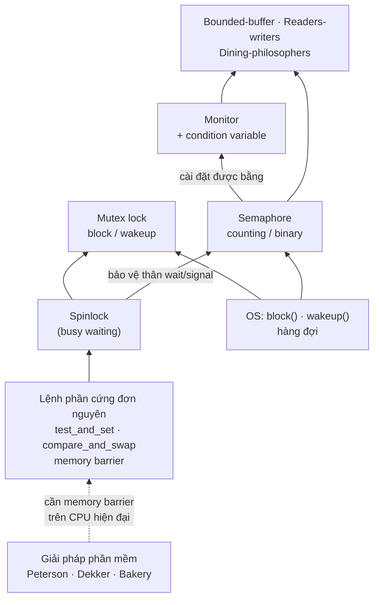

# L05 — Process synchronization (Đồng bộ tiến trình)

| | |
|---|---|
| Môn | `IT007` Hệ điều hành |
| Buổi | 5 — tổng hợp **toàn bộ chương 5** theo yêu cầu người dùng |
| Ngày | Không gán |
| Giảng viên | Nguyễn Thanh Thiện |
| Transcript | Không có; note dựa trên ba bộ slide bên dưới |
| Code | [`../code/L05/`](../code/L05/) — hai file C chạy được |

> Không có transcript nên note **chỉ phản ánh slide**: không bắt được lời giảng viên
> nói thêm, ví dụ ngoài slide hay gợi ý thi. Analogy, ví dụ nhỏ, code và các đoạn
> "trong production" là phần minh hoạ bổ sung, không phải lời giảng.
> Theo lịch ở slide chương 0, chương 5 rải trên buổi 5–6 [C0 s9–s10]; `L05` là số
> note, không khẳng định cả chương được dạy trong một buổi.

---

## Mục lục

- [Nguồn và cách đọc](#nguồn-và-cách-đọc)
- [Tóm tắt một đoạn](#tóm-tắt-một-đoạn)
- [Nội dung chính](#nội-dung-chính)
  - [1. Race condition — vì sao phải đồng bộ](#1-race-condition--vì-sao-phải-đồng-bộ)
  - [2. Critical section và 3 yêu cầu của lời giải](#2-critical-section-và-3-yêu-cầu-của-lời-giải)
  - [3. Phân loại giải pháp](#3-phân-loại-giải-pháp)
  - [4. Giải pháp phần mềm: turn, flag, Peterson](#4-giải-pháp-phần-mềm-turn-flag-peterson)
  - [5. Hỗ trợ từ phần cứng: memory barrier](#5-hỗ-trợ-từ-phần-cứng-memory-barrier)
  - [6. Mutex locks](#6-mutex-locks)
  - [7. Semaphore](#7-semaphore)
  - [8. Monitor và condition variable](#8-monitor-và-condition-variable)
  - [9. Liveness: deadlock, starvation, priority inversion](#9-liveness-deadlock-starvation-priority-inversion)
  - [10. Bài toán bounded-buffer](#10-bài-toán-bounded-buffer)
  - [11. Bài toán readers-writers](#11-bài-toán-readers-writers)
  - [12. Bài toán dining-philosophers](#12-bài-toán-dining-philosophers)
- [Bảng tổng hợp](#bảng-tổng-hợp)
- [Sơ đồ](#sơ-đồ)
- [Quy trình giải bài đồng bộ bằng semaphore](#quy-trình-giải-bài-đồng-bộ-bằng-semaphore)
- [Chỗ cần lưu ý khi đối chiếu nguồn](#chỗ-cần-lưu-ý-khi-đối-chiếu-nguồn)
- [Gợi ý thi và deadline phát sinh](#gợi-ý-thi-và-deadline-phát-sinh)
- [Liên kết](#liên-kết)
- [Tự kiểm tra](#tự-kiểm-tra)

---

## Nguồn và cách đọc

Số slide là **trang PDF, bắt đầu từ 1**. Nhãn `[C5-2 s16]` = bộ C5-2, slide 16.

| Mã | Tài liệu gốc | Phạm vi |
|---|---|---|
| C5-1 | [Copy of #Week07-Chapter5-1 2024.pdf](../materials/slides/Copy%20of%20%23Week07-Chapter5-1%202024.pdf) | 58 slide: 5.1 race condition → 5.5 hỗ trợ phần cứng |
| C5-2 | [Copy of #Week09-Chapter5-2 2024.pdf](../materials/slides/Copy%20of%20%23Week09-Chapter5-2%202024.pdf) | 55 slide: 5.6 mutex → 5.8 monitor, Appendix A liveness |
| C5-3 | [Copy of #Week10-Chapter5-3 2024.pdf](../materials/slides/Copy%20of%20%23Week10-Chapter5-3%202024.pdf) | 32 slide: 5.9 bounded-buffer, 5.10 readers-writers, 5.11 dining-philosophers |
| C0 | [Copy of #Week01-Chapter0.pdf](../materials/slides/Copy%20of%20%23Week01-Chapter0.pdf) | Lịch buổi học |

Mục 1–5 trả lời **vấn đề là gì và cần gì để giải**; mục 6–8 là **công cụ** hệ điều
hành cung cấp; mục 9 là **cái giá** khi dùng sai công cụ; mục 10–12 là **ba bài kinh
điển** để luyện áp dụng công cụ. C5-3 có nhiều code dưới dạng hình; phần đó đã được
đọc bằng cách render slide.

## Tóm tắt một đoạn

Khi nhiều tiến trình/thread cùng sửa một dữ liệu chung, kết quả phụ thuộc vào thứ tự
chạy mà không ai kiểm soát được — đó là race condition. Cách chữa là biến đoạn code
đụng dữ liệu chung (critical section) thành "mỗi lúc một người", và lời giải nào cũng
phải đạt đủ ba yêu cầu: mutual exclusion, progress, bounded waiting. Giải pháp phần
mềm như Peterson đạt đủ ba nhưng phải busy waiting và hỏng trên CPU hiện đại do sắp
xếp lại lệnh; vì vậy hệ điều hành cung cấp công cụ cấp cao hơn: mutex lock, semaphore
(đếm tài nguyên, cho phép ngủ thay vì quay vòng) và monitor. Dùng sai các công cụ này
sinh ra lỗi liveness — deadlock, starvation, priority inversion. Ba bài bounded-buffer,
readers-writers, dining-philosophers là khuôn mẫu cho gần như mọi bài đồng bộ.

---

## Nội dung chính

### 1. Race condition — vì sao phải đồng bộ

**Trực giác:** hai người cùng sửa một con số mà không hẹn trước, người sau ghi đè
kết quả của người trước.

**Analogy:** hai thu ngân cùng cập nhật số hàng tồn trên một tờ giấy. Người A đọc "5",
người B cũng đọc "5"; A nhập thêm 1 hàng ghi "6", B bán 1 hàng ghi "4". Thực tế tồn
kho vẫn là 5, nhưng tờ giấy ghi 4.

**Ví dụ nhỏ nhất** [C5-1 s11]: `count = 5`. `count++` thật ra là 3 lệnh máy
(load → inc → store), `count--` cũng vậy. Nếu quantum = 2 chu kỳ:

```
T1 Producer: reg1 = count      (reg1 = 5)
T2 Producer: reg1 = reg1 + 1   (reg1 = 6)
T3 Consumer: reg2 = count      (reg2 = 5)   ← đọc giá trị cũ
T4 Consumer: reg2 = reg2 - 1   (reg2 = 4)
T5 Producer: count = reg1      (count = 6)
T6 Consumer: count = reg2      (count = 4)  ← sai, đúng phải là 5
```

Với quantum = 3 chu kỳ, mỗi bên chạy trọn 3 lệnh nên ra đúng 5. **Cùng code, khác lịch
chạy, khác kết quả** — đó là dấu hiệu nhận biết race condition. Ví dụ thứ hai trong slide
là hai tiến trình cùng `fork()` và cùng lấy `next_available_pid`, dẫn đến một PID bị cấp
cho hai tiến trình con [C5-1 s13].

> 💬 *Bổ sung từ phiên gia sư 2026-09-23*
>
> **Đọc bảng T1–T6 như chuyện "bảng trắng + giấy nháp".** CPU không sửa thẳng con số
> trong bộ nhớ. Mỗi nhân viên có một tờ giấy nháp riêng (thanh ghi `reg1`, `reg2`) và muốn
> sửa số trên bảng (biến `count`) thì phải làm 3 bước: **chép** số trên bảng vào nháp
> (`load`) → **tính** trên nháp (`inc`/`dec`) → **ghi** nháp đè lên bảng (`store`).
> Quantum là số bước mỗi người được làm trước khi bị gọi đi, và người đó mang giấy nháp theo.
>
> | Lúc | Ai | Việc | Giấy nháp | Bảng |
> |---|---|---|---|---|
> | T1 | Producer | chép | P: 5 | 5 |
> | T2 | Producer | cộng 1 | P: 6 | 5 |
> | T3 | Consumer | chép | C: **5** ← bảng vẫn là 5 | 5 |
> | T4 | Consumer | trừ 1 | C: 4 | 5 |
> | T5 | Producer | ghi | | 6 |
> | T6 | Consumer | ghi, **đè mất số 6** | | **4** ❌ |
>
> **Mấu chốt nằm ở khoảng giữa lúc đọc và lúc ghi.** Consumer **đọc lúc T3** nhưng **ghi
> lúc T6**. Ở giữa, T5 đã đổi bảng thành 6, còn Consumer vẫn cầm số cũ (stale) và ghi đè
> lên. Race condition xảy ra khi giữa lúc đọc và lúc ghi của một bên, bên kia chen vào sửa
> dữ liệu. Cách chữa là làm cho ba bước chép → tính → ghi **liền một mạch**, tức là biến
> chúng thành critical section (mục 2).
>
> Chỗ dễ nhầm: hỏi "Consumer lấy số 5 lúc nào" thì đáp án là lúc **đọc** (T3), không phải
> lúc **ghi** (T6).

**Định nghĩa hình thức** [C5-1 s15–s16]:
> **Race condition** là hiện tượng xảy ra khi các tiến trình cùng truy cập đồng thời vào
> dữ liệu được chia sẻ. Kết quả cuối cùng phụ thuộc vào thứ tự thực thi của các tiến
> trình đang chạy đồng thời. Race condition có thể làm dữ liệu sai và không nhất quán
> (inconsistency).

**Code** — [`../code/L05/race-condition.c`](../code/L05/race-condition.c):

```c
#define N 1000000
int count = 5;

void *producer(void *arg) { for (int i = 0; i < N; i++) count++; return NULL; }
void *consumer(void *arg) { for (int i = 0; i < N; i++) count--; return NULL; }
// main: tạo 2 thread, join, in count
```

```
$ gcc -O0 -pthread race-condition.c -o race && ./race
count = -252492 (kỳ vọng 5)       ← mỗi lần chạy một số khác
$ gcc -O0 -pthread -DUSE_MUTEX race-condition.c -o race && ./race
count = 5 (kỳ vọng 5)
```

> **Trong production:** đây chính là lỗi "lost update" — hai request cùng
> `SELECT balance` rồi `UPDATE balance = ...`. Database giải bằng đúng tư tưởng của
> chương này: khoá dòng (`SELECT ... FOR UPDATE`) hoặc phép cập nhật nguyên tử
> (`UPDATE ... SET balance = balance - 1`).

### 2. Critical section và 3 yêu cầu của lời giải

**Trực giác:** khoanh vùng đoạn code đụng dữ liệu chung, rồi đặt luật "mỗi lúc chỉ
một người vào" — nhưng luật đó không được làm ai kẹt mãi bên ngoài.

**Analogy:** phòng thử đồ có một buồng. (1) Có người trong buồng thì người khác không
vào. (2) Buồng trống thì người đang đứng ngoài hàng — không muốn thử đồ — không được
chặn cửa người khác. (3) Không ai phải đợi vô hạn vì cứ bị người khác chen lên.

**Ví dụ nhỏ nhất:** P0, P1 cùng tăng `count`. Critical section (CS) là dòng `count++`.
Mọi tiến trình có dạng [C5-1 s19]:

```
while (1) {
    entry section       ← xin phép vào
        critical section
    exit section        ← báo đã ra
        remainder section
}
```

**Định nghĩa hình thức** [C5-1 s18, s21–s25]:
> **Critical section (vùng tranh chấp)** là đoạn code mà tiến trình thay đổi dữ liệu
> được chia sẻ. Lời giải cho bài toán vùng tranh chấp phải đảm bảo **3 yêu cầu**:
> 1. **Mutual exclusion (loại trừ tương hỗ):** khi P đang thực thi trong CS của nó thì
>    không có tiến trình Q nào khác đang thực thi trong CS của Q.
> 2. **Progress (tiến triển):** một tiến trình tạm dừng bên ngoài CS không được ngăn
>    cản các tiến trình khác vào CS.
> 3. **Bounded waiting (chờ đợi giới hạn):** mỗi tiến trình chỉ phải chờ vào CS trong
>    một khoảng thời gian có hạn định. Không xảy ra starvation (đói tài nguyên).

Slide gắn thêm: P chờ điều kiện từ Q trong khi Q cũng chờ điều kiện từ P để vào CS thì
gọi là **deadlock** — một dạng vi phạm progress [C5-1 s24].

> ⚠️ Đề mẫu cuối kỳ có câu cho 4 phát biểu và hỏi cái nào là "chờ đợi giới hạn"; phát
> biểu nhiễu là "tiến trình chưa được vào phải từ bỏ CPU" — không phải yêu cầu nào cả.
> Xem [`../exam-prep/exam-map.md`](../exam-prep/exam-map.md) câu 2.

### 3. Phân loại giải pháp

**Trực giác:** hoặc tự viết code để chờ, hoặc nhờ phần cứng/hệ điều hành giúp; và
trong lúc chờ thì hoặc đứng hỏi liên tục, hoặc đi ngủ chờ được gọi.

**Analogy:** chờ bàn ở quán ăn — đứng ở cửa hỏi "có bàn chưa?" mỗi 5 giây (busy
waiting), hay để lại số điện thoại rồi đi dạo, quán gọi khi có bàn (sleep & wake up).

**Ví dụ nhỏ nhất:** CS dài 1 giờ. Với busy waiting, tiến trình chờ đốt CPU suốt 1 giờ
chỉ để hỏi "đến lượt chưa?". Với sleep & wake up, nó không tốn CPU cho đến khi được đánh
thức.

**Định nghĩa hình thức** [C5-1 s27–s28]:

| Tiêu chí | Nhóm 1 | Nhóm 2 |
|---|---|---|
| Hỗ trợ phần cứng | **Giải pháp phần mềm** (giải pháp dựa trên ngắt): chỉ dùng kỹ thuật lập trình — Peterson, Bakery, Dekker | **Giải pháp phần cứng**: cần lệnh đơn nguyên đặc biệt — Test & Set, Compare & Swap |
| Hỗ trợ hệ điều hành | **Busy waiting**: không cần OS, tiến trình liên tục kiểm tra điều kiện | **Sleep & Wake up**: OS cung cấp system call `block` (cho ngủ) và `wakeup` (đánh thức) |

Giải pháp đơn giản nhất — **cấm ngắt** ở entry section, bật lại ở exit section — bị slide
đặt câu hỏi ngược [C5-1 s30]: CS chạy 1 giờ thì sao? có tiến trình bị đói không? có 2 CPU
thì sao? Ý trả lời: cấm ngắt khiến cả hệ thống đứng chờ CS, và **không có tác dụng trên
multiprocessor** vì CPU kia vẫn chạy (slide C5-2 s39 xác nhận điểm cuối).

**Code:** không áp dụng — đây là mục phân loại.

### 4. Giải pháp phần mềm: turn, flag, Peterson

**Trực giác:** Peterson = "tôi muốn vào" + "nhưng mời bạn trước". Hai tín hiệu gộp lại
thì vừa không đụng nhau, vừa không nhường nhau đến chết.

**Analogy:** hai người gặp nhau ở cửa hẹp. Chỉ dùng "lượt ai" (turn) thì người kia đi
vắng vẫn giữ lượt, mình đứng chờ vô ích. Chỉ dùng "tôi muốn qua" (flag) thì cả hai cùng
giơ tay rồi cùng đứng chờ nhau. Peterson: cả hai giơ tay **và** nói "mời anh" — ai nói
"mời" sau cùng thì người đó chờ, người kia đi.

**Ví dụ nhỏ nhất** — so sánh 3 giải pháp cho 2 tiến trình P0, P1:

| Giải pháp | Entry section của Pi | Mutual exclusion | Progress | Bounded waiting |
|---|---|:---:|:---:|:---:|
| Phần mềm 1 — biến `turn` [C5-1 s33–s36] | `while (turn == j);` | ✅ | ❌ P1 chạy remainder rất lâu nhưng vẫn giữ `turn = 1`, chặn P0 | ❌ |
| Phần mềm 2 — mảng `flag[]` [C5-1 s38–s40] | `flag[i] = true; while (flag[j]);` | ✅ | ❌ | ❌ |
| Peterson [C5-1 s42–s46] | `flag[i] = true; turn = j; while (flag[j] && turn == j);` | ✅ | ✅ | ✅ P1 chờ tối đa 1 lượt P0 vào CS |

Slide để ngỏ câu hỏi cho giải pháp 2 [C5-1 s40]. Kịch bản phá progress: P0 gán
`flag[0] = true`, bị ngắt; P1 gán `flag[1] = true`; giờ cả hai cùng kẹt ở `while` —
không ai trong CS mà không ai vào được (*suy luận, slide không ghi đáp án*).

**Định nghĩa hình thức** — giải thuật Peterson cho Pi, j = 1 − i [C5-1 s43]:

```c
while (true) {
    flag[i] = true;                 // Pi sẵn sàng vào CS
    turn = j;                       // nhường lượt cho Pj
    while (flag[j] && turn == j);   // Pj sẵn sàng VÀ đang lượt Pj → Pi chờ
    /* critical section */
    flag[i] = false;                // Pi bỏ trạng thái sẵn sàng
    /* remainder section */
}
```

Mutual exclusion: Pi chỉ vào khi `flag[j] == false` **hoặc** `turn == i`, và `turn` không
thể vừa bằng i vừa bằng j [C5-1 s44]. Giả định bắt buộc: `load` và `store` là đơn nguyên.

**Peterson trên kiến trúc hiện đại** [C5-1 s47–s51]: để tăng hiệu suất, CPU và compiler
có thể **sắp xếp lại** các thao tác độc lập. Ví dụ `x = 100; flag = true;` có thể thành
`flag = true; x = 100;` → thread đọc có thể in ra 0 thay vì 100. Với Peterson, nếu phép
gán `flag[]` và `turn` bị đảo, **P0 và P1 cùng vào CS**. Muốn Peterson đúng phải dùng
memory barrier.

**Code:** không đưa bản chạy được — trên máy thật Peterson thuần C có thể sai vì chính lý
do reordering ở trên. Bản đúng cần `stdatomic.h` với `memory_order_seq_cst`.

> **Trong production:** không ai tự viết Peterson. Nó tồn tại để chứng minh bài toán
> giải được bằng phần mềm thuần, và để thấy vì sao cần memory model — đúng thứ Java
> `volatile`, C++ `std::atomic` và Go memory model đang quy định.

### 5. Hỗ trợ từ phần cứng: memory barrier

**Trực giác:** một lệnh bảo CPU "viết xong hết những gì trước đây rồi mới làm tiếp,
và cho mọi CPU khác thấy".

**Analogy:** barrier ở trạm thu phí — mọi xe phía trước phải qua hết rồi thanh chắn mới
mở cho xe phía sau.

**Ví dụ nhỏ nhất** [C5-1 s55]:

```c
// Thread2                       // Thread1
x = 100;                         while (!flag)
memory_barrier();                    memory_barrier();
flag = true;                     print x;          // chắc chắn in 100
```

Barrier bên Thread2 bảo đảm `x = 100` xong trước `flag = true`; bên Thread1 bảo đảm đọc
`flag` trước khi đọc `x`.

**Định nghĩa hình thức** [C5-1 s53–s54]:
> **Memory model** quy định cách bộ nhớ được truy cập giữa các CPU. **Strongly ordered**:
> thay đổi trên một CPU được CPU khác thấy ngay. **Weakly ordered**: có thể không thấy ngay.
> **Memory barrier** là chỉ thị bắt buộc mọi thay đổi bộ nhớ được truyền tới tất cả CPU:
> mọi `load`/`store` trước barrier hoàn thành trước khi `load`/`store` sau barrier thực hiện.

**Test & Set, Compare & Swap, biến đơn nguyên (5.5.2–5.5.4):** slide ghi "sinh viên tự
nghiên cứu và trình bày tại lớp" [C5-1 s56], không có nội dung. Tóm tắt bổ sung *ngoài
slide*: `test_and_set(&lock)` đọc giá trị cũ và gán `true` trong **một** lệnh không bị cắt
ngang; `compare_and_swap(&v, expected, new)` chỉ ghi `new` nếu `v == expected`; biến đơn
nguyên (atomic variable) như `atomic_int` dùng CAS bên dưới để `++` an toàn. Mutex trong
mục 6 được xây trên các lệnh này [C5-2 s7].

> ❓ **CẦN XÁC MINH:** phạm vi thi của 5.5.2–5.5.4 khi slide để "tự nghiên cứu".

### 6. Mutex locks

**Trực giác:** một ổ khoá cho critical section — vào thì khoá, ra thì mở.

**Analogy:** chìa khoá nhà vệ sinh ở quán cà phê: chỉ có một chìa, ai cầm chìa mới được
vào, trả chìa ở quầy thì người kế tiếp mới lấy được.

**Ví dụ nhỏ nhất:** thêm `pthread_mutex_lock`/`unlock` quanh `count++`/`count--` ở mục 1 →
kết quả luôn là 5.

**Định nghĩa hình thức** [C5-2 s7–s13]:

```c
acquire() {                      release() {
    while (!available);              available = true;
        /* busy wait */          }
    available = false;
}
```

- `acquire()` và `release()` phải **đơn nguyên**, cài bằng lệnh phần cứng như
  `compare_and_swap` [C5-2 s7].
- Bản trên là **spinlock**: busy waiting → lãng phí CPU [C5-2 s8].
- **Mutex không busy waiting** [C5-2 s10–s11]: khoá đang bị giữ → `block()` đưa tiến trình
  vào hàng đợi, trạng thái ngủ; khi mở khoá → `wakeup(Q)` đưa một tiến trình từ hàng đợi về
  ready queue. Tức là **ngủ khi khoá đang khoá, đánh thức khi khoá được mở**.
- **Cách dùng** [C5-2 s13]: khai báo và khởi tạo → `acquire()` trước CS → `release()` sau CS
  → huỷ khi không dùng nữa. Mutex **thường khai báo toàn cục** (để mọi thread trong tiến
  trình cùng truy cập) và khởi tạo trong `main`. Phải xác định đúng CS trước khi đặt khoá.

**Code** — cùng file [`race-condition.c`](../code/L05/race-condition.c), bật `-DUSE_MUTEX`:

```c
pthread_mutex_t lock = PTHREAD_MUTEX_INITIALIZER;   // toàn cục

pthread_mutex_lock(&lock);     // acquire() — entry section
count++;                       // critical section
pthread_mutex_unlock(&lock);   // release() — exit section
```

> **Trong production:** spinlock không vô dụng — kernel dùng nó khi CS ngắn hơn chi phí
> context switch. Go `sync.Mutex` và Linux futex đều quay vòng một chút rồi mới ngủ, kết
> hợp cả hai ý của slide.

### 7. Semaphore

**Trực giác:** một bộ đếm số "suất" tài nguyên còn lại: lấy một suất thì trừ, trả thì
cộng, hết suất thì chờ.

**Analogy — chính slide dùng** [C5-2 s17–s24]: nhà hàng có 15 bàn, `freeTable = 15`.
Khách đến gọi `wait(freeTable)`, khách về gọi `signal(freeTable)`.

**Ví dụ nhỏ nhất:**

| Sự kiện | Lệnh | `freeTable` |
|---|---|---:|
| Khởi tạo | | 15 |
| Khách P1 đến | `wait` | 14 |
| 15 khách đã ngồi | | 0 |
| Khách P16 đến | `wait` → **chờ** | 0 |
| Khách P15 về | `signal` | 1 |
| P16 vào được | `wait` | 0 |

**Định nghĩa hình thức** [C5-2 s15–s16, s26]:
> **Semaphore S** là một biến số nguyên, chỉ truy cập được qua 2 thao tác đơn nguyên
> `wait()` (còn gọi `P()`) và `signal()` (còn gọi `V()`).

```c
wait(S) {                        signal(S) {
    while (S <= 0)                   S++;
        ; // busy wait           }
    S--;
}
```

- `wait` = **muốn sử dụng tài nguyên**; S không dương thì chờ; vào được thì **giảm S đi 1**.
- `signal` = **trả lại tài nguyên**; **tăng S lên 1**.
- **Counting semaphore**: giá trị nguyên không giới hạn. **Binary semaphore**: chỉ 0 hoặc 1,
  tác dụng giống mutex. Counting semaphore dùng được như binary semaphore.

**Hiện thực không busy waiting** [C5-2 s28–s32]: bản thân `wait`/`signal` cũng là một
critical section. Để không quay vòng, mỗi semaphore gắn một hàng đợi:

```c
typedef struct { int value; struct process *list; } semaphore;

wait(semaphore *S) {                    signal(semaphore *S) {
    S->value--;                             S->value++;
    if (S->value < 0) {                     if (S->value <= 0) {
        // thêm tiến trình vào S->list          // lấy P khỏi S->list
        block();                                wakeup(P);
    }                                       }
}                                       }
```

Ở bản này **value được phép âm** [C5-2 s38]:
- `value ≥ 0`: số lần còn gọi `wait` mà không bị block.
- `value < 0`: `|value|` là **số tiến trình đang chờ** trên S. Ví dụ `S = −5` → 5 tiến trình
  đang block.

**Ba ứng dụng** [C5-2 s34–s36]:

| Mục đích | Khởi tạo | Cách đặt |
|---|---|---|
| Mutual exclusion | `S = 1` | `wait(S); CS; signal(S);` |
| Bắt S1 chạy trước S2 | `synch = 0` | P1: `S1; signal(synch);` · P2: `wait(synch); S2;` |
| Điều kiện `sells ≤ products` | `stock = 0` | Produce: `products++; signal(stock);` · Consume: `wait(stock); sells++;` |

**Nhận xét và bẫy** [C5-2 s39, s41–s42]: `wait`/`signal` phải atomic và mutual exclusion
ngay cả trên multiprocessor. Sai **thứ tự** gọi hoặc sai **giá trị khởi tạo** là lỗi. Ví dụ
kinh điển: S = Q = 1, P1 gọi `wait(S); wait(Q);`, P2 gọi `wait(Q); wait(S);` →
P1 giữ S chờ Q, P2 giữ Q chờ S → **deadlock**. Sửa: hai bên cùng lấy theo một thứ tự.

**Code** — [`../code/L05/bounded-buffer.c`](../code/L05/bounded-buffer.c) tự cài semaphore
theo đúng kiểu block/wakeup bằng mutex + condition variable (xem mục 10).

> Đề mẫu dùng `sem_wait()` (POSIX) thay cho `wait(S)`. Trên Linux: `sem_init`,
> `sem_wait` (= `wait`, **giảm**), `sem_post` (= `signal`, **tăng**). Phát biểu "sem_wait
> làm semaphore tăng 1" là **sai**.

> **Trong production:** connection pool, rate limiter, "tối đa N request đồng thời"
> (`golang.org/x/sync/semaphore`, `asyncio.Semaphore`) đều là counting semaphore.

### 8. Monitor và condition variable

**Trực giác:** thay vì để lập trình viên tự rải `wait`/`signal` (dễ sai), gói dữ liệu chung
và các hàm thao tác lên nó vào một khối mà ngôn ngữ **tự** bảo đảm mỗi lúc chỉ một người
chạy bên trong.

**Analogy:** quầy giao dịch ngân hàng: khách không tự vào két, chỉ đứng ở quầy yêu cầu thủ
tục; mỗi lúc một khách ở quầy. Khách thiếu giấy tờ thì ra ghế chờ (condition queue),
đủ giấy tờ thì được gọi lại.

**Ví dụ nhỏ nhất** — bắt S1 (P1) chạy trước S2 (P2) bằng monitor [C5-2 s50]:

```
monitor {                         F1: S1; done = true; x.signal();
  condition x; boolean done;      F2: if (done == false) x.wait(); S2;
}
```

**Định nghĩa hình thức** [C5-2 s44–s49]:
> **Monitor** là một kiểu dữ liệu trừu tượng đóng gói: biến nội bộ (chỉ hàm trong monitor
> truy cập được), các thủ tục (thực thi theo mutual exclusion) và đoạn code khởi tạo. Chỉ
> một tiến trình ở trong monitor tại một thời điểm.
>
> **Condition variable** (`condition x, y;`) chỉ có 2 thao tác: `x.wait()` block tiến trình
> đến khi có `x.signal()`; `x.signal()` phục hồi **một** tiến trình đang block trên x — không
> có ai thì **không có tác dụng** (khác `signal` của semaphore vốn luôn tăng giá trị).

Monitor có thể cài bằng semaphore: mỗi thủ tục được bọc `wait(mutex); body; signal(mutex);`
với `mutex = 1` [C5-2 s45]. Các hàng đợi: entry queue, condition queue x/y, và **urgent
queue** chứa tiến trình vừa gọi `x.signal()` (nó phải nhường để giữ mutual exclusion)
[C5-2 s49].

**Code:** C không có monitor; phần `semaphore` trong
[`bounded-buffer.c`](../code/L05/bounded-buffer.c) dùng đúng cặp mutex + condition variable
mà monitor dựa vào.

> **Trong production:** Java `synchronized` + `wait()/notify()` chính là monitor; Go
> `sync.Cond`, pthread `pthread_cond_t` là condition variable.

### 9. Liveness: deadlock, starvation, priority inversion

**Trực giác:** chương trình không sai kết quả nhưng **không chạy tiếp được nữa**.

**Analogy:** ngã tư bốn xe cùng nhường nhau (deadlock); xe máy ở làn phụ mãi không chen ra
được vì dòng xe chính không dứt (starvation); xe cứu thương kẹt sau xe rác đang bị xe
khách chặn (priority inversion).

**Ví dụ nhỏ nhất:** đoạn `wait(S); wait(Q);` vs `wait(Q); wait(S);` ở mục 7.

**Định nghĩa hình thức** [C5-2 s51–s53]:
> **Liveness** là thuật ngữ chỉ một tập các đặc điểm mà hệ thống phải thỏa mãn để đảm bảo
> tiến trình thực sự chạy. Chờ vô thời hạn khi xin mutex/semaphore là ví dụ liveness thất
> bại — vi phạm progress và bounded waiting.
> - **Deadlock:** hai hay nhiều tiến trình chờ không giới hạn một sự kiện mà chỉ một trong
>   các tiến trình đang chờ đó mới gây ra được.
> - **Starvation:** một tiến trình có thể không bao giờ ra khỏi hàng đợi semaphore.
> - **Priority inversion:** tiến trình độ ưu tiên thấp giữ khoá mà tiến trình độ ưu tiên
>   cao cần; giải bằng **priority inheritance protocol**.

> ⚠️ Đề mẫu có câu điền thuật ngữ tiếng Anh cho đúng định nghĩa liveness ở trên — thuộc
> câu chữ này.

> **Trong production:** Mars Pathfinder (1997) liên tục reset vì priority inversion; bản vá
> là bật priority inheritance trên mutex của VxWorks (*nguồn ngoài slide*).

**Code:** không áp dụng. Chương 6 (Tắc nghẽn) đi sâu deadlock — theo lịch là tự nghiên cứu [C0 s10].

### 10. Bài toán bounded-buffer

**Trực giác:** một kệ hàng có hạn chỗ: người bày hàng phải chờ khi kệ đầy, người lấy hàng
phải chờ khi kệ trống, và không ai được đụng kệ cùng lúc với người kia.

**Analogy:** băng chuyền sushi có n đĩa: đầu bếp chỉ đặt khi còn chỗ trống, khách chỉ lấy
khi có đĩa, và một lúc chỉ một tay đụng vào băng chuyền.

**Ví dụ nhỏ nhất:** n = 3. Ban đầu `empty = 3, full = 0, mutex = 1`. Producer bày 3 món →
`empty = 0, full = 3`; món thứ 4 → `wait(empty)` block đến khi Consumer lấy bớt.

**Định nghĩa hình thức** [C5-3 s5–s10] — 4 bước áp semaphore:

1. **Xác định tài nguyên từ điều kiện:** không thêm khi đầy; không xoá khi rỗng; đoạn truy
   cập `buffer` và `count` là CS.
2. **Số semaphore:** `empty = n` (số chỗ có thể thêm), `full = 0` (số phần tử có thể xoá),
   `mutex = 1` (bảo vệ CS).
3. **Đặt `wait`/`signal`:**

   ```c
   // Producer                  // Consumer
   wait(empty);                 wait(full);
   wait(mutex);                 wait(mutex);
   // add to buffer[]           // remove from buffer[]
   count++;                     count--;
   signal(mutex);               signal(mutex);
   signal(full);                signal(empty);
   ```

4. Giá trị khởi tạo theo trạng thái ban đầu (mảng rỗng).

**Lỗi thường gặp** [C5-3 s11–s13]:
- Dùng `while (count < n)` / `if` thay semaphore → **busy waiting**, và kiểm tra `count`
  ngoài CS vẫn là race.
- **Bỏ quên vùng tranh chấp** — chỉ dùng `empty`, `full` mà không có `mutex` → `count++` và
  `count--` chạy đồng thời → **không đảm bảo mutual exclusion**. Đây chính là câu 9 của đề mẫu.

**Code** — [`../code/L05/bounded-buffer.c`](../code/L05/bounded-buffer.c), đã chạy thử
5 lần, `count` luôn nằm trong `[0, 3]`:

```
$ gcc -pthread bounded-buffer.c -o bbuf && ./bbuf
produce  1 | count = 1
...
consume 10 | count = 0
xong, count = 0
```

> **Trong production:** Go buffered channel `make(chan T, n)`, Java `ArrayBlockingQueue`,
> Kafka consumer lag — đều là bounded-buffer. Channel đầy thì sender block, đúng vai `empty`.

### 11. Bài toán readers-writers

**Trực giác:** đọc cùng lúc bao nhiêu người cũng được, nhưng lúc có người sửa thì phải
một mình.

**Analogy:** bảng tin công ty: nhiều người đứng đọc cùng lúc thoải mái; người dán thông
báo mới cần cả bảng trống người đọc để không ai đọc nửa cũ nửa mới.

**Ví dụ nhỏ nhất:** R1, R2 đang đọc; W1 đến phải chờ. R3 đến sau W1: biến thể 1 cho R3 vào
luôn (W1 có thể đói); biến thể 2 bắt R3 chờ sau W1 (reader có thể đói).

**Định nghĩa hình thức** [C5-3 s15–s20]:
> Dữ liệu chia sẻ giữa các tiến trình đồng thời. **Readers** chỉ đọc; **Writers** vừa đọc
> vừa ghi. Cho phép nhiều Readers đọc đồng thời; chỉ một Writer truy cập tại một thời điểm.
> - **Biến thể 1 (ưu tiên Readers):** Reader không phải chờ chỉ vì có Writer đang chờ →
>   **Writers có thể bị starvation**.
> - **Biến thể 2 (ưu tiên Writers):** Writer sẵn sàng thì chạy sớm nhất; có Writer chờ thì
>   không Reader mới nào được vào → **Readers có thể bị starvation**.

Lời giải biến thể 1: `rw_mutex = 1` (bảo vệ dữ liệu), `mutex = 1` (bảo vệ `read_count`),
`read_count = 0`.

```c
// Reader                                      // Writer
wait(mutex);                                   wait(rw_mutex);
read_count++;                                  /* cập nhật dữ liệu */
if (read_count == 1) wait(rw_mutex);  // đầu   signal(rw_mutex);
signal(mutex);
/* đọc dữ liệu */
wait(mutex);
read_count--;
if (read_count == 0) signal(rw_mutex); // cuối
signal(mutex);
```

Chỉ **reader đầu tiên** khoá dữ liệu, chỉ **reader cuối cùng** mở. Writer đang trong CS mà
có n Readers chờ thì 1 Reader xếp ở hàng đợi `rw_mutex`, n − 1 Reader còn lại ở hàng đợi
`mutex` [C5-3 s20].

**Code:** dùng lại `semaphore` trong [`bounded-buffer.c`](../code/L05/bounded-buffer.c) thay
cho `wait`/`signal` ở trên là chạy được.

> **Trong production:** `pthread_rwlock_t`, Go `sync.RWMutex`, Java `ReentrantReadWriteLock`.
> Go `RWMutex` chọn kiểu biến thể 2: có writer chờ thì chặn reader mới, tránh writer đói.

### 12. Bài toán dining-philosophers

**Trực giác:** mỗi người cần **hai** tài nguyên dùng chung với hàng xóm; nếu ai cũng cầm
một cái rồi chờ cái thứ hai thì cả bàn đứng hình.

**Analogy:** 5 người ngồi bàn tròn, giữa mỗi hai người có một chiếc đũa; muốn ăn phải có đủ
đôi.

**Ví dụ nhỏ nhất:** 5 triết gia cùng lúc cầm đũa bên trái → ai cũng chờ đũa bên phải đang
nằm trong tay hàng xóm → **deadlock** [C5-3 s26].

**Định nghĩa hình thức** [C5-3 s22–s30]: n triết gia, n chiếc đũa, `chopstick[5]` khởi tạo
1. Lời giải semaphore ngây thơ:

```c
wait(chopstick[i]);              // đũa trái
wait(chopstick[(i + 1) % 5]);    // đũa phải
/* eat */
signal(chopstick[i]);
signal(chopstick[(i + 1) % 5]);
/* think */
```

Cách tránh deadlock [C5-3 s27]: cho tối đa **4** triết gia ngồi; chỉ cầm đũa khi **cả hai**
sẵn sàng (việc cầm phải nằm trong CS); **bất đối xứng** — vị trí lẻ cầm trái trước, vị trí
chẵn cầm phải trước. Starvation vẫn có thể xảy ra.

Lời giải monitor [C5-3 s28–s30]: `state[i] ∈ {THINKING, HUNGRY, EATING}`, `condition self[5]`.
`pickup(i)` đặt HUNGRY rồi `test(i)`; `test(i)` chỉ cho EATING khi hai người bên cạnh không
EATING; `putdown(i)` đặt THINKING rồi `test` hai hàng xóm. **Không bao giờ deadlock nhưng
vẫn có thể starvation.**

**Code:** không đưa bản chạy được; khung monitor ở slide C5-3 s29 là tham chiếu.

> **Trong production:** cách "bất đối xứng" chính là **lock ordering** — quy ước mọi nơi
> khoá tài nguyên theo cùng một thứ tự (ví dụ theo ID tăng dần). Đây là cách chống deadlock
> phổ biến nhất khi chuyển tiền giữa hai tài khoản.

---

## Bảng tổng hợp

| Công cụ | Chờ bằng gì | Giá trị | Dùng khi | Bẫy |
|---|---|---|---|---|
| Cấm ngắt | Không cho ai chạy | — | Uniprocessor, CS cực ngắn | Không chạy trên multiprocessor |
| Peterson | Busy waiting | `flag[2]`, `turn` | Học lý thuyết, 2 tiến trình | Hỏng khi lệnh bị sắp xếp lại |
| Spinlock | Busy waiting | `available` | CS rất ngắn, trong kernel | Đốt CPU |
| Mutex (block/wakeup) | Ngủ | khoá / mở | Mutual exclusion | Quên unlock, CS xác định sai |
| Counting semaphore | Ngủ (bản hàng đợi) | nguyên, được âm | Đếm N tài nguyên, thứ tự, điều kiện | Sai thứ tự `wait`, sai khởi tạo → deadlock |
| Binary semaphore | Ngủ | 0/1 | Như mutex | Như trên |
| Monitor + condition | Ngủ trong condition queue | — | Để ngôn ngữ bảo đảm mutual exclusion | `x.signal()` không ai chờ thì mất tác dụng |

| Bài kinh điển | Semaphore | Khởi tạo | Rủi ro liveness |
|---|---|---|---|
| Bounded-buffer | `empty`, `full`, `mutex` | n, 0, 1 | Quên `mutex` → race; đảo `wait(mutex)` lên trước `wait(empty)` → deadlock (*suy luận*) |
| Readers-writers (biến thể 1) | `rw_mutex`, `mutex`, `read_count` | 1, 1, 0 | Writer starvation |
| Dining-philosophers | `chopstick[5]` | 1 | Deadlock nếu ai cũng cầm trái; starvation |

## Sơ đồ

Công cụ nào xây trên công cụ nào:



Vòng đời một tiến trình khi gọi `wait` trên semaphore có hàng đợi:

```
            wait(S): value--            value >= 0
 Running ─────────────────────────┬─────────────────► vào CS
                                  │ value < 0
                                  ▼
                        block(): vào S->list (ngủ)
                                  │
             signal(S): value++, value <= 0 → wakeup(P)
                                  ▼
                              Ready queue ──► chờ CPU scheduler (chương 4)
```

## Quy trình giải bài đồng bộ bằng semaphore

Tổng quát hoá từ 4 bước của bounded-buffer [C5-3 s8–s10] và ứng dụng "đảm bảo điều kiện"
[C5-2 s36]:

1. **Viết điều kiện bằng lời:** "không X khi Y". Mỗi điều kiện là một tài nguyên cần đếm.
2. **Mỗi tài nguyên một semaphore**, cộng một `mutex` cho mỗi nhóm biến chia sẻ.
3. **Đặt `wait` trước hành động tiêu thụ tài nguyên, `signal` sau hành động tạo tài nguyên.**
   `wait` điều kiện **trước**, `wait(mutex)` **sau** — không ngủ khi đang cầm mutex.
4. **Khởi tạo theo trạng thái ban đầu**: đếm số suất có sẵn ngay lúc bắt đầu.
5. **Tự kiểm:** thử lịch chạy xấu nhất — mỗi tiến trình bị ngắt ngay sau mỗi `wait`. Có
   trường hợp hai bên cùng chờ nhau không? Có dòng nào đụng biến chung ngoài `mutex` không?

## Chỗ cần lưu ý khi đối chiếu nguồn

- **C5-2 s11:** code mutex không busy waiting viết `if (!available); block();` — dấu `;`
  thừa sau `if` khiến `block()` **luôn** được gọi. Ý đúng: `if (!available) block();`.
  Theo mô tả kèm theo trên slide, khoá đang mở thì tiến trình vào CS luôn.
- **C5-1 s33:** slide giải pháp `turn` chú thích entry/exit section là "vô hiệu hoá ngắt /
  kích hoạt ngắt" — đó là nhãn của mục 5.4 (giải pháp dựa trên ngắt), code thực tế không cấm
  ngắt mà chỉ dùng biến `turn`.
- **Đánh số mục:** C5-2 đánh Liveness là "09" / Appendix A trong khi C5-3 dùng 5.9 cho
  bounded-buffer. Note này gọi Liveness là **Appendix A** để khỏi trùng.
- **C5-1 s40:** slide hỏi giải pháp `flag[]` có đạt 3 yêu cầu không nhưng không ghi đáp án;
  bảng ở mục 4 là suy luận.

> ❓ **CẦN XÁC MINH:** 5.5.2–5.5.4 (test_and_set, compare_and_swap, biến đơn nguyên) slide
> ghi "sinh viên tự nghiên cứu và trình bày tại lớp" — không rõ có nằm trong phạm vi thi.

## Gợi ý thi và deadline phát sinh

Không có transcript để trích lời dặn thi. Không tìm thấy hạn nộp trong ba bộ slide; không
phát sinh cập nhật cho `IMPORTANT_NOTES.md` hoặc `admin/deadlines.md`.

Tham khảo (không phải lời giảng viên): **đề thi mẫu** dành **2.9/10 điểm** cho chương 5, rải
đều các mục 5.1.3, 5.3.1, 5.3.2, 5.6.2, 5.6.3, 5.7.1–5.7.2, 5.9 và liveness, toàn bộ ở dạng
lý thuyết — xem [`../exam-prep/exam-map.md`](../exam-prep/exam-map.md).

## Liên kết

- [L03 — Process management](L03-process-management.md) — thread, tiến trình cộng tác
- [L04 — CPU scheduling](L04-cpu-scheduling.md) — vì sao thứ tự chạy không đoán trước được
- [Starvation và aging](../../../../knowledge-base/starvation-and-aging.md)
- [Map đề thi](../exam-prep/exam-map.md)
- [Flashcard của môn](../exam-prep/flashcards.md) · [CSV import Anki](../exam-prep/flashcards.csv)
- [Ghi chú quan trọng](../IMPORTANT_NOTES.md)

## Tự kiểm tra

**1.** `count = 5`. Producer `count++`, Consumer `count--` chạy đồng thời, mỗi phép là 3 lệnh
load/inc/store. Nêu một lịch chạy cho kết quả 6 và giải thích vì sao đây là race condition.

<details><summary>Đáp án</summary>

C load 5, C dec → 4, P load 5, P inc → 6, C store 4, P store 6 → `count = 6`. Kết quả phụ
thuộc thứ tự thực thi của hai tiến trình khi cùng truy cập dữ liệu chia sẻ — đúng định
nghĩa race condition [C5-1 s15].

</details>

**2.** Giải pháp dùng một biến `turn` đạt mutual exclusion nhưng vi phạm yêu cầu nào?
Cho kịch bản cụ thể.

<details><summary>Đáp án</summary>

Vi phạm **progress** (và cả bounded waiting). P0 ra khỏi CS, gán `turn = 1`. P1 đang chạy
remainder section rất dài, chưa muốn vào CS, nhưng `turn` vẫn là 1 nên P0 muốn vào lại
cũng không được — tiến trình ở ngoài CS đang chặn người khác [C5-1 s35].

</details>

**3.** Semaphore S có hàng đợi, `S->value = −3`. Điều đó nghĩa là gì? Gọi `signal(S)` một
lần thì chuyện gì xảy ra?

<details><summary>Đáp án</summary>

Có **3 tiến trình** đang block trong hàng đợi của S. `signal` tăng value lên −2; vì
`value ≤ 0` nên lấy một tiến trình khỏi `S->list` và `wakeup` nó về ready queue
[C5-2 s31, s38].

</details>

**4.** Lời giải Producer-Consumer chỉ có `empty` (khởi tạo n) và `full` (khởi tạo 0), không có
`mutex`. Producer có thể thêm vào buffer đã đầy không? Lời giải sai ở đâu?

<details><summary>Đáp án</summary>

Không thêm được khi đầy — `wait(empty)` đã chặn. Lỗi là **bỏ quên vùng tranh chấp**:
`count++` và `count--` (cùng thao tác trên `buffer`) có thể chạy đồng thời → không đảm bảo
mutual exclusion. Cần thêm `mutex = 1` bọc quanh đoạn truy cập buffer [C5-3 s13].

</details>

**5.** Trong readers-writers biến thể 1, vì sao chỉ reader **đầu tiên** gọi `wait(rw_mutex)`
và ai có thể bị starvation?

<details><summary>Đáp án</summary>

Các reader được đọc đồng thời nên chỉ cần reader đầu tiên chặn writer thay cho cả nhóm, và
reader cuối cùng mở ra. Miễn còn ít nhất một reader đang đọc thì `rw_mutex` không được trả →
reader mới cứ vào tiếp, **writer có thể bị starvation** [C5-3 s17, s20].

</details>
