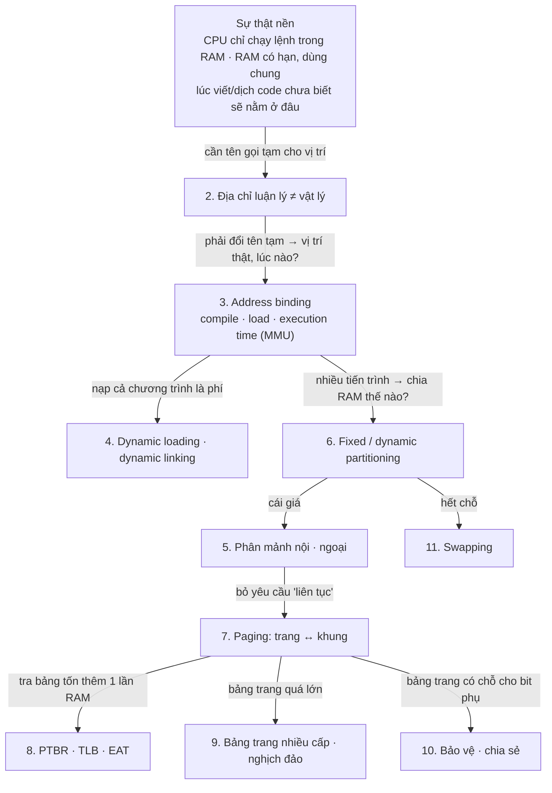
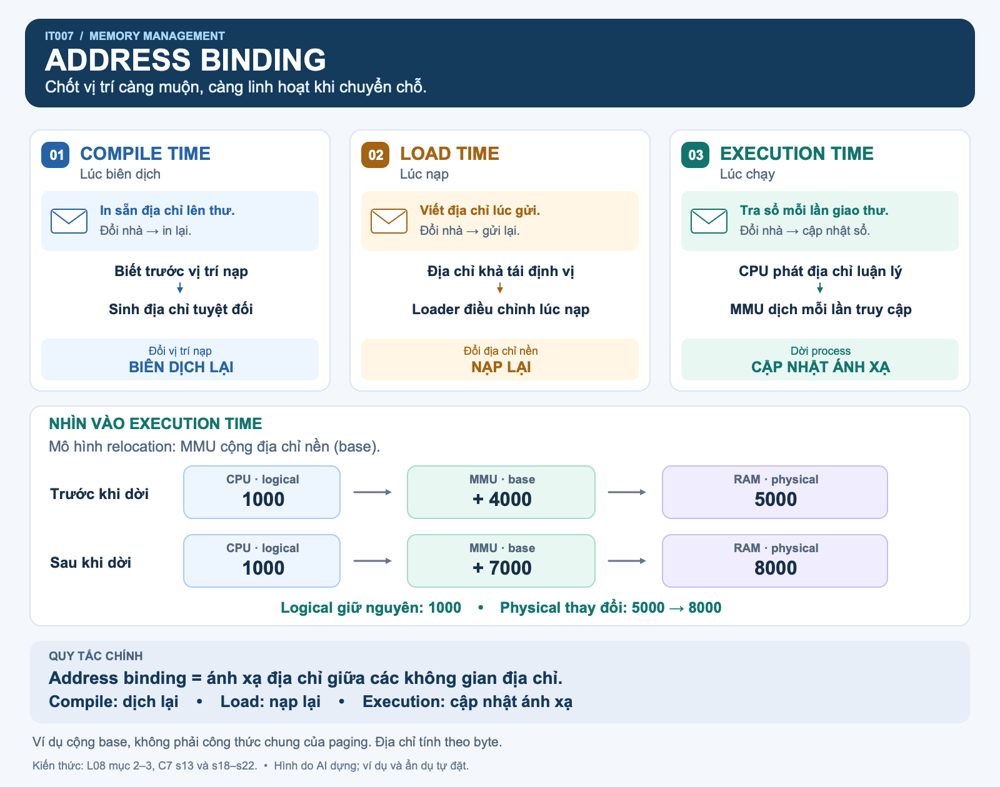
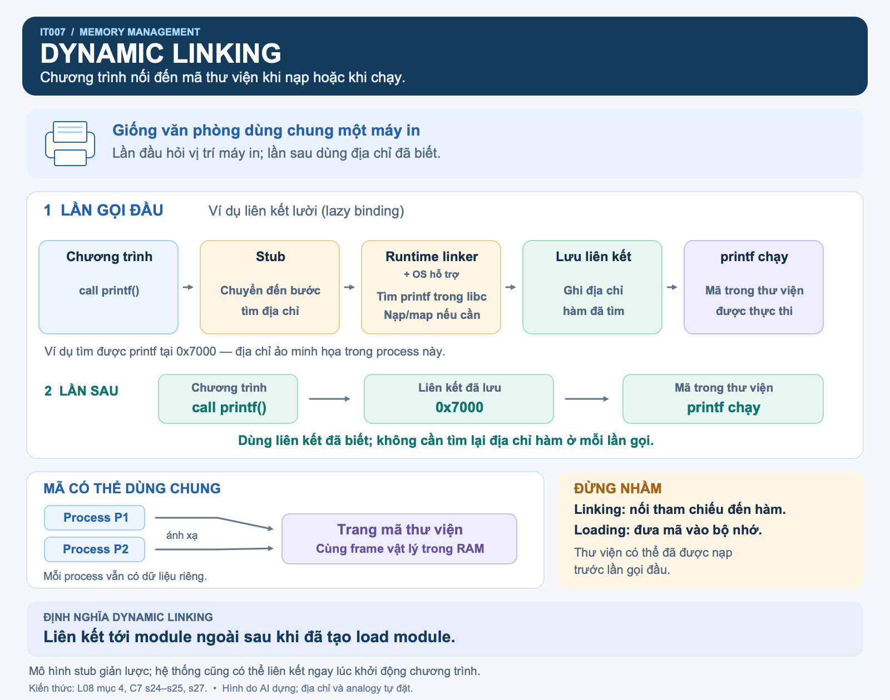
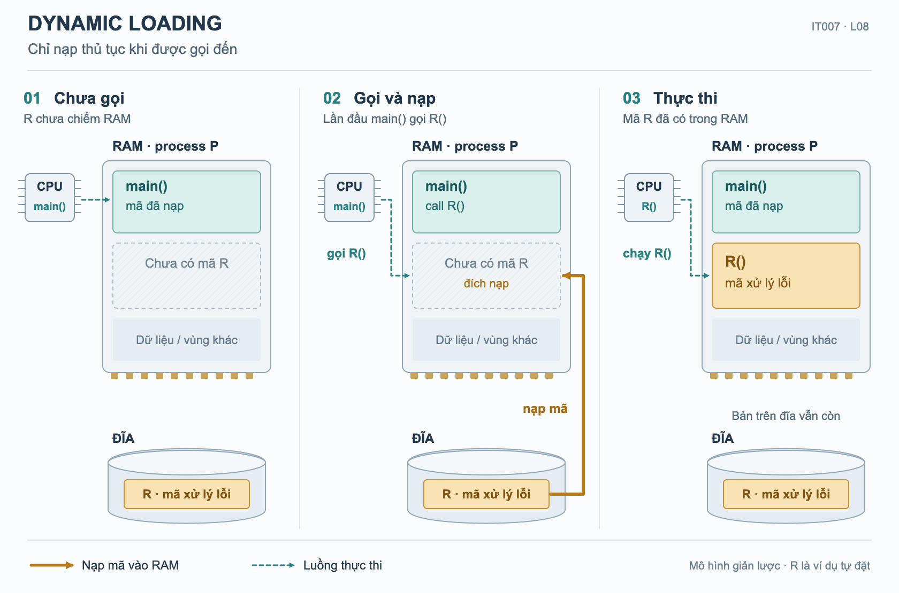
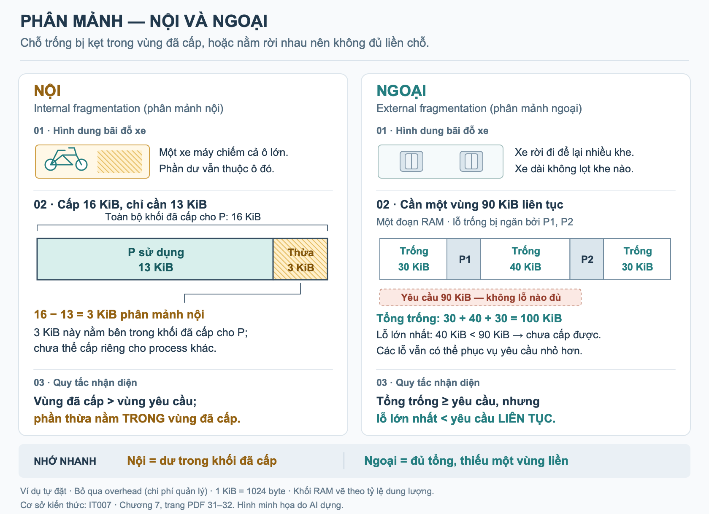
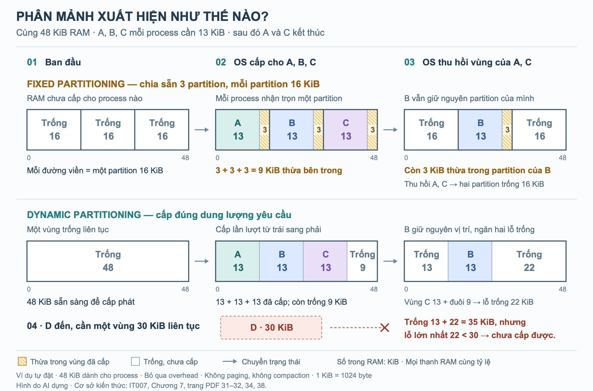
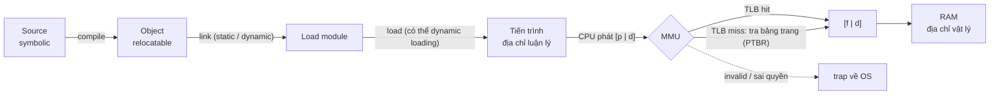

# L08 — Memory management (Quản lý bộ nhớ)

| | |
|---|---|
| Môn | `IT007` Hệ điều hành |
| Buổi | 8–9 — tổng hợp **toàn bộ chương 7** (lịch ở slide C0: chương 7 phần 1 ở buổi 8, phần 2 ở buổi 9 [C0 s10]) |
| Ngày | Không gán |
| Giảng viên | Nguyễn Thanh Thiện |
| Transcript | Không có; note dựa trên slide bên dưới |
| Slide | [`Copy of #Week12-Chapter7 2024.pdf`](../materials/slides/Copy%20of%20%23Week12-Chapter7%202024.pdf) — 72 slide |
| Code | [`../code/L08/memory-calc.py`](../code/L08/memory-calc.py) — đổi địa chỉ, tính EAT, mô phỏng placement |

> Không có transcript nên note **chỉ phản ánh slide**: không bắt được lời giảng viên nói thêm hay gợi ý thi.
> Phần "gốc rễ", analogy, ví dụ nhỏ, code, bài tập tự đặt và các đoạn "trong production" là phần bổ sung,
> không phải lời giảng. Slide có nhiều hình (bố cục bộ nhớ, sơ đồ MMU, TLB, bảng trang nhiều cấp);
> các hình đó đã được đọc bằng cách render slide.

> **Cấu trúc mỗi mục:** 📚 **Lý thuyết** (gốc rễ → định nghĩa học thuật) → 💡 **Giải thích dễ hiểu**
> (trực giác, analogy, ví dụ nhỏ nhất, hình) → 💻 **Code & thực tế** → ✍️ **Bài tập** (kèm 🔑 kiến thức
> mở khoá bài đó). Mục phụ được rút gọn và ghi rõ.

---

## Mục lục

- [Nguồn và cách đọc](#nguồn-và-cách-đọc)
- [Tóm tắt một đoạn](#tóm-tắt-một-đoạn)
- [Gốc rễ của cả chương](#gốc-rễ-của-cả-chương)
- [Nội dung chính](#nội-dung-chính)
  - [1. Khái niệm cơ sở — quản lý bộ nhớ là gì](#1-khái-niệm-cơ-sở--quản-lý-bộ-nhớ-là-gì)
  - [2. Các kiểu địa chỉ nhớ](#2-các-kiểu-địa-chỉ-nhớ)
  - [3. Chuyển đổi địa chỉ — address binding](#3-chuyển-đổi-địa-chỉ--address-binding)
  - [4. Dynamic linking và dynamic loading](#4-dynamic-linking-và-dynamic-loading)
  - [5. Phân mảnh — nội và ngoại](#5-phân-mảnh--nội-và-ngoại)
  - [6. Phân vùng cố định, phân vùng động và chiến lược placement](#6-phân-vùng-cố-định-phân-vùng-động-và-chiến-lược-placement)
  - [7. Phân trang và chuyển đổi địa chỉ trong paging](#7-phân-trang-và-chuyển-đổi-địa-chỉ-trong-paging)
  - [8. Cài đặt bảng trang: PTBR, TLB và EAT](#8-cài-đặt-bảng-trang-ptbr-tlb-và-eat)
  - [9. Tổ chức bảng trang: nhiều cấp và nghịch đảo](#9-tổ-chức-bảng-trang-nhiều-cấp-và-nghịch-đảo)
  - [10. Bảo vệ và chia sẻ trong paging](#10-bảo-vệ-và-chia-sẻ-trong-paging)
  - [11. Swapping](#11-swapping)
- [Bảng tổng hợp](#bảng-tổng-hợp)
- [Sơ đồ](#sơ-đồ)
- [Chỗ cần lưu ý khi đối chiếu nguồn](#chỗ-cần-lưu-ý-khi-đối-chiếu-nguồn)
- [Gợi ý thi và deadline phát sinh](#gợi-ý-thi-và-deadline-phát-sinh)
- [Liên kết](#liên-kết)
- [Tự kiểm tra](#tự-kiểm-tra)

---

## Nguồn và cách đọc

Số slide là **trang PDF, bắt đầu từ 1**. Nhãn `[C7 s44]` = slide chương 7, trang 44.

| Mã | Tài liệu gốc | Phạm vi |
|---|---|---|
| C7 | [Copy of #Week12-Chapter7 2024.pdf](../materials/slides/Copy%20of%20%23Week12-Chapter7%202024.pdf) | 7.1 khái niệm cơ sở → 7.6 swapping, bài tập s67–s71 |
| C0 | [Copy of #Week01-Chapter0.pdf](../materials/slides/Copy%20of%20%23Week01-Chapter0.pdf) | Lịch buổi học |

**Nhãn nguồn trong bài tập:** `slide` = bài tập có trong slide · `đề mẫu câu n` = dạng câu của đề mẫu
([`exam-map.md`](../exam-prep/exam-map.md), **đề đã viết lại**) · `tự đặt` = bài mình đặt, **đáp án đã kiểm bằng code**.

**Trọng số trong đề mẫu** *(một đề, không phải lời giảng viên)*: chương 7 chiếm **4,1/10 điểm** — nặng nhất đề.
Mục 7 (đổi địa chỉ paging, **1,3 điểm**) là mục đáng tiền nhất; kế đến phân mảnh (0,8), address binding (0,6).

## Tóm tắt một đoạn

Chương trình phải nằm trong RAM mới chạy được, nhưng lúc viết code không ai biết nó sẽ nằm ở đâu. Vì vậy
chương trình dùng **địa chỉ luận lý** (logical), còn RAM dùng **địa chỉ vật lý** (physical); phải có bước
**chuyển đổi** (address binding) ở lúc biên dịch, lúc nạp hoặc — linh hoạt nhất — lúc thực thi nhờ phần cứng MMU.
Nhét nhiều tiến trình vào RAM thì phải chia chỗ: chia cố định (fixed partitioning) phí chỗ bên trong khối
(**phân mảnh nội**); chia động (dynamic partitioning) để lại các lỗ vụn giữa các tiến trình (**phân mảnh ngoại**).
**Phân trang** (paging) giải quyết phân mảnh ngoại bằng cách cắt chương trình thành các **trang** bằng nhau và
đặt vào bất kỳ **khung** trống nào; cái giá là mỗi truy cập cần tra **bảng trang** (2 lần vào RAM), được bù bằng
cache **TLB**; bảng trang quá lớn thì tổ chức **nhiều cấp** hoặc **nghịch đảo**. Bảng trang còn mang **bit bảo vệ**
và cho phép **chia sẻ** trang. Swapping đưa cả tiến trình ra đĩa khi thiếu chỗ.

## Gốc rễ của cả chương

Cả chương mọc từ một mâu thuẫn: **chương trình được viết mà không biết nó sẽ nằm ở đâu trong RAM, và RAM phải
chứa nhiều chương trình cùng lúc.** Mỗi khái niệm sau là cách vá chỗ hở của khái niệm trước.



---

## Nội dung chính

### 1. Khái niệm cơ sở — quản lý bộ nhớ là gì

*(mục phụ — bản rút gọn: đề mẫu không hỏi, nhưng là nền cho mọi mục sau)*

#### 📚 Lý thuyết

**Gốc rễ (first principles).** CPU chỉ đọc lệnh và dữ liệu từ bộ nhớ chính, nên **chương trình phải được mang vào RAM và đặt trong một tiến trình** mới chạy được [C7 s6]. RAM có hạn và nhiều tiến trình cùng muốn ở đó ⇒ cần một bên **phân chỗ, giữ chỗ, và chặn ai lấn sang chỗ người khác** — đó là việc của hệ điều hành, với phần cứng hỗ trợ việc kiểm tra ở mỗi lần truy cập (vì kiểm bằng phần mềm ở mỗi lần truy cập thì quá chậm — *ngoài slide*).

**Định nghĩa hình thức** [C7 s9–s10]

> **Quản lý bộ nhớ** là công việc của hệ điều hành với sự hỗ trợ của phần cứng nhằm phân phối, sắp xếp các
> tiến trình trong bộ nhớ sao cho hiệu quả. **Mục tiêu cần đạt được** là nạp càng nhiều tiến trình vào bộ nhớ
> càng tốt (gia tăng mức độ đa chương). Trong hầu hết các hệ thống, **kernel sẽ chiếm một phần cố định của bộ
> nhớ**; phần còn lại phân phối cho các tiến trình.

**Năm yêu cầu** [C7 s10]: **cấp phát** bộ nhớ cho tiến trình · **tái định vị** (relocation, vd khi swapping) · **bảo vệ** (truy xuất có hợp lệ không) · **chia sẻ** vùng nhớ chung · **kết gán** địa chỉ luận lý của user vào địa chỉ thực.

**Cơ chế bảo vệ đơn giản nhất** — thanh ghi **base** và **limit** [C7 s7, s10]: CPU phát ra một địa chỉ; nếu `address ≥ base` **và** `address < base + limit` thì cho truy cập, ngược lại **trap** về hệ điều hành (illegal addressing error).

**Bố cục một tiến trình trong bộ nhớ** [C7 s8]: từ địa chỉ thấp lên cao là **text** (mã lệnh) → **data** (biến toàn cục đã khởi tạo) → **bss** (biến chưa khởi tạo, gán 0) → **heap** (cấp phát động, lớn dần lên) → … → **stack** (lớn dần xuống); trên cùng là vùng kernel mà user code không được đọc/ghi.

#### 💡 Giải thích dễ hiểu

**Trực giác:** RAM là một dãy ô có đánh số; hệ điều hành là người chia ô cho các chương trình và gác cổng để không ai đụng ô của người khác.

**Analogy:** một khách sạn — lễ tân (OS) xếp phòng cho khách (tiến trình), tầng trệt dành cho ban quản lý (kernel); mỗi khách cầm thẻ phòng chỉ mở được đúng dãy phòng của mình (base/limit).
*Chỗ analogy vỡ:* khách sạn xếp phòng một lần; OS có thể **dời** chỗ của tiến trình trong khi nó đang chạy (tái định vị) mà tiến trình không hề biết.

**Minh hoạ** — kiểm tra base/limit ở mỗi lần truy cập [C7 s10]:

```
 CPU ─ địa chỉ ─▶ [ ≥ base ? ] ─ có ─▶ [ < base + limit ? ] ─ có ─▶ RAM
                       │ không                 │ không
                       └──────────┬────────────┘
                                  ▼
                   trap về OS: illegal addressing error
```

#### ✍️ Bài tập

**Bài 1** *(Vận dụng)* — *tự đặt, dựa trên hình s7.* Tiến trình có `base = 300040`, `limit = 120900`. Truy cập các địa chỉ 300040, 420939, 420940 thì cái nào bị trap?

> 🔑 **Kiến thức mở khoá:** điều kiện hợp lệ là `base ≤ address < base + limit` — cận dưới **có** bằng, cận trên **không**.

<details><summary>Hướng giải</summary>

`base + limit = 420940`. 300040 hợp lệ (bằng base) · 420939 hợp lệ (nhỏ hơn 420940) · **420940 bị trap** (không nhỏ hơn cận trên).

</details>

**Chốt mục:** OS quản lý bộ nhớ **có phần cứng hỗ trợ**; mục tiêu là **tăng mức đa chương**; 5 yêu cầu: cấp phát · tái định vị · bảo vệ · chia sẻ · kết gán địa chỉ.

### 2. Các kiểu địa chỉ nhớ

#### 📚 Lý thuyết

**Gốc rễ (first principles).**

- **Ngữ cảnh:** chương trình đi qua nhiều bước — viết code → biên dịch → liên kết (link) → nạp (load) → chạy [C7 s6, s14].
- **Vấn đề gốc:** ở mỗi bước, "vị trí của biến `a`" phải được gọi bằng **một cái tên nào đó**, nhưng vị trí thật trong RAM chỉ biết ở bước sau cùng.
- **Những sự thật nền:**
  1. Lúc biên dịch **không biết** chương trình sẽ được nạp vào đâu (RAM đang có những tiến trình khác, thay đổi liên tục).
  2. Một chương trình được ghép từ **nhiều module** biên dịch riêng; mỗi module không biết module kia nằm ở đâu [C7 s15].
  3. Cuối cùng CPU vẫn phải truy cập **một ô thật** trong RAM.
- **Suy luận:** (1) + (2) ⇒ trong chương trình chỉ dùng được **tên tạm cho vị trí** — tính **tương đối** so với đầu module ⇒ đó là **địa chỉ luận lý / địa chỉ tương đối**. (3) ⇒ vẫn phải có **địa chỉ vật lý**. Hai loại địa chỉ tồn tại song song là hệ quả tất yếu, và giữa chúng phải có một bước **đổi** (mục 3).
- **Nếu không có phân biệt này thì sao?** chương trình phải biết trước địa chỉ nạp — chạy hai bản cùng lúc hoặc chạy cạnh chương trình khác sẽ đụng nhau.

**Định nghĩa hình thức** [C7 s12]

> - **Địa chỉ vật lý** (physical address, địa chỉ thực) là một vị trí thực trong bộ nhớ chính.
> - **Địa chỉ luận lý** (logical address) là một vị trí nhớ được diễn tả trong một chương trình (còn gọi là
>   địa chỉ ảo — virtual address). Các trình biên dịch (compiler) tạo ra mã lệnh chương trình mà trong đó mọi
>   tham chiếu bộ nhớ đều là địa chỉ luận lý.
> - **Địa chỉ tuyệt đối** (absolute address): địa chỉ tương đương với địa chỉ thực.
> - **Địa chỉ tương đối** (relative address, địa chỉ khả tái định vị, relocatable address) là một kiểu địa chỉ
>   luận lý trong đó các địa chỉ được biểu diễn tương đối so với một vị trí xác định nào đó trong chương trình.
>   Ví dụ: 12 byte so với vị trí bắt đầu chương trình.

**Linker và loader** [C7 s14]: **linker** kết hợp các object module thành một file nhị phân khả thực thi gọi là **load module**; **loader** nạp (load) module vào bộ nhớ chính.

**Đổi địa chỉ bằng phần cứng** [C7 s13]: bộ **MMU** (memory management unit) có **relocation register**; địa chỉ vật lý = địa chỉ luận lý + giá trị thanh ghi. Ví dụ: relocation register = 14000, logical 346 → physical **14346**.

#### 💡 Giải thích dễ hiểu

**Trực giác:** trong chương trình, biến được gọi bằng "vị trí thứ mấy tính từ đầu chương trình"; chỉ khi chạy mới biết "đầu chương trình" nằm ở đâu trong RAM.

**Analogy:** "phòng số 12 **của tầng mình**" (địa chỉ tương đối) so với "phòng 512 **của khách sạn**" (địa chỉ vật lý). Khi biết tầng bắt đầu ở phòng 500, cộng vào là ra phòng thật — đúng việc của relocation register.
*Chỗ analogy vỡ:* khách sạn không đổi tầng của bạn giữa chừng; OS có thể dời cả tiến trình sang vùng khác, chỉ cần sửa **một** con số trong relocation register là mọi địa chỉ luận lý vẫn đúng.

**Ví dụ nhỏ nhất** — đường đi của một lời gọi hàm qua các bước [C7 s16]:

| Bước | `main.c` gọi `add(a, b)` được viết thành |
|---|---|
| Source | `add(a, b)` — **symbolic** (tên biến, tên hàm) |
| Sau compile (`main.obj`) | `MOVE R1, (a)` · `CALL add` — tên chưa có vị trí |
| Sau link (`cal.exe`) | `MOVE R1, (2388)` · `CALL 1547` — vị trí **tương đối** trong load module |
| Sau load (trong RAM) | `MOVE R1, (22388)` · `CALL 21547` — cộng thêm địa chỉ nạp **20000** |

**Minh hoạ** — MMU đổi địa chỉ ở mỗi lần truy cập [C7 s13]:

```
          logical 346       ┌──────── MMU ────────┐      physical 14346
 CPU ─────────────────────▶ │ relocation reg 14000│ ──────────────────▶ RAM
                            │        346 + 14000  │
                            └─────────────────────┘
 Chương trình chỉ thấy 346; không bao giờ thấy 14346.
```

#### 💻 Code & thực tế

Không áp dụng bản chạy được cho mục này (địa chỉ vật lý bị OS giấu khỏi user program).

> **Trong production** *(ngoài slide)*: mọi con trỏ in ra trong C/Go (`%p`) là **địa chỉ ảo**, không phải địa chỉ RAM thật.
> ASLR (address space layout randomization) đổi địa chỉ nạp mỗi lần chạy — chỉ làm được vì chương trình dùng địa chỉ luận lý.

#### ✍️ Bài tập

**Bài 1** *(Nhớ)* — *đề mẫu câu 23c, đề viết lại.* Điền thuật ngữ **tiếng Anh**: "một vị trí nhớ được diễn tả trong một chương trình" là ______.

> 🔑 **Kiến thức mở khoá:** định nghĩa nguyên văn [C7 s12] — phân biệt với *physical address* (vị trí thực trong bộ nhớ chính).

<details><summary>Hướng giải</summary>

**Logical address** (còn gọi là *virtual address*).

</details>

**Bài 2** *(Vận dụng)* — *tự đặt.* Relocation register = 14000. CPU phát địa chỉ luận lý 346 và 1200. Địa chỉ vật lý là bao nhiêu? Nếu OS dời tiến trình sang vùng bắt đầu từ 30000 thì chương trình phải sửa gì?

> 🔑 **Kiến thức mở khoá:** physical = logical + relocation register [C7 s13]; chương trình chỉ cầm địa chỉ luận lý.

<details><summary>Hướng giải</summary>

14346 và 15200. Khi dời, **chương trình không sửa gì**; OS chỉ đổi relocation register thành 30000 → 346 thành 30346. Đây chính là lợi ích của việc tách logical/physical.

</details>

**Chốt mục:** **logical** = vị trí diễn tả trong chương trình (còn gọi virtual) · **physical** = vị trí thật trong RAM · relative = logical tính từ một mốc. Bẫy thi: câu điền thuật ngữ cần đúng **từ tiếng Anh**.

### 3. Chuyển đổi địa chỉ — address binding

#### 📚 Lý thuyết

**Gốc rễ (first principles).**

- **Ngữ cảnh:** mục 2 cho thấy phải đổi địa chỉ luận lý sang vật lý. Câu hỏi còn lại: **đổi vào lúc nào?**
- **Những sự thật nền:**
  1. Chỉ đổi được khi **đã biết** địa chỉ nạp.
  2. Đổi càng sớm thì càng rẻ lúc chạy, nhưng càng **cứng**: đổi xong mà vị trí thay đổi thì phải đổi lại.
  3. Có ba mốc mà địa chỉ nạp có thể được biết: lúc **biên dịch** (nếu biết trước), lúc **nạp**, hoặc chỉ biết **khi đang chạy** (tiến trình có thể bị dời đi).
- **Suy luận:** (1) + (3) ⇒ đúng **ba** thời điểm binding. (2) ⇒ ba thời điểm là một **đánh đổi**: compile time rẻ nhất nhưng phải biên dịch lại khi đổi chỗ; load time phải nạp lại; execution time linh hoạt nhất nhưng cần **phần cứng** (MMU) để đổi ở mỗi lần truy cập mà không chậm.
- **Nếu chỉ có binding lúc biên dịch?** mỗi chương trình phải có sẵn một chỗ cố định trong RAM — không chạy được hai chương trình muốn cùng chỗ.

**Định nghĩa hình thức** [C7 s18–s22]

> **Chuyển đổi địa chỉ** là quá trình ánh xạ một địa chỉ từ không gian địa chỉ này sang không gian địa chỉ khác.
> - Trong source code: **symbolic** (các biến, hằng, pointer…).
> - Trong thời điểm biên dịch: thường là địa chỉ **khả tái định vị**. Ví dụ: `a` ở vị trí 12 byte so với vị trí bắt đầu module.
> - Thời điểm linking/loading: có thể là **địa chỉ thực**. Ví dụ: dữ liệu nằm tại địa chỉ bộ nhớ thực 2030.

**Ba thời điểm binding:**

| Thời điểm | Khi nào dùng | Khuyết điểm / yêu cầu | Nguồn |
|---|---|---|---|
| **Compile time** | Biết trước địa chỉ bộ nhớ của chương trình → kết gán địa chỉ tuyệt đối lúc biên dịch. Ví dụ: chương trình `.COM` của MS-DOS | **Phải biên dịch lại** nếu thay đổi địa chỉ nạp chương trình | [C7 s19–s20] |
| **Load time** | Loader chuyển địa chỉ khả tái định vị thành địa chỉ thực dựa trên một **địa chỉ nền**; địa chỉ thực tính lúc nạp | **Phải reload** nếu địa chỉ nền thay đổi | [C7 s19, s21] |
| **Execution time** | Tiến trình có thể bị di chuyển trong khi thực thi → trì hoãn chuyển đổi đến lúc thực thi | **Cần phần cứng hỗ trợ** ánh xạ (vd thanh ghi base và limit). Dùng trong đa số OS đa dụng có swapping, paging, segmentation | [C7 s22] |

#### 💡 Giải thích dễ hiểu

**Trực giác:** "đổi tên tạm sang địa chỉ thật" có thể làm một lần từ sớm, một lần khi nạp, hoặc liên tục mỗi lần chạy — càng muộn càng linh hoạt.

**Analogy:** ghi địa chỉ lên thư. *Compile time* = in sẵn địa chỉ lên phong bì — chuyển nhà thì phải in lại cả xấp. *Load time* = viết địa chỉ lúc gửi — chuyển nhà thì phải gửi lại. *Execution time* = ghi "gửi tới người X", bưu điện tra sổ địa chỉ mới nhất mỗi lần giao — chuyển nhà chỉ cần báo bưu điện.
*Chỗ analogy vỡ:* bưu điện tra sổ chậm; MMU tra bằng phần cứng ở **mỗi** lần truy cập bộ nhớ, nhanh đến mức gần như không thấy.

**Ví dụ nhỏ nhất** [C7 s18, s20–s21]: lệnh `JUMP i` trong chương trình.

| Giai đoạn | Compile-time binding | Load-time binding |
|---|---|---|
| Source | `JUMP i` (symbolic) | `JUMP i` |
| Sau compile | `JUMP 1424` — **đã là địa chỉ tuyệt đối** | `JUMP 400` — **tương đối** so với đầu module |
| Sau link/load (nạp tại 1024) | `JUMP 1424` (giữ nguyên) | `JUMP 1424` (= 1024 + 400, loader cộng vào) |

Cùng kết quả cuối, khác **ai** tính và **khi nào** tính. Nếu lần sau nạp tại 2048: compile-time sai (vẫn nhảy tới 1424) → phải biên dịch lại; load-time → loader tính lại thành 2448.

**Minh hoạ** — ba mốc đổi trên đường đi của chương trình:

```
source ──compile──▶ object ──link──▶ load module ──load──▶ RAM ──run──▶ CPU truy cập
            ▲                                       ▲                ▲
      compile time                             load time      execution time
  (biết trước chỗ nạp;                  (loader cộng        (MMU đổi ở mỗi lần
   đổi chỗ → dịch lại)                   địa chỉ nền;        truy cập; dời được
                                         đổi → nạp lại)      khi đang chạy)
```



*Hình do AI dựng bằng SVG và xuất PNG, dựa trên [C7 s13, s18–s22]; analogy và ví dụ số tự đặt. [Bản SVG có thể chỉnh sửa](images/address-binding-explained.svg).*

**Đọc hình:** ba cột là **ba lựa chọn thời điểm binding**, không phải ba bước chuyển đổi bắt buộc nối tiếp nhau.
Hai hàng bên dưới minh họa riêng **execution-time binding bằng relocation cộng base**, với địa chỉ tính theo byte:
`1000 + 4000 = 5000`; khi process được dời và base cập nhật thành `7000`, địa chỉ luận lý vẫn là `1000` nhưng địa chỉ vật lý thành `8000`.
Đây không phải công thức chung của paging; analogy giao thư chỉ minh họa thời điểm xác định địa chỉ, không mô tả cơ chế phần cứng.

#### 💻 Code & thực tế

Không áp dụng bản chạy được.

> **Trong production** *(ngoài slide)*: executable hiện đại là **PIE** (position-independent executable) — không gắn địa chỉ cố định, OS nạp ở đâu cũng chạy; kết hợp với paging (execution-time binding) nên ASLR mới làm được.

#### ✍️ Bài tập

**Bài 1** *(Hiểu)* — *đề mẫu câu 15, đề viết lại.* Trong **source code**, biến `int i;` được tham chiếu bằng loại địa chỉ nào?

> 🔑 **Kiến thức mở khoá:** ba giai đoạn [C7 s18] — source: **symbolic**; sau biên dịch: khả tái định vị; sau link/load: có thể là địa chỉ thực.

<details><summary>Hướng giải</summary>

**Symbolic address** (tên biến, hằng, pointer). Bẫy: chọn "relocatable" — đó là địa chỉ **sau khi biên dịch**.

</details>

**Bài 2** *(Hiểu)* — *đề mẫu câu 16, đề viết lại.* Khuyết điểm của binding tại **compile time** là gì? Phân biệt với khuyết điểm của load time.

> 🔑 **Kiến thức mở khoá:** bảng ba thời điểm [C7 s19] — đổi càng sớm càng cứng.

<details><summary>Hướng giải</summary>

Compile time: **phải biên dịch lại** nếu thay đổi địa chỉ nạp. Load time: **phải nạp lại (reload)** nếu địa chỉ nền thay đổi. Đề mẫu đặt khuyết điểm của load time làm phương án nhiễu.

</details>

**Bài 3** *(Vận dụng)* — *tự đặt.* Lệnh `LOAD j` có địa chỉ tương đối 1200 trong module. Loader nạp module tại 1024, rồi lần sau tại 3000. Với load-time binding, địa chỉ ghi trong lệnh mỗi lần là bao nhiêu? Với execution-time binding thì sao?

> 🔑 **Kiến thức mở khoá:** load time: loader **cộng địa chỉ nền một lần** khi nạp; execution time: lệnh giữ địa chỉ **tương đối**, MMU cộng mỗi lần truy cập.

<details><summary>Hướng giải</summary>

Load time: lệnh ghi **2224** (1024 + 1200), lần sau loader phải sửa lại thành **4200**. Execution time: lệnh **luôn ghi 1200**; lần đầu MMU cộng 1024 → 2224, lần sau relocation register = 3000 → 4200, không cần sửa code.

</details>

**Chốt mục:** 3 thời điểm binding — **compile** (dịch lại khi đổi chỗ) · **load** (nạp lại khi đổi nền) · **execution** (cần phần cứng, dùng trong hầu hết OS). Source code dùng **symbolic address**.

### 4. Dynamic linking và dynamic loading

#### 📚 Lý thuyết

**Gốc rễ (first principles).**
- **Vấn đề gốc:** nạp **toàn bộ** chương trình và **toàn bộ** thư viện nó dùng vào RAM là phí: (a) nhiều thủ tục hiếm khi được gọi (vd xử lý lỗi); (b) nhiều tiến trình cùng dùng một thư viện, mỗi bản giữ một bản sao.
- **Suy luận:** (a) ⇒ **trì hoãn việc nạp** thủ tục đến lúc nó thực sự được gọi — **dynamic loading**. (b) ⇒ **trì hoãn việc liên kết** thư viện đến lúc chạy, và để mọi tiến trình **dùng chung một bản** — **dynamic linking**. Cả hai cùng ý: *đừng làm trước những việc có thể không cần*.

**Định nghĩa hình thức**

> **Dynamic linking** [C7 s24–s25]: quá trình link đến một module ngoài (external module) được thực hiện **sau khi
> đã tạo xong load module**. Ví dụ: Windows dùng file `.DLL`, Unix dùng `.so` (shared library). Load module chứa
> các **stub** tham chiếu đến routine của external module. Lúc thực thi, khi stub được thực thi lần đầu, stub
> nạp routine vào bộ nhớ, tự thay thế bằng địa chỉ của routine và routine được thực thi; các lần gọi sau diễn ra
> bình thường. Stub cần sự hỗ trợ của OS.
>
> **Dynamic loading** [C7 s27]: chỉ khi nào cần được gọi đến thì một thủ tục mới được nạp vào bộ nhớ chính ⇒ tăng
> độ hiệu dụng của bộ nhớ. Rất hiệu quả khi có khối lượng lớn mã có tần suất sử dụng thấp (vd các thủ tục xử lý
> lỗi). **User chịu trách nhiệm** thiết kế và hiện thực; OS chủ yếu cung cấp thủ tục thư viện hỗ trợ.

**Ưu điểm của dynamic linking** [C7 s25]: dùng được phiên bản mới của external module **mà không cần biên dịch lại**; **chia sẻ mã** — module chỉ nạp một lần, các tiến trình dùng chung ⇒ tiết kiệm bộ nhớ và đĩa; cần OS kiểm tra một thủ tục có được chia sẻ hay không.

| | Dynamic **loading** | Dynamic **linking** |
|---|---|---|
| Trì hoãn việc gì | **Nạp** thủ tục vào RAM | **Liên kết** tới thư viện ngoài |
| Đến khi nào | Thủ tục được gọi | Chương trình chạy (stub gọi lần đầu) |
| Ai chịu trách nhiệm | **User** (OS chỉ hỗ trợ thư viện) | **OS** (stub, kiểm tra chia sẻ) |
| Lợi ích chính | Không chiếm RAM cho mã hiếm dùng | Chia sẻ mã giữa tiến trình; nâng cấp thư viện không dịch lại |

#### 💡 Giải thích dễ hiểu

**Trực giác:** chỉ mang theo thứ cần dùng ngay; thứ hiếm dùng thì lấy khi cần; thứ ai cũng dùng thì để một bản chung.

**Analogy:** *dynamic loading* = chỉ lấy sách hướng dẫn sửa xe ra khỏi kho **khi xe hỏng**. *Dynamic linking* = cả văn phòng dùng chung **một** máy in; trên bàn mỗi người chỉ có tờ ghi chú "cần in thì ra phòng máy in" (stub).
*Chỗ analogy vỡ:* với dynamic linking, lần gọi đầu tiên stub **tự thay mình** bằng địa chỉ thật — giống tờ ghi chú tự biến thành đường dây nối thẳng tới máy in cho các lần sau.

**Minh hoạ** — stub ở lần gọi đầu và các lần sau [C7 s24]:

```
Lần 1:  call printf ─▶ [stub] ─▶ OS: đã nạp libc chưa? ─ chưa ─▶ nạp libc.so ─▶ sửa stub = địa chỉ printf ─▶ printf chạy
Lần 2+: call printf ─▶ [địa chỉ printf] ─▶ printf chạy          (không còn qua stub)
```



*Hình do AI dựng bằng SVG và xuất PNG, dựa trên [C7 s24–s25, s27]; analogy và địa chỉ minh họa tự đặt. [Bản SVG có thể chỉnh sửa](images/dynamic-linking-explained.svg).*

**Đọc hình:** đây là ví dụ **lazy binding** — lần gọi đầu tìm địa chỉ hàm, lưu liên kết rồi thực thi;
lần sau dùng liên kết đã biết. `0x7000` chỉ là **địa chỉ ảo minh họa trong một process**, không phải địa chỉ cố định của `printf`.
Phân biệt **linking** (nối tham chiếu đến hàm) với **loading** (đưa mã vào bộ nhớ); thư viện có thể đã được nạp trước lần gọi đầu.

**Giới hạn mô hình (ngoài slide):** dynamic linking cũng có thể thực hiện ngay lúc khởi động chương trình.
Trong cơ chế như PLT/GOT, lần gọi sau vẫn có thể đi qua stub/bảng địa chỉ; phần được bỏ qua là bước **resolve symbol**,
không phải luôn xóa stub khỏi mã. Hai process có thể ánh xạ trang mã thư viện vào cùng frame vật lý dù địa chỉ ảo khác nhau;
phần dữ liệu riêng của mỗi process không vì vậy mà trở thành dữ liệu dùng chung. Analogy máy in chỉ minh họa tìm địa chỉ và dùng chung mã, không ngụ ý các process phải lần lượt gọi hàm.

**Minh họa cơ chế dynamic loading — từ lời gọi đến thực thi [C7 s27]:**



*Hình do AI dựng bằng SVG và xuất PNG, dựa trên mô tả dynamic loading [C7 s27]; thủ tục xử lý lỗi `R` và bố trí vùng nhớ là ví dụ tự đặt. [Bản SVG có thể chỉnh sửa](images/dynamic-loading-mechanism.svg).*

**Đọc hình:**

- **Hướng đọc:** từ trái sang phải là ba thời điểm của **cùng một process P**, không phải ba process.
- **Chưa gọi:** `main()` đã ở RAM, `R` chưa được nạp.
- **Gọi và nạp:** khi cần gọi `R()`, cơ chế nạp do chương trình tổ chức nạp mã của `R` từ đĩa vào RAM.
- **Thực thi:** **nạp xong mới thực thi `R`**.
- **Mũi tên:** nét liền biểu diễn việc nạp mã; nét đứt biểu diễn luồng gọi/thực thi.
- **Vùng gạch chéo:** RAM chưa chứa mã `R`, không ngụ ý phải dành sẵn một vùng RAM vật lý cho `R`.
- **Bản trên đĩa:** vẫn còn sau khi nạp.
- **Phạm vi mô hình:** lược bỏ chi tiết loader và hỗ trợ của OS; không quy định lúc nào mã được giải phóng khỏi RAM.

#### 💻 Code & thực tế

```
$ ldd /bin/ls        # liệt kê shared library (.so) mà ls sẽ dynamic-link lúc chạy
```

> **Trong production** *(ngoài slide)*: `dlopen()` (C), `import()` động (JS), lazy-load module là **dynamic loading**;
> `.so`/`.dll`/`.dylib` là **dynamic linking**. Go mặc định **static linking** — binary to hơn nhưng không phụ thuộc thư viện hệ thống.

#### ✍️ Bài tập

**Bài 1** *(Nhớ)* — *đề mẫu câu 18, đề viết lại.* Cơ chế "chỉ khi được gọi đến thì thủ tục mới được nạp vào bộ nhớ chính" là: (a) dynamic linking · (b) dynamic loading · (c) swapping · (d) static linking?

> 🔑 **Kiến thức mở khoá:** bảng so sánh — loading trì hoãn **nạp**, linking trì hoãn **liên kết** [C7 s24, s27].

<details><summary>Hướng giải</summary>

**(b) Dynamic loading.** Bẫy: (a) nghe giống nhưng nói về link tới module ngoài; câu 6 của đề mẫu dùng dynamic linking làm phương án nhiễu.

</details>

**Bài 2** *(Hiểu)* — *tự đặt.* 10 tiến trình cùng dùng thư viện 2 MB. Dùng static linking thì thư viện chiếm bao nhiêu RAM? Dynamic linking thì sao?

> 🔑 **Kiến thức mở khoá:** ưu điểm **chia sẻ mã** của dynamic linking [C7 s25].

<details><summary>Hướng giải</summary>

Static: mỗi tiến trình một bản → **20 MB**. Dynamic: thư viện nạp **một lần**, các tiến trình dùng chung → **2 MB** (cộng phần dữ liệu riêng mỗi tiến trình, *ngoài slide*).

</details>

**Chốt mục:** loading = **nạp khi gọi** (user lo) · linking = **link lúc chạy qua stub**, chia sẻ `.dll`/`.so` (OS lo). Bẫy thi: nhầm hai cái.

### 5. Phân mảnh — nội và ngoại

#### 📚 Lý thuyết

**Gốc rễ (first principles).**

- **Ngữ cảnh:** chương này dùng mô hình **đơn giản, không có bộ nhớ ảo**: một tiến trình phải được nạp **hoàn toàn** vào bộ nhớ mới được thực thi [C7 s29].
- **Vấn đề gốc:** RAM bị chia cho nhiều tiến trình đến rồi đi; sớm muộn cũng có **chỗ trống không dùng được**.
- **Những sự thật nền:**
  1. Nếu cấp phát theo **khối cố định**, tiến trình hiếm khi vừa khít khối → **thừa bên trong** khối.
  2. Nếu cấp phát **vừa khít**, tiến trình ra về để lại các lỗ **kích thước lẻ** nằm rải rác **giữa** các tiến trình khác.
  3. Tiến trình cần một vùng **liên tục**.
- **Suy luận:** (1) ⇒ **phân mảnh nội** — phí nằm **trong** vùng đã cấp. (2) + (3) ⇒ **phân mảnh ngoại** — tổng chỗ trống đủ nhưng **không liền nhau** nên không dùng được. Hai loại là **hai mặt của cùng một lựa chọn** (khối cố định hay vừa khít); không cách nào né cả hai bằng việc chọn kích thước khối — cần bỏ hẳn yêu cầu "liên tục" (paging, mục 7).

**Định nghĩa hình thức** [C7 s31]

> - **Phân mảnh ngoại** (external fragmentation): kích thước không gian nhớ còn trống đủ để thỏa mãn một yêu cầu
>   cấp phát, tuy nhiên không gian nhớ này không liên tục ⇒ có thể dùng cơ chế **kết khối** (compaction) để gom
>   lại thành vùng nhớ liên tục.
> - **Phân mảnh nội** (internal fragmentation): kích thước vùng nhớ được cấp phát có thể hơi lớn hơn vùng nhớ yêu
>   cầu. Ví dụ: cấp một khoảng trống 18,464 bytes cho một tiến trình yêu cầu 18,462 bytes. Thường xảy ra khi bộ
>   nhớ thực được chia thành các khối kích thước cố định và tiến trình được cấp phát theo đơn vị khối — ví dụ cơ
>   chế phân trang (paging).

Slide s32 giải thích ví dụ trên: quản lý một khoảng trống chỉ 2 byte tốn hơn chính 2 byte đó, nên OS **cấp hẳn khối 18,464 byte** → dư 2 byte không dùng.

| | Phân mảnh **nội** | Phân mảnh **ngoại** |
|---|---|---|
| Chỗ phí nằm ở đâu | **Bên trong** vùng đã cấp cho tiến trình | **Giữa** các tiến trình, chưa cấp cho ai |
| Sinh ra bởi | Cấp theo **khối cố định** (fixed partitioning, paging) | Cấp **vừa khít** (dynamic partitioning) |
| Chữa | Khối nhỏ hơn | **Compaction** · hoặc bỏ yêu cầu liên tục (paging) |

#### 💡 Giải thích dễ hiểu

**Trực giác:** nội = phần thừa trong phòng đã thuê; ngoại = những phòng trống lẻ tẻ không đủ lớn để ai ở.

**Analogy:** bãi đỗ xe. *Nội*: mỗi ô đỗ cỡ xe tải; xe máy vào đỗ một ô → phí phần lớn ô. *Ngoại*: bãi không kẻ ô, xe đỗ sát nhau; xe đi về để lại khoảng trống lẻ — cộng lại đủ một xe khách nhưng không khoảng nào đủ dài. *Compaction* = dồn tất cả xe về một phía.
*Chỗ analogy vỡ:* dồn xe thì dễ; **compaction trong RAM phải dời tiến trình đang chạy** — chỉ làm được khi binding ở execution time (mục 3), và tốn thời gian chép dữ liệu.

**Ví dụ nhỏ nhất:** RAM trống 3 lỗ 30K, 40K, 30K rời nhau. Tiến trình cần 90K. Tổng trống 100K ≥ 90K nhưng **không lỗ nào ≥ 90K** → không nạp được → **phân mảnh ngoại**. Compaction gom thành một lỗ 100K → nạp được.

**Minh hoạ:**



*Hình minh họa do AI dựng dựa trên định nghĩa và ranh giới vùng cấp phát ở [C7 s31–s32](../materials/slides/Copy%20of%20%23Week12-Chapter7%202024.pdf#page=31).
Analogy và số liệu trong hình là ví dụ tự đặt, bỏ qua overhead (chi phí quản lý); 1 KiB = 1024 byte.
Các khối RAM được vẽ theo tỷ lệ trong từng ví dụ, hai cột dùng tỷ lệ riêng. [Bản SVG để chỉnh sửa](images/fragmentation-explained.svg).*

**Đọc hình:**

- **Cột trái:** đường viền bao cả 13 KiB đang dùng lẫn 3 KiB thừa — phần thừa vẫn thuộc khối đã cấp cho P.
- **Cột phải:** các lỗ trống **chưa cấp cho ai** nhưng bị P1, P2 ngăn cách: tổng đủ 90 KiB, lỗ lớn nhất chỉ 40 KiB.
- **Lưu ý:** các lỗ trống vẫn có thể phục vụ yêu cầu nhỏ hơn; thất bại ở đây là cấp **một vùng liên tục 90 KiB**.

**Cơ chế hình thành — cấp phát rồi thu hồi bộ nhớ:**



*Hình minh họa cơ chế do AI dựng dựa trên [C7 s31–s32](../materials/slides/Copy%20of%20%23Week12-Chapter7%202024.pdf#page=31),
[s34](../materials/slides/Copy%20of%20%23Week12-Chapter7%202024.pdf#page=34) và [s38](../materials/slides/Copy%20of%20%23Week12-Chapter7%202024.pdf#page=38); số liệu và chuỗi sự kiện là ví dụ tự đặt.
Giả thiết: 48 KiB dành cho process, bỏ qua overhead; hàng trên mỗi partition chứa một process;
hàng dưới cấp lần lượt từ trái sang phải và gộp các lỗ liền kề sau thu hồi. Không dùng paging hay compaction.
[Bản SVG để chỉnh sửa](images/fragmentation-mechanism.svg).*

**Đọc hình:**

- **Hướng đọc:** theo từng hàng từ trái sang phải; hai hàng dùng cùng dung lượng RAM và cùng chuỗi yêu cầu của A, B, C. Bước 4 kiểm tra thêm yêu cầu của D **ở hàng dynamic partitioning**.
- **Cấp phát — hàng trên:** mỗi process cần 13 KiB nhưng nhận trọn partition 16 KiB, sinh `3 × (16 − 13) = 9 KiB` phân mảnh nội. Khi A, C kết thúc, hai partition được thu hồi; phần thừa 3 KiB trong partition của B vẫn còn.
- **Thu hồi — hàng dưới:** A để lại lỗ 13 KiB; vùng C 13 KiB nối với 9 KiB trống ở cuối thành lỗ 22 KiB. B vẫn ở nguyên vị trí. Gộp hai vùng trống **đã liền kề** không phải compaction; không có process nào được dời đi.
- **Yêu cầu mới — hàng dưới:** D cần 30 KiB liên tục. Tổng trống `13 + 22 = 35 KiB`, nhưng lỗ lớn nhất chỉ 22 KiB, nên chưa cấp được — đây là phân mảnh ngoại đối với yêu cầu này.

#### 💻 Code & thực tế

Không áp dụng bản chạy được.

> **Trong production** *(ngoài slide)*: `malloc` gặp đúng phân mảnh ngoại trên heap — lý do có các allocator như jemalloc/tcmalloc chia theo size class (đổi phân mảnh ngoại lấy một chút phân mảnh nội). GC dạng compacting (JVM, .NET) chính là compaction.

#### ✍️ Bài tập

**Bài 1** *(Nhớ)* — *đề mẫu câu 14, đề viết lại.* "Tổng không gian trống đủ cho một yêu cầu cấp phát nhưng không liên tục" là hiện tượng gì?

> 🔑 **Kiến thức mở khoá:** định nghĩa [C7 s31] — từ khoá "đủ nhưng **không liên tục**" là của phân mảnh **ngoại**.

<details><summary>Hướng giải</summary>

**Phân mảnh ngoại (external fragmentation).** Phân mảnh nội thì chỗ thừa nằm **trong** vùng đã cấp.

</details>

**Bài 2** *(Nhớ)* — *đề mẫu câu 23d, đề viết lại.* Điền thuật ngữ **tiếng Anh**: cơ chế gom các vùng trống rời rạc thành một vùng nhớ liên tục là ______.

> 🔑 **Kiến thức mở khoá:** [C7 s31] — cách chữa phân mảnh ngoại được nêu ngay trong định nghĩa.

<details><summary>Hướng giải</summary>

**Compaction** (kết khối).

</details>

**Bài 3** *(Vận dụng)* — *tự đặt, số liệu từ [C7 s61].* Trang 2 KB, tiến trình 10.468 byte. Cần bao nhiêu trang? Phân mảnh nội bao nhiêu byte, nằm ở trang nào?

> 🔑 **Kiến thức mở khoá:** paging cấp theo **khối cố định** ⇒ trang cuối thường dư — phân mảnh **nội**.

<details><summary>Hướng giải</summary>

`⌈10468 / 2048⌉ = 6` trang (0–5), cấp 6 × 2048 = 12.288 byte. Phân mảnh nội = 12.288 − 10.468 = **1.820 byte**, nằm ở **trang 5** (trang cuối) *(đã kiểm bằng code)*.

</details>

**Chốt mục:** **nội** = thừa **trong** khối (khối cố định, paging) · **ngoại** = đủ tổng nhưng **không liên tục** (cấp vừa khít) → chữa bằng **compaction**.

### 6. Phân vùng cố định, phân vùng động và chiến lược placement

#### 📚 Lý thuyết

**Gốc rễ (first principles).**
- **Vấn đề gốc:** cần một cách **chia RAM** cho các tiến trình khi mỗi tiến trình phải nằm liền một khối.
- **Suy luận:** cách đơn giản nhất là **chia sẵn** thành các partition khi khởi động (fixed) — dễ quản lý nhưng phân mảnh nội. Cách ngược lại là **cắt theo yêu cầu** (dynamic) — không phí trong khối nhưng sinh lỗ lẻ; lúc đó lại phát sinh câu hỏi mới: **có nhiều lỗ đủ lớn thì chọn lỗ nào?** ⇒ các **chiến lược placement**. Mỗi chiến lược là một giả thuyết khác nhau về cách giữ cho lỗ còn dùng được.

**Định nghĩa hình thức**

> **Fixed partitioning** [C7 s34]: khi khởi động hệ thống, bộ nhớ chính được chia thành nhiều phần rời nhau gọi là
> các **partition** có kích thước bằng nhau hoặc khác nhau. Tiến trình nhỏ hơn hoặc bằng kích thước partition thì
> nạp được vào partition đó; lớn hơn thì phải dùng cơ chế **overlay**. Không hiệu quả do **phân mảnh nội**.
>
> **Dynamic partitioning** [C7 s38]: số lượng partition không cố định và partition có thể có kích thước khác nhau;
> mỗi tiến trình được cấp phát **chính xác** dung lượng cần thiết; gây ra **phân mảnh ngoại**.

**Fixed partitioning — các biến thể** [C7 s35–s36]:
- **Partition bằng nhau:** còn partition trống thì nạp; hết mà có tiến trình đang **blocked** thì **swap** nó ra để nhường chỗ.
- **Không bằng nhau, giải pháp 1:** gán mỗi tiến trình vào **partition nhỏ nhất vừa với nó**, **mỗi partition một hàng đợi** → giảm phân mảnh nội, nhưng có hàng đợi trống trơn trong khi hàng khác dày đặc.
- **Không bằng nhau, giải pháp 2:** **một hàng đợi chung**; cần nạp thì chọn partition **nhỏ nhất còn trống**.

**Chiến lược placement** [C7 s39] — quyết định cấp khối trống nào; mục tiêu **giảm chi phí compaction**:

| Chiến lược | Chọn khối trống | Tìm từ đâu |
|---|---|---|
| **First-fit** | Phù hợp **đầu tiên** | Từ **đầu bộ nhớ** |
| **Next-fit** | Phù hợp **đầu tiên** | Từ **vị trí cấp phát cuối cùng** |
| **Best-fit** | **Nhỏ nhất** còn vừa | Toàn bộ |
| **Worst-fit** | **Lớn nhất** | Toàn bộ |

#### 💡 Giải thích dễ hiểu

**Trực giác:** fixed = hộp đựng chia ngăn sẵn; dynamic = cắt vải theo đơn. Khi cắt vải, còn nhiều mảnh vừa thì chọn mảnh nào là câu hỏi của placement.

**Analogy — xếp khách vào bàn trống ở nhà hàng:** first-fit = đi từ cửa vào, bàn nào đủ chỗ thì ngồi luôn; next-fit = đi tiếp từ bàn vừa xếp lần trước; best-fit = tìm bàn **vừa khít nhất** để khỏi phí ghế; worst-fit = xếp vào bàn **to nhất** để phần ghế còn lại vẫn đủ cho nhóm khác.
*Chỗ analogy vỡ:* ở nhà hàng ghế thừa vẫn ngồi được khách lẻ; trong RAM lỗ vụn nhỏ hơn mọi yêu cầu thì **vô dụng** — best-fit hay để lại những lỗ vụn như thế.

**Ví dụ nhỏ nhất:** 3 lỗ trống theo thứ tự 50K, 20K, 30K; tiến trình cần 25K.
first-fit → 50K (còn 25K) · best-fit → 30K (còn 5K — lỗ vụn) · worst-fit → 50K (còn 25K) · next-fit → tuỳ vị trí cấp lần trước.

**Minh hoạ** — bài mẫu [C7 s67] theo cách hiểu **dynamic partitioning** (lỗ bị thu nhỏ sau mỗi lần cấp). 4 khối trống **600K, 500K, 200K, 300K**; 4 tiến trình **212K, 417K, 112K, 426K** theo thứ tự:

| | 212K | 417K | 112K | 426K | Lỗ còn lại |
|---|---|---|---|---|---|
| **First-fit** | 600K (còn 388) | 500K (còn 83) | 600K (còn 276) | **phải chờ** | 276, 83, 200, 300 |
| **Best-fit** | 300K (còn 88) | 500K (còn 83) | 200K (còn 88) | 600K (còn 174) | 174, 83, 88, 88 |
| **Next-fit** | 600K (còn 388) | 500K (còn 83) | 200K (còn 88) | **phải chờ** | 388, 83, 88, 300 |
| **Worst-fit** | 600K (còn 388) | 500K (còn 83) | 600K (còn 276) | **phải chờ** | 276, 83, 200, 300 |

→ **Best-fit** là cách duy nhất cấp đủ cả 4 tiến trình trong trường hợp này *(đã kiểm bằng code)*.

> ❓ **Cách hiểu thứ hai:** nếu coi 4 khối là **fixed partition** (mỗi partition chỉ chứa một tiến trình, không cắt nhỏ)
> thì: first-fit 212→600, 417→500, 112→200, 426 chờ · best-fit 212→300, 417→500, 112→200, 426→600 ·
> next-fit giống first-fit · worst-fit 212→600, 417→500, 112→300, 426 chờ. Kết luận vẫn là **best-fit tốt nhất**.
> Slide không nói rõ dùng cách hiểu nào; cách thứ nhất là cách của giáo trình Silberschatz *(ngoài slide)*.

#### 💻 Code & thực tế

[`../code/L08/memory-calc.py`](../code/L08/memory-calc.py) mô phỏng cả 4 chiến lược:

```
$ python3 memory-calc.py place "600,500,200,300" "212,417,112,426"
first-fit: 212K→600K, 417K→500K, 112K→600K, 426K→chờ  còn trống [276, 83, 200, 300]
 best-fit: 212K→300K, 417K→500K, 112K→200K, 426K→600K còn trống [174, 83, 88, 88]
 next-fit: 212K→600K, 417K→500K, 112K→200K, 426K→chờ  còn trống [388, 83, 88, 300]
worst-fit: 212K→600K, 417K→500K, 112K→600K, 426K→chờ  còn trống [276, 83, 200, 300]
```

> **Trong production** *(ngoài slide)*: allocator của `malloc` dùng biến thể của first-fit/best-fit trên danh sách khối trống (free list); không có chiến lược nào thắng tuyệt đối — tuỳ phân bố kích thước yêu cầu.

#### ✍️ Bài tập

**Bài 1** *(Vận dụng)* — *đề mẫu câu 13, đề viết lại.* Bộ nhớ có các khối trống, một con trỏ đang chỉ vào khối vừa cấp phát gần nhất. Với **first-fit**, tìm khối trống bắt đầu từ đâu?

> 🔑 **Kiến thức mở khoá:** bảng placement [C7 s39] — first-fit tìm **từ đầu bộ nhớ**; tìm từ vị trí cấp cuối là **next-fit**.

<details><summary>Hướng giải</summary>

**Từ đầu bộ nhớ**, bỏ qua con trỏ. Con trỏ "vị trí cấp phát cuối" là mồi nhử dành cho next-fit.

</details>

**Bài 2** *(Vận dụng)* — *slide s67.* Làm lại bảng trên bằng tay, không nhìn đáp án. Thuật toán nào dùng bộ nhớ hiệu quả nhất?

> 🔑 **Kiến thức mở khoá:** định nghĩa từng chiến lược + mỗi lần cấp thì **lỗ bị thu nhỏ** (dynamic partitioning cấp đúng dung lượng cần).

<details><summary>Hướng giải</summary>

Xem bảng Minh hoạ. **Best-fit** hiệu quả nhất — là cách duy nhất nạp được 426K, vì nó để dành khối 600K cho tiến trình lớn nhất.

</details>

**Bài 3** *(Hiểu)* — *tự đặt.* Vì sao fixed partitioning với partition không bằng nhau, "mỗi partition một hàng đợi", có thể làm RAM trống mà tiến trình vẫn phải chờ?

> 🔑 **Kiến thức mở khoá:** giải pháp 1 ở [C7 s35] — mỗi tiến trình bị gán **cố định** vào partition nhỏ nhất vừa với nó.

<details><summary>Hướng giải</summary>

Nếu nhiều tiến trình nhỏ cùng được gán vào partition nhỏ, chúng xếp hàng ở đó, trong khi partition lớn **trống** nhưng hàng đợi của nó không có ai. Giải pháp 2 (một hàng đợi chung) chữa bằng cách cho tiến trình vào partition nhỏ nhất **còn trống**.

</details>

**Chốt mục:** fixed → **phân mảnh nội**; dynamic → **phân mảnh ngoại**. **First** = từ đầu · **next** = từ lần cấp cuối · **best** = nhỏ nhất vừa · **worst** = lớn nhất. Bẫy thi: nhầm first-fit với next-fit.

### 7. Phân trang và chuyển đổi địa chỉ trong paging

#### 📚 Lý thuyết

**Gốc rễ (first principles).**

- **Ngữ cảnh:** fixed partitioning phí bên trong, dynamic partitioning phí bên ngoài (mục 5–6).
- **Vấn đề gốc:** phân mảnh ngoại tồn tại **chỉ vì** tiến trình phải nằm trên **một vùng liên tục**.
- **Những sự thật nền:**
  1. CPU không cần chương trình liên tục trong RAM — nó chỉ cần **đổi được** mỗi địa chỉ luận lý sang đúng ô vật lý.
  2. Nếu cắt cả chương trình lẫn RAM thành các khối **bằng nhau**, khối nào của chương trình cũng vừa **bất kỳ** khối trống nào của RAM.
  3. Nếu kích thước khối là **lũy thừa của 2**, việc tách "khối thứ mấy" và "vị trí trong khối" chỉ là **cắt bit**, không cần phép chia.
- **Suy luận:** (1) + (2) ⇒ bỏ yêu cầu liên tục: cắt chương trình thành **trang** (page), cắt RAM thành **khung** (frame) cùng cỡ, và giữ một **bảng trang** ghi trang nào nằm ở khung nào. Không còn lỗ nào "không đủ" ⇒ **hết phân mảnh ngoại**; chỉ còn phân mảnh nội ở trang cuối. (3) ⇒ địa chỉ luận lý tách thẳng thành `(p, d)` bằng các bit cao và bit thấp.
- **Nếu không có paging?** mỗi lần tiến trình ra vào lại phải tìm lỗ đủ lớn, phải compaction định kỳ.

**Định nghĩa hình thức** [C7 s41, s44]

> **Phân trang** là cơ chế cấp phát bộ nhớ **không liên tục**:
> - Chia bộ nhớ vật lý thành các khối cố định gọi là **khung trang** (frames). Kích thước frame là **lũy thừa của 2**,
>   từ khoảng 512 byte đến 16MB.
> - Chia bộ nhớ luận lý thành các khối bằng nhau gọi là **trang** (pages); kích thước page **bằng** kích thước frame.
> - Chương trình có N trang cần N khung trống (free frames) để nạp vào.
> - Thiết lập **bảng phân trang** (page table) để ánh xạ địa chỉ luận lý thành địa chỉ thực.
>
> Nếu kích thước không gian địa chỉ ảo là **2^m** và kích thước trang là **2^n** (byte hay word tuỳ kiến trúc) thì
> địa chỉ luận lý gồm **page number `p`** (m − n bit, từ 0 đến 2^(m−n) − 1) và **page offset `d`** (n bit, từ 0 đến
> 2^n − 1). Bảng trang có tổng cộng **2^m / 2^n = 2^(m−n)** mục (entry).

**Công thức cần mang đi thi** *(p, d, f là số nguyên; `f` = số khung trang ghi trong bảng trang ở mục `p`)*:

```
p = ⌊ logical / page_size ⌋        d = logical mod page_size
physical = f × page_size + d       (offset GIỮ NGUYÊN — chỉ thay p bằng f)

số bit logical  = số bit(p) + n        số bit(p) = ⌈log2(số trang)⌉
số bit physical = số bit(f) + n        số bit(f) = ⌈log2(số frame)⌉
kích thước bảng trang = số mục (2^(m−n)) × kích thước mỗi mục
```

**Cấp phát khung** [C7 s47]: OS giữ **danh sách khung trống** (free-frame list); tiến trình mới 4 trang lấy 4 khung trống bất kỳ (vd 14, 13, 18, 20) và ghi vào bảng trang của nó — **không cần liền nhau**.

#### 💡 Giải thích dễ hiểu

**Trực giác:** cắt chương trình thành các mẩu cùng cỡ, nhét mẩu nào vào ô trống nào cũng được, rồi giữ một cuốn sổ ghi mẩu nào nằm ô nào.

**Analogy:** một cuốn sách (chương trình) xé ra thành từng trang, cất vào các ngăn tủ (khung) còn trống bất kỳ; **mục lục** (bảng trang) ghi "trang 2 ở ngăn 7". Muốn tìm dòng 904 của trang 2: tra mục lục ra ngăn 7, rồi đếm đúng dòng 904 trong ngăn đó — **số dòng trong trang không đổi**.
*Chỗ analogy vỡ:* mục lục sách nằm ngay đầu sách; bảng trang nằm **trong RAM** nên mỗi lần tra cũng tốn một lần truy cập bộ nhớ — đó là vấn đề của mục 8.

**Ví dụ nhỏ nhất** — slide [C7 s46]: địa chỉ luận lý 16 bit, **6 bit page number**, **10 bit offset** (trang 1 KB). Bảng trang: trang 0 → khung 5, trang 1 → khung 6, trang 2 → khung 3.

| Bước | Việc | Giá trị |
|---|---|---|
| 1 | Địa chỉ luận lý | `000001 0111011110` |
| 2 | Tách `p` (6 bit cao) | `000001` = **1** |
| 3 | Tách `d` (10 bit thấp) | `0111011110` = **478** |
| 4 | Tra bảng: trang 1 → khung | `000110` = **6** |
| 5 | Ghép `f` với `d` (giữ nguyên `d`) | `000110 0111011110` = 6 × 1024 + 478 = **6622** |

**Minh hoạ** — đường đi của một địa chỉ [C7 s45]:

```
 CPU ──▶ logical = [ p | d ]
                     │   └──────────────────────────┐ d giữ nguyên
                     ▼                              ▼
             bảng trang[p] ──▶ f ──────────▶ physical = [ f | d ] ──▶ RAM
```

#### 💻 Code & thực tế

[`../code/L08/memory-calc.py`](../code/L08/memory-calc.py):

```
$ python3 memory-calc.py translate 5000 2048 "5,3,7,1"
logical 5000: p=2, d=904 → frame 7 → physical 7 × 2048 + 904 = 15240
$ python3 memory-calc.py translate 9000 2048 "5,3,7,1"
logical 9000: p=4 vượt bảng trang (4 mục) → trap: địa chỉ không hợp lệ
$ python3 memory-calc.py bits 12 2048 32
offset 11 bit · page number 4 bit → logical 15 bit · frame number 5 bit → physical 16 bit
```

> **Trong production** *(ngoài slide)*: Linux/x86-64 dùng trang **4 KB** (và huge page 2 MB / 1 GB cho database, JVM heap lớn). `getconf PAGESIZE` in ra kích thước trang của máy bạn.

#### ✍️ Bài tập

**Bài 1** *(Vận dụng)* — *đề mẫu câu 20, số liệu tự đặt.* Trang **2 KB**. Bảng trang: trang 0 → khung 5, 1 → 3, 2 → 7, 3 → 1. Đổi địa chỉ luận lý **5000** sang địa chỉ vật lý.

> 🔑 **Kiến thức mở khoá:** `p = ⌊5000 / 2048⌋`, `d = 5000 mod 2048`; offset **giữ nguyên**, chỉ thay `p` bằng `f`.

<details><summary>Hướng giải</summary>

`p = 2`, `d = 5000 − 2 × 2048 = 904`. Trang 2 → khung 7. Physical = 7 × 2048 + 904 = **15240** *(đã kiểm bằng code)*.

</details>

**Bài 2** *(Vận dụng)* — *slide s68, cùng dạng đề mẫu câu 21a.* Không gian địa chỉ có **12 trang**, mỗi trang **2K**, ánh xạ vào bộ nhớ vật lý có **32 khung trang**. (a) Địa chỉ logic gồm bao nhiêu bit? (b) Địa chỉ physic gồm bao nhiêu bit?

> 🔑 **Kiến thức mở khoá:** địa chỉ = **bit chỉ số trang/khung** + **bit offset**; offset = log2(2048) = 11 bit; số bit chỉ số = ⌈log2(số lượng)⌉.

<details><summary>Hướng giải</summary>

Offset **11 bit**. (a) 12 trang → ⌈log2 12⌉ = **4 bit** → logic **15 bit**. (b) 32 khung → log2 32 = **5 bit** → physic **16 bit** *(đã kiểm bằng code)*. Bẫy: 12 không phải lũy thừa của 2 — phải làm tròn **lên** (3 bit chỉ đủ 8 trang).

</details>

**Bài 3** *(Vận dụng)* — *tự đặt, cùng dạng đề mẫu câu 21b.* Tiến trình có không gian địa chỉ **16 trang × 1 KB**, mỗi mục bảng trang **4 byte**. Địa chỉ luận lý bao nhiêu bit? Bảng trang lớn bao nhiêu?

> 🔑 **Kiến thức mở khoá:** m = (m − n) + n; kích thước bảng trang = **số mục × kích thước mục**, số mục = số trang = 2^(m−n) [C7 s44].

<details><summary>Hướng giải</summary>

n = 10 (1 KB), m − n = 4 (16 trang) → **m = 14 bit**. Bảng trang = 16 × 4 = **64 byte** *(đã kiểm bằng code)*.

</details>

**Chốt mục:** logical = `[p | d]`; physical = `f × page_size + d`, **d giữ nguyên**. Số bit = ⌈log2(số trang hoặc số khung)⌉ + bit offset. Bẫy thi: làm tròn **lên** khi số trang không phải lũy thừa của 2; nhầm số trang (logic) với số khung (physic).

### 8. Cài đặt bảng trang: PTBR, TLB và EAT

#### 📚 Lý thuyết

**Gốc rễ (first principles).**

- **Ngữ cảnh:** mỗi tiến trình có một bảng trang, thường lớn (mục 9) nên phải để **trong RAM** [C7 s49].
- **Vấn đề gốc:** vậy mỗi lần CPU đọc một byte, nó phải **vào RAM hai lần** — một lần tra bảng trang, một lần lấy dữ liệu ⇒ chậm gấp đôi.
- **Những sự thật nền:**
  1. Chương trình thường truy cập đi truy cập lại **một số ít trang** trong một khoảng thời gian *(tính cục bộ — ngoài slide)*.
  2. Một bộ nhớ nhỏ, cực nhanh, tìm kiếm song song (associative) có thể nằm ngay cạnh CPU.
- **Suy luận:** (1) + (2) ⇒ giữ các cặp `(p → f)` hay dùng trong một cache phần cứng nhỏ ⇒ **TLB**. Trúng TLB thì chỉ vào RAM **một** lần. Hiệu quả thực tế phụ thuộc **tỉ lệ trúng** ⇒ cần một công thức tính thời gian **trung bình**: **EAT**.

**Định nghĩa hình thức** [C7 s49–s53]

> Bảng phân trang thường được lưu giữ trong bộ nhớ chính; mỗi tiến trình được hệ điều hành cấp một bảng phân trang.
> - Thanh ghi **page-table base** (**PTBR**) trỏ đến bảng phân trang.
> - Thanh ghi **page-table length** (**PTLR**) biểu thị kích thước của bảng phân trang (có thể dùng trong cơ chế bảo vệ).
>
> Theo cơ chế này, một thao tác truy cập lệnh hoặc dữ liệu cần đến **2 lần truy cập bộ nhớ chính**: lần 1 cho bảng
> trang, lần 2 cho lệnh hoặc dữ liệu. Thường dùng một bộ phận cache phần cứng có tốc độ truy xuất và tìm kiếm cao,
> gọi là **thanh ghi kết hợp** (associative register) hoặc **translation look-aside buffers** (**TLBs**).

**Effective Access Time** [C7 s53] — ký hiệu: `ε` = thời gian tìm trong TLB (associative lookup); `x` = thời gian một chu kỳ truy xuất bộ nhớ; `α` = **hit ratio** (tỉ số số lần tìm thấy trong TLB trên số lần truy xuất).

```
TLB hit :  ε + x            (TLB cho f ngay → 1 lần vào RAM lấy dữ liệu)
TLB miss:  ε + x + x        (TLB không có → vào RAM tra bảng trang → vào RAM lấy dữ liệu)

EAT = (ε + x)·α + (ε + 2x)·(1 − α)  =  (2 − α)·x + ε
```

Ví dụ của slide [C7 s54], `ε = 20 ns`, `x = 100 ns`: `α = 0.8` → EAT = 1.2 × 100 + 20 = **140 ns**; `α = 0.98` → **122 ns**.

#### 💡 Giải thích dễ hiểu

**Trực giác:** tra sổ trong kho thì chậm, nên dán một tờ ghi chú những dòng hay tra ngay trên bàn; phần lớn lần tra chỉ cần nhìn tờ ghi chú.

**Analogy:** bạn hay gọi 10 người quen. Danh bạ đầy đủ nằm trong ngăn kéo (bảng trang trong RAM); 10 số hay gọi dán trên màn hình (TLB). Nhìn thấy số trên màn hình (hit) thì bấm luôn; không có (miss) thì mở ngăn kéo tra rồi mới bấm.
*Chỗ analogy vỡ:* tờ ghi chú bạn tự chọn; TLB do **phần cứng** tự thay mục cũ bằng mục mới, và khi đổi sang tiến trình khác thì các mục cũ thường **không còn đúng** *(ngoài slide)*.

**Ví dụ nhỏ nhất** — 10 lần truy cập, `x = 100 ns`, `ε = 20 ns`, TLB trúng 8 lần (α = 0.8):

| Loại | Số lần | Mỗi lần | Tổng |
|---|---:|---:|---:|
| Hit | 8 | 20 + 100 = 120 | 960 |
| Miss | 2 | 20 + 100 + 100 = 220 | 440 |
| **Trung bình** | 10 | | **1400 / 10 = 140 ns** |

Khớp công thức (2 − 0.8) × 100 + 20 = 140.

**Minh hoạ** — hai nhánh hit/miss [C7 s50–s51]:

```
            ┌──── TLB hit ──── f ──────────────────────────┐
 CPU [p|d] ─┤                                              ├─▶ [f|d] ─▶ RAM (lấy dữ liệu)
            └──── TLB miss ─▶ RAM: bảng trang[p] (PTBR) ─ f ┘
                               ▲ tốn thêm một lần vào RAM
```

#### 💻 Code & thực tế

```
$ python3 memory-calc.py eat 100 0.8 20
EAT = 0.8×120 + 0.2×220 = (2 − 0.8)×100 + 20 = 140 ns
$ python3 memory-calc.py eat 200 0.75 0
EAT = 0.75×200 + 0.25×400 = (2 − 0.75)×200 + 0 = 250 ns
```

> **Trong production** *(ngoài slide)*: "TLB miss" là một trong những lý do vòng lặp nhảy lung tung trong bộ nhớ chạy chậm; huge page giảm số mục TLB cần thiết cho cùng lượng RAM.

#### ✍️ Bài tập

**Bài 1** *(Vận dụng)* — *slide s69.* Bảng trang lưu trong bộ nhớ chính. (a) Một lần truy xuất bộ nhớ bình thường là 200 ns thì một thao tác truy xuất trong hệ thống này mất bao lâu? (b) Dùng TLB với hit ratio 75%, thời gian tìm trong TLB xem như bằng 0. Tính EAT.

> 🔑 **Kiến thức mở khoá:** không có TLB → **2 lần** vào RAM [C7 s49]; có TLB → công thức EAT với `ε = 0`.

<details><summary>Hướng giải</summary>

(a) 2 × 200 = **400 ns**. (b) EAT = 0.75 × 200 + 0.25 × 400 = (2 − 0.75) × 200 + 0 = **250 ns** *(đã kiểm bằng code)*.

</details>

**Bài 2** *(Vận dụng)* — *đề mẫu câu 3, số liệu tự đặt.* Biết EAT = 130 ns, `x = 100 ns`, hit ratio `α = 0.9`. Tìm thời gian tìm kiếm trong TLB `ε`.

> 🔑 **Kiến thức mở khoá:** giải **ngược** công thức rút gọn `EAT = (2 − α)x + ε` ⇒ `ε = EAT − (2 − α)x`.

<details><summary>Hướng giải</summary>

`ε = 130 − (2 − 0.9) × 100 = 130 − 110 = ` **20 ns** *(đã kiểm bằng code)*. Dùng dạng rút gọn nhanh hơn nhiều so với dạng đầy đủ.

</details>

**Bài 3** *(Hiểu)* — *tự đặt.* Tăng hit ratio từ 0.8 lên 0.98 (x = 100, ε = 20) thì EAT giảm bao nhiêu? Vì sao EAT không bao giờ nhỏ hơn `x + ε`?

> 🔑 **Kiến thức mở khoá:** EAT = (2 − α)x + ε; với α = 1 (mọi lần đều trúng) thì EAT = x + ε.

<details><summary>Hướng giải</summary>

140 → 122: giảm **18 ns**. EAT nhỏ nhất khi α = 1 → x + ε = 120 ns: ngay cả khi luôn trúng TLB vẫn phải tra TLB (ε) và vào RAM lấy dữ liệu một lần (x).

</details>

**Chốt mục:** không TLB = **2 lần** vào RAM; `EAT = (2 − α)x + ε`. Bẫy thi: hit tốn `ε + x` (không phải chỉ `ε`); miss tốn `ε + 2x`; đề hay cho `ε = 0` hoặc bắt giải **ngược**.

### 9. Tổ chức bảng trang: nhiều cấp và nghịch đảo

#### 📚 Lý thuyết

**Gốc rễ (first principles).**
- **Vấn đề gốc:** bảng trang một cấp phải có **một mục cho mọi trang có thể có**, kể cả trang tiến trình không dùng. Không gian địa chỉ càng lớn thì bảng càng khổng lồ.
- **Sự thật nền** [C7 s56]: địa chỉ ảo 2^32, trang 4 KB (2^12) ⇒ bảng trang có 2^32 / 2^12 = **2^20 = 1M mục**; mỗi mục 4 byte ⇒ **4 MB cho mỗi tiến trình** — và phải nằm **liên tục** trong RAM (tức là lại gặp vấn đề của mục 5–6, lần này với chính bảng trang).
- **Suy luận:** hai hướng thoát.
  1. **Phân trang chính bảng trang** — cắt bảng trang thành trang, và chỉ giữ những trang của bảng thực sự có dùng ⇒ **bảng trang nhiều cấp**.
  2. Bảng trang theo **khung** thay vì theo trang: RAM có bao nhiêu khung thì có bấy nhiêu mục, **dùng chung cho mọi tiến trình** ⇒ **bảng trang nghịch đảo**.

**Định nghĩa hình thức**

> **Phân trang 2 cấp** [C7 s56–s57]: số trang được tách tiếp thành `p1` (chỉ số trong **bảng trang ngoài**, outer
> page table) và `p2` (chỉ số trong một **trang của bảng trang**); `d` là offset. Ví dụ 32 bit, trang 4 KB:
> `p1` = 10 bit · `p2` = 10 bit · `d` = 12 bit.
>
> **Bảng trang nghịch đảo** [C7 s58] (IBM System/38, IBM RISC, IBM RT): **sử dụng cho tất cả các tiến trình**. Địa chỉ
> logic có dạng `<IDP, p, d>` (IDP = định danh tiến trình); hệ thống tìm trong bảng mục `i` chứa `(IDP, p)`, rồi địa
> chỉ vật lý là `<i, d>`.

**Tính chất:**
- **Số trang** của không gian địa chỉ chỉ phụ thuộc **tổng số bit dành cho chỉ số trang** (= số bit địa chỉ − số bit offset), **không** phụ thuộc cách chia thành các cấp.
- **Kích thước trang** chỉ phụ thuộc **số bit offset**.
- Nhiều cấp tiết kiệm bộ nhớ nhưng mỗi lần miss TLB phải tra **nhiều** bảng *(ngoài slide)*. Bảng nghịch đảo nhỏ (tỉ lệ với RAM) nhưng phải **tìm kiếm** thay vì tra trực tiếp.

#### 💡 Giải thích dễ hiểu

**Trực giác:** thay vì một cuốn danh bạ dày in sẵn mọi số có thể, dùng **mục lục của mục lục** — chỉ in những tập danh bạ thật sự có người.

**Analogy:** địa chỉ nhà `Quận – Phường – Số nhà`. Bảng cấp 1 = danh sách quận; mỗi quận trỏ tới danh sách phường của quận đó (cấp 2); số nhà = offset. Quận không có ai ở thì **không cần in danh sách phường** — tiết kiệm giấy.
*Chỗ analogy vỡ:* địa chỉ nhà có thể dài ngắn tuỳ ý; địa chỉ ảo có **số bit cố định**, nên thêm bit cho cấp này là bớt bit ở cấp khác hoặc ở offset.

**Ví dụ nhỏ nhất** — 32 bit, 2 cấp 10/10/12:

```
 32-bit logical = [ p1: 10 bit | p2: 10 bit | d: 12 bit ]
                      │             │            └─ offset trong trang 4 KB
                      │             └─ chọn mục trong một trang của bảng trang (1024 mục)
                      └─ chọn mục trong bảng trang ngoài (1024 mục) → trỏ tới một trang của bảng trang

 bảng ngoài[p1] ──▶ trang-của-bảng-trang ──[p2]──▶ f ──▶ physical = [ f | d ]
```

#### 💻 Code & thực tế

Không áp dụng bản chạy được.

> **Trong production** *(ngoài slide)*: x86-64 dùng bảng trang **4 cấp** (9/9/9/9 bit + 12 bit offset cho 48 bit ảo), gần đây là 5 cấp.

#### ✍️ Bài tập

**Bài 1** *(Vận dụng)* — *slide s70.* Máy tính **32 bit** địa chỉ, bảng trang **2 cấp**: **9 bit** cho bảng trang cấp 1, **11 bit** cho cấp 2, còn lại cho offset. Kích thước một trang? Địa chỉ ảo có bao nhiêu trang?

> 🔑 **Kiến thức mở khoá:** offset = số bit còn lại → quyết định **kích thước trang**; số trang = 2^(tổng bit chỉ số trang).

<details><summary>Hướng giải</summary>

Offset = 32 − 9 − 11 = **12 bit** → trang **2^12 = 4 KB**. Số trang = 2^(9 + 11) = **2^20 = 1.048.576 trang** *(đã kiểm bằng code)*.

</details>

**Bài 2** *(Phân tích)* — *slide s71.* Địa chỉ ảo 32 bit tách thành 4 trường `a, b, c, d`; 3 trường đầu cho bảng trang 3 cấp, `d` là offset. Số lượng trang có phụ thuộc cả 4 trường không? Trường nào ảnh hưởng, trường nào không?

> 🔑 **Kiến thức mở khoá:** tính chất ở phần Lý thuyết — số trang chỉ phụ thuộc **tổng** bit chỉ số trang `a + b + c = 32 − d`.

<details><summary>Hướng giải</summary>

**Không phụ thuộc cả 4 trường riêng lẻ.** Số trang = 2^(a+b+c) = 2^(32−d) → chỉ phụ thuộc **`d`** (tương đương: tổng a + b + c). Cách chia `a, b, c` giữa ba cấp **không ảnh hưởng** số trang; nó chỉ ảnh hưởng kích thước từng bảng ở từng cấp.

</details>

**Bài 3** *(Vận dụng)* — *slide s56.* Vì sao hệ 32 bit, trang 4 KB, mục 4 byte cần 4 MB bảng trang **cho mỗi tiến trình** nếu dùng một cấp?

> 🔑 **Kiến thức mở khoá:** bảng một cấp có 2^(m−n) mục [C7 s44] — kể cả trang không dùng.

<details><summary>Hướng giải</summary>

2^32 / 2^12 = 2^20 mục × 4 byte = 2^22 byte = **4 MB**. 100 tiến trình → 400 MB chỉ cho bảng trang — lý do phải dùng nhiều cấp.

</details>

**Chốt mục:** nhiều cấp = **phân trang chính bảng trang**; nghịch đảo = **một bảng cho cả hệ thống**, mục theo khung, địa chỉ `<IDP, p, d>`. Bẫy thi: **số trang chỉ phụ thuộc offset** (hoặc tổng bit chỉ số trang), không phụ thuộc cách chia cấp.

### 10. Bảo vệ và chia sẻ trong paging

*(mục phụ — bản rút gọn: đề mẫu không hỏi)*

#### 📚 Lý thuyết

**Gốc rễ.** Bảng trang đã được tra ở **mỗi** lần truy cập ⇒ đó là chỗ rẻ nhất để gắn thêm **bit kiểm tra quyền**, và để hai tiến trình **trỏ vào cùng một khung** khi muốn dùng chung mã.

**Định nghĩa hình thức** [C7 s60–s62]

> Bảo vệ bộ nhớ được hiện thực bằng cách gắn với frame các **bit bảo vệ** (protection bits) giữ trong bảng phân
> trang: **read-only, read-write, execute-only**. Ngoài ra có một **valid/invalid bit** gắn với mỗi mục: *valid* —
> trang của tiến trình, hợp lệ; *invalid* — không phải trang của tiến trình, bất hợp lệ. Dùng **PTLR** để kiểm tra
> truy xuất đến bảng phân trang có nằm trong bảng hay không.
>
> **Chia sẻ các trang nhớ** [C7 s62]: nhiều tiến trình ánh xạ trang mã dùng chung (vd trình soạn thảo `ed1, ed2, ed3`)
> vào **cùng các khung**; mỗi tiến trình vẫn có trang dữ liệu riêng.

**Ví dụ của slide** [C7 s61]: địa chỉ 14 bit (0 – 16383), trang 2K = 2048 → bảng trang 8 mục. Tiến trình 10.468 byte dùng trang 0–5 (**valid**), trang 6–7 **invalid**. Các địa chỉ ảo **> 12287** là invalid. Trang 5 nằm ở khung 9 và chứa phân mảnh nội.

#### 💡 Giải thích dễ hiểu

**Trực giác:** mỗi dòng mục lục có thêm ô ghi "được đọc / được ghi / được chạy" và "trang này có thật không".
*Analogy:* thẻ nhân viên ghi rõ vào được phòng nào, chỉ xem hay được sửa; phòng không có trên thẻ thì cửa không mở.
*Chỗ analogy vỡ:* valid bit dựa theo **trang**, không theo **byte** — địa chỉ 10.468 đến 12.287 nằm trong trang 5 (valid) nên **không bị chặn**, dù nằm ngoài kích thước thật của tiến trình.

#### ✍️ Bài tập

**Bài 1** *(Phân tích)* — *slide s61.* Với ví dụ trên, truy cập địa chỉ ảo **11000** và **12500** thì có bị chặn không? Vì sao?

> 🔑 **Kiến thức mở khoá:** kiểm tra theo **valid bit của trang**; trang = ⌊địa chỉ / 2048⌋.

<details><summary>Hướng giải</summary>

11000 → trang 5 → **valid**, không bị chặn (dù tiến trình chỉ dài 10.468 byte — phần dư của trang 5 là phân mảnh nội). 12500 → trang 6 → **invalid** → trap.

</details>

**Chốt mục:** bảng trang mang **protection bits** (r/rw/x) và **valid/invalid bit**; chia sẻ trang = nhiều bảng trang trỏ **cùng khung**.

### 11. Swapping

*(mục phụ — bản rút gọn: đề mẫu không hỏi)*

#### 📚 Lý thuyết

**Gốc rễ.** Mô hình của chương này bắt tiến trình nằm **trọn** trong RAM (mục 5) ⇒ khi hết chỗ, cách duy nhất để nhận tiến trình mới là **tạm đưa cả một tiến trình khác ra đĩa**.

**Định nghĩa hình thức** [C7 s64–s65]

> Một tiến trình có thể tạm thời bị **swap** ra khỏi bộ nhớ chính và lưu trên một hệ thống lưu trữ phụ (backing
> store); sau đó có thể được nạp lại vào bộ nhớ để tiếp tục thực thi. Hai ví dụ swapping policy:
> - **Round-robin:** swap out P1 (vừa tiêu thụ hết quantum), swap in P2, thực thi P3…
> - **Roll out, roll in:** dùng trong định thời theo độ ưu tiên — tiến trình ưu tiên thấp hơn bị swap out nhường chỗ
>   cho tiến trình ưu tiên cao hơn mới đến.
>
> Hiện nay ít hệ thống sử dụng cơ chế swapping trên.

#### 💡 Giải thích dễ hiểu

**Trực giác:** bàn làm việc chật thì cất tạm hồ sơ đang chờ vào tủ, lấy hồ sơ khác ra.
*Chỗ analogy vỡ:* cất cả tập hồ sơ thì chậm; hệ thống hiện đại chỉ cất **từng trang** — đó là bộ nhớ ảo của chương 8 ([L10](L10-virtual-memory.md)).

#### ✍️ Bài tập

**Bài 1** *(Hiểu)* — *tự đặt.* Vì sao swapping cần address binding ở **execution time**?

> 🔑 **Kiến thức mở khoá:** bảng ba thời điểm binding (mục 3) — chỉ execution time cho phép dời tiến trình khi đang chạy.

<details><summary>Hướng giải</summary>

Tiến trình bị swap out rồi swap in có thể được nạp vào **chỗ khác** trong RAM. Với compile/load time, địa chỉ đã gắn cứng thì phải biên dịch lại hoặc nạp lại; với execution time, OS chỉ cần đổi thanh ghi/bảng trang [C7 s22].

</details>

**Chốt mục:** swapping = đưa **cả tiến trình** ra đĩa; chính sách RR hoặc roll out/roll in; hiện ít dùng — thay bằng bộ nhớ ảo (chương 8).

---

## Bảng tổng hợp

| Cơ chế | Cấp phát liên tục? | Phân mảnh | Cần phần cứng | Bẫy thi |
|---|:-:|---|---|---|
| Fixed partitioning | ✅ | **Nội** | base/limit | Tiến trình > partition → overlay |
| Dynamic partitioning | ✅ | **Ngoại** → compaction | base/limit | Nhầm first-fit (từ đầu) với next-fit (từ lần cấp cuối) |
| Paging | ❌ | **Nội** (trang cuối) | MMU, PTBR/PTLR, TLB | `d` giữ nguyên; làm tròn lên số bit; không TLB = 2 lần vào RAM |
| Paging nhiều cấp | ❌ | Nội | như trên | Số trang chỉ phụ thuộc offset |
| Bảng trang nghịch đảo | ❌ | Nội | như trên + tìm kiếm | Một bảng cho **mọi** tiến trình, `<IDP, p, d>` |

| Công thức | Dùng khi |
|---|---|
| `p = ⌊A / S⌋`, `d = A mod S`, `physical = f·S + d` | Đổi địa chỉ (S = page size) |
| bit logic = ⌈log2 số trang⌉ + log2 S · bit physic = ⌈log2 số khung⌉ + log2 S | Tính số bit |
| số mục bảng trang = 2^(m−n) · kích thước = số mục × kích thước mục | Kích thước bảng trang |
| `EAT = (2 − α)x + ε` | Có TLB |

**Kiến thức nào giải được dạng bài nào**

| Kiến thức | Giải được dạng bài | Làm ở |
|---|---|---|
| Ba thời điểm binding + symbolic/relocatable | Nhận diện loại địa chỉ, khuyết điểm từng thời điểm | Mục 3, bài 1–3 |
| Định nghĩa phân mảnh nội/ngoại | Nhận diện, điền thuật ngữ (compaction) | Mục 5, bài 1–3 |
| Định nghĩa 4 chiến lược placement | Mô phỏng cấp phát, so sánh hiệu quả | Mục 6, bài 1–2 |
| Tách `p`, `d`; `f·S + d` | Đổi địa chỉ luận lý → vật lý | Mục 7, bài 1 |
| Số bit = bit chỉ số + bit offset | Tính số bit địa chỉ, kích thước bảng trang | Mục 7, bài 2–3; mục 9, bài 1 |
| Công thức EAT | Tính EAT, giải ngược ε / α | Mục 8, bài 1–3 |
| Số trang chỉ phụ thuộc offset | Bài bảng trang nhiều cấp | Mục 9, bài 1–2 |

## Sơ đồ

Từ chương trình đến ô nhớ thật — mọi khái niệm của chương nằm trên một đường đi:



## Chỗ cần lưu ý khi đối chiếu nguồn

- **C7 s67:** đề không nói rõ khối trống là fixed partition (không cắt nhỏ) hay dynamic (cắt nhỏ). Note dùng cách hiểu dynamic
  (cách của giáo trình Silberschatz) và ghi kết quả của cách hiểu fixed ở mục 6; cả hai cách đều cho best-fit tốt nhất.
- **C7 s22:** slide viết "Excution time" (sai chính tả của *execution time*).
- **C7 s19:** compile time binding lấy ví dụ chương trình `.COM` của MS-DOS.
- Slide đánh số mục 7.1–7.6; note đánh số 1–11 và tách 7.4 thành phân mảnh (mục 5) và phân vùng (mục 6), 7.5 thành 4 mục (7–10).

## Gợi ý thi và deadline phát sinh

Không có transcript để trích lời dặn thi. Slide không có hạn nộp; không phát sinh cập nhật cho `IMPORTANT_NOTES.md`
hoặc `admin/deadlines.md`.

Tham khảo (không phải lời giảng viên): **đề thi mẫu** dành **4,1/10 điểm** cho chương 7 — nặng nhất đề, gánh **toàn bộ**
phần tính toán: đổi địa chỉ paging (1,3), phân mảnh (0,8), address binding (0,6), kiểu địa chỉ (0,5), dynamic loading,
placement, EAT (mỗi mục 0,3). Bài tập mẫu **phân trang 2–3 cấp** [C7 s70–s71] chưa xuất hiện trong đề mẫu nhưng là dạng
tính toán dễ ra — xem [`../exam-prep/exam-map.md`](../exam-prep/exam-map.md).

## Liên kết

- [L03 — Process management](L03-process-management.md) — tiến trình, bố cục trong bộ nhớ
- [L04 — CPU scheduling](L04-cpu-scheduling.md) — swapping theo round-robin / độ ưu tiên
- [L10 — Bộ nhớ ảo](L10-virtual-memory.md) — chương 8 bỏ yêu cầu "nạp trọn tiến trình": demand paging, thay trang
- [Map đề thi](../exam-prep/exam-map.md) · [Flashcard của môn](../exam-prep/flashcards.md) · [Ghi chú quan trọng](../IMPORTANT_NOTES.md)

## Tự kiểm tra

**1.** Trang 1 KB, bảng trang: trang 0 → khung 5, 1 → 6, 2 → 3. Đổi địa chỉ luận lý 1502 sang vật lý, rồi cho biết nếu
chương trình bị dời sang vùng RAM khác thì chương trình có phải sửa địa chỉ 1502 không.

<details><summary>Đáp án</summary>

`p = 1`, `d = 478` → khung 6 → 6 × 1024 + 478 = **6622** [C7 s46]. **Không phải sửa**: chương trình dùng địa chỉ luận lý;
OS chỉ cập nhật bảng trang (binding ở execution time, mục 3).

</details>

**2.** Vì sao paging hết phân mảnh ngoại nhưng vẫn còn phân mảnh nội?

<details><summary>Đáp án</summary>

Trang nào cũng vừa **bất kỳ** khung trống nào nên không còn lỗ "đủ tổng mà không liên tục" → hết phân mảnh ngoại. Nhưng tiến
trình được cấp theo **đơn vị trang cố định**, trang cuối hiếm khi đầy → phân mảnh nội [C7 s31].

</details>

**3.** 32 bit địa chỉ, trang 4 KB, mỗi mục bảng trang 4 byte. Bảng trang một cấp lớn bao nhiêu? Chuyển sang 2 cấp 10/10/12 thì
số trang của không gian địa chỉ có đổi không?

<details><summary>Đáp án</summary>

2^20 mục × 4 byte = **4 MB** [C7 s56]. Số trang **không đổi** (vẫn 2^20) vì chỉ phụ thuộc số bit offset (12); chia cấp chỉ
đổi cách lưu bảng trang.

</details>

**4.** `x = 100 ns`, `ε = 20 ns`, hit ratio 0.8. Tính EAT. Nếu không có TLB thì mỗi truy cập mất bao lâu?

<details><summary>Đáp án</summary>

EAT = (2 − 0.8) × 100 + 20 = **140 ns** [C7 s54]. Không TLB: **2 × 100 = 200 ns** (một lần tra bảng trang, một lần lấy dữ liệu).

</details>

**5.** Phân biệt dynamic loading với dynamic linking; ai chịu trách nhiệm cài đặt mỗi cái?

<details><summary>Đáp án</summary>

**Dynamic loading**: thủ tục chỉ được **nạp** khi được gọi — **user** chịu trách nhiệm, OS chỉ cung cấp thư viện hỗ trợ [C7 s27].
**Dynamic linking**: **liên kết** tới module ngoài (`.dll`, `.so`) lúc chạy qua **stub** — cần **OS** hỗ trợ, cho phép chia sẻ mã
giữa các tiến trình [C7 s24–s25].

</details>
