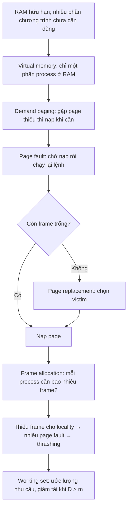
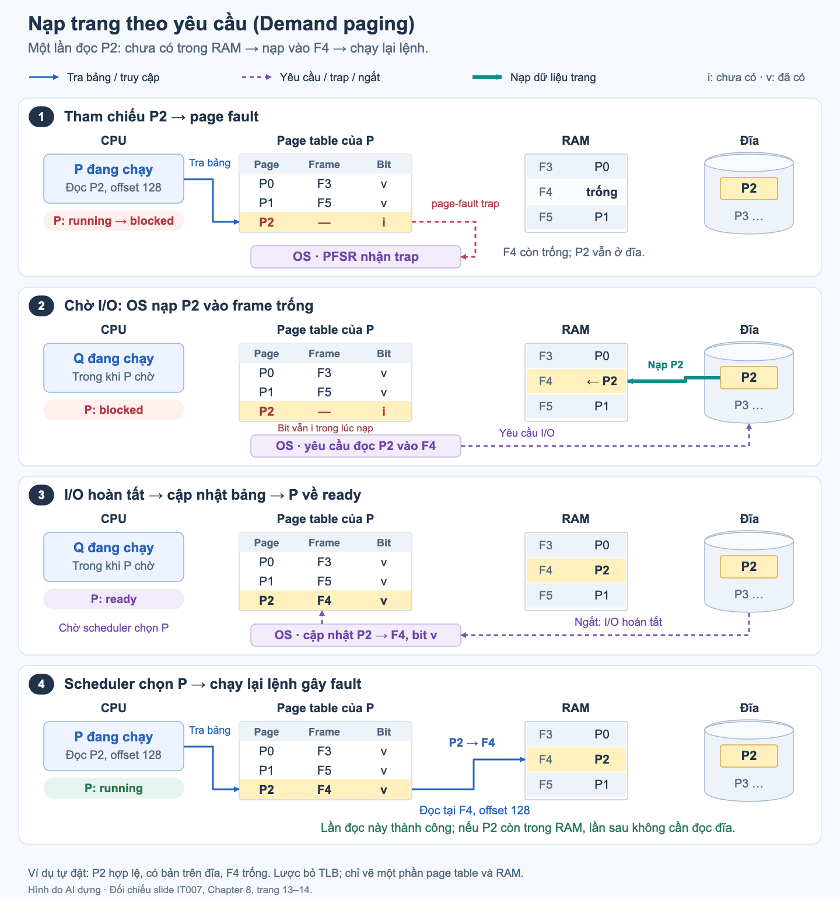

# L10 — Bộ nhớ ảo (Virtual Memory)

| | |
|---|---|
| Môn | `IT007` Hệ điều hành |
| Buổi | 10 |
| Ngày | 2026-09-11 — theo metadata của file `_raw` |
| Giảng viên | Nguyễn Thanh Thiện |
| Transcript | [`L10-2026-09-11.md`](_raw/L10-2026-09-11.md) chỉ ghi transcript Teams bị lỗi dịch/ngôn ngữ, không có lời giảng dùng được |
| Slide | **C8** = [Copy of #Week13-Chapter8 2024.pdf](../materials/slides/Copy%20of%20%23Week13-Chapter8%202024.pdf) |
| Code minh họa | [`virtual-memory-demo.py`](../code/L10/virtual-memory-demo.py), Python 3.9+, không cần dependency |

> ❓ **CẦN XÁC MINH:** Note dựa trên slide, chưa xác nhận được phạm vi giảng thực tế, lời nhấn mạnh khi thi và yêu cầu nộp bài của buổi này. Không suy diễn lời giảng từ thời lượng hay nội dung slide.
>
> **Cách đọc nguồn:** `[C8 sN]` là trang N của PDF, tính từ 1. Trích dẫn nguyên văn giữ trong blockquote; lời giải, code và ví dụ tự dựng được ghi rõ **ngoài slide**. Câu đề mẫu là tài liệu luyện tập, không phải đáp án chính thức hay lời dặn giảng viên.

---

## Mục lục

- [Tóm tắt một đoạn](#tóm-tắt-một-đoạn)
- [Gốc rễ của cả buổi](#gốc-rễ-của-cả-buổi)
- [Nội dung chính](#nội-dung-chính)
  - [1. Bộ nhớ ảo (Virtual memory)](#1-bộ-nhớ-ảo-virtual-memory)
  - [2. Phân trang theo yêu cầu (Demand paging)](#2-phân-trang-theo-yêu-cầu-demand-paging)
  - [3. Giải thuật thay trang (Page Replacement Algorithms)](#3-giải-thuật-thay-trang-page-replacement-algorithms)
  - [4. Cấp phát khung trang (Frame allocation)](#4-cấp-phát-khung-trang-frame-allocation)
  - [5. Trì trệ, tính cục bộ và tập làm việc (Thrashing, Locality & Working set)](#5-trì-trệ-tính-cục-bộ-và-tập-làm-việc-thrashing-locality--working-set)
- [Bảng tổng hợp](#bảng-tổng-hợp)
- [Sơ đồ](#sơ-đồ)
- [Gợi ý thi](#gợi-ý-thi)
- [Deadline phát sinh](#deadline-phát-sinh)
- [Chỗ chưa rõ](#chỗ-chưa-rõ)
- [Liên kết](#liên-kết)
- [Tự kiểm tra](#tự-kiểm-tra)

---

## Tóm tắt một đoạn

Virtual memory cho phép thực thi process khi chỉ một phần của nó ở RAM. Demand paging nạp page khi được tham chiếu; trong mô hình có disk I/O của slide, page fault khiến process chờ, OS nạp page và cập nhật ánh xạ rồi đưa process về ready. Khi không còn frame trống, page replacement chọn victim theo FIFO, OPT hoặc LRU; frame allocation lại quyết định mỗi process được bao nhiêu frame. Nếu nhu cầu các page đang dùng vượt RAM khả dụng, hệ thống có thể sa vào thrashing; working set xấp xỉ nhu cầu đó để điều chỉnh số process cùng hoạt động. [C8 s7–s19, s25–s46]

---

## Gốc rễ của cả buổi

**Suy luận nối các mục — ngoài slide, dựa trên C8 s7, s13, s19, s35, s41–s46.** Không phải mọi page đều được dùng cùng lúc, nên có thể chỉ giữ phần đang cần trong RAM. Nhưng làm vậy buộc hệ thống giải quyết ba việc: phát hiện page thiếu, tìm chỗ nạp page và giữ đủ frame cho phần process đang làm việc.



---

## Nội dung chính

### 1. Bộ nhớ ảo (Virtual memory)

#### 📚 Lý thuyết

**Gốc rễ — suy luận ngoài slide:**

- **Ngữ cảnh:** Chương 7 đã có page table để ánh xạ page của process vào frame vật lý.
- **Vấn đề gốc:** yêu cầu nạp toàn bộ process có thể giữ cả những page chưa dùng, gây áp lực lên RAM.
- **Sự thật nền 1:** trong mô hình chương này, page cần được đưa vào RAM trước khi truy cập lệnh/dữ liệu trong page đó.
- **Sự thật nền 2:** không phải mọi phần của process cần được dùng cùng lúc; slide nêu code xử lý lỗi hiếm xảy ra và tính năng ít dùng. [C8 s7]
- **Suy luận:** chỉ giữ phần cần dùng trong RAM, đồng thời quản lý phần còn lại và khả năng nạp khi cần ⇒ virtual memory.
- **Nếu không có:** trong mô hình nạp trọn, process 4 page không vừa vùng RAM chỉ có 2 frame dành cho nó; virtual memory bỏ yêu cầu phải cùng hiện diện cả 4 page.

**Định nghĩa nguyên văn [C8 s7]:**

> Bộ nhớ ảo là một kỹ thuật cho phép xử lý một tiến trình không được nạp toàn bộ vào bộ nhớ vật lý.

**Tính chất và điều kiện:**

- Slide nêu ba lợi ích: nhiều process có thể ở bộ nhớ hơn; process có thể lớn hơn bộ nhớ thực; giảm công việc quản lý nạp phần chương trình cho lập trình viên. Đây là khả năng, không bảo đảm mọi workload chạy nhanh. [C8 s8]
- Cần phần cứng hỗ trợ paging và/hoặc segmentation; OS quản lý sự di chuyển page/segment giữa bộ nhớ chính và thứ cấp. Chương này chỉ xét paging. [C8 s10]
- `Page` là đơn vị trong không gian địa chỉ của process; `frame` là chỗ chứa một page trong RAM. Paging ánh xạ được page vào frame không liên tục. [C8 s11; nền ở L08]
- Slide gọi vùng tráo đổi là **swap space**, ví dụ swap partition của Linux và `pagefile.sys` của Windows. [C8 s8]

**Giới hạn ngoài slide:** virtual memory không đồng nghĩa “ổ đĩa trở thành RAM nhanh như thật” hay “mọi page chưa ở RAM đều đã nằm trong swap”. Page có thể có bản ở file; vùng zero-fill có thể được tạo khi cần. Note dùng mô hình đơn giản có bản page trên đĩa khi giải thích PFSR.

#### 💡 Giải thích dễ hiểu

**Trực giác:** chỉ bày phần đang làm lên bàn, không cần bày toàn bộ công việc cùng lúc.

**Analogy:** bàn làm việc = RAM; ô đặt giấy = frame; tờ hồ sơ = page; tủ hồ sơ = nơi lưu phần chưa dùng. Bạn có bốn tờ nhưng chỉ cần hai tờ trên bàn để làm bước hiện tại.

*Chỗ analogy vỡ:* máy dùng địa chỉ và page table để truy cập, không tìm giấy bằng mắt; dữ liệu được nạp theo page có kích thước cố định, không theo ý nghĩa của một tài liệu.

**Ví dụ tự đặt — ngoài slide:** process có page `0,1,2,3`, được cấp 2 frame trống, lần lượt dùng `0,1,0`.

| Bước | Page cần | F0 | F1 | Kết quả |
|---:|---:|---:|---:|---|
| 1 | 0 | 0 | — | Fault, nạp page 0 |
| 2 | 1 | 0 | 1 | Fault, nạp page 1 |
| 3 | 0 | 0 | 1 | Hit; page 2, 3 vẫn chưa cần nạp |

```text
Không gian của process: [page 0] [page 1] [page 2] [page 3]
                           │        │       chưa nạp
                           ▼        ▼
RAM dành cho process:    [frame 0][frame 1]
```

#### 💻 Code & thực tế

**Mô hình tự dựng — ngoài slide:** chạy từ root repo:

```bash
python3 semesters/2025-2026-S3/IT007-operating-systems/code/L10/virtual-memory-demo.py overview
```

Kết quả đã chạy:

```text
Page của process: [0, 1, 2, 3]
Page đang ở RAM: [0, 1]
Chưa nạp: [2, 3]
Fault: 2 | Hit: 1
```

> **Trong production — ngoài slide:** khi đọc báo cáo memory của một process, dung lượng địa chỉ ảo và lượng đang resident trong RAM là hai đại lượng khác nhau; không suy ra RAM dùng thực chỉ từ kích thước vùng đã reserve.

#### ✍️ Bài tập

**Bài 1 — Hiểu · diễn đạt lại ý câu 6 và 10 của [đề mẫu](../exam-prep/exam-map.md):** “Process lớn hơn RAM có thể chạy nhờ virtual memory” có đồng nghĩa “process không cần RAM” hoặc “luôn chạy nhanh hơn” không?

> 🔑 **Kiến thức mở khoá:** định nghĩa chỉ bỏ điều kiện **nạp toàn bộ**, không bỏ yêu cầu phần đang truy cập phải có trong RAM; lợi ích dung lượng khác với hiệu năng.

<details><summary>Hướng giải</summary>

1. Tách toàn bộ không gian process khỏi phần đang cần dùng: chỉ phần thứ hai phải hiện diện tại thời điểm truy cập.
2. Vì vậy phát biểu “có thể lớn hơn RAM” đúng trong điều kiện hệ thống hỗ trợ và đủ tài nguyên. [C8 s8, s10]
3. “Không cần RAM” sai; “luôn nhanh hơn” cũng sai vì có thể phải chờ nạp page, thậm chí thrashing. [C8 s13, s39]

Đây là đáp án suy luận để luyện tập, không phải đáp án chính thức.

</details>

**Chốt mục:** virtual memory tách kích thước process khỏi yêu cầu tất cả page phải đồng thời ở RAM; đừng đồng nhất virtual size với RAM đang dùng.

---

### 2. Phân trang theo yêu cầu (Demand paging)

#### 📚 Lý thuyết

**Gốc rễ — suy luận ngoài slide:**

- **Ngữ cảnh:** một số page của process chưa nằm trong RAM.
- **Vấn đề gốc:** CPU vẫn có thể tham chiếu một page chưa nạp.
- **Sự thật nền 1:** phần cứng cần biết ánh xạ hiện tại có cho phép truy cập page trong RAM không.
- **Sự thật nền 2:** nạp page từ đĩa mất thời gian; khi chờ I/O, process chưa thể hoàn thành lệnh đang cần page đó.
- **Suy luận:** phát trap cho OS xử lý, chờ page được nạp, cập nhật bảng rồi chạy lại lệnh ⇒ cơ chế demand paging. [C8 s13–s14]
- **Nếu không có:** với P2 còn ở đĩa, dùng bừa frame của một ánh xạ chưa hợp lệ sẽ không lấy được dữ liệu đúng của P2.

**Định nghĩa nguyên văn [C8 s13]:**

> Demand paging: các trang của tiến trình chỉ được nạp vào bộ nhớ chính khi được yêu cầu.

**Ký hiệu và phạm vi:** trong hình slide, `v` chỉ page đang có trong RAM, `i` chỉ page chưa có. Note xét **địa chỉ hợp lệ nhưng page chưa resident**, có bản trên đĩa và cần disk I/O. Bit `i` không tự chứng minh địa chỉ là hợp lệ; OS còn phải phân biệt truy cập hợp lệ với vi phạm. Phân biệt này là **ngoài slide**, để tránh suy rộng mô hình.

**PFSR (page-fault service routine) theo C8 s13:**

1. Chuyển process gây page fault về `blocked`.
2. Yêu cầu đọc page vào frame trống; trong lúc chờ I/O, process khác có thể được cấp CPU.
3. I/O hoàn tất phát ngắt; OS cập nhật page table và chuyển process về `ready`.

Khi scheduler chọn lại process, **chạy lại lệnh gây fault**, không bỏ qua lệnh đó. Sơ đồ C8 s14 ghi `restart instruction`. `Ready` chưa phải `running`.

Nếu **hết frame trống**, chọn **victim page**, thu hồi frame, điều chỉnh ánh xạ rồi nạp page cần. C8 s17–s18 minh họa nhánh ghi victim ra đĩa trước khi thay.

> **Làm rõ ngoài slide:** không phải mọi victim đều cần ghi ra đĩa. Việc ghi phụ thuộc nội dung đã thay đổi (`dirty`) và có bản lưu phù hợp hay chưa; page sạch có thể được bỏ rồi nạp lại từ bản lưu. Cũng không phải mọi page fault trong OS thực đều phát sinh disk I/O.

| Tình huống trong mô hình | Page fault? | Replacement? |
|---|---|---|
| Page đã ở RAM, truy cập được phép | Không | Không |
| Page chưa ở RAM, còn frame trống | Có | Không |
| Page chưa ở RAM, hết frame trống | Có | Có |

#### 💡 Giải thích dễ hiểu

**Trực giác:** thiếu món đang cần thì tạm chờ lấy về; người khác vẫn tiếp tục làm việc.

**Analogy:** người đọc = process; sách = page; chỗ đặt sách = frame; thủ thư = OS. Bạn cần sách còn trong kho nên chờ thủ thư lấy; sách về thì bạn đủ điều kiện đọc tiếp.

*Chỗ analogy vỡ:* sách về không có nghĩa bạn lập tức được phục vụ. Process phải được scheduler chọn lại; lệnh gây fault được chạy lại với ánh xạ mới. Streaming có thể nạp trước, nên không dùng nó để suy ra rằng demand paging luôn tải trước page sắp cần.

**Ví dụ tự đặt — ngoài slide, cùng hình bên dưới:** P cần P2, P2 còn ở đĩa, F4 trống; Q là process khác sẵn sàng chạy.

| Thời điểm | Process P | Entry P2 | F4 | CPU / OS làm gì? |
|---|---|---|---|---|
| Trước tham chiếu | Running | `i`, chưa ánh xạ frame resident | Trống | P tham chiếu P2 |
| Trap và chờ đọc | Blocked | Vẫn `i` | Đang nạp | OS xử lý fault; Q có thể chạy trong lúc chờ |
| I/O xong | Ready | `F4, v` | P2 | OS cập nhật bảng, P chờ được chọn |
| Được chọn lại | Running | `F4, v` | P2 | P chạy lại lệnh; offset giữ nguyên |



*Hình do AI dựng, đối chiếu [slide Chapter 8, trang 13–14](../materials/slides/Copy%20of%20%23Week13-Chapter8%202024.pdf#page=13). Ví dụ P, Q, P2, F4 và offset 128 tự đặt; giả sử P2 là page hợp lệ, chưa có trong RAM, có bản trên đĩa và F4 trống. Hình lược bỏ TLB, chỉ hiển thị một phần page table và RAM; i/v biểu thị chưa/đã có trong RAM theo mô hình slide.*

[SVG chỉnh sửa](images/demand-paging-mechanism.svg)

**Đọc hình:**

- **Cảnh 1:** CPU tham chiếu P2, gặp bit i nên phát sinh page-fault trap. PFSR đưa P về blocked.
- **Cảnh 2:** OS yêu cầu đọc P2 vào F4; mũi tên xanh ngọc thể hiện dữ liệu được nạp từ đĩa vào RAM. Trong lúc P chờ I/O, Q dùng CPU; bit của P2 vẫn là i.
- **Cảnh 3:** I/O hoàn tất, OS xử lý ngắt, ghi ánh xạ P2 → F4 và đổi bit sang v, rồi đưa P về ready. P vẫn phải chờ scheduler chọn mới được chạy.
- **Cảnh 4:** Khi được cấp CPU, P chạy lại lệnh gây fault; cùng offset 128 nay được truy cập trong F4. Nếu P2 còn ở RAM, lần tham chiếu sau không cần đọc lại đĩa.


#### 💻 Code & thực tế

**Không áp dụng trực tiếp trong Python user-space — trap và PFSR là công việc của phần cứng/kernel.** Code ở mục 3 chỉ mô phỏng điều kiện hit/fault và nội dung frame; không mô phỏng scheduler, ngắt hay thời gian I/O.

> **Trong production — ngoài slide:** lần chạm đầu tiên vào vùng nhớ có thể đắt hơn những lần sau. Tuy nhiên không kết luận có truy cập đĩa chỉ từ số page fault; cần phân biệt loại fault và quan sát I/O thực tế.

#### ✍️ Bài tập

**Bài 1 — Hiểu · diễn đạt lại quy trình ở câu 19 [đề mẫu](../exam-prep/chapter8-exam-study-guide.md):** sắp xếp ba hành động: A — cập nhật bảng và ready sau I/O; B — blocked; C — yêu cầu đọc page và nhường CPU khi chờ. Sau A có chạy ngay không?

> 🔑 **Kiến thức mở khoá:** page phải có dữ liệu trước khi ánh xạ được dùng; `blocked → ready → running` là ba thời điểm khác nhau.

<details><summary>Hướng giải</summary>

Thứ tự theo nhãn **của bài này** là **B → C → A**. Sau A, scheduler mới có thể chọn process; khi được chọn thì chạy lại lệnh. Nhãn chữ ở đây tự đặt, không thay thế số thứ tự hành động trong đề gốc. [C8 s13–s14]

</details>

**Bài 2 — Vận dụng · tự đặt:** RAM có P0 và một frame trống, P2 còn ở đĩa. Tham chiếu P2 rồi P2 lần nữa, không có eviction xen giữa. Đếm fault, replacement và số lần nạp từ đĩa trong mô hình này.

> 🔑 **Kiến thức mở khoá:** fault do page chưa có; replacement chỉ xảy ra khi cần thu hồi frame đang dùng.

<details><summary>Hướng giải</summary>

Lần đầu: 1 fault, dùng frame trống nên 0 replacement; đọc P2 từ đĩa 1 lần. Lần sau P2 vẫn ở RAM nên hit. Tổng **1 fault, 0 replacement, 1 lần nạp**. Đã đối chiếu mô phỏng chuỗi `[2,2]` với frame trống và kiểm lại theo hai trạng thái trước/sau nạp.

</details>

**Chốt mục:** page fault ≠ replacement; kết thúc I/O đưa process về ready, sau đó mới được chọn và chạy lại lệnh.

---

### 3. Giải thuật thay trang (Page Replacement Algorithms)

#### 📚 Lý thuyết

**Gốc rễ — suy luận ngoài slide:**

- **Ngữ cảnh:** page cần chưa ở RAM và mọi frame được cấp đã có page.
- **Vấn đề gốc:** muốn nạp page mới phải chọn một page đang có để nhường chỗ.
- **Sự thật nền 1:** mỗi frame chỉ chứa một page tại một thời điểm trong mô hình.
- **Sự thật nền 2:** page bị đuổi có thể được dùng lại; chọn victim khác nhau làm số fault sau đó khác nhau.
- **Suy luận:** cần một quy tắc chọn victim và so sánh trên cùng chuỗi tham chiếu ⇒ bài toán page replacement. [C8 s19, s22]
- **Nếu chọn kém:** cùng chuỗi slide và 3 frame, FIFO có 15 fault, còn OPT có 9; chênh lệch 6 lần phải xử lý fault. [C8 s25, s30]

**Mục tiêu nguyên văn [C8 s19]:**

> Mục tiêu: số lượng page-fault nhỏ nhất.

**Ba quy tắc:**

- **FIFO — First In First Out**, nguyên văn [C8 s25]:
  > Giải thuật thay trang FIFO thay thế trang nhớ có thời gian được nạp vào bộ nhớ sớm nhất trong các trang nhớ.
- **OPT — Optimal**, nguyên văn phần chọn victim [C8 s30]:
  > Giải thuật thay trang OPT thay thế trang nhớ sẽ được tham chiếu trễ nhất trong tương lai
- **LRU — Least Recently Used**, nguyên văn phần chọn victim [C8 s32]:
  > trang LRU là trang nhớ có thời điểm tham chiếu nhỏ nhất

Với LRU, “thời điểm tham chiếu” là **lần tham chiếu gần nhất** của mỗi page đang ở RAM. Dùng `last_used[p]`, chọn giá trị nhỏ nhất; sau **mọi** tham chiếu, kể cả hit, cập nhật `last_used[p]`. FIFO chỉ cập nhật thứ tự khi **nạp**. OPT nhìn phần chuỗi **sau** tham chiếu hiện tại, coi page không dùng lại có thời điểm tiếp theo là `∞`; nếu nhiều page đồng hạng thì có thể chọn một trong số đó. Quy ước tie-break của code: frame có chỉ số nhỏ nhất.

| Giải thuật | Cần nhớ/biết | Khi hit | Giới hạn |
|---|---|---|---|
| FIFO | Thứ tự nạp page | Không đổi thứ tự nạp | Có thể gặp Belady |
| OPT | Lần dùng tiếp theo trong tương lai | Xét phần chuỗi còn lại khi cần chọn victim | Là mốc tối ưu cho chuỗi đã biết; không biết chính xác tương lai khi chạy thật |
| LRU | Lần dùng gần nhất trong quá khứ | Phải cập nhật | Theo dõi chính xác tốn chi phí, cần hỗ trợ phù hợp [C8 s32] |

**Nghịch lý Belady (Belady's Anomaly), nguyên văn [C8 s28]:**

> Bất thường (anomaly) Belady: số page fault tăng mặc dù tiến trình đã được cấp nhiều frame hơn.

FIFO có thể gặp hiện tượng này; **không** có nghĩa mọi lần tăng frame đều làm FIFO tệ hơn. Chuỗi C8 s27: `1,2,3,4,1,2,5,1,2,3,4,5` cho 9 fault với 3 frame, 10 với 4 frame.

**Dữ liệu đầu vào bắt buộc:** chuỗi page, số frame, trạng thái ban đầu. Nếu đề đưa địa chỉ `A` và page size `S`, đổi `page = floor(A/S)` trước; C8 s20 dùng `S=100`, nên `0098 → 0`, `0432 → 4`, `0201 → 2`. Giữ nguyên các tham chiếu lặp khi trace. [C8 s20, s22]

**Cách kiểm:** `hit + fault = số tham chiếu`. Nạp vào frame rỗng vẫn là fault. Frame vật lý cố định; danh sách thứ tự FIFO/LRU là dữ liệu phụ, không phải lý do xáo lại vị trí frame.

#### 💡 Giải thích dễ hiểu

**Trực giác:** chọn cất món nào để ít phải đi lấy lại nhất.

**Analogy:** trên bàn có hai cuốn sách. FIFO cất cuốn đặt lên bàn trước; LRU cất cuốn lâu nhất chưa đọc; OPT biết trước lịch đọc nên cất cuốn còn lâu nhất mới cần.

*Chỗ analogy vỡ:* người đọc có thể biết lịch việc sắp tới, còn OS không biết chính xác toàn bộ tương lai của chương trình. OPT là chuẩn so sánh, không phải dự báo chắc chắn.

**Ví dụ nhỏ tự đặt:** 2 frame rỗng, chuỗi `1,2,1,3,1`.

| Bước | Page | FIFO: F0, F1 | FIFO: H/F, victim | LRU: F0, F1 | LRU: H/F, victim |
|---:|---:|---|---|---|---|
| 1 | 1 | `1, —` | F, — | `1, —` | F, — |
| 2 | 2 | `1, 2` | F, — | `1, 2` | F, — |
| 3 | 1 | `1, 2` | H, — | `1, 2` | H, — |
| 4 | 3 | `3, 2` | F, **1** | `1, 3` | F, **2** |
| 5 | 1 | `3, 1` | F, 2 | `1, 3` | H, — |

Bước 3 là chỗ quyết định: lần hit page 1 làm page 2 trở thành LRU, nhưng không thay đổi thứ tự nạp FIFO. OPT tại bước 4 cũng chọn page 2 vì chuỗi còn lại chỉ dùng page 1. Tổng FIFO **4**, LRU **3**, OPT **3** fault; đã kiểm bằng code.

```text
Tham chiếu page
    ├─ Có trong frame → HIT → cập nhật lần dùng nếu LRU
    └─ Chưa có        → FAULT
                          ├─ Còn frame trống → nạp vào
                          └─ Hết frame → chọn victim → thay → cập nhật metadata
```

**Ví dụ chuẩn slide:** 3 frame rỗng, chuỗi `7,0,1,2,0,3,0,4,2,3,0,3,2,1,2,0,1,7,0,1` → FIFO **15**, OPT **9**, LRU **12**. [C8 s24–s32]

#### 💻 Code & thực tế

**Code tự dựng — ngoài slide:** hàm `simulate` trong [virtual-memory-demo.py](../code/L10/virtual-memory-demo.py) giữ nguyên vị trí frame và trả lại từng bước: page, frames, hit/fault, victim, fault lũy kế. `None` là ô trống; page 0 vẫn là page hợp lệ. Mô hình giả sử mọi frame ban đầu rỗng, không tính thời gian I/O hay dirty bit.

Chạy từ root repo:

```bash
python3 semesters/2025-2026-S3/IT007-operating-systems/code/L10/virtual-memory-demo.py algorithms
```

Kết quả thật:

```text
C8 s24–32: FIFO=15, OPT=9, LRU=12
C8 s49: FIFO=13, OPT=8, LRU=10
Belady FIFO: 3 frame=9, 4 frame=10
Đề mẫu C22: LRU=13, victim lần đầu gặp 7=5
```

Xem từng frame của bài slide trang 49 bằng:

```bash
python3 semesters/2025-2026-S3/IT007-operating-systems/code/L10/virtual-memory-demo.py --trace LRU
```

Có thể thay `LRU` bằng `FIFO` hoặc `OPT`. Đây là kết quả mô phỏng, không phải đo RAM hay page fault của OS đang chạy.

> **Trong production — ngoài slide:** ý tưởng LRU gặp trong application cache: một lần cache hit phải cập nhật recency. Nhưng cache entry có thể khác kích thước, có TTL và chi phí tải khác nhau; bảng page cố định ở đây không bao phủ các yếu tố đó.

#### ✍️ Bài tập

**Bài 1 — Vận dụng · [C8 s49]:** chuỗi `1,2,3,4,2,1,5,6,2,1,2,3,7,6,3,2,1`, 4 frame. Tính fault của LRU, FIFO, OPT. **Giả thiết bổ sung:** frame ban đầu rỗng, vì trang 49 không ghi trạng thái đầu. Hiện chưa có bằng chứng bài này là mục nộp có deadline; dùng như bài luyện từ slide.

> 🔑 **Kiến thức mở khoá:** kiểm page có trong RAM trước; chỉ chọn victim khi fault và hết chỗ. LRU cập nhật cả hit, FIFO theo lần nạp, OPT theo phần chuỗi tương lai.

<details><summary>Hướng giải và bảng kiểm đếm</summary>

1. Vẽ 4 hàng frame, đánh số 17 tham chiếu.
2. Bốn lần đầu đều fault để lấp frame. Bước 5, 6 là hit; LRU vẫn phải cập nhật recency của page 2 và 1.
3. Bước 7 cần page 5: FIFO chọn 1; LRU chọn 3; OPT chọn 4 vì page 4 không dùng lại.
4. Tiếp tục tới hết, dùng bảng dưới kiểm lại hit + fault = 17.

| Thuật toán | Các bước hit | Số hit | Số fault | Số replacement |
|---|---|---:|---:|---:|
| FIFO | 5, 6, 11, 15 | 4 | **13** | 9 |
| OPT | 5, 6, 9, 10, 11, 12, 14, 15, 16 | 9 | **8** | 4 |
| LRU | 5, 6, 9, 10, 11, 15, 16 | 7 | **10** | 6 |

Số replacement = số fault − 4 lần lấp frame ban đầu, **chỉ với dữ kiện bài này**. Code in trace để đối chiếu từng victim. Các số là lời giải tự tính, không phải đáp án ghi sẵn trên slide.

</details>

**Bài 2 — Phân tích · [C8 s27–s28]:** vì sao kết quả FIFO 9 fault với 3 frame và 10 fault với 4 frame bác bỏ khẳng định “thêm frame luôn giảm fault”?

> 🔑 **Kiến thức mở khoá:** FIFO bảo toàn thứ tự nạp, không bảo toàn nhóm page cần nhất; định nghĩa Belady chỉ cần một phản ví dụ.

<details><summary>Hướng giải</summary>

Giữ cùng chuỗi `1,2,3,4,1,2,5,1,2,3,4,5`, cùng trạng thái rỗng ban đầu, chỉ đổi capacity. Với 3 frame, hit ở bước 8, 9, 12 → `12−3=9` fault. Với 4 frame, hit ở bước 5, 6 → `12−2=10` fault. Số frame tăng mà fault cũng tăng, đúng định nghĩa Belady. Không suy ra “thêm RAM luôn có hại”.

</details>

**Bài 3 — Vận dụng · đề mẫu câu 22a–22b:** 4 frame rỗng, LRU, chuỗi `1,3,2,4,5,4,0,1,7,4,1,3,2,7,1,3,5,2`. Tính fault và victim khi page 7 xuất hiện lần đầu.

> 🔑 **Kiến thức mở khoá:** so **lần dùng gần nhất** của page đang resident, không so lần nạp hoặc số hiệu page.

<details><summary>Hướng giải</summary>

Trước bước 9, các frame chứa `5,0,1,4`; lần dùng gần nhất lần lượt là `5,7,8,6`. Chọn page **5** vì timestamp nhỏ nhất, thay bằng page 7. Toàn chuỗi có **13 fault**, 5 hit, 9 replacement. Xem [bảng 18 bước và câu 22](../exam-prep/chapter8-exam-study-guide.md); kết quả dùng giả thiết frame rỗng, là đáp án suy luận.

</details>

**Chốt mục:** FIFO nhìn lần nạp, LRU nhìn lần dùng gần nhất, OPT nhìn lần dùng tiếp theo; không bỏ qua hit khi cập nhật LRU và không bỏ lỗi nạp ban đầu khi đếm fault.

---

### 4. Cấp phát khung trang (Frame allocation)

#### 📚 Lý thuyết

**Gốc rễ — suy luận ngoài slide:**

- **Ngữ cảnh:** nhiều process cạnh tranh số frame hữu hạn.
- **Vấn đề gốc:** replacement chọn victim nhưng chưa trả lời mỗi process được bao nhiêu frame.
- **Sự thật nền 1:** tổng frame đang cấp phải nằm trong ngân sách RAM khả dụng.
- **Sự thật nền 2:** mỗi process có nhu cầu khác nhau và nhu cầu có thể đổi khi chạy.
- **Suy luận:** cần phân phối ngân sách frame trước hoặc trong lúc chạy ⇒ frame allocation. [C8 s19, s35]
- **Nếu cấp lệch:** dồn hết 12 frame cho một process có thể không còn frame cho process khác, dù process đầu chỉ đang cần 4.

**Phân biệt nguyên văn [C8 s19]:**

> Frame-allocation algorithm
>
> Cấp phát cho tiến trình bao nhiêu frame của bộ nhớ thực?

**Chiến lược [C8 s35]:**

- **Fixed-allocation**, nguyên văn: “Số frame cấp cho mỗi tiến trình không đổi, được xác định vào thời điểm loading”.
- **Variable-allocation**, nguyên văn: “Số frame cấp cho mỗi tiến trình có thể thay đổi trong khi nó chạy”. Slide nêu tăng frame nếu tỷ lệ fault cao, giảm nếu thấp; OS phải chịu chi phí ước định nhu cầu.

Cấp ít frame dễ làm tăng fault; cấp nhiều cho mỗi process có thể giảm số process cùng ở bộ nhớ, tức mức multiprogramming. [C8 s35]

**Ba cách cấp tĩnh [C8 s37]:**

| Cách cấp | Quy tắc / ví dụ |
|---|---|
| Bằng nhau | 100 frame / 5 process → 20 frame mỗi process |
| Theo tỷ lệ kích thước | `S = Σs_i`; `a_i = (s_i/S) × m` |
| Theo độ ưu tiên | Ưu tiên khác nhau có thể nhận ngân sách khác nhau; slide không đưa công thức |

`m` là tổng frame xét cấp, `s_i` là kích thước process, `a_i` là số frame cấp cho process đó. Frame phải nguyên: ví dụ slide `m=64`, `s1=10`, `s2=127` ghi `a1≈5`, `a2≈59`. Giá trị trước làm tròn là `4,6715` và `59,3285`; **slide không quy định quy tắc làm tròn tổng quát**, nên không tự áp dụng máy móc cho mọi bộ số.

#### 💡 Giải thích dễ hiểu

**Trực giác:** chia bao nhiêu chỗ cho mỗi người là một việc; chọn món cần cất trong phần chỗ đó là việc khác.

**Analogy:** thư viện chia bàn cho hai người. Frame allocation quyết định mỗi người có mấy chỗ để sách; replacement quyết định người đó cất cuốn nào khi hết chỗ.

*Chỗ analogy vỡ:* process có thể đổi nhu cầu liên tục và OS có cơ chế thu hồi/chuyển ngân sách frame; chỗ ngồi cố định của người thật không mô tả đầy đủ việc này.

**Ví dụ tự đặt:** 12 frame, kích thước hai process là 2 và 4 đơn vị cùng loại.

| Cách cấp | P1 | P2 | Kiểm tổng |
|---|---:|---:|---:|
| Chia đều | 6 | 6 | 12 |
| Theo tỷ lệ | `2/6×12=4` | `4/6×12=8` | 12 |

```text
Ngân sách 12 frame → [P1: 4 frame] + [P2: 8 frame]
                       │                 │
                   Chọn victim       Chọn victim
                   khi cần thay      khi cần thay
```

Sơ đồ minh họa hai quyết định; không bổ sung quy tắc global/local replacement mà slide chưa giải thích.

#### 💻 Code & thực tế

Chạy ví dụ đã kiểm bằng phân số chính xác:

```bash
python3 semesters/2025-2026-S3/IT007-operating-systems/code/L10/virtual-memory-demo.py allocation
```

```text
m=12, s=[2, 4] → a=[4, 8]
C8 s37, giá trị trước khi làm tròn: 4.6715, 59.3285
```

> **Trong production — ngoài slide:** memory limit của container là giới hạn tài nguyên, không tự bảo đảm ứng dụng có đủ RAM cho working set. Cần xem cả nhu cầu lúc tải cao; không đồng nhất limit với một chính sách fixed-allocation của bài học.

#### ✍️ Bài tập

**Bài 1 — Vận dụng · tự đặt từ công thức C8 s37:** 12 frame, hai process kích thước 2 và 4. So sánh chia đều với chia theo tỷ lệ; mỗi process dùng FIFO hay LRU có làm thay đổi công thức tỷ lệ không?

> 🔑 **Kiến thức mở khoá:** allocation quyết định **số lượng**; replacement quyết định **victim**. Tỷ lệ dựa vào `s_i/S`, không dựa tên thuật toán thay trang.

<details><summary>Hướng giải</summary>

Tổng kích thước `S=6`. Chia đều: `6,6`; theo tỷ lệ: `4,8`. Cả hai cộng lại đúng 12. Đổi FIFO thành LRU không đổi dữ kiện công thức tỷ lệ này. Đã kiểm bằng code và tính ngược tỷ lệ `4:8=2:4`.

</details>

**Chốt mục:** “bao nhiêu frame?” là allocation; “thay page nào?” là replacement. Khi số frame tính ra lẻ, cần quy ước làm tròn và kiểm tổng.

---

### 5. Trì trệ, tính cục bộ và tập làm việc (Thrashing, Locality & Working set)

#### 📚 Lý thuyết

**Gốc rễ — suy luận ngoài slide:**

- **Ngữ cảnh:** dù đã có replacement, hệ thống vẫn có thể chờ nạp page quá nhiều.
- **Vấn đề gốc:** chọn victim tốt không tạo thêm frame khi tập page đang cần lớn hơn ngân sách.
- **Sự thật nền 1:** process thường tham chiếu lặp lại một nhóm page trong một giai đoạn, rồi chuyển sang nhóm khác. [C8 s41]
- **Sự thật nền 2:** nếu nhóm đang dùng không vừa RAM được cấp, đuổi một page có thể sớm phải nạp lại chính nó.
- **Suy luận:** cần ước lượng nhóm page đang dùng, cấp đủ chỗ hoặc giảm số process cùng hoạt động ⇒ working set để hạn chế thrashing. [C8 s43–s46]
- **Nếu thiếu:** chuỗi lặp `1,2,3,1,2,3` với LRU và 2 frame rỗng fault cả 6 lần; 3 frame chỉ fault 3 lần đầu.

**Thrashing, nguyên văn [C8 s39]:**

> Thrashing: hiện tượng các trang nhớ của một tiến trình bị hoán chuyển vào/ra liên tục.

Slide mô tả page faults/sec rất cao khi process không đủ frame; đồ thị CPU utilization tăng theo mức multiprogramming tới một điểm rồi sụp xuống. Một fault đơn lẻ không đủ kết luận thrashing; vấn đề là tải nạp/thay trang lặp lại làm công việc hữu ích tiến triển kém.

**Locality, nguyên văn [C8 s41]:**

> Locality là tập các trang được tham chiếu gần nhau.

Process gồm nhiều locality và chuyển giữa các locality. Slide nêu điều kiện `Σ size of locality > memory size`; khi áp dụng phải đo nhu cầu và khả năng chứa theo đơn vị tương thích, ví dụ page và frame cùng kích thước.

**Working set, nguyên văn [C8 s44]:**

> Working set của tiến trình Pi, ký hiệu WSi, là tập gồm Δ các trang được sử dụng gần đây nhất.

**Đọc chính xác câu rút gọn của slide:** Δ là **độ dài cửa sổ quan sát**, không phải số page phân biệt bắt buộc trong tập. Theo ví dụ slide với Δ=10, `WS(t1)={1,2,5,6,7}` nhưng `WSS(t1)=5`; `WS(t2)={3,4}`, `WSS(t2)=2`. [C8 s43–s45]

Trong mô hình đếm theo lần tham chiếu của note:

```text
WS(t, Δ) = tập các page phân biệt trong Δ tham chiếu gần nhất, tính cả bước t
WSS_i = |WS_i|                         (số page phân biệt)
D = Σ WSS_i                           (tổng nhu cầu frame)
m = số frame khả dụng trong mô hình
```

`WSS_i` là “số lượng các trang trong WS_i” theo C8 s45. Working set **xấp xỉ locality**, không phải danh sách toàn bộ page đang ở RAM. [C8 s44]

| Chọn Δ | Hệ quả theo slide |
|---|---|
| Quá nhỏ | Không bao phủ đủ locality hiện tại |
| Quá lớn | Gộp nhiều locality khác nhau |
| Δ = ∞ | Bao gồm mọi page đã dùng |

**Giải pháp theo mô hình C8 s46:** cung cấp frame thỏa nhu cầu working set; nếu `D > m`, tạm dừng một process và thu hồi frame. Nếu vẫn thiếu thì cần tiếp tục giảm tải — suy luận ngoài slide từ bất đẳng thức. Đây là mô hình không xét chia sẻ page; trong OS thực `D > m` là tín hiệu áp lực theo cách ước lượng, không phải phép đo tuyệt đối cho mọi workload.

#### 💡 Giải thích dễ hiểu

**Trực giác:** nếu cứ phải cất món vừa dùng để lấy món khác rồi lập tức lấy lại, thời gian chủ yếu mất vào việc đi lấy đồ.

**Analogy:** đang nấu một món cần dao, thớt, bát nhưng bàn chỉ để vừa hai món. Cất món nào cũng có thể sớm cần lại. Locality là nhóm đồ đang cần cho công đoạn; working set là nhóm đồ bạn vừa thực sự dùng để ước lượng nhu cầu mặt bàn.

*Chỗ analogy vỡ:* working set nhìn **lịch sử**, không biết chắc đồ cần tiếp theo; chọn cửa sổ quá ngắn/dài có thể đo sai nhu cầu hiện tại.

**Trace tự đặt — LRU, 2 frame rỗng:**

| Bước | Page | F0 | F1 | H/F | Victim |
|---:|---:|---:|---:|---|---:|
| 1 | 1 | 1 | — | F | — |
| 2 | 2 | 1 | 2 | F | — |
| 3 | 3 | 3 | 2 | F | 1 |
| 4 | 1 | 3 | 1 | F | 2 |
| 5 | 2 | 2 | 1 | F | 3 |
| 6 | 3 | 2 | 3 | F | 1 |

6 fault minh họa việc thiếu frame cho nhóm ba page; code không đo thời gian I/O nên chỉ là minh họa cơ chế dẫn tới thrashing, không phải benchmark thrashing thực.

**Trace working set tự đặt:** chuỗi `1,2,1,3,2,4`, Δ=4.

| t | Cửa sổ 4 tham chiếu kết thúc tại t | WS | WSS |
|---:|---|---|---:|
| 4 | `1,2,1,3` | `{1,2,3}` | 3 |
| 5 | `2,1,3,2` | `{1,2,3}` | 3 |
| 6 | `1,3,2,4` | `{1,2,3,4}` | 4 |

```text
Tham chiếu gần đây → lấy cửa sổ Δ → bỏ page trùng → WS → đếm → WSS
                                                            │
Mọi process đang xét ────────────────────────────────────────┘
                     Σ WSS = D
                         │
                  D > m? ├─ Có → giảm tải / thu hồi frame theo mô hình
                         └─ Không → tiếp tục theo dõi; nhu cầu có thể đổi
```

#### 💻 Code & thực tế

Hàm cốt lõi của mô hình là lấy tập từ cửa sổ: `set(refs[max(0, t-window):t])`, với `t` đếm từ 1 và bao gồm tham chiếu thứ t. Chạy từ root:

```bash
python3 semesters/2025-2026-S3/IT007-operating-systems/code/L10/virtual-memory-demo.py working-set
```

```text
t=4, Δ=4: WS=[1, 2, 3], WSS=3
t=5, Δ=4: WS=[1, 2, 3], WSS=3
t=6, Δ=4: WS=[1, 2, 3, 4], WSS=4
LRU, chuỗi 1 2 3 1 2 3, 2 frame: 6 fault
LRU, chuỗi 1 2 3 1 2 3, 3 frame: 3 fault
WSS=[3, 4], m=6 → D=7 > 6
```

Danh sách in ra đã sắp xếp để dễ đọc, còn `WS` trong code là tập hợp. Các kết quả đã chạy và đối chiếu với bảng trace.

> **Trong production — ngoài slide:** tăng concurrency có thể làm nhiều working set cạnh tranh RAM. Khi throughput giảm và I/O tăng, cần xem áp lực bộ nhớ cùng CPU; CPU utilization thấp không tự chứng minh máy đang thiếu việc.

#### ✍️ Bài tập

**Bài 1 — Vận dụng · tự đặt từ C8 s43–s45:** với chuỗi `1,2,1,3,2,4`, tính WS và WSS tại t=5 khi Δ=4. Nếu tăng Δ lên 5 thì WSS có bắt buộc tăng không?

> 🔑 **Kiến thức mở khoá:** Δ đếm số tham chiếu trong cửa sổ; WSS đếm page **phân biệt**.

<details><summary>Hướng giải</summary>

Δ=4: lấy bước 2–5 là `2,1,3,2`, bỏ trùng → `{1,2,3}`, WSS=3. Δ=5: lấy bước 1–5 là `1,2,1,3,2`, tập vẫn `{1,2,3}`. Cửa sổ lớn hơn không buộc số page phân biệt tăng. Đã kiểm bằng `working_set` và liệt kê cửa sổ.

</details>

**Bài 2 — Phân tích · tự đặt từ C8 s46:** hai process có WSS lần lượt 3 và 4, hệ thống có 6 frame khả dụng. Chỉ đổi FIFO sang LRU có tạo đủ chỗ cho cả hai working set không? Nếu tạm dừng process thứ hai thì sao?

> 🔑 **Kiến thức mở khoá:** replacement không tăng ngân sách frame; tổng nhu cầu `D=ΣWSS_i` phải được so với `m`.

<details><summary>Hướng giải</summary>

`D=3+4=7>6`, thiếu 1 frame theo mô hình. Đổi victim policy không tạo thêm frame để cùng chứa 7 page. Tạm dừng process thứ hai làm nhu cầu các process tiếp tục hoạt động còn 3, vừa 6 frame. Đây chỉ là một lựa chọn minh họa; slide không quy định luôn phải chọn process nào để tạm dừng.

</details>

**Chốt mục:** working set là tập page trong cửa sổ, WSS là số phần tử của tập; `D>m` nhắc xem lại tổng tải, không chỉ thuật toán victim.

---

## Bảng tổng hợp

| Câu hỏi cần trả lời | Khái niệm | Bẫy cần tránh |
|---|---|---|
| Có phải nạp toàn bộ process? | Virtual memory: không cần cùng nạp toàn bộ | Không đồng nghĩa chạy không cần RAM |
| Khi nào nạp page? | Demand paging: khi được yêu cầu | Không tự thêm prefetch vào định nghĩa slide |
| Page chưa có thì xử lý sao? | Page fault → PFSR → nạp → ready → được chọn, chạy lại lệnh | Ready chưa phải running |
| Chọn page nào nhường chỗ? | FIFO / OPT / LRU | Đừng nhầm thời điểm nạp, lần dùng gần nhất, lần dùng tiếp theo |
| Mỗi process nhận bao nhiêu frame? | Frame allocation | Không phải page replacement |
| Vì sao liên tục phải đổi page? | Thiếu frame cho locality → nguy cơ thrashing | Fault đơn lẻ chưa đủ kết luận |
| Ước lượng nhu cầu bằng gì? | WS, WSS, D so với m | Δ không nhất thiết bằng WSS |

## Sơ đồ

```text
Địa chỉ hợp lệ, page chưa ở RAM
             │
             ▼
      Page-fault trap → OS/PFSR → process blocked
             │
      Có frame trống?
       ├─ Có ─────────────────────────────────────┐
       └─ Không → chọn victim → ghi lại nếu cần* ─┤
                                                  ▼
                                        Nạp page vào frame
                                                  │ I/O xong
                                                  ▼
                                  Cập nhật bảng → process ready
                                                  │ scheduler chọn
                                                  ▼
                                         Chạy lại lệnh gây fault
```

`*` Slide s17–s18 minh họa bước ghi victim ra đĩa; điều kiện “nếu cần” là phần làm rõ ngoài slide về dirty page/bản lưu. Sơ đồ giả sử page hợp lệ và phải đọc đĩa, không bao quát mọi loại fault của OS thực.

---

## Gợi ý thi

**Chưa trích được gợi ý thi từ lời giảng viên:** `_raw` không có transcript dùng được. Không thêm suy đoán vào `IMPORTANT_NOTES.md`.

Để luyện có mục tiêu, [map đề mẫu](../exam-prep/exam-map.md) có câu **6, 8, 10, 12, 19, 22a, 22b, 23b** liên quan Chương 8. Đây chỉ là bằng chứng của **một đề tham khảo**, không bảo đảm đề sắp tới có cùng trọng số hay phạm vi.

## Deadline phát sinh

Không xác định được deadline mới từ nguồn hiện có. Bài C8 s49 có đề nhưng không ghi hạn nộp; không tự tạo task có ngày đoán. Lịch thi và các buổi ôn đang theo dõi tại [task HK3](../../../../admin/tasks-2025-2026-S3.md).

## Chỗ chưa rõ

> ❓ **CẦN XÁC MINH:** Phạm vi giảng thực tế, ví dụ nói thêm và lời dặn thi của buổi 10 do transcript Teams không dùng được.
>
> ❓ **CẦN XÁC MINH:** Bài trang 49 là luyện trên lớp hay bài phải nộp; nếu phải nộp thì hạn và yêu cầu trình bày là gì. Lời giải trong note dùng giả thiết frame rỗng ban đầu.
>
> ❓ **CẦN XÁC MINH:** Quy tắc làm tròn frame khi cấp theo tỷ lệ cho dữ kiện khác ví dụ trang 37; slide chỉ cho kết quả xấp xỉ của một trường hợp.

## Liên kết

- **Nguồn C8:** [Copy of #Week13-Chapter8 2024.pdf](../materials/slides/Copy%20of%20%23Week13-Chapter8%202024.pdf) — s7–s11: virtual memory; s13–s19: demand paging/replacement; s20–s33: FIFO/OPT/LRU; s35–s37: allocation; s39–s47: thrashing/working set; s49: bài tập.
- [L08 — Quản lý bộ nhớ](L08-memory-management.md): nền page/frame, page table và chuyển đổi địa chỉ.
- [Ôn Chương 8 và hướng dẫn đề mẫu](../exam-prep/chapter8-exam-study-guide.md).
- [Code đã chạy kiểm chứng](../code/L10/virtual-memory-demo.py) · [Flashcard](../exam-prep/flashcards.md) · [Anki CSV](../exam-prep/flashcards.csv).
- [Ghi chú quan trọng của môn](../IMPORTANT_NOTES.md).

---

## Tự kiểm tra

**1.** Process có 4 page, chỉ 2 frame. Khi dùng page chưa resident nhưng có frame trống, có fault không, có replacement không? Virtual memory giúp ở điểm nào?

<details><summary>Đáp án</summary>

Có fault vì thiếu page, không replacement vì còn frame trống. Virtual memory cho phép chỉ một phần process cùng hiện diện trong RAM; nạp đúng page cần mà không phải chứa toàn bộ 4 page. [C8 s7, s13]

</details>

**2.** I/O nạp page xong: process đã running chưa, và lệnh gây fault được bỏ qua hay chạy lại?

<details><summary>Đáp án</summary>

OS cập nhật bảng rồi đưa process về ready; scheduler chọn mới được running. Khi được chạy, lệnh gây fault được thực hiện lại. [C8 s13–s14]

</details>

**3.** Với 2 frame và chuỗi `1,2,1,3`, tại sao FIFO và LRU chọn victim khác nhau dù trước lần dùng 3 chúng đang chứa cùng hai page?

<details><summary>Đáp án</summary>

FIFO chọn 1 vì nạp trước. LRU chọn 2 vì page 1 vừa được hit ở bước 3. Metadata về thứ tự khác nhau dù nội dung frame giống nhau. [C8 s25, s32; ví dụ tự đặt]

</details>

**4.** Đổi FIFO sang LRU có giải quyết được mọi trường hợp thiếu frame cho working set không? Liên hệ frame allocation với thrashing.

<details><summary>Đáp án</summary>

Không. Đổi policy có thể cải thiện chọn victim nhưng không tăng số frame. Nếu tổng nhu cầu đang dùng vượt ngân sách, phải xem lại cấp phát và số process cùng hoạt động; chỉ thay victim có thể vẫn phải nạp lại liên tục. [C8 s19, s35, s41–s46]

</details>

**5.** Cửa sổ `1,2,1,3` có Δ=4 thì WSS bằng bao nhiêu? Nếu process khác có WSS=4 và chỉ có m=6 frame, mô hình working set gợi ý gì?

<details><summary>Đáp án</summary>

WS=`{1,2,3}`, WSS=3. Tổng `D=3+4=7>6`; theo mô hình cần giảm tải, ví dụ tạm dừng một process và thu hồi frame. Δ đếm tham chiếu, WSS đếm page phân biệt. [C8 s44–s46; dữ kiện tự đặt]

</details>
