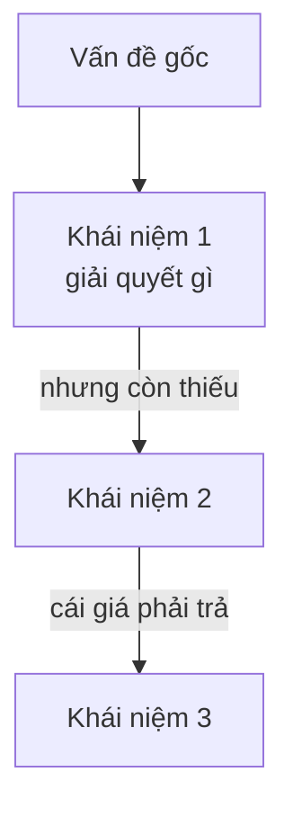

# L{{NUM}} — {{TOPIC_VI}}

| | |
|---|---|
| Môn | `{{CODE}}` {{NAME_VI}} |
| Buổi | {{NUM}} |
| Ngày | {{DATE}} |
| Giảng viên | {{LECTURER}} |
| Transcript | [`_raw/{{RAW_FILE}}`](_raw/{{RAW_FILE}}) |
| Slide | [`../materials/slides/`](../materials/slides/) |

<!--
CẤU TRÚC MỖI MỤC — thứ tự cố định:  📚 Lý thuyết  →  💡 Dễ hiểu  →  💻 Code  →  ✍️ Bài tập
Quy tắc chi tiết: .claude/skills/new-lecture/SKILL.md, Bước 5.
Xoá mọi comment kiểu này khi viết xong. Mục phụ (ít trọng số) được rút gọn: chỉ Định nghĩa + Trực giác + 1 bài.
-->

---

## Mục lục

- [Tóm tắt một đoạn](#tóm-tắt-một-đoạn)
- [Gốc rễ của cả buổi](#gốc-rễ-của-cả-buổi)
- [Nội dung chính](#nội-dung-chính)
- [Bảng tổng hợp](#bảng-tổng-hợp)
- [Sơ đồ](#sơ-đồ)
- [Gợi ý thi](#gợi-ý-thi)
- [Deadline phát sinh](#deadline-phát-sinh)
- [Chỗ chưa rõ](#chỗ-chưa-rõ)
- [Tự kiểm tra](#tự-kiểm-tra)
- [Liên kết](#liên-kết)

---

## Tóm tắt một đoạn

<3–5 câu. Đọc đoạn này là nắm được buổi học nói gì, không cần đọc tiếp.>

---

## Gốc rễ của cả buổi

<Một chuỗi suy luận ngắn: từ **một vấn đề gốc** → các khái niệm của buổi lần lượt ra đời như hệ quả.
Người đọc nhìn vào là thấy các mục không rời rạc mà là một "cây" mọc từ một gốc.>



---

## Nội dung chính

### 1. <Tên khái niệm>

#### 📚 Lý thuyết

**Gốc rễ (first principles).** *Suy luận từ nguyên lý — phần không có trong slide sẽ gắn nhãn `ngoài slide`.*

- **Ngữ cảnh:** <hệ thống/vấn đề rộng hơn mà khái niệm này sống trong đó>
- **Vấn đề gốc:** <điều gì đau hoặc không giải được nếu chưa có khái niệm này>
- **Những sự thật nền** (ràng buộc không bỏ được):
  1. <sự thật 1>
  2. <sự thật 2>
- **Suy luận:** sự thật 1 + sự thật 2 ⇒ <bước trung gian> ⇒ **<khái niệm> ra đời như một hệ quả**, không phải quy ước tuỳ tiện.
- **Nếu không có nó thì sao?** <hậu quả cụ thể, nên có con số hoặc tình huống>

**Định nghĩa hình thức** `[nguồn slide/giáo trình + số trang]`

> <định nghĩa chuẩn, giữ nguyên thuật ngữ; trích nguyên văn khi có thể>

**Tính chất · điều kiện · ký hiệu:**
- <điều kiện để khái niệm áp dụng, tính chất suy ra, ký hiệu dùng trong slide>

**Thuật toán / cơ chế** *(nếu có)*

```
<pseudo-code hoặc các bước theo đúng slide>
```

#### 💡 Giải thích dễ hiểu

**Trực giác:** <một câu, không thuật ngữ>

**Analogy đời thường:** <so sánh với thứ ngoài đời>
*Chỗ analogy vỡ:* <điểm nào của khái niệm mà analogy không mô tả đúng — để khỏi hiểu lệch>

**Ví dụ nhỏ nhất** *(con số cụ thể, trường hợp bé nhất; theo dõi từng bước)*

| Bước | Việc xảy ra | Trạng thái |
|---|---|---|
| 1 | | |

**Minh hoạ:**

```
<sơ đồ ASCII / Mermaid / bảng trace — dùng khi có luồng xử lý, trạng thái hoặc quan hệ>
```

#### 💻 Code & thực tế

```
<đoạn code chạy được, nếu áp dụng. Không áp dụng thì ghi "không áp dụng — <lý do>">
```

> **Trong production:** <chỗ nghề dev gặp lại khái niệm này, gắn nhãn `ngoài slide`>

#### ✍️ Bài tập

*Từ dễ đến khó. Ưu tiên bài trong slide, rồi câu trong đề mẫu (`exam-map.md`), cuối cùng mới tự đặt (ghi `tự đặt`).*

**Bài 1** *(Nhớ)* — <đề> · *nguồn: <slide / đề mẫu câu n / tự đặt>*

> 🔑 **Kiến thức mở khoá:** <khái niệm/tính chất nào ở phần Lý thuyết giúp giải bài này, và giúp ở bước nào>

<details><summary>Hướng giải</summary>

<các bước giải, nối từng bước về kiến thức ở trên>

</details>

**Bài 2** *(Vận dụng)* — <đề>

> 🔑 **Kiến thức mở khoá:** …

<details><summary>Hướng giải</summary>

…

</details>

**Chốt mục:** <1–2 dòng: điều cần mang đi thi và cái bẫy hay gặp>

---

## Bảng tổng hợp

| | | |
|---|---|---|

---

## Sơ đồ

```
<ASCII hoặc Mermaid khi có quan hệ/luồng xử lý xuyên nhiều mục>
```

---

## Gợi ý thi

> ⚠️ **GỢI Ý THI:** <câu giảng viên nói> — buổi {{NUM}}, {{DATE}}

*(Đã append vào `IMPORTANT_NOTES.md` mục 2/3.)*

---

## Deadline phát sinh

| Việc | Hạn nộp | Đã ghi vào `admin/deadlines.md` |
|---|---|---|
| | | |

---

## Chỗ chưa rõ

> ❓ **CẦN XÁC MINH:** <phần transcript không rõ hoặc thiếu>

---

## Tự kiểm tra

**1.** <câu hỏi>

<details><summary>Đáp án</summary>

<đáp án>

</details>

**2.** <câu hỏi>

<details><summary>Đáp án</summary>

<đáp án>

</details>

**3.** <câu hỏi>

<details><summary>Đáp án</summary>

<đáp án>

</details>

**4.** <câu hỏi>

<details><summary>Đáp án</summary>

<đáp án>

</details>

**5.** <câu hỏi>

<details><summary>Đáp án</summary>

<đáp án>

</details>

---

## Liên kết

- Khái niệm dùng chung: [`knowledge-base/`](../../../../knowledge-base/)
- Ghi chú quan trọng của môn: [`../IMPORTANT_NOTES.md`](../IMPORTANT_NOTES.md)
